<!-- AI Solution Architect Interview & Daily Working Playbook -->

<div align="center">

# 🤖 AI Solution Architect — Interview & Daily Working Playbook

### New Capabilities + Continuous Technical Improvement → Architecture → Prove → Operate → Optimize


</div>

> **One-line definition:** An **AI Solution Architect** turns business and product needs into secure, scalable, measurable and production-ready systems — while continuously improving the architecture, performance, reliability, experience and cost of existing systems.
>
> 🎨 **Diagram style:** GitHub-rendered Mermaid diagrams use high-contrast colors, compact layouts and clear role-based visual grouping. The diagrams use color-coded visual grouping and compact flow layouts for fast scanning. GitHub does not reliably support animated Mermaid diagrams, so the design prioritizes clarity and readability instead.

> **Core idea:** Do not start with “Which AI model should we use?” Start with “What problem are we solving, how will we measure success, and what is the simplest safe architecture that can solve it?”

---

## 🏷️ Tags

`AI Solution Architect` • `AI Architecture` • `GenAI` • `LLM` • `RAG` • `Agentic AI` • `System Design` • `Azure AI` • `Databricks` • `NVIDIA` • `MLOps` • `LLMOps` • `AI Security` • `Responsible AI` • `Customer Discovery` • `POC` • `Production AI` • `Technical Modernization` • `FinOps` • `Cost Optimization` • `Performance Engineering` • `Technical Debt`

---

# 📚 Table of Contents

1. [What Is an AI Solution Architect?](#-1-what-is-an-ai-solution-architect)
2. [What Does an AI Solution Architect Actually Do?](#-2-what-does-an-ai-solution-architect-actually-do)
3. [AI Solution Architect vs Other Roles](#-3-ai-solution-architect-vs-other-roles)
4. [How an AI Solution Architect Thinks](#-4-how-an-ai-solution-architect-thinks)
5. [The Business → AI → Production Framework](#-5-the-business--ai--production-framework)
6. [Customer Discovery](#-6-customer-discovery)
7. [30+ Customer Discovery Questions](#-7-30-customer-discovery-questions)
8. [Requirement Analysis](#-8-requirement-analysis)
9. [AI Feasibility Assessment](#-9-ai-feasibility-assessment)
10. [Choosing the Right AI Approach](#-10-choosing-the-right-ai-approach)
11. [Architecture Design Framework](#-11-architecture-design-framework)
12. [Reference Enterprise AI Architecture](#-12-reference-enterprise-ai-architecture)
13. [RAG Architecture](#-13-rag-architecture)
14. [Agentic AI Architecture](#-14-agentic-ai-architecture)
15. [Multimodal AI Architecture](#-15-multimodal-ai-architecture)
16. [Data Architecture](#-16-data-architecture)
17. [Security Architecture](#-17-security-architecture)
18. [Responsible AI](#-18-responsible-ai)
19. [AI Evaluation Framework](#-19-ai-evaluation-framework)
20. [Cost & FinOps](#-20-cost--finops)
21. [Performance & Scalability](#-21-performance--scalability)
22. [Observability & LLMOps](#-22-observability--llmops)
23. [POC → Production Strategy](#-23-poc--production-strategy)
24. [Customer Presentation Framework](#-24-customer-presentation-framework)
25. [Architecture Decision Records](#-25-architecture-decision-records)
26. [Common Architecture Trade-offs](#-26-common-architecture-trade-offs)
27. [Case Study 1 — Enterprise Document Intelligence](#-27-case-study-1--enterprise-document-intelligence)
28. [Case Study 2 — Enterprise Knowledge Assistant](#-28-case-study-2--enterprise-knowledge-assistant)
29. [Case Study 3 — Agentic Customer Support](#-29-case-study-3--agentic-customer-support)
30. [Case Study 4 — AI Sales Assistant](#-30-case-study-4--ai-sales-assistant)
31. [Case Study 5 — Multimodal Enterprise AI](#-31-case-study-5--multimodal-enterprise-ai)
32. [Daily AI Solution Architect Checklist](#-32-daily-ai-solution-architect-checklist)
33. [Customer Meeting Checklist](#-33-customer-meeting-checklist)
34. [POC Checklist](#-34-poc-checklist)
35. [Production Readiness Checklist](#-35-production-readiness-checklist)
36. [Weekly Architecture Review Checklist](#-36-weekly-architecture-review-checklist)
37. [Interview Preparation Plan](#-37-interview-preparation-plan)
38. [30+ Interview Questions & Answers](#-38-30-interview-questions--answers)
39. [System Design Scenarios](#-39-system-design-scenarios)
40. [Customer Scenario Questions](#-40-customer-scenario-questions)
41. [Whiteboarding Exercises](#-41-whiteboarding-exercises)
42. [STAR Interview Framework](#-42-star-interview-framework)
43. [Common Interview Mistakes](#-43-common-interview-mistakes)
44. [Principal-Level Expectations](#-44-principal-level-expectations)
45. [AI Solution Architect Mental Model](#-45-ai-solution-architect-mental-model)
46. [One-Page Quick Revision](#-46-one-page-quick-revision)
47. [Final Interview Checklist](#-47-final-interview-checklist)
48. [Official Resources](#-48-official-resources)

---

# 🧭 1. What Is an AI Solution Architect?

An AI Solution Architect sits between **business**, **software**, **cloud**, **data**, and **AI**.

The role is bigger than selecting an LLM. It is about making good decisions across the complete system.

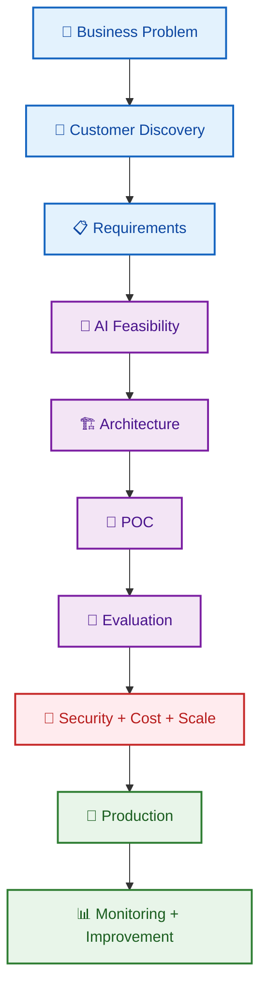

### The architect should be able to answer

> “Why this solution, why this model, why this data design, why this cloud architecture, and what happens when the system fails?”

---

# 🧑‍💼 2. What Does an AI Solution Architect Actually Do?

| Activity | What the architect does |
|---|---|
| New capability architecture | Turn business/product requirements into end-to-end solution designs |
| Technical modernization | Improve existing systems even when no new customer requirement exists |
| Architecture workshop | Turn requirements, constraints and technical risks into system decisions |
| Whiteboarding | Explain current-state, target-state and migration designs visually |
| POC | Prove difficult technical assumptions before committing to a large build |
| AI evaluation | Measure whether the AI is useful, safe, reliable and good enough |
| Security review | Identify data, identity, authorization and abuse risks |
| Cost & FinOps | Estimate TCO, unit economics, budgets and cost/performance trade-offs |
| Performance & scalability | Remove bottlenecks and design for growth, resilience and predictable latency |
| Production readiness | Check reliability, monitoring, supportability and operational ownership |
| Troubleshooting | Find failures across data, app, API, model and infrastructure |
| Technical debt reduction | Simplify architecture, remove obsolete components and reduce future engineering cost |
| Technical leadership | Align engineering, product, security, finance/FinOps and business teams |

### Real-world analogy

Think of an architect like a **city planner**.

A city planner does not personally build every road or building. They decide where things go, how systems connect, what rules apply, what can scale, and what happens during emergencies.

---

# 🔍 3. AI Solution Architect vs Other Roles

| Role | Primary focus | Typical question |
|---|---|---|
| Software Architect | Software structure | “How should the application be designed?” |
| Cloud Solution Architect | Cloud platform and infrastructure | “How should this run securely in cloud?” |
| AI Engineer | AI application implementation | “How do I build this AI capability?” |
| ML Engineer | ML lifecycle | “How do I train, deploy and monitor ML?” |
| Data Architect | Data systems | “How should data be stored, governed and accessed?” |
| AI Solution Architect | End-to-end business + AI solution | “What should we build, why, and how do we productionize it?” |
| Specialist Solution Architect | Deep expertise in one area | “How do we solve this hard AI/ML problem?” |
| Field AI Engineer | Customer-facing technical implementation | “How do we make this work in the customer environment?” |
| AI Technical Architect | Architecture + technical leadership | “How do we create a sustainable technical design?” |

> **Easy rule:** Engineer = build it. Architect = decide what should be built, why, and how the pieces fit together.

---

# 🧠 4. How an AI Solution Architect Thinks

A common mistake is to jump directly to technology.

Customer:

> “We need a chatbot.”

Weak response:

> “Let's use an LLM and a vector database.”

Better response:

> “What user problem should the assistant solve, what data must it access, what actions should it perform, and how will we measure success?”

### The 10-question mental model

1. What business problem exists?
2. Who uses the solution?
3. What does success mean?
4. What data is available?
5. How fresh must the data be?
6. Is AI really needed?
7. What are the security requirements?
8. What happens if AI is wrong?
9. What is the expected cost and scale?
10. How will we know the system is working?

### Decision loop

Architecture work starts from **two different triggers**. The architect should not force every problem through a customer-discovery flow.

~~~mermaid
flowchart TD
TRIGGER{"🚦 Architecture Trigger"}
TRIGGER --> NEW["🆕 New Capability / Requirement"]
TRIGGER --> IMP["🔧 Existing-System Improvement"]
NEW --> ND["🎯 Business Outcome + User Need"]
ND --> NR["📋 Requirements + Constraints"]
NR --> NA["🏗️ Target Architecture"]
IMP --> TECH["📊 Current-State Evidence"]
TECH --> ISSUE["⚠️ Bottleneck / Debt / Risk / Cost"]
ISSUE --> IA["🏗️ Improved Target Architecture"]
NA --> TRADE["⚖️ Trade-offs"]
IA --> TRADE
TRADE --> PROVE["🧪 Prove Risky Parts"]
PROVE --> DELIVER["🚀 Implement / Migrate"]
DELIVER --> MEASURE["📏 Measure Outcome"]
MEASURE --> IMPROVE["🔄 Continuous Improvement"]
classDef trigger fill:#FFF3E0,stroke:#EF6C00,color:#E65100,stroke-width:2px
classDef new fill:#E3F2FD,stroke:#1565C0,color:#0D47A1,stroke-width:2px
classDef improve fill:#E0F7FA,stroke:#00838F,color:#004D40,stroke-width:2px
classDef decision fill:#F3E5F5,stroke:#7B1FA2,color:#4A148C,stroke-width:2px
classDef delivery fill:#E8F5E9,stroke:#2E7D32,color:#1B5E20,stroke-width:2px
class TRIGGER trigger
class NEW,ND,NR,NA new
class IMP,TECH,ISSUE,IA improve
class TRADE,PROVE decision
class DELIVER,MEASURE,IMPROVE delivery
~~~

**Architectural thinking applies to both paths:**

- **New capability:** “What should we build and why?”
- **Technical improvement:** “What should we change and why?”
- **Both:** “What evidence supports the decision, what are the trade-offs, and how will we prove the result?”

**Trade-off** means choosing one benefit while accepting another downside.

Example: a larger model may improve quality but increase cost and latency (response time).

---

# 🚀 5. The Business → AI → Production Framework

The classic **Business → AI → Production** flow is only one side of architecture work. In a real product, architects continuously work on two parallel streams:

| Architecture stream | Trigger | Typical work | Success measure |
|---|---|---|---|
| **A. New capability architecture** | New business/product requirement | New feature, AI capability, integration, workflow, platform capability | Business KPI + functional/NFR success |
| **B. Continuous technical improvement** | Technical evidence or engineering need | Monolith decomposition, API redesign, data-contract evolution, DB optimization, caching, scaling, reliability, security, cost reduction, platform modernization | Performance, reliability, developer experience, operational cost, quality |

> **Important:** A customer or business request is not required for architecture work. A system can need architectural change because the existing design is too slow, too expensive, too fragile, difficult to evolve, or creating unacceptable developer/user experience.

### Two common architecture journeys

~~~mermaid
flowchart LR
N["🆕 New Requirement"]-->NR["Requirements"]-->NA["Target Architecture"]-->NP["POC"]-->ND["Delivery"]-->NM["Measure"]
I["🔧 Existing-System Issue"]-->E["Evidence"]-->IA["Improvement Design"]-->MP["Migration / Refactor POC"]-->MD["Delivery"]-->IM["Measure"]
NM-->LOOP["🔄 Learn + Improve"]
IM-->LOOP
LOOP-->N
LOOP-->I
classDef new fill:#E3F2FD,stroke:#1565C0,color:#0D47A1,stroke-width:2px
classDef improve fill:#E0F7FA,stroke:#00838F,color:#004D40,stroke-width:2px
classDef measure fill:#E8F5E9,stroke:#2E7D32,color:#1B5E20,stroke-width:2px
class N,NR,NA,NP,ND new
class I,E,IA,MP,MD improve
class NM,IM,LOOP measure
~~~

### Examples of architecture work that may not be customer-driven

| Problem | Architectural response | Evidence / metric |
|---|---|---|
| Monolith becoming difficult to change | Strangler pattern / bounded-context extraction | Lead time, deployment frequency, failure rate |
| API contract is unstable | Versioned contract + compatibility policy | Breaking-change rate, consumer incidents |
| REST payloads are too large/slow | Pagination, field selection, compression or gRPC where justified | p95 latency, bandwidth, CPU |
| Database is the bottleneck | Indexing, query redesign, read replicas, partitioning or data-store change | Query latency, CPU, throughput |
| Repeated downstream calls | Cache or materialized view | Cache hit rate, latency, dependency load |
| AI requests are too expensive | Model routing, context reduction, caching, batching | Cost/request, tokens/request |
| System fails during traffic spikes | Queueing, autoscaling, backpressure | Queue depth, p95 latency, error rate |
| Developer experience is poor | Platform/reusable components and golden paths | Lead time, onboarding time, defects |
| Security boundary is unclear | Centralized policy enforcement and least privilege | Security findings, unauthorized access attempts |
| Technical debt is slowing delivery | Simplify/decommission components | Change failure rate, maintenance effort |

### Architecture is a lifecycle, not a one-time diagram

~~~mermaid
flowchart TD
A["🏗️ Design"]-->B["🚀 Build"]
B-->C["📊 Observe"]
C-->D["🔎 Find Bottlenecks / Risks"]
D-->E["⚖️ Prioritize Improvement"]
E-->F["🔧 Optimize / Modernize"]
F-->C
~~~

This means a Solution Architect should regularly review the **current state**, not only approve the next feature.

| Stage | Main question | Output |
|---|---|---|
| Business | Why are we doing this? | Problem statement |
| Discovery | What do we know? | Constraints + assumptions |
| Requirements | What must the system do? | Functional + non-functional requirements |
| AI feasibility | Is AI suitable? | AI approach decision |
| Architecture | How should components connect? | HLD (High-Level Design) |
| Technology | Which services fit? | Technology decision |
| POC | Can the risky parts work? | Evidence |
| Evaluation | Is it good enough? | Metrics |
| Security | Can it be used safely? | Controls |
| Cost | Can we afford it? | Cost model |
| Production | Can we operate it? | Production architecture |
| Operations | Is it healthy? | Monitoring + improvement |

### Non-functional requirement

A **non-functional requirement (NFR)** describes *how well* the system must work.

Examples:

- 99.9% availability
- response under 3 seconds
- encryption at rest
- audit logs
- support for 10,000 users

---

# 🧑‍💬 6. Customer Discovery

Customer discovery is one of the most important skills.

Do not start by presenting architecture.

Start by listening.

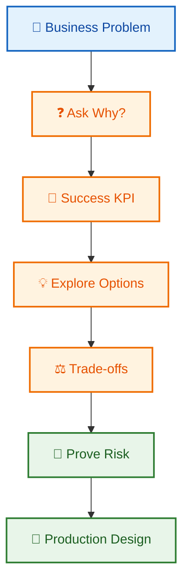

### Example

Customer:

> “We need GenAI for contract management.”

Ask:

> “Which contract process are we improving?”

The actual problem may be:

- contract classification,
- clause extraction,
- comparison,
- risk detection,
- search,
- drafting,
- approval routing.

Each can require a different architecture.

---

# ❓ 7. 30+ Customer Discovery Questions

### Business

1. What problem are we solving?
2. Why is this problem important now?
3. Who is affected?
4. What happens today?
5. What is the cost of the current process?
6. What KPI (Key Performance Indicator) should improve?
7. What does success look like in 90 days?

### Users

8. Who are the users?
9. How many users are expected?
10. Are there different user roles?
11. Do users belong to different tenants (customer environments)?

### Data

12. What data sources exist?
13. Which sources are authoritative?
14. How frequently does data change?
15. What formats exist?
16. Does the data contain PII (Personally Identifiable Information)?
17. What access rules exist?
18. How long must data be retained?

### AI

19. Is the task generation, classification, prediction or retrieval?
20. Is the answer expected to be grounded in company data?
21. Is real-time information required?
22. Can a human review the result?
23. What happens if the model is wrong?

### Integration

24. Which APIs already exist?
25. Which systems must the AI call?
26. Are there event-driven integrations?
27. Are there legacy systems?

### Security

28. How is identity managed?
29. What data must never leave the organization's boundary?
30. What actions require approval?
31. What compliance rules apply?

### Reliability and cost

32. What is the expected request volume?
33. What is the maximum acceptable latency?
34. What budget exists?
35. What availability is required?
36. What is the disaster recovery requirement?

### Operations

37. Who owns production support?
38. How will incidents be detected?
39. How will prompts and models be versioned?
40. How will AI quality be measured after release?

---

# 📋 8. Requirement Analysis

Separate requirements into four buckets.

### 1. Functional requirements

What should the system do?

Example:

> “Users can ask questions about company policies.”

### 2. Non-functional requirements

How well should it work?

Example:

> “95% of responses must complete within 3 seconds.”

### 3. AI requirements

What makes the AI useful?

- grounded answers,
- citations,
- structured output,
- confidence handling,
- fallback behavior.

### 4. Governance requirements

What rules must be followed?

- role-based access,
- auditability,
- retention,
- privacy,
- human approval.

---

# 🔬 9. AI Feasibility Assessment

Not every problem needs AI.

### Use traditional software when

- the rule is deterministic,
- the answer is exact,
- logic is stable,
- normal code is easier to test.

Example:

> “If invoice total > ₹1,00,000, require approval.”

That is a business rule, not an LLM problem.

### Use AI when

- inputs are unstructured,
- language understanding is required,
- users ask open-ended questions,
- documents contain complex text,
- flexible generation or reasoning is needed.

### Feasibility matrix

| Problem | Good first choice |
|---|---|
| Exact calculation | Deterministic code |
| CRUD workflow | Normal application |
| Document search | Search / RAG |
| Text summarization | LLM |
| Image + text understanding | Multimodal model |
| Fixed classification | ML or LLM |
| Multi-step open-ended task | Agent or controlled workflow |
| Prediction from structured history | ML model |

> **Use the simplest technology that can reliably solve the problem.**

---

# 🧭 10. Choosing the Right AI Approach

## LLM vs Traditional ML

**LLM (Large Language Model)** is a model trained on large amounts of data for language-heavy tasks.

**Traditional ML (Machine Learning)** usually solves a narrower prediction or classification problem.

| Need | Often consider |
|---|---|
| Text generation | LLM |
| Semantic understanding | LLM / embeddings |
| Fraud probability | ML |
| Demand forecast | ML |
| Sentiment classification | LLM or ML |
| Exact business rules | Code |

## RAG vs Fine-Tuning

**RAG (Retrieval-Augmented Generation)** retrieves relevant information before generating an answer.

**Fine-tuning** means additional training that changes model behavior for a specialized task.

| Need | Common fit |
|---|---|
| Private knowledge | RAG |
| Frequently changing knowledge | RAG |
| Citations | RAG |
| New behavior/style | Fine-tuning |
| Specialized task behavior | Fine-tuning may help |
| Knowledge + behavior | RAG + fine-tuning may be combined |

### Simple analogy

RAG = **give the employee the latest handbook before answering**.

Fine-tuning = **train the employee to behave differently**.

## RAG vs Long Context

**Long context** means sending a large amount of information directly to the model.

Use long context when the content is manageable and broad document understanding is needed.

Use RAG when the knowledge base is large, changes often, access control matters, or only a small subset is relevant.

## Workflow vs Agent


## Single Agent vs Multi-Agent

Start with one agent.

Add multiple agents only when there is a real reason:

- specialist responsibilities,
- independent ownership,
- parallel work,
- separate policies.

## Vector Search vs Keyword Search

**Keyword search** looks for matching words.

**Vector search** looks for similar meaning.

**Hybrid search** combines keyword and vector search.

## Batch vs Real-Time AI

| Batch | Real-time |
|---|---|
| Process later | Respond immediately |
| Good for scheduled jobs | Good for user-facing requests |
| Easier capacity planning | More latency pressure |

## Cloud AI vs Self-Hosted AI

**Cloud AI** = managed model/service from a cloud provider.

**Self-hosted AI** = your team runs the model/inference stack.

Consider data residency, control, model choice, GPU cost, scale and operations.

---

# 🏗️ 11. Architecture Design Framework

Use layers when drawing an architecture.

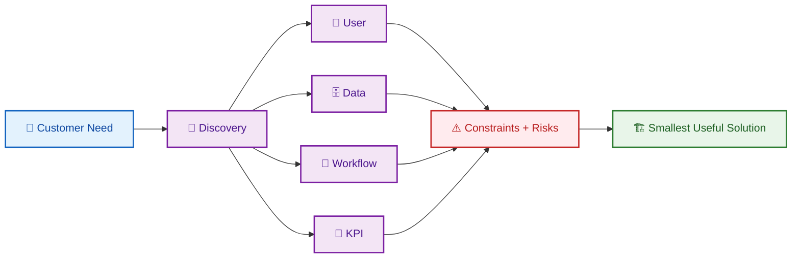

### For every component ask

- Why do we need it?
- Can we remove it?
- What is the failure mode?
- What happens under load?
- What data does it see?
- How is it secured?
- How much does it cost?
- How will we monitor it?

> **If you cannot explain why a box exists on your diagram, remove it or justify it.**

---

# ☁️ 12. Reference Enterprise AI Architecture

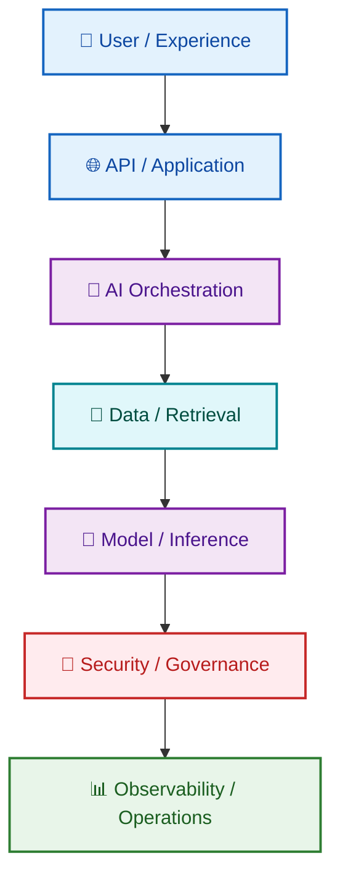

---

# 📚 13. RAG Architecture

### RAG in simple words

> Search first, then ask the model to answer using the retrieved information.

### Ingestion

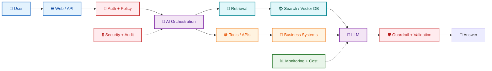

**Chunking** means splitting large documents into smaller pieces.

**Embedding** converts text into numbers that represent meaning.

### Query flow

```mermaid
flowchart LR
DOC["📄 Documents"]-->PARSE["⚙️ Parse"]-->CHUNK["✂️ Chunk"]-->EMB["🧬 Embeddings"]-->IDX["🔎 Index"]
Q["❓ User Question"]-->RET["🔍 Hybrid / Vector Search"]-->ACL["🔐 ACL Filter"]-->RR["🎯 Reranking"]-->CTX["📚 Top Context"]-->LLM["🤖 LLM"]-->ANS["💬 Answer + Citations"]
IDX-->RET
classDef ingest fill:#E3F2FD,stroke:#1565C0,color:#0D47A1,stroke-width:2px
classDef search fill:#E0F7FA,stroke:#00838F,color:#004D40,stroke-width:2px
classDef sec fill:#FFEBEE,stroke:#C62828,color:#B71C1C,stroke-width:2px
classDef ai fill:#F3E5F5,stroke:#7B1FA2,color:#4A148C,stroke-width:2px
classDef out fill:#E8F5E9,stroke:#2E7D32,color:#1B5E20,stroke-width:2px
class DOC,PARSE,CHUNK,EMB,IDX ingest
class Q,RET,RR,CTX search
class ACL sec
class LLM ai
class ANS out
```

**Reranking** means taking initial search results and sorting them again using a stronger relevance method.

**ACL (Access Control List)** defines who can access a resource.

> **Critical security rule:** Authorization must happen before unauthorized content reaches the model.

---

# 🤖 14. Agentic AI Architecture

**Agentic AI** means an AI system can choose among actions or tools to accomplish a goal.

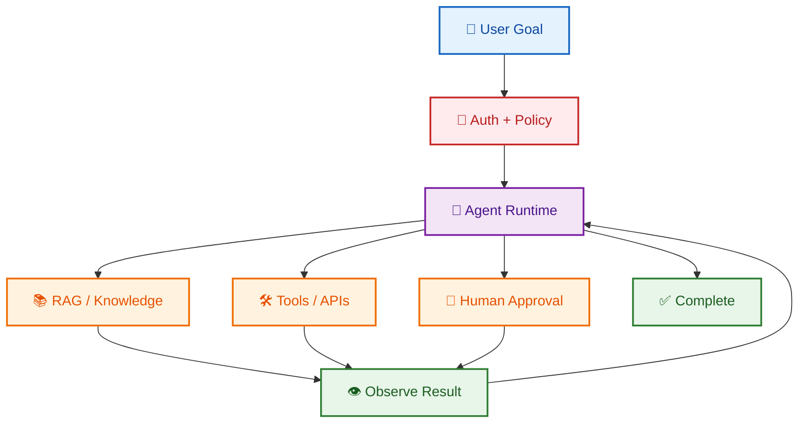

### Production pattern

```text
User
  ↓
Auth + Policy
  ↓
Agent Runtime
  ├── RAG / Knowledge
  ├── Tools / APIs
  └── Human Approval
        ↓
   Business Systems

Cross-cutting:
State • Limits • Audit • Monitoring • Evaluation
```

A **guardrail** is a control that limits unsafe, invalid or unwanted AI behavior.

---

# 🖼️ 15. Multimodal AI Architecture

**Multimodal AI** can work with text, images, audio or video.

Example:

> Insurance claim = accident photo + PDF + customer text.

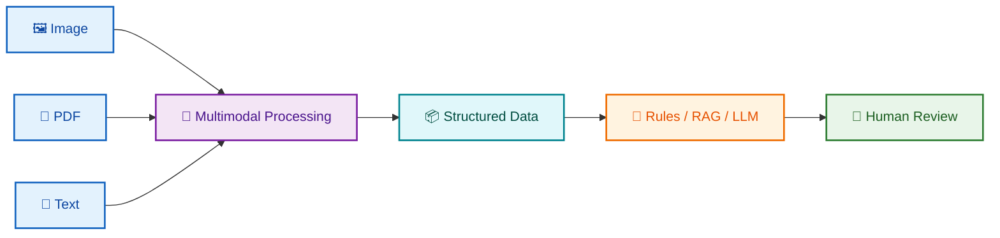

### Architect questions

- Does the model support the required inputs?
- What image/document quality exists?
- How are extracted fields validated?
- What happens when OCR fails?
- What sensitive data is visible?
- How is evidence retained?

**OCR (Optical Character Recognition)** means extracting text from images or scanned documents.

---

# 🗄️ 16. Data Architecture

AI quality often depends more on data quality than on model choice.

### Data questions

- Is the source authoritative?
- Is the data current?
- Is it duplicated?
- Is it complete?
- Can access be filtered?
- Can changes be detected?
- Can historical versions be retained?

### Enterprise knowledge architecture

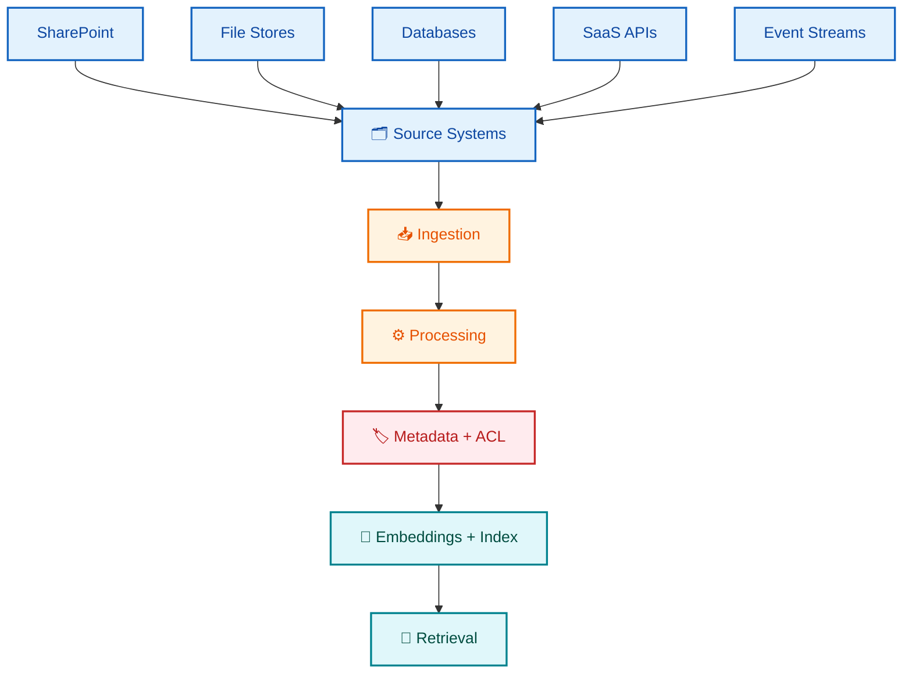

---

# 🔐 17. Security Architecture

Treat AI security as application security plus AI-specific risks.

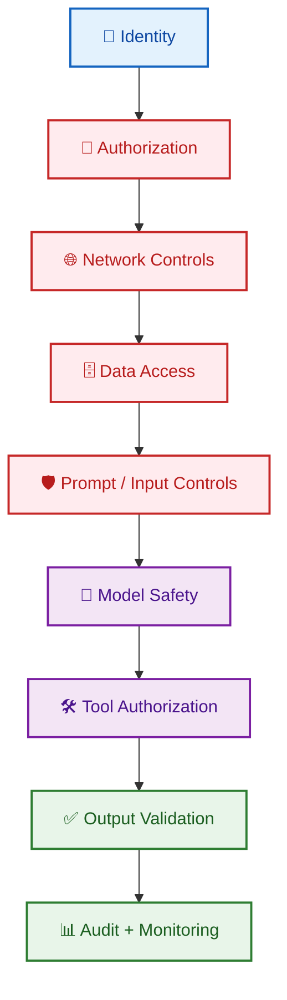

### Important threats

- Prompt injection (malicious instructions in input)
- Indirect prompt injection (malicious instructions in documents/web content)
- Data leakage
- Excessive tool permissions
- Unsafe output
- Cross-tenant data access
- Insecure integrations
- Secrets exposure

> **The LLM is not your authorization system.**

---

# 🌱 18. Responsible AI

Responsible AI means designing AI so it is useful, safe, transparent and appropriate for the situation.

Consider:

- fairness,
- privacy,
- transparency,
- safety,
- reliability,
- human oversight,
- accountability.

### Ask

> “What happens if the AI is wrong?”

### Risk-based design

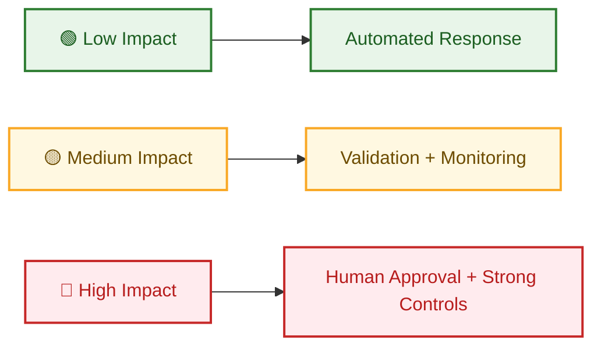

---

# 📏 19. AI Evaluation Framework

You cannot improve what you do not measure.

| Metric | Simple meaning |
|---|---|
| Accuracy | Is the answer correct? |
| Relevance | Did it answer the question? |
| Groundedness | Is it supported by evidence? |
| Faithfulness | Does the answer reflect the evidence? |
| Retrieval quality | Did we retrieve the right information? |
| Safety | Did the system avoid unsafe behavior? |
| Latency | How fast was the response? |
| Cost | How expensive was the request? |
| Task success | Did the user achieve the goal? |

### Evaluation dataset

Create a representative test set containing:

- normal questions,
- hard questions,
- ambiguous questions,
- no-answer questions,
- adversarial questions,
- long-context cases,
- permission-sensitive cases.

### RAG evaluation

```mermaid
flowchart LR
Q["❓ Question"]-->E["📚 Expected Evidence"]-->RET["🔎 Retriever"]-->CH["📄 Retrieved Chunks"]-->GEN["🤖 Generation"]-->ANS["🎯 Expected Answer"]-->EVAL["📏 Evaluation"]
classDef input fill:#E3F2FD,stroke:#1565C0,color:#0D47A1,stroke-width:2px
classDef retrieval fill:#E0F7FA,stroke:#00838F,color:#004D40,stroke-width:2px
classDef ai fill:#F3E5F5,stroke:#7B1FA2,color:#4A148C,stroke-width:2px
classDef eval fill:#E8F5E9,stroke:#2E7D32,color:#1B5E20,stroke-width:2px
class Q,E input
class RET,CH retrieval
class GEN ai
class ANS,EVAL eval
```

---

# 💰 20. Cost & FinOps

## Does architecture really own cost?

**Yes — architecture owns the cost trade-off, while FinOps/Finance usually provides the financial governance, billing data, budgets and cost-management process.**

An architect does not need to approve every invoice. The architect **does** need to understand how architectural choices create cost and how to compare cost against quality, latency, reliability, security and business value.

A production architecture is incomplete if it can meet the functional requirement but has no credible answer to:

> **“How much will this cost at the expected scale, what drives that cost, and what happens to cost when usage grows 10×?”**

### Cost is an architectural property

~~~mermaid
flowchart LR
REQ["📋 Requirements"]-->ARCH["🏗️ Architecture"]
ARCH-->MODEL["🤖 Model Choice"]
ARCH-->DATA["🗄️ Data + Storage"]
ARCH-->COMPUTE["⚙️ Compute"]
ARCH-->NET["🌐 Network"]
ARCH-->OBS["📊 Observability"]
MODEL-->COST["💰 Total Cost"]
DATA-->COST
COMPUTE-->COST
NET-->COST
OBS-->COST
COST-->UNIT["📏 Unit Economics"]
UNIT-->DECIDE["⚖️ Cost / Quality / Latency Trade-off"]
~~~

## 20.1 What makes up AI solution cost?

Think in **fixed**, **variable**, and **indirect** cost.

| Cost category | Examples | Typical driver |
|---|---|---|
| Model inference | Input/output tokens, model calls | Requests × tokens |
| Embeddings | Document/query embeddings | Documents + queries |
| Retrieval | Search/vector DB operations | Queries + index size |
| Agent execution | Tool calls, multiple model steps | Tasks × steps |
| Compute | CPU, GPU, serverless, Kubernetes | Instance-hours / execution |
| Storage | DB, object storage, vector index | GB-month |
| Network | Egress, inter-service traffic | GB transferred |
| Observability | Logs, traces, metrics | Events + retention |
| Security | WAF, key management, scanning | Requests + resources |
| Backup/DR | Replication, snapshots | Data volume |
| Engineering/operations | Platform and support effort | Team/workload complexity |

### Fixed vs variable

~~~text
Monthly TCO
=
Fixed Infrastructure
+
Variable Usage Cost
+
Operational / Platform Cost
~~~

**TCO (Total Cost of Ownership)** includes the recurring costs required to run and operate the solution, not just the model bill.

## 20.2 How do you calculate AI cost?

Start with the workload.

Example assumptions:

~~~text
1,000,000 requests / month
Average input = 2,000 tokens
Average output = 500 tokens
Average retrieval = 5 searches/request
Average agent steps = 2 model calls/request
~~~

For a provider whose prices are expressed per 1M tokens:

~~~text
Model cost
=
(Input tokens / 1M × Input price)
+
(Output tokens / 1M × Output price)
~~~

For multiple model calls:

~~~text
Total model cost
=
Σ(cost of every model call)
~~~

Then add non-model costs:

~~~text
Total monthly cost
=
Model inference
+ Embeddings
+ Search / Vector DB
+ Database
+ Compute
+ Storage
+ Network
+ Observability
+ Backup / DR
+ Other platform costs
~~~

> **Do not hard-code cloud/model prices into an architecture document unless the price source and date are recorded. Prices change. Use the current provider pricing page or pricing calculator when producing a real estimate.**

## 20.3 Cost per request

The most useful starting metric is often:

~~~text
Cost per request
=
Total monthly AI/application cost
÷
Successful requests
~~~

But **cost/request alone can be misleading**.

| Metric | Formula | Why it matters |
|---|---|---|
| Cost/request | Total cost ÷ requests | Basic unit cost |
| Cost/1K tokens | Model cost ÷ tokens × 1,000 | Token efficiency |
| Cost/session | Total cost ÷ sessions | User-level economics |
| Cost/active user | Total cost ÷ active users | Product economics |
| Cost/document | Processing cost ÷ documents | Document workloads |
| Cost/agent task | Agent cost ÷ completed tasks | Agent efficiency |
| Cost/successful task | Total cost ÷ successful tasks | Quality-adjusted cost |
| Cost/tenant | Tenant-attributed cost | Multi-tenant profitability |
| Cost/1K transactions | Total cost ÷ transactions × 1,000 | Business-unit economics |

### The important metric: cost per successful outcome

Suppose:

~~~text
Architecture A:
₹0.80/request
90% task success

Architecture B:
₹1.20/request
98% task success
~~~

A simple quality-adjusted comparison is:

~~~text
Cost per successful task

A = ₹0.80 / 0.90 = ₹0.89
B = ₹1.20 / 0.98 = ₹1.22
~~~

If failed tasks require human rework, include that too:

~~~text
True unit cost
=
AI cost
+
Failure / retry cost
+
Human review cost
+
Downstream business impact
~~~

This is why architects should optimize **business outcome per rupee/dollar**, not simply the cloud bill.

## 20.4 Metrics an architect should monitor

### AI efficiency

- input tokens/request
- output tokens/request
- total tokens/request
- model calls/request
- agent steps/task
- cache hit rate
- retrieval calls/request
- average context size
- retry rate
- fallback-model rate

### Infrastructure

- CPU/GPU utilization
- memory utilization
- instance-hours
- database CPU/storage
- vector-index size
- network ingress/egress
- serverless executions
- queue depth

### Financial

- daily/monthly spend
- budget variance
- forecast vs actual
- cost/request
- cost/session
- cost/tenant
- cost/successful task
- cost by model
- cost by environment
- cost by product/team

### Quality-adjusted

- cost vs accuracy
- cost vs groundedness
- cost vs task success
- cost vs latency
- cost vs human-review rate

## 20.5 Find the biggest cost driver

Do not optimize randomly. Use a Pareto-style breakdown:

~~~mermaid
flowchart TD
C["💰 Total Monthly Cost"]-->M["🤖 Model Inference"]
C-->DB["🗄️ Data / Vector DB"]
C-->GPU["⚙️ Compute / GPU"]
C-->NET["🌐 Network"]
C-->OBS["📊 Observability"]
C-->ST["💾 Storage / Backup"]
M-->M1["Tokens / Calls / Context"]
DB-->D1["Queries / Index Size"]
GPU-->G1["Hours / Utilization"]
NET-->N1["Data Transfer"]
OBS-->O1["Logs / Traces / Retention"]
ST-->S1["GB / Replication"]
~~~

Example:

~~~text
Total = $100,000/month

Model inference     $55,000
Database/vector DB  $15,000
GPU/compute         $12,000
Network              $5,000
Observability        $8,000
Storage/backup       $5,000
~~~

Start optimization with the **largest controllable drivers**, not tiny infrastructure savings.

## 20.6 Cost trade-offs architects actually make

| Decision | Lower-cost option | Higher-cost option | Why choose the expensive option? |
|---|---|---|---|
| Model | Smaller model | Larger model | Better quality/reasoning |
| Context | Short context | Larger context | Better evidence / task coverage |
| Retrieval | Basic search | Hybrid + reranking | Better relevance |
| Compute | Serverless | Always-on compute | Predictable latency / throughput |
| Hosting | Managed model | Self-hosted GPU | Control, privacy, specialization |
| Storage | Standard tier | Premium/replicated | Performance / resilience |
| API | REST | gRPC | Lower overhead for high-throughput internal calls |
| Architecture | Monolith | Microservices | Independent scaling/ownership |
| Availability | Single region | Multi-region | Higher resilience |
| Observability | Minimal | Detailed traces | Faster diagnosis and governance |

> **Architectural cost trade-off = paying more only when the additional cost buys a measurable business or technical outcome.**

## 20.7 Cost optimization levers

1. **Reduce work:** smaller prompts, better retrieval, less context, fewer agent/tool calls.
2. **Reduce price per unit:** route simple tasks to smaller models and reserve expensive models for complex work.
3. **Reuse work:** cache repeated inference, retrieval and deterministic computations.
4. **Change execution pattern:** batch workloads when real-time processing is not required.
5. **Improve utilization:** right-size CPU/GPU, autoscale and schedule non-production workloads.
6. **Reduce failure cost:** better retrieval/evaluation can reduce retries, human review and downstream business cost.

## 20.8 Cost estimation workflow

~~~mermaid
flowchart LR
W["📊 Workload"]-->A["🏗️ Architecture"]
A-->DR["📦 Cost Drivers"]
DR-->Q["🧮 Quantity"]
Q-->P["💵 Unit Price"]
P-->T["💰 Monthly TCO"]
T-->S["📏 Unit Economics"]
S-->TR["⚖️ Trade-offs"]
TR-->B["📋 Budget + Guardrails"]
B-->MON["📊 Actual Cost"]
MON-->VAR["🔎 Variance"]
VAR-->OPT["🔧 Optimize"]
OPT-->MON
~~~

### Minimum inputs

1. Requests/day or month
2. Peak requests/second
3. Average input/output tokens
4. Model calls per request
5. Retrieval/search operations
6. Documents and data size
7. Storage growth
8. Compute/GPU requirements
9. Availability and DR target
10. Logging/trace retention
11. Network/egress assumptions
12. Expected growth

### Estimate three scenarios

| Scenario | Usage assumption | Purpose |
|---|---|---|
| Low | Early adoption | Initial budget |
| Expected | Business forecast | Operating plan |
| High | Peak/growth case | Capacity + risk planning |

> **Never present one cost number as “the cost.” Present assumptions and a range.**

## 20.9 Cost governance

An architecture should define:

- budgets and alerts,
- resource tagging,
- tenant/product attribution,
- model allowlists,
- maximum context/token policies,
- agent-step limits,
- quota/rate limits,
- retention policies,
- scheduled shutdown for non-production resources,
- monthly cost review.

### Example guardrails

~~~text
IF monthly spend > 80% of budget
    → alert owner

IF spend forecast > 100% of budget
    → review architecture + usage

IF cost/request increases > 20%
    → investigate model, token, traffic and infrastructure changes
~~~

### What the architect should bring to a cost review

~~~text
Architecture
    ↓
Workload assumptions
    ↓
Cost drivers
    ↓
TCO estimate
    ↓
Unit economics
    ↓
Cost / quality / latency trade-offs
    ↓
Guardrails
    ↓
Actual vs forecast
    ↓
Optimization backlog
~~~

**FinOps** is not “cut cost at any price.” It is making technology spending visible, accountable and aligned with business value.

# ⚡ 21. Performance & Scalability

### Major latency contributors

```text
Request
  ↓
Network
  ↓
Authentication
  ↓
Retrieval
  ↓
Reranking
  ↓
LLM
  ↓
Tool Calls
  ↓
Post-processing
```

### Common techniques

- async I/O (non-blocking input/output),
- parallel retrieval,
- caching,
- connection pooling,
- request batching,
- streaming responses,
- model routing,
- horizontal scaling,
- timeout policies.

**Horizontal scaling** means adding more application instances instead of making one server bigger.

Always discuss:

- average latency,
- p95/p99 latency,
- throughput,
- concurrency,
- availability.

---

# 📊 22. Observability & LLMOps

**Observability** means understanding what happened inside the production system.

**LLMOps** means the operational practices used to develop, deploy, monitor and improve LLM applications.

### Request trace

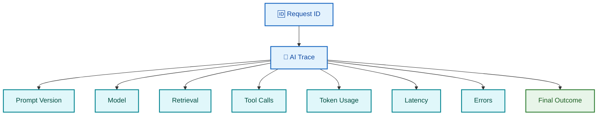

### Production dashboard

Track:

- request count,
- errors,
- latency,
- token usage,
- cost,
- tool failures,
- retrieval failures,
- model failures,
- user feedback,
- evaluation score.

---

# 🧪 23. POC → Production Strategy

A POC should prove the **risky assumptions**.

Do not build the entire production platform as a POC.

### Step 1 — Identify the risk

Example:

> “Can we get enough accuracy from scanned PDFs?”

### Step 2 — Build the smallest experiment

Use:

- representative documents,
- representative questions,
- a small pipeline.

### Step 3 — Measure

Measure:

- extraction quality,
- retrieval quality,
- answer quality,
- latency,
- cost.

### Step 4 — Decide

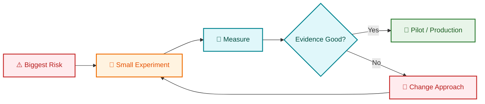

### POC exit criteria

A good POC has explicit success criteria.

Example:

- ≥ 90% field extraction accuracy
- target retrieval quality
- citation coverage
- target latency
- security controls demonstrated

---

# 🎤 24. Customer Presentation Framework

Use this structure:

1. Business problem
2. Desired outcome
3. Proposed solution
4. Why this approach
5. Risks
6. Security
7. Cost
8. Roadmap

### Roadmap

```text
POC → Pilot → Production → Scale
```

> **Start with the business outcome. End with measurable impact.**

---

# 📝 25. Architecture Decision Records

An **ADR (Architecture Decision Record)** is a short document that captures an architecture decision and why it was made.

### Example

```text
Decision:
Use hybrid search.

Why:
Keyword search handles exact terms.
Vector search handles semantic meaning.

Alternatives:
Vector-only, keyword-only.

Trade-off:
More infrastructure and tuning complexity.

Expected benefit:
Better retrieval quality for mixed enterprise queries.
```

Useful ADR fields:

- Context
- Decision
- Alternatives
- Reason
- Trade-offs
- Risks
- Impact
- Owner
- Date

---

# ⚖️ 26. Common Architecture Trade-offs

| Decision | Option A | Option B | Main trade-off |
|---|---|---|---|
| Model | Small | Large | Cost vs capability |
| Retrieval | Keyword | Vector | Exact match vs semantic match |
| AI control | Workflow | Agent | Predictability vs flexibility |
| Deployment | Managed | Self-hosted | Simplicity vs control |
| Context | RAG | Long context | Retrieval complexity vs token cost |
| Storage | SQL | NoSQL | Strong structure vs flexibility |
| Compute | Serverless | Kubernetes | Simplicity vs control |
| Async | Queue | Direct call | Resilience vs simplicity |
| Architecture | Single service | Microservices | Simplicity vs independent scaling |

> “I would choose based on requirements, not technology fashion.”

---

# 📂 27. Case Study 1 — Enterprise Document Intelligence

## Problem

A company has millions of documents. Employees spend too much time finding information.

## Discovery

Ask:

- Which documents are authoritative?
- Can users only access their department's data?
- How often do documents change?
- Are PDFs scanned?
- Are citations required?
- What happens if no answer exists?

## Architecture

```text
Documents
   ↓
Ingestion
   ↓
Parse + OCR
   ↓
Chunk + Metadata
   ↓
Embeddings
   ↓
Search Index
   ↓
User Question
   ↓
ACL Filter
   ↓
Hybrid Retrieval
   ↓
Reranking
   ↓
LLM
   ↓
Answer + Citation
```

## Key decision

RAG is often a strong fit when the source data is private and changes over time.

## Security

User identity must determine which documents can be retrieved.

## Evaluation

Measure:

- retrieval quality,
- answer groundedness,
- citation accuracy,
- latency,
- user task success.

---

# 🧑‍🏫 28. Case Study 2 — Enterprise Knowledge Assistant

## Problem

Employees repeatedly ask HR and IT questions.

A single assistant can combine multiple patterns:

```text
"What is the leave policy?"
        ↓
       RAG

"How many leaves do I have?"
        ↓
       API

"Submit a leave request."
        ↓
Workflow + Authorization + Approval
```

### Lesson

> One assistant can use several architectural patterns. Choose each component for the job it actually performs.

---

# 🎧 29. Case Study 3 — Agentic Customer Support

## Problem

Support agents manually:

- search customer records,
- read previous tickets,
- check order status,
- create cases.

## Architecture

```text
Customer
   ↓
Assistant
   ↓
Agent
 ┌─┼───────────────┐
 │ │               │
 ▼ ▼               ▼
CRM Search     Order API
 │                 │
 └──────┬──────────┘
        ▼
     Draft Reply
        │
        ▼
Human Approval
        │
        ▼
       Send
```

### Why human approval?

Sending an external message can have business impact.

---

# 💼 30. Case Study 4 — AI Sales Assistant

## Problem

Sales teams need fast access to product, account and opportunity information.

### Architecture choices

- RAG for product content,
- APIs for live CRM data,
- agent for multi-step research,
- deterministic code for calculations,
- approval for external actions.

### Architect rule

Do not let an LLM perform critical business calculations when deterministic application logic can do them reliably.

---

# 🖼️ 31. Case Study 5 — Multimodal Enterprise AI

## Problem

An insurer receives:

- accident images,
- claim forms,
- emails,
- policy PDFs.

### Flow

```text
Images + PDFs + Text
          ↓
     Extraction
          ↓
   Structured Claim
          ↓
   Rules + AI Review
          ↓
  Risk / Missing Data
          ↓
     Human Review
          ↓
        Decision
```

### Key concern

Keep evidence connected to the output so an investigator can understand where the result came from.

---

# ✅ 32. Daily AI Solution Architect Checklist

### Morning

- [ ] What business problem needs attention today?
- [ ] What architecture decision is pending?
- [ ] What technical risk is not yet proven?
- [ ] What customer question needs an answer?
- [ ] What production issue affects reliability?

### During the day

- [ ] Did I validate the business requirement?
- [ ] Did I challenge unnecessary complexity?
- [ ] Did I document important decisions?
- [ ] Did I check security implications?
- [ ] Did I consider cost and scale?
- [ ] Did I define how success will be measured?

### End of day

- [ ] What changed in the architecture?
- [ ] Which assumptions were disproved?
- [ ] Which risks remain?
- [ ] What needs customer confirmation?
- [ ] What should be tested next?

---

# 🤝 33. Customer Meeting Checklist

### Before

- [ ] Know the business context.
- [ ] Read available technical documentation.
- [ ] Identify stakeholders.
- [ ] Prepare discovery questions.
- [ ] Know the current architecture.
- [ ] Prepare options, not only one solution.
- [ ] Identify likely security concerns.
- [ ] Prepare a simple diagram.

### During

- [ ] Listen first.
- [ ] Clarify ambiguous requirements.
- [ ] Separate facts from assumptions.
- [ ] Confirm success criteria.
- [ ] Capture constraints.
- [ ] Confirm next steps.

### After

- [ ] Share meeting summary.
- [ ] Document decisions.
- [ ] List open questions.
- [ ] Assign owners.
- [ ] Define next actions.

---

# 🧪 34. POC Checklist

- [ ] Define the business question.
- [ ] Define measurable success criteria.
- [ ] Select representative data.
- [ ] Identify risky assumptions.
- [ ] Build the smallest useful experiment.
- [ ] Establish a baseline.
- [ ] Measure quality.
- [ ] Measure latency.
- [ ] Measure cost.
- [ ] Test failure cases.
- [ ] Test security.
- [ ] Capture evidence.
- [ ] Decide go / change / stop.

---

# 🏭 35. Production Readiness Checklist

### Architecture

- [ ] Clear component responsibilities
- [ ] Failure handling
- [ ] Timeouts
- [ ] Safe retries
- [ ] Idempotency (safe repeated execution)
- [ ] Capacity plan
- [ ] Disaster recovery

### Security

- [ ] Authentication
- [ ] Authorization
- [ ] Secrets management
- [ ] Encryption
- [ ] PII controls
- [ ] Audit logging
- [ ] Prompt injection testing
- [ ] Tool access controls

### AI

- [ ] Model selected
- [ ] Prompt versioned
- [ ] Evaluation set created
- [ ] Guardrails defined
- [ ] Fallback behavior defined
- [ ] Cost budget defined

### Operations

- [ ] Metrics
- [ ] Logs
- [ ] Traces
- [ ] Alerts
- [ ] Dashboard
- [ ] Incident runbook
- [ ] Ownership

---

# 🔎 36. Weekly Architecture Review Checklist

### Business

- [ ] Are KPIs improving?
- [ ] Has scope changed?

### Technical

- [ ] What became a bottleneck?
- [ ] Which dependency is risky?
- [ ] Is architecture becoming unnecessarily complex?

### AI

- [ ] Did model quality change?
- [ ] Are hallucinations increasing?
- [ ] Are retrieval results still good?
- [ ] Did prompt/model versions change?

### Security

- [ ] Any new attack paths?
- [ ] Any permission changes?
- [ ] Any sensitive data exposure?

### Cost

- [ ] Cost per request
- [ ] Token usage
- [ ] Infrastructure utilization
- [ ] Unexpected spend

---

# 🎯 37. Interview Preparation Plan

## Phase 1 — Foundations

Study:

- cloud architecture,
- distributed systems,
- APIs,
- databases,
- messaging,
- security,
- AI basics.

## Phase 2 — GenAI

Study:

- LLMs,
- tokenization,
- prompting,
- embeddings,
- vector search,
- RAG,
- agents,
- tool calling,
- evaluation.

## Phase 3 — Production AI

Study:

- observability,
- LLMOps,
- cost,
- latency,
- scaling,
- governance,
- security,
- deployment.

## Phase 4 — Architecture

Practice:

- customer discovery,
- HLD (High-Level Design),
- trade-offs,
- whiteboarding,
- POC planning,
- architecture reviews.

## Phase 5 — Interview simulation

Practice:

> “Design an enterprise AI solution for this customer.”

Use:

```text
Clarify
  ↓
Requirements
  ↓
Assumptions
  ↓
Architecture
  ↓
Trade-offs
  ↓
Security
  ↓
Evaluation
  ↓
Scale
  ↓
Cost
  ↓
Failure Handling
  ↓
Summary
```

---

# 🎤 38. 30+ Interview Questions & Answers

## Q1. What is an AI Solution Architect?

**Answer:** An AI Solution Architect converts business problems into secure, scalable and measurable AI solutions, connecting business requirements with data, models, applications and cloud infrastructure.

**Interview tip:** Mention business outcomes, not only AI technologies.

## Q2. How do you start an AI project?

**Answer:** I start with the business problem, users, success KPI, constraints, data availability and risk profile before selecting a model or framework.

## Q3. How do you decide whether AI is needed?

**Answer:** I compare AI with simpler deterministic solutions. If the problem can be solved accurately with normal software rules, I avoid unnecessary AI complexity.

## Q4. What is RAG?

**Answer:** RAG retrieves relevant information from an external knowledge source and provides it to the LLM before generation.

## Q5. When would you choose RAG over fine-tuning?

**Answer:** I usually prefer RAG when knowledge changes frequently, private data is required, or citations and access-aware retrieval are important.

## Q6. When would you not use RAG?

**Answer:** If the task does not need external knowledge, adding retrieval may only increase complexity and latency.

## Q7. What is an AI agent?

**Answer:** An agent is an application where an LLM can choose among approved actions, use tools, inspect results and continue toward a goal.

## Q8. Workflow vs agent?

**Answer:** A workflow gives explicit step control. An agent provides more dynamic decision-making. I use workflows for predictable processes and agents for open-ended tasks.

## Q9. How do you secure AI agents?

**Answer:** I enforce authentication, authorization, least privilege, tool allowlists, argument validation, business rules, human approval for high-risk actions and audit logging. The LLM is not the security boundary.

## Q10. How do you protect RAG from prompt injection?

**Answer:** Treat retrieved content as untrusted data, apply authorization before retrieval, separate instructions from data, validate outputs and test malicious documents.

## Q11. How do you evaluate RAG?

**Answer:** Evaluate retrieval quality separately from generation quality, then measure groundedness, relevance, citation quality, task success, latency and cost.

## Q12. What is groundedness?

**Answer:** It measures whether an answer is supported by the supplied evidence instead of being invented.

## Q13. How do you reduce LLM cost?

**Answer:** First identify the dominant cost drivers. I measure tokens/request, model calls, agent steps, retrieval cost, infrastructure utilization and cost per successful task. Then I reduce unnecessary context, route simple tasks to smaller models, cache repeated work, batch where appropriate and enforce usage guardrails. I optimize total cost against quality, latency and business outcome rather than simply choosing the cheapest model.

## Q13A. Does an architect own cost?

**Answer:** The architect owns the **architectural cost trade-off**, while FinOps/Finance typically owns financial governance and billing processes. I make cost a design constraint by estimating TCO, identifying cost drivers, calculating unit economics, comparing alternatives and defining cost guardrails.

## Q13B. How do you calculate the cost of an AI solution?

**Answer:** I start with workload assumptions such as requests/month, peak concurrency, input/output tokens, model calls, retrieval operations, storage, compute and retention. I multiply each quantity by its current unit price, then add fixed and variable infrastructure, network, observability, backup/DR and operational costs. Finally I calculate cost/request and cost/successful task and validate the estimate against expected business value.

## Q14. How do you reduce latency?

**Answer:** Parallelize independent work, use efficient retrieval, streaming, caching, model selection, connection reuse and strict timeout policies.

## Q15. What is model routing?

**Answer:** Model routing means choosing different models based on task complexity, cost, latency or quality requirements.

## Q16. What is prompt versioning?

**Answer:** Treat prompts like code by storing versions, evaluation results and release history.

## Q17. Why are citations important in enterprise RAG?

**Answer:** Citations improve trust and make it easier for users to verify where the answer came from.

## Q18. What happens when no relevant data is found?

**Answer:** The system should not invent an answer. It should return a controlled “not enough information” response or route to a human or business process.

## Q19. How do you handle hallucinations?

**Answer:** Improve retrieval, constrain the prompt, use citations, validate structured output, add evaluation and design clear fallback behavior.

## Q20. How do you design multi-tenant AI?

**Answer:** Keep tenant identity in the authenticated request context and enforce tenant-aware authorization and filtering before data reaches retrieval and generation.

## Q21. How do you scale an AI application?

**Answer:** Scale stateless application components horizontally, use queues for asynchronous work, optimize retrieval and model calls, and plan capacity for the actual workload.

## Q22. How do you handle model failure?

**Answer:** Use timeouts, retries where safe, fallback models or controlled responses, circuit breakers and user-friendly failure handling.

**Circuit breaker** temporarily stops repeated calls to a failing dependency.

## Q23. Why use a queue?

**Answer:** A queue separates producers from consumers and helps absorb bursts, support retries and process long-running work asynchronously.

## Q24. How do you choose serverless vs Kubernetes?

**Answer:** I consider workload shape, runtime control, scaling pattern, operational skills, networking and deployment complexity.

## Q25. What is observability?

**Answer:** The ability to understand the internal behavior of a system using logs, metrics and traces.

## Q26. What should an AI trace contain?

**Answer:** Request ID, model, prompt version, retrieval calls, tool calls, latency, token usage, errors and final outcome, subject to privacy policy.

## Q27. What is an ADR?

**Answer:** An ADR records an architecture decision, its context, alternatives, reasoning and trade-offs.

## Q28. How do you explain a complex architecture to executives?

**Answer:** Start with business impact, show a simple diagram, explain only the decisions relevant to the outcome, and describe risk, cost and measurable benefits.

## Q29. How do you run an architecture workshop?

**Answer:** Establish the goal, map the current state, capture requirements, identify constraints, propose options, discuss trade-offs, agree on decisions and record open questions.

## Q30. How do you handle disagreement with a customer?

**Answer:** I first understand the reason for the customer's preference, compare options using objective requirements and evidence, document the trade-offs and agree on a decision.

## Q31. What makes a good POC?

**Answer:** A good POC proves the biggest technical and business risks with measurable success criteria and representative data.

## Q32. What is your approach to production readiness?

**Answer:** I review security, reliability, scaling, cost, observability, evaluation, failure handling, ownership and operational processes before release.

## Q33. How do you decide between one agent and multiple agents?

**Answer:** I start with one agent. I split only when there are meaningful specialist boundaries, parallel workloads or different ownership and policy requirements.

## Q34. What would you monitor after launch?

**Answer:** Business KPI, task success, answer quality, latency, errors, cost, token use, retrieval quality, tool failures and user feedback.

## Q35. How do you answer an open-ended system-design question?

**Answer:** Clarify the problem, define users and scale, state assumptions, design the core architecture, identify bottlenecks, discuss security and failure handling, then explain trade-offs.

---

# 🏗️ 39. System Design Scenarios

Practice these:

1. Enterprise document assistant
2. Customer-support agent
3. AI sales copilot
4. Secure enterprise RAG platform
5. Multimodal claims assistant
6. AI knowledge search system
7. Agent using internal APIs
8. AI application for 1 million documents
9. Multi-tenant AI platform
10. AI platform with strict cost controls
11. Real-time AI assistant
12. AI application with human approval

### For every scenario answer

- users,
- requirements,
- scale,
- data,
- architecture,
- API flow,
- AI flow,
- security,
- evaluation,
- monitoring,
- cost,
- failure handling,
- trade-offs.

---

# 🧑‍💼 40. Customer Scenario Questions

### Scenario 1

> “The customer wants an LLM but has no clear business problem.”

**Response:** First define the business objective and KPI instead of selecting a model.

### Scenario 2

> “The customer wants an agent for a fixed five-step process.”

**Response:** Evaluate a deterministic workflow first because explicit control may be safer and easier to test.

### Scenario 3

> “The customer wants the model to access every database table.”

**Response:** Challenge the design and introduce least-privilege, domain-specific access and policy enforcement.

### Scenario 4

> “The model answer is good but costs too much.”

**Response:** Identify the major cost drivers, reduce unnecessary context, route simple tasks to smaller models and evaluate caching or batching.

### Scenario 5

> “RAG accuracy is poor.”

**Response:** Isolate retrieval quality from generation quality and inspect parsing, chunking, metadata, embeddings, search strategy and reranking before changing the model.

---

# 🧑‍🎨 41. Whiteboarding Exercises

When whiteboarding, draw left to right.

### Enterprise RAG

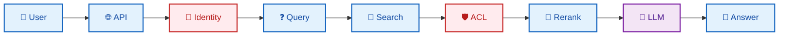

### Agent

```text
Goal
 ↓
Agent
 ├── Search
 ├── SQL
 ├── CRM
 └── Approval
 ↓
Result
```

### Production

Add:

- queue,
- cache,
- database,
- monitoring,
- disaster recovery,
- alerts.

> **Start with the business flow. Add infrastructure only where it solves a stated requirement.**

---

# ⭐ 42. STAR Interview Framework

**STAR** means:

- **Situation** — what was happening?
- **Task** — what needed to be achieved?
- **Action** — what did you do?
- **Result** — what changed?

### Example

**Question:** “Tell me about a difficult AI architecture decision.”

**Situation:** We needed an enterprise assistant over a large document set.

**Task:** We had to improve answer quality while protecting document-level permissions.

**Action:** I separated ingestion, retrieval, authorization and generation. We added metadata-aware retrieval, evaluation data and tracing.

**Result:** The team had a production-oriented architecture with measurable quality and explicit security boundaries.

### Strong answer pattern

```text
Problem
  ↓
Constraint
  ↓
Decision
  ↓
Why
  ↓
Trade-off
  ↓
Result
  ↓
Lesson
```

---

# ❌ 43. Common Interview Mistakes

### Mistake 1 — Starting with technology

Bad:

> “I would use Azure OpenAI.”

Better:

> “First I would understand the business goal and data constraints.”

### Mistake 2 — Using AI for everything

Not every problem needs an LLM.

### Mistake 3 — Ignoring security

An enterprise architecture without identity, authorization and audit is incomplete.

### Mistake 4 — Ignoring evaluation

“Looks good in the demo” is not enough.

### Mistake 5 — Ignoring cost

Production AI must have a cost model.

### Mistake 6 — Overengineering

More microservices, agents and infrastructure do not automatically mean a better architecture.

### Mistake 7 — Giving one answer without trade-offs

Architects need to compare options.

### Mistake 8 — Speaking only in technology language

Customers care about business outcomes.

### Mistake 9 — Treating AI as deterministic

LLMs are probabilistic (their outputs can vary).

### Mistake 10 — Letting the model own authorization

Keep authorization in deterministic application logic.

---

# 🏆 44. Principal-Level Expectations

At senior/principal level, the discussion goes beyond “Can you build this?”

You should be able to discuss:

- business value,
- architecture strategy,
- platform reuse,
- technical standards,
- risk management,
- cost at scale and unit economics,
- continuous technical improvement,
- technical debt and modernization strategy,
- organizational constraints,
- governance,
- roadmap,
- technical debt (future cost created by shortcuts),
- mentoring,
- cross-team alignment.

### Principal-level question

> “How would you make this solution reusable across 20 teams?”

Consider:

- platform boundaries,
- reusable services,
- reference architectures,
- standards,
- observability,
- governance,
- onboarding,
- ownership.

---

# 🧠 45. AI Solution Architect Mental Model

Remember five layers.

### Layer 1 — Business

> What value are we creating?

### Layer 2 — Experience

> What should the user be able to do?

### Layer 3 — AI

> Where does AI add unique value?

### Layer 4 — Engineering

> How do data, APIs, models and infrastructure work together?

### Layer 5 — Operations

> How do we secure, monitor, scale and improve it?

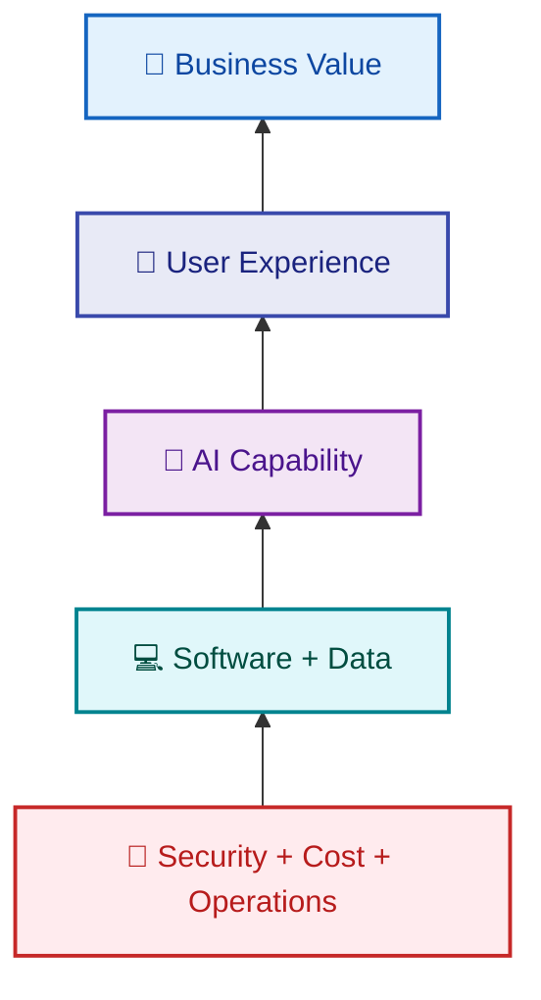

> **An architect designs the system around the problem, not the problem around the technology.**

---

# ⚡ 46. One-Page Quick Revision

## AI Solution Architect Formula

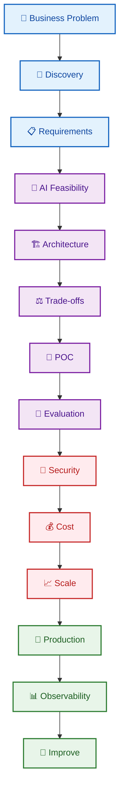

## AI decision rules

```text
Exact Rule        → Code
Prediction        → ML
Private Knowledge → RAG
New Behavior      → Fine-tuning
Open-ended Action → Agent
Known Steps       → Workflow
Sensitive Action  → Human Approval
```

## Security rules

```text
User Input = Untrusted
Retrieved Data = Untrusted
LLM = Not Authorization
Tool Call = Must Be Validated
High-Risk Action = Approval
Secrets = Outside Prompt
```

## Interview rules

1. Clarify first.
2. State assumptions.
3. Start simple.
4. Show the data flow.
5. Explain trade-offs.
6. Discuss failure cases.
7. Cover security.
8. Explain evaluation.
9. Explain cost and scale.
10. End with business impact.

---

# ✅ 47. Final Interview Checklist

### Architecture

- [ ] End-to-end AI architecture
- [ ] RAG
- [ ] Agentic AI
- [ ] Multimodal AI
- [ ] API architecture
- [ ] Distributed systems
- [ ] Messaging
- [ ] Databases
- [ ] Cloud infrastructure

### AI

- [ ] LLM basics
- [ ] Prompt engineering
- [ ] Embeddings
- [ ] Vector search
- [ ] Reranking
- [ ] Model selection
- [ ] Evaluation
- [ ] Guardrails

### Production

- [ ] Scalability
- [ ] Reliability
- [ ] Observability
- [ ] Cost optimization
- [ ] Security
- [ ] Governance
- [ ] Disaster recovery
- [ ] CI/CD (Continuous Integration / Continuous Delivery)

### Customer-facing

- [ ] Discovery questions
- [ ] Architecture presentation
- [ ] Whiteboarding
- [ ] POC planning
- [ ] Trade-off discussion
- [ ] Executive communication

### Storytelling

Prepare 6–8 real stories covering:

- difficult architecture decision,
- production incident,
- successful POC,
- security challenge,
- cost optimization,
- scaling challenge,
- stakeholder disagreement,
- mentoring/technical leadership.

---

# 📚 48. Official Resources

### Microsoft

- Microsoft Careers: https://apply.careers.microsoft.com/
- Azure Architecture Center: https://learn.microsoft.com/azure/architecture/
- Azure AI: https://learn.microsoft.com/azure/ai-services/
- Azure AI Foundry: https://learn.microsoft.com/azure/ai-foundry/

### Databricks

- Databricks Careers: https://www.databricks.com/company/careers/
- Databricks documentation: https://docs.databricks.com/
- MLflow: https://mlflow.org/

### NVIDIA

- NVIDIA Careers: https://www.nvidia.com/en-us/about-nvidia/careers/
- NVIDIA Developer: https://developer.nvidia.com/
- NVIDIA AI: https://developer.nvidia.com/ai

### General AI Engineering

- OpenAI: https://platform.openai.com/docs
- Anthropic: https://docs.anthropic.com/
- Model Context Protocol: https://modelcontextprotocol.io/
- OWASP GenAI Security: https://genai.owasp.org/

---

# 🎯 Final Architect Rule

When an interviewer gives you a modern AI problem, do not rush to name a service.

Say:

> **“Let me first understand the business goal, users, data, constraints, scale and success criteria. Then I’ll compare the simplest viable approaches and explain the trade-offs before proposing the target architecture.”**

That demonstrates architectural thinking.

---

## 🚀 AI Solution Architect Daily Habit

Every day ask:

> **What business problem am I solving?**  
> **What assumption am I making?**  
> **What evidence do I have?**  
> **What is the simplest architecture?**  
> **What can fail?**  
> **How will I secure it?**  
> **How will I measure it?**  
> **How much will it cost?**  
> **How will I operate it in production?**

### Learn → Discuss → Design → Prove → Secure → Measure → Ship → Improve

---

## 🔗 Related Guides in This Repository

- [🤖 Agent: Frameworks & Protocols](./Agent-Frameworks-and-Protocols.md)
- [🧠 Embeddings Deep Dive](./Embeddings-Deep-Dive.md)
- [🔐 Prompt Engineering: Introduction & Security](./Prompt-Engineering-Introduction-and-Security.md)
- [🎤 AI Engineer Interview Questions 2026](./AI-Engineer-Interview-Questions-2026.md)

<div align="center">

### 🤖 Think Like an Architect. Build Like an Engineer. Continuously Improve the System.

**New Requirement → Architecture → Production → Measure → Optimize → Modernize**

> Great architecture is not only about building the next feature. It is also about making the existing product faster, safer, cheaper, more reliable and easier to evolve.

</div>
