<!-- Agent: Frameworks & Protocols -->

<div align="center">

# 🤖 Agent: Frameworks & Protocols

### From **Agent Basics** → **Frameworks** → **Tool Calling** → **MCP** → **A2A** → **Multi-Agent Systems** → **Production Architecture**


</div>

> **One-line definition:** An **AI agent** is a software system that uses an LLM to decide what to do, call approved tools, observe the results, and continue until the task is complete.

---

## 🏷️ Tags

`AI Agents` • `Agentic AI` • `LLM` • `Tool Calling` • `Function Calling` • `LangChain` • `LangGraph` • `Semantic Kernel` • `Microsoft Agent Framework` • `MCP` • `A2A` • `Multi-Agent` • `RAG` • `Agent Orchestration` • `Human-in-the-Loop` • `Guardrails` • `AI Security` • `Python` • `C#` • `Azure AI`

---

## 📚 Table of Contents

1. [Why Agents Need Frameworks](#-1-why-agents-need-frameworks)
2. [The Agent Mental Model](#-2-the-agent-mental-model)
3. [Framework vs Protocol](#-3-framework-vs-protocol)
4. [Core Agent Building Blocks](#-4-core-agent-building-blocks)
5. [Tool Calling](#-5-tool-calling)
6. [Agent Loop](#-6-agent-loop)
7. [Framework Landscape](#-7-framework-landscape)
8. [LangChain](#-8-langchain)
9. [LangGraph](#-9-langgraph)
10. [Semantic Kernel](#-10-semantic-kernel)
11. [Microsoft Agent Framework](#-11-microsoft-agent-framework)
12. [CrewAI](#-12-crewai)
13. [AutoGen and Its Evolution](#-13-autogen-and-its-evolution)
14. [LlamaIndex](#-14-llamaindex)
15. [OpenAI Agents SDK](#-15-openai-agents-sdk)
16. [Pydantic AI](#-16-pydantic-ai)
17. [MCP](#-17-mcp-model-context-protocol)
18. [MCP Architecture](#-18-mcp-architecture)
19. [MCP vs API](#-19-mcp-vs-api)
20. [A2A](#-20-a2a-agent2agent-protocol)
21. [MCP + A2A Together](#-21-mcp--a2a-together)
22. [Single Agent vs Multi-Agent](#-22-single-agent-vs-multi-agent)
23. [Orchestration Patterns](#-23-orchestration-patterns)
24. [Agent Security](#-24-agent-security)
25. [Production Design](#-25-production-design)
26. [Python Example](#-26-python-example)
27. [C# Example](#-27-c-example)
28. [Interview Q&A](#-28-interview-qa)
29. [Quick Revision Sheet](#-29-quick-revision-sheet)
30. [Official Learning Resources](#-30-official-learning-resources)

---

# 🧩 1. Why Agents Need Frameworks

Building an agent from scratch is possible:

```text
LLM + tools + state + loop + error handling + retries + memory + security
```

Production software quickly becomes complicated. A framework gives reusable building blocks for models, tools, state, routing, human approval, observability and protocol integrations.

| Need | What a framework helps with |
|---|---|
| 🧠 Model | Connect to LLM providers |
| 🛠️ Tools | Define and invoke functions |
| 🔁 Loop | Run tool → observe → decide again |
| 💾 State | Keep conversation/workflow state |
| 🧭 Routing | Decide which agent/tool runs next |
| 👤 Human approval | Pause before sensitive actions |
| 📊 Observability | Logs, traces, token and latency data |
| 🛡️ Safety | Middleware, validation and guardrails |
| 🔌 Protocols | Connect tools or remote agents consistently |

### Easy rule

> **Framework = how you build/run the agent.**  
> **Protocol = how separate components communicate.**

---

# 🧠 2. The Agent Mental Model

Think of an agent like a **smart employee with controlled access to company systems**.

- 🧠 **LLM** = brain
- 📋 **Instructions** = job description
- 🛠️ **Tools** = approved company applications
- 💾 **Memory/state** = notebook
- 🧭 **Orchestrator** = manager deciding the workflow
- 🛡️ **Authorization** = access badge
- 👤 **Human approval** = manager sign-off for risky actions

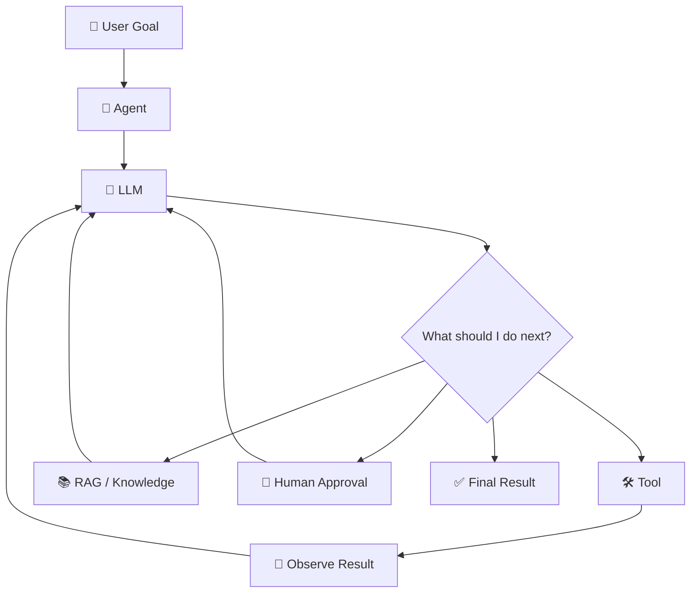

Example: an employee asks an assistant to find a leave policy, check remaining leave, and submit a request. The system may need several tools and several decisions before it can finish.

---

# 🔄 3. Framework vs Protocol

| Concept | Framework | Protocol |
|---|---|---|
| Main purpose | Build an application | Standardize communication |
| Example | LangGraph | MCP |
| Defines | Code abstractions and runtime | Message/interface rules |
| Developer concern | How do I orchestrate? | How do components interoperate? |
| Can switch implementation? | Usually yes | Yes, if both support the protocol |

### Simple analogy

Imagine a restaurant:

- **Framework** = the kitchen system, recipes, staff workflow and equipment.
- **Protocol** = the standard format used to place an order.

---

# 🧱 4. Core Agent Building Blocks

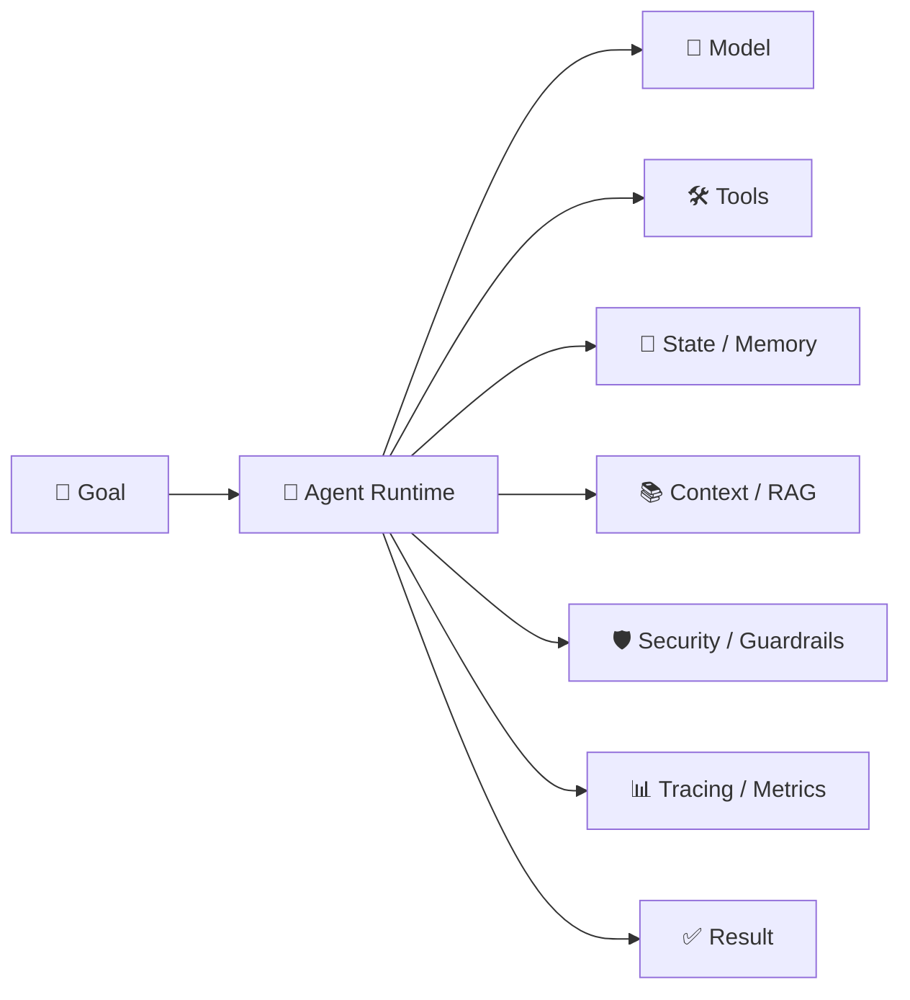

**Model:** understands instructions and proposes the next step.

**Tool:** lets the model ask software to do something, such as search, query, calculate or call a business API.

**State:** keeps information needed during or between steps, such as conversation history, current task and approval status.

**Context:** information supplied to the model for the current decision. RAG is one way to create context.

**Guardrails:** restrict unsafe, invalid or unauthorized behavior.

---

# 🛠️ 5. Tool Calling

**Tool calling** means the model asks your application to execute a registered function. The LLM should propose the action; your application should decide whether it is allowed to execute it.

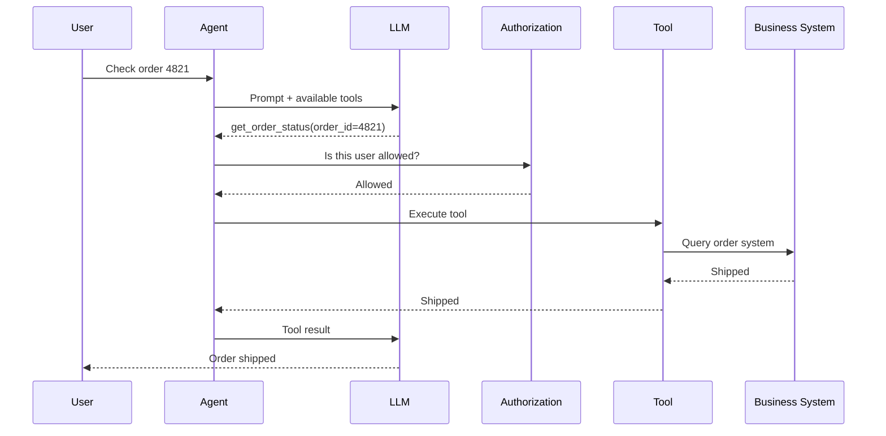

### Python

```python
from typing import Any

def get_order_status(order_id: str) -> dict[str, Any]:
    return {
        "order_id": order_id,
        "status": "shipped",
    }
```

### Security pattern

```text
LLM → Tool Proposal → Authorization → Validation → Tool Execution
```

---

# 🔁 6. Agent Loop

The simplest mental model is:

> **Decide → Act → Observe → Decide again**

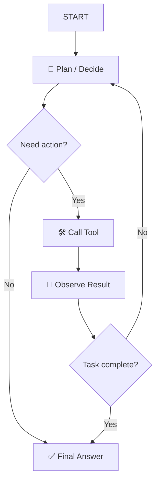

### Production controls

- Maximum iterations
- Timeouts
- Token/cost budgets
- Retry policy
- Cancellation
- Idempotency
- Human approval
- Audit logs

---

# 🧭 7. Framework Landscape

The ecosystem changes quickly, so treat this as an architectural guide rather than a permanent ranking.

| Framework / SDK | Main idea | Useful when |
|---|---|---|
| 🦜 **LangChain** | High-level agent building blocks | Fast application development |
| 🕸️ **LangGraph** | Explicit stateful graphs | Complex workflows and control |
| 🧩 **Semantic Kernel** | Microsoft SDK for AI integration | .NET / enterprise applications |
| 🏢 **Microsoft Agent Framework** | Unified agents + workflows + enterprise features | Microsoft-oriented agent systems |
| 👥 **CrewAI** | Role/task-oriented crews | Simple multi-agent concepts |
| 🔬 **AutoGen** | Multi-agent abstractions | Existing AutoGen systems / migration knowledge |
| 📚 **LlamaIndex** | Data + retrieval + agent workflows | Knowledge-heavy applications |
| 🧠 **OpenAI Agents SDK** | Lightweight agents and tools | Provider-centric agent applications |
| ✅ **Pydantic AI** | Type-safe Python agents | Strong typing and structured outputs |

> **Interview tip:** Do not answer "Framework X is best." Explain what problem each framework solves and why the architecture needs it.

---

# 🦜 8. LangChain

**Simple definition:** LangChain provides reusable building blocks for models, tools, prompts, retrieval, middleware and agents.

Its current `create_agent` API provides a standard agent loop and is built on LangGraph's runtime. citeturn681710search3turn681710search12

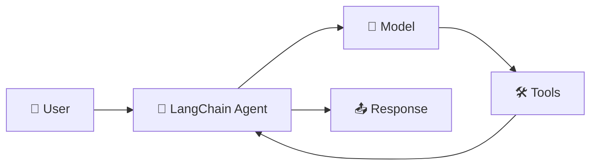

### Interview phrase

> "I use LangChain when I need fast composition of model, tool and retrieval components. When the workflow needs explicit state and branching, I move to LangGraph."

---

# 🕸️ 9. LangGraph

**Simple definition:** LangGraph is a low-level orchestration framework for long-running and stateful agent workflows.

It is designed for durable execution, persistence, streaming, human-in-the-loop controls and customizable graph-based workflows. citeturn681710search15turn681710search6

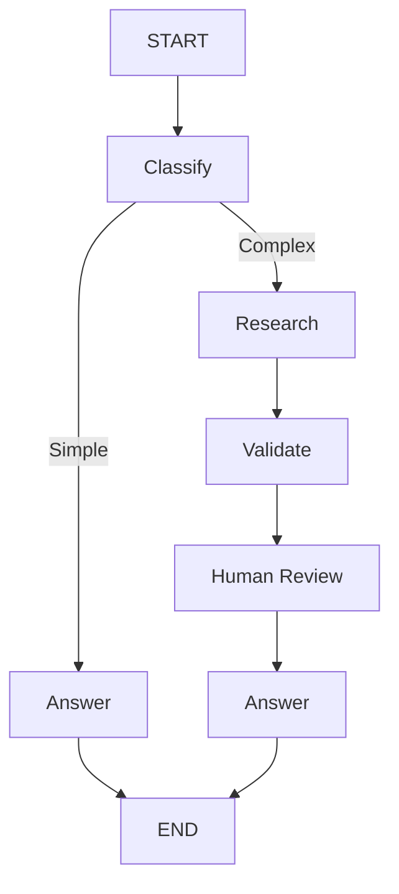

> **Think of LangGraph as:** a workflow state machine for agentic systems.

---

# 🧩 10. Semantic Kernel

**Simple definition:** Semantic Kernel is Microsoft's open-source SDK for integrating AI models, plugins and application services into applications in C#, Python and Java. citeturn681710search10

```text
Your .NET application
        ↓
Semantic Kernel
        ↓
Model + Plugins + Services
```

### C# example

```csharp
using Microsoft.SemanticKernel;
using System.ComponentModel;

public class OrderPlugin
{
    [KernelFunction("get_order_status")]
    [Description("Gets the current order status.")]
    public string GetOrderStatus(string orderId)
    {
        return $"Order {orderId} is shipped.";
    }
}
```

> **Easy rule:** Kernel is the bridge between your application code, AI services and plugins.

---

# 🏢 11. Microsoft Agent Framework

**Simple definition:** Microsoft Agent Framework provides a unified model for agents, workflows, tools, middleware, state and integrations.

Microsoft describes it as the successor to the Semantic Kernel + AutoGen line, combining simple agent abstractions with enterprise features such as session state, type safety, middleware, telemetry and graph-based workflows. citeturn681710search2turn681710search7

Current documentation covers agents, workflows, memory, tools, MCP integrations, security, human-in-the-loop and hosting. citeturn681710search1

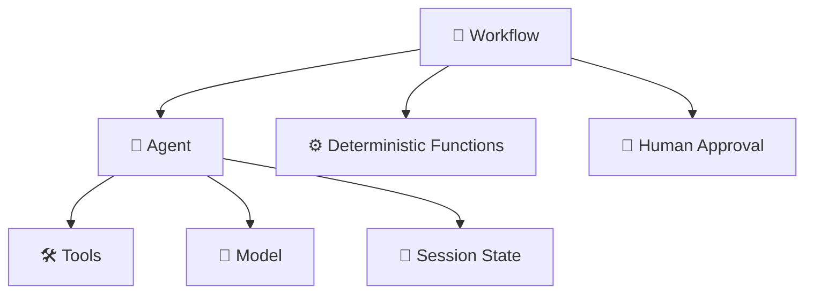

The official guidance is useful for architecture decisions: use an **agent** for open-ended or conversational tasks; use a **workflow** when execution steps require explicit control. citeturn681710search4

---

# 👥 12. CrewAI

**Simple definition:** CrewAI models a group of agents as a crew with roles, goals and tasks.

```text
Research Agent
      ↓
Writer Agent
      ↓
Reviewer Agent
      ↓
Final Result
```

### Engineering lesson

More agents do **not** automatically mean a better system. Every extra agent can add LLM calls, latency, state, cost and failure points.

---

# 🔬 13. AutoGen and Its Evolution

AutoGen became well known for multi-agent conversation and orchestration patterns. For interviews, understand the concepts even when your implementation uses another framework:

- Agent-to-agent communication
- Conversational orchestration
- Group coordination
- Tool use
- Human intervention

Microsoft's current Agent Framework documentation describes the new framework as the direct successor to the Semantic Kernel and AutoGen teams' work. citeturn681710search2

### Migration mindset

```text
Agent abstraction
→ Tools
→ State
→ Orchestration
→ Human approval
→ Observability
```

---

# 📚 14. LlamaIndex

**Simple definition:** LlamaIndex is a data-focused framework for connecting LLM applications with private or external data, including retrieval and agent workflows.

It is especially useful when the application is centered around documents, data connectors, indexes, retrieval and knowledge agents.

```text
Your data → Index → Retrieve → Agent/LLM → Answer
```

---

# 🧠 15. OpenAI Agents SDK

A lightweight agent stack generally contains:

```text
Agent
  ↓
Instructions
  ↓
Tools
  ↓
Model
  ↓
Result
```

### Engineering principle

Keep business logic outside the model abstraction:

```text
Agent SDK
   ↓
Application Service
   ↓
Domain Rules
   ↓
Database / APIs
```

---

# ✅ 16. Pydantic AI

**Simple definition:** Pydantic AI focuses on Python agents with strong typing and structured outputs.

Example result:

```json
{
  "decision": "approve",
  "reason": "Policy allows the request",
  "confidence": 0.91
}
```

> **Easy rule:** Use natural language for people; use schemas for software.

---

# 🔌 17. MCP — Model Context Protocol

**Simple definition:** MCP is an open protocol for connecting AI applications to tools and context in a standardized way.

```text
AI Application
      ↓
    MCP
      ↓
┌───────────────┬───────────────┬───────────────┐
│ Search Server │ GitHub Server │ DB Server     │
└───────────────┴───────────────┴───────────────┘
```

### Core concepts

- 🛠️ **Tools** — actions an application/model can request
- 📚 **Resources** — contextual data
- 📝 **Prompts** — reusable prompt templates

> **Easy analogy:** MCP is a universal adapter specification. The agent does not need a custom integration for every tool if the tool provider speaks the protocol.

---

# 🏗️ 18. MCP Architecture

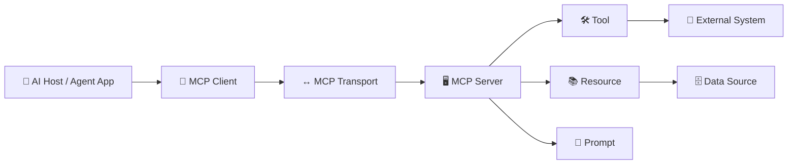

### Important separation

```text
Agent logic
    ≠
Tool implementation
    ≠
Protocol transport
    ≠
Business authorization
```

---

# 🔀 19. MCP vs API

| Traditional API | MCP |
|---|---|
| Application-to-application interface | AI-oriented context/tool interface |
| REST/GraphQL/gRPC are common | MCP standardizes agent-facing interaction |
| Business API can remain internal | MCP can act as an adapter over business APIs |
| Client-specific integration is common | Common protocol reduces bespoke integrations |

Example:

```text
Existing API:
POST /orders/{id}/cancel

AI layer:
Agent → MCP Tool → Cancellation API
```

The business service does not need to move its core authorization and domain rules into the model.

---

# 🤝 20. A2A — Agent2Agent Protocol

**Simple definition:** A2A is an open protocol designed to let independent AI agents discover capabilities and collaborate across different implementations.

The official specification describes capability discovery, modality negotiation, collaborative tasks and interaction without requiring access to another agent's internal state, memory or tools. citeturn681710search16turn681710search17

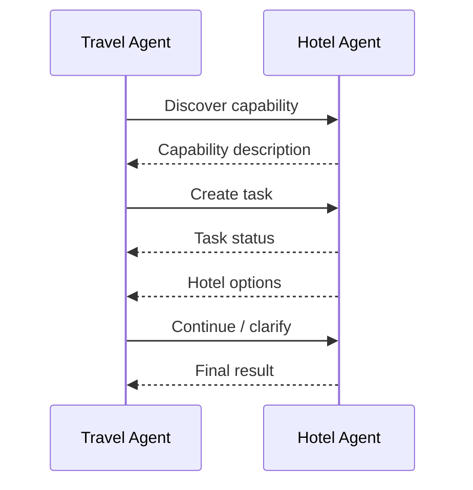

---

# 🧩 21. MCP + A2A Together

### MCP answers

> **How does an agent access tools/context?**

### A2A answers

> **How can agents collaborate?**

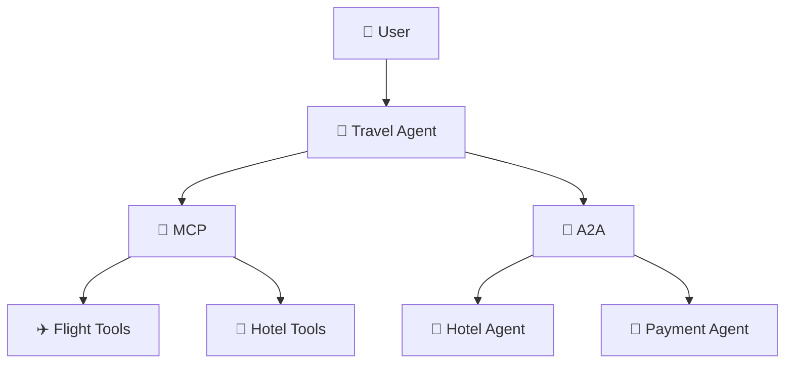

> **Interview one-liner:** MCP connects agents to capabilities; A2A connects agents to agents.

---

# 👥 22. Single Agent vs Multi-Agent

Start with a single agent unless multiple agents solve a real problem.

| Single Agent | Multi-Agent |
|---|---|
| Simpler | More complex |
| Lower coordination overhead | More coordination |
| Easier debugging | Harder debugging |
| Good for bounded tasks | Useful for specialized roles |
| Fewer model calls | Potentially many model calls |

Example:

```text
Supervisor Agent
   ├── Research Agent
   ├── Compliance Agent
   └── Report Agent
```

---

# 🧭 23. Orchestration Patterns

## Pattern 1 — Sequential

```text
A → B → C → D
```

Use when steps always happen in order.

## Pattern 2 — Router

```text
             → Billing Agent
User → Router → HR Agent
             → Technical Agent
```

Use when one request should be directed to one specialist.

## Pattern 3 — Parallel

```text
          → Research A →
User → Coordinator       → Merge
          → Research B →
```

Use when tasks can run independently.

## Pattern 4 — Supervisor

```text
             Supervisor
            /          \
     Researcher      Analyst
            \          /
                ↓
              Result
```

## Pattern 5 — Human-in-the-loop

```text
Agent → Proposed Action → Human → Execute
```

---

# 🛡️ 24. Agent Security

Agent systems combine untrusted natural language, a powerful model and powerful tools. Treat this as an application security problem, not only a prompt-engineering problem.

### Security checklist

#### 1. Authentication
Who is the user?

#### 2. Authorization
What is the user allowed to do?

#### 3. Tool authorization
Is this user allowed to call this specific tool with these arguments?

#### 4. Input validation
Validate IDs, amounts, paths, SQL parameters and URLs.

#### 5. Prompt injection defense
Treat user text, retrieved documents and tool output as untrusted data.

#### 6. Least privilege
Give tools only the permissions they need.

#### 7. Approval for high-risk actions
Require human approval for sensitive operations.

#### 8. Audit trail
Record user, agent, tool, arguments, authorization result, outcome and timestamp.

> **Critical rule:** The LLM is not your security boundary.

---

# 🏭 25. Production Design

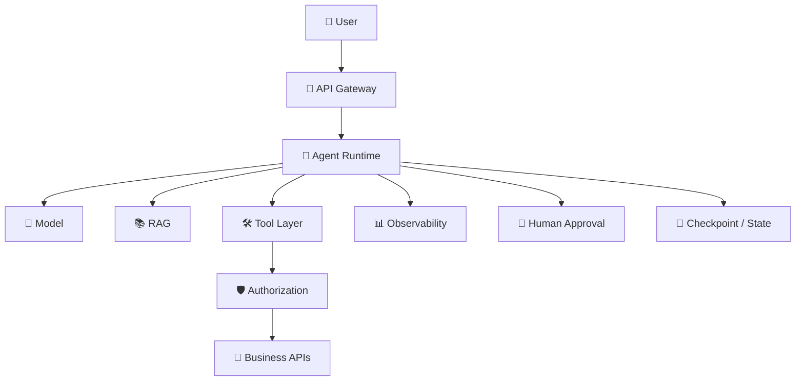

### Production questions interviewers expect

- What happens if the LLM times out?
- What happens if a tool fails?
- How do you prevent duplicate actions?
- How do you stop infinite loops?
- How do you authorize tool calls?
- How do you trace one request across several tools?
- How do you control token cost?
- How do you resume a long-running task?
- How do you handle prompt injection?
- How do you test probabilistic output?

---

# 🐍 26. Python Example

Below is a framework-neutral mini agent. The goal is to understand the mechanics before learning a framework.

```python
from typing import Any, Callable

def search_documents(query: str) -> dict[str, Any]:
    return {
        "documents": [
            {
                "title": "Leave Policy",
                "text": "Employees receive 24 annual leave days.",
            }
        ]
    }

def execute_tool(tool_name: str, arguments: dict[str, Any]) -> dict[str, Any]:
    tools: dict[str, Callable[..., dict[str, Any]]] = {
        "search_documents": search_documents,
    }

    tool = tools.get(tool_name)
    if tool is None:
        raise ValueError(f"Unknown tool: {tool_name}")

    return tool(**arguments)
```

### What this teaches

- Tools are normal application functions.
- The agent can select a tool by name.
- The application executes the selected function.
- Security, validation and error handling belong around the tool.

---

# 💜 27. C# Example

A clean .NET design should keep the AI layer separate from business logic.

```csharp
public interface IDocumentSearchTool
{
    Task<IReadOnlyList<string>> SearchAsync(
        string query,
        CancellationToken cancellationToken);
}
```

```csharp
public sealed class DocumentAgentService
{
    private readonly IDocumentSearchTool _searchTool;

    public DocumentAgentService(IDocumentSearchTool searchTool)
    {
        _searchTool = searchTool;
    }

    public async Task<string> AskAsync(
        string question,
        CancellationToken cancellationToken)
    {
        IReadOnlyList<string> context =
            await _searchTool.SearchAsync(
                question,
                cancellationToken);

        return $"Use this context to answer: {string.Join(" ", context)}";
    }
}
```

### Architecture principle

```text
Controller
   ↓
Application Service
   ↓
Agent Runtime
   ↓
Tool Interface
   ↓
Infrastructure
```

---

# 🎤 28. Interview Q&A

The format below is intentionally simple, structured and interview-ready.

## Q1. What is an AI agent?

### Simple explanation
An AI agent is an application where an LLM can decide the next step, use approved tools, inspect results and continue until the task is complete.

### Key points
- LLM = reasoning component
- Tools = actions
- State = working memory
- Orchestration = controls the loop
- Guardrails = controls risk

### STAR-style sample answer
**Situation:** We had an enterprise assistant that needed more than answering questions.

**Task:** It had to search documents and call internal services.

**Action:** I designed the LLM as the reasoning layer and exposed document search and business APIs as controlled tools. I added authorization before tool execution and a maximum-step limit.

**Result:** The assistant could complete multi-step tasks while keeping business actions inside normal application security boundaries.

### Interview tip
Do not say "the agent thinks like a human." Say it **selects actions based on model output and system state**.

## Q2. What is the difference between an agent and a workflow?

### Simple explanation
A workflow follows known steps. An agent can decide which step to take next.

### Key points
- Workflow = explicit control
- Agent = dynamic decision-making
- Many systems combine both

### STAR-style sample answer
**Situation:** Our document-processing process had fixed ingestion stages.

**Task:** We needed predictable execution for ingestion but flexible behavior during question answering.

**Action:** I kept ingestion as a deterministic workflow and used an agent only for question answering and tool selection.

**Result:** We reduced unnecessary model decisions and kept critical processing easy to test.

### Interview tip
> **Known path → workflow. Open-ended path → agent.**

## Q3. Why use LangGraph?

### Simple explanation
LangGraph is useful when an agent needs explicit state, branching, checkpoints, persistence or human approval.

### Key points
- Graph-based
- Stateful
- Long-running
- Human-in-the-loop
- Deterministic + agentic steps

### STAR-style sample answer
**Situation:** A simple agent loop became difficult to control when we added approval and retry branches.

**Task:** We needed a clear execution model.

**Action:** I represented major states explicitly: classify, retrieve, validate, approve and answer.

**Result:** The workflow became easier to debug, test and resume.

## Q4. What is MCP?

### Simple explanation
MCP is a standard protocol for connecting AI applications to tools and context providers.

### Key points
- Standard interface
- Tools
- Resources
- Prompts
- Decouples agent from tool implementation

### STAR-style sample answer
**Situation:** Different AI applications needed access to the same internal capabilities.

**Task:** We wanted to avoid custom integrations for every application.

**Action:** I exposed common capabilities through a protocol-based tool layer and kept business services behind that adapter.

**Result:** Multiple AI clients could consume consistent capabilities without duplicating business logic.

## Q5. MCP vs REST API?

### Simple explanation
REST is a general application API style. MCP standardizes how AI applications interact with agent-facing tools and context.

### STAR-style sample answer
**Situation:** We already had REST business APIs.

**Task:** We wanted agents to consume those capabilities safely.

**Action:** I kept REST as the business API and placed a controlled MCP adapter in front of the capabilities that made sense for AI use.

**Result:** Existing APIs stayed reusable while the AI layer gained a standardized tool interface.

## Q6. What is A2A?

### Simple explanation
A2A is designed for communication and collaboration between independent AI agents.

### Key points
- Agent discovery
- Capability exchange
- Task collaboration
- Cross-framework interoperability
- Agents need not expose internal implementation

### STAR-style sample answer
**Situation:** Different specialist agents were owned by different teams.

**Task:** We needed them to collaborate without tightly coupling their internal implementations.

**Action:** We defined an agent-to-agent interaction boundary and treated each specialist as an independent service.

**Result:** Teams could evolve agent implementations separately while preserving the collaboration contract.

## Q7. MCP vs A2A?

### Simple explanation
```text
MCP → Agent ↔ Tools / Context
A2A → Agent ↔ Agent
```

### Interview answer
> "I think of MCP as the capability integration layer and A2A as the agent collaboration layer. An agent can use MCP to reach tools and use A2A to delegate work to another agent."

## Q8. Why not use one giant agent?

### Simple explanation
One giant agent becomes harder to secure, debug and control.

### Key points
- Large tool list
- Ambiguous responsibilities
- More context
- Harder testing
- More failure modes

### STAR-style sample answer
**Situation:** We had many unrelated business capabilities.

**Task:** We needed clearer ownership and authorization boundaries.

**Action:** I separated capabilities by domain and only exposed relevant tools to each agent.

**Result:** Tool selection and security rules became easier to reason about.

## Q9. How do you secure agent tool calling?

### Sample answer
> "I never treat an LLM tool call as authorization. The application validates the user identity, checks tool-level permissions, validates arguments, applies business rules and only then executes the operation. For high-risk actions I also add human approval and audit logging."

### Easy flow
```text
LLM proposal
   ↓
Authentication
   ↓
Authorization
   ↓
Argument validation
   ↓
Business rules
   ↓
Human approval if needed
   ↓
Execute
```

## Q10. How do you prevent infinite agent loops?

### Answer
Use multiple controls:

- Max iterations
- Timeouts
- Token/cost budgets
- Tool failure limits
- Cancellation
- Stop conditions
- Duplicate-action detection

> "I never let agent autonomy mean unlimited execution."

## Q11. When would you use multi-agent architecture?

### Answer
I use multi-agent architecture when there are genuinely distinct roles, ownership boundaries or parallel specialist tasks. I avoid it when a single agent with a small set of tools is enough because every extra agent increases latency, cost and coordination complexity.

## Q12. What is the role of RAG in an agent?

### Answer
RAG provides external knowledge. The agent decides **when retrieval is needed and which retrieval tool to call**.

```text
Agent
 ├── RAG Search
 ├── SQL Query
 ├── API Call
 └── Calculator
```

## Q13. How do frameworks differ from protocols?

### Sample answer
> "Frameworks give me programming abstractions and runtime behavior for building agents. Protocols define interoperable communication rules. For example, LangGraph can orchestrate an agent workflow, while MCP can define how that agent accesses tools."

## Q14. What is human-in-the-loop?

### Simple explanation
The agent pauses and asks a person to approve or correct an action.

```text
Agent proposes action
        ↓
Human approval
        ↓
System executes
```

Use it for financial operations, account deletion, legal workflows, production changes and sensitive communication.

## Q15. What would you monitor in production?

### Answer
I would trace the complete request and measure end-to-end latency, LLM latency, tool latency, token usage, cost, tool success/failure, retry counts, number of agent steps, retrieval quality, human approvals/rejections and final answer quality.

## Q16. How would you test an agent?

### Layered answer
1. **Unit tests:** tools and business rules.
2. **Contract tests:** tool schemas and protocol interfaces.
3. **Workflow tests:** state transitions and branches.
4. **Evaluation tests:** groundedness, task success and answer quality.
5. **Security tests:** prompt injection, unauthorized tools, data leakage and excessive actions.

## Q17. What is the biggest mistake when designing agents?

### Sample answer
> "The biggest mistake is giving an LLM direct access to powerful systems without deterministic authorization and validation. I treat the LLM as a decision component, not as a security boundary or business rules engine."

## Q18. What is the difference between tool use and A2A delegation?

### Answer
Tool use is usually **Agent → Capability**. A2A is **Agent → Another Agent**. The second agent may have its own model, tools, memory and internal workflow.

## Q19. How do you choose a framework?

### Decision guide
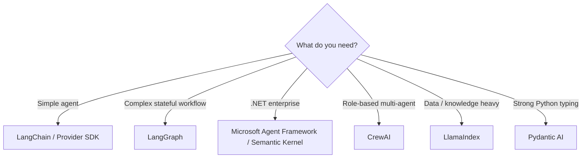

### Interview answer
> "I choose based on workflow complexity, language/runtime, observability, integration needs, deployment model, team skills and long-term maintenance—not only popularity."

## Q20. Explain your agent architecture in 60 seconds.

### Sample answer
> "I design the agent as one controlled component inside a standard application. The user request enters through an authenticated API. The agent uses an LLM to select from a small set of typed tools. Before execution, every tool call goes through authorization, argument validation and business rules. RAG is available as a knowledge tool. The runtime maintains state and has step, timeout and cost limits. Sensitive operations require human approval. Finally, I trace model calls, tool calls, latency, token usage and outcomes so the system is observable and testable."

---

# ⚡ 29. Quick Revision Sheet

### Remember these 10 lines

1. 🧠 **LLM = reasoning**
2. 🛠️ **Tool = action**
3. 💾 **State = memory of the task**
4. 🧭 **Orchestrator = decides workflow**
5. 📚 **RAG = external knowledge**
6. 🛡️ **Guardrail = safety/control**
7. 🦜 **LangChain = agent building blocks**
8. 🕸️ **LangGraph = explicit stateful orchestration**
9. 🔌 **MCP = agent ↔ tools/context**
10. 🤝 **A2A = agent ↔ agent**

```text
                 ┌───────────────────┐
                 │     👤 USER       │
                 └─────────┬─────────┘
                           ↓
                 ┌───────────────────┐
                 │  🔐 APPLICATION   │
                 └─────────┬─────────┘
                           ↓
              ┌─────────────────────────┐
              │      🤖 AGENT           │
              │                         │
              │   🧠 LLM + 🧭 State     │
              └─────┬──────────┬────────┘
                    ↓          ↓
              ┌─────────┐  ┌─────────┐
              │   📚    │  │   🔌    │
              │   RAG   │  │   MCP   │
              └─────────┘  └────┬────┘
                                 ↓
                           ┌───────────┐
                           │ 🛠️ Tools │
                           └───────────┘

                    🤝 A2A → Other Agents
```

---

# 📖 30. Official Learning Resources

| Topic | Official resource |
|---|---|
| 🦜 LangChain | https://www.langchain.com/langchain |
| 🕸️ LangGraph | https://www.langchain.com/langgraph |
| 🧩 Semantic Kernel | https://learn.microsoft.com/en-us/semantic-kernel/ |
| 🏢 Microsoft Agent Framework | https://learn.microsoft.com/en-us/agent-framework/ |
| 🔌 MCP | https://modelcontextprotocol.io/ |
| 🤝 A2A | https://a2a-protocol.org/ |

---

# 🎯 Final Interview Formula

```text
1. Define it in one simple sentence
            ↓
2. Explain why it exists
            ↓
3. Show the architecture
            ↓
4. Give one real-world example
            ↓
5. Explain trade-offs
            ↓
6. Mention security + observability
            ↓
7. Finish with the result
```

### Example

> "MCP is a protocol for connecting AI applications to tools and context. I would use it when multiple AI clients need standardized access to common capabilities. I would keep authorization and business logic behind the MCP adapter, because the protocol itself does not replace application security. This gives us a reusable integration boundary while keeping the core services independent."

---

## ⭐ Key Takeaway

> **Build the agent with a framework. Connect capabilities with protocols. Keep security and business rules outside the LLM.**

---

## 🔗 Related Guides in This Repository

- [🤖 Agentic AI Guide](./agentic-ai-guide.md)
- [🏗️ Agentic AI System Design — Simple](./Agentic-AI-System-Design-Simple.md)
- [🏗️ Agentic AI System Design](./Agentic-AI-System-Design.md)
- [📚 Production GenAI & Agentic AI Guide](./production-genai-agentic-ai-guide.md)
- [🎤 AI Engineer Interview Questions 2026](./AI-Engineer-Interview-Questions-2026.md)

<div align="center">

### 🚀 Learn → Build → Evaluate → Secure → Deploy

**Become an AI Engineer who can design agents — not just call an LLM.**

</div>