# 🤖 Agentic AI Open-Source Stack: LangChain, LangGraph & the Tools Behind Production AI Agents

<div align="center">

### 🧠 From LLM → Tools → RAG → Memory → Orchestration → Multi-Agent → Production


</div>

> **One-line definition:** An Agentic AI system is a software system in which an LLM can select actions, call approved tools, observe results, maintain state, and continue through multiple steps to achieve a goal.

---

## 🏷️ Tags

`Agentic AI` • `AI Agents` • `LangChain` • `LangGraph` • `LlamaIndex` • `CrewAI` • `Pydantic AI` • `OpenAI Agents SDK` • `Semantic Kernel` • `Microsoft Agent Framework` • `AutoGen` • `MCP` • `A2A` • `RAG` • `Vector Database` • `Tool Calling` • `Function Calling` • `Multi-Agent Systems` • `AI Orchestration` • `Human-in-the-Loop` • `Guardrails` • `AI Security` • `FastAPI` • `Python` • `C#` • `Azure AI` • `Open Source AI` • `AI Solution Architecture`

---

## 📚 Table of Contents

1. [The Big Idea](#-1-the-big-idea)
2. [Agentic AI vs a Normal LLM App](#-2-agentic-ai-vs-a-normal-llm-app)
3. [The Restaurant Analogy](#-3-the-restaurant-analogy)
4. [The Complete Agentic AI Stack](#-4-the-complete-agentic-ai-stack)
5. [LLM — The Brain](#-5-llm--the-brain)
6. [Tool Calling — The Hands](#-6-tool-calling--the-hands)
7. [LangChain — The Toolbox](#-7-langchain--the-toolbox)
8. [LangGraph — The Control Room](#-8-langgraph--the-control-room)
9. [LlamaIndex — The Librarian](#-9-llamaindex--the-librarian)
10. [CrewAI — The Team](#-10-crewai--the-team)
11. [Pydantic AI — The Safety Inspector](#-11-pydantic-ai--the-safety-inspector)
12. [OpenAI Agents SDK — The Lightweight Runtime](#-12-openai-agents-sdk--the-lightweight-runtime)
13. [Semantic Kernel & Microsoft Agent Framework](#-13-semantic-kernel--microsoft-agent-framework)
14. [AutoGen — The Multi-Agent Conversation Model](#-14-autogen--the-multi-agent-conversation-model)
15. [MCP — The Universal Adapter](#-15-mcp--the-universal-adapter)
16. [A2A — The Agent-to-Agent Telephone](#-16-a2a--the-agent-to-agent-telephone)
17. [RAG — The Company Knowledge Base](#-17-rag--the-company-knowledge-base)
18. [Memory — The Notebook](#-18-memory--the-notebook)
19. [Vector Databases — The Semantic Filing Cabinet](#-19-vector-databases--the-semantic-filing-cabinet)
20. [Observability — The Flight Recorder](#-20-observability--the-flight-recorder)
21. [Guardrails & Security](#-21-guardrails--security)
22. [Single Agent vs Multi-Agent](#-22-single-agent-vs-multi-agent)
23. [A Real Enterprise Example](#-23-a-real-enterprise-example)
24. [Reference Architecture](#-24-reference-architecture)
25. [Choosing the Right Tool](#-25-choosing-the-right-tool)
26. [Common Architecture Mistakes](#-26-common-architecture-mistakes)
27. [Interview Cheat Sheet](#-27-interview-cheat-sheet)
28. [Official References](#-28-official-references)

---

# 🧩 1. The Big Idea

A modern Agentic AI application is **not** just:

`User → Prompt → LLM → Answer`

A useful production mental model is:

`User Goal → Agent → Decision → Tool → Observation → Decision → ... → Result`

That is why the ecosystem contains many different projects. They solve different engineering problems:

| Problem | Typical tool/category |
|---|---|
| Talk to an LLM | Model SDK / provider SDK |
| Build prompts, tools, retrieval and agent components | **LangChain** |
| Control stateful branches, loops, checkpoints and approvals | **LangGraph** |
| Connect data, indexing and knowledge retrieval | **LlamaIndex** |
| Model role-based teams of agents | **CrewAI** |
| Enforce typed inputs/outputs in Python | **Pydantic AI** |
| Build lightweight agents with tools/handoffs/guardrails | **OpenAI Agents SDK** |
| .NET enterprise AI integration | **Semantic Kernel / Microsoft Agent Framework** |
| Connect AI apps to standard tool/context servers | **MCP** |
| Let independent agents collaborate | **A2A** |
| Serve open models locally / at scale | **Ollama / vLLM** |
| Store semantic retrieval data | **Qdrant / pgvector / FAISS / Chroma** |
| Trace and evaluate production behavior | **OpenTelemetry + evaluation tooling** |

> **These tools are complementary. They are not one giant list of interchangeable frameworks.**

---

# 🧠 2. Agentic AI vs a Normal LLM App

### Traditional LLM Application

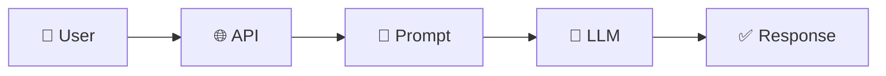

The application usually decides the workflow.

### Agentic Application

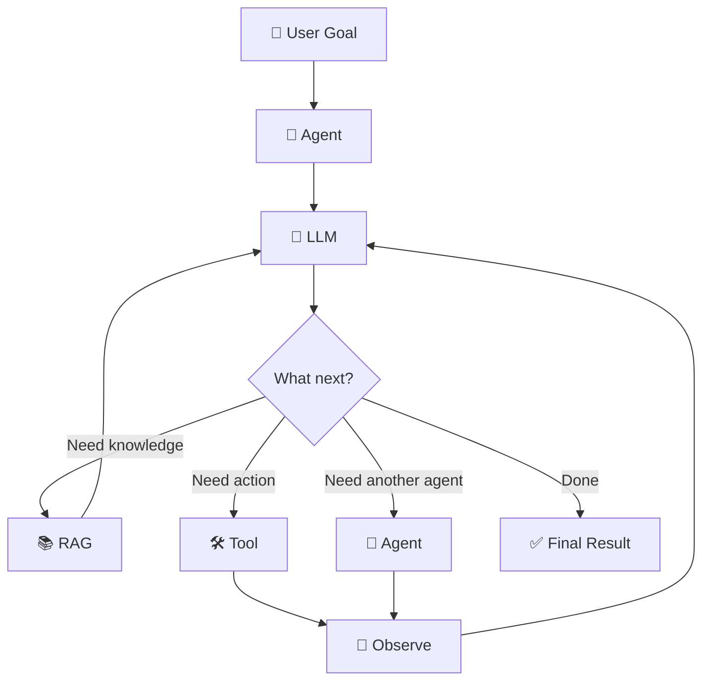

An agent introduces **decision-making inside the execution loop**.

---

# 🍽️ 3. The Restaurant Analogy

The easiest way to remember the ecosystem is to imagine a large restaurant.

| Agentic AI concept | Restaurant analogy |
|---|---|
| 👤 User | Customer |
| 🧠 LLM | Experienced chef / decision maker |
| 🧭 Orchestrator | Head chef / floor manager |
| 🛠️ Tool | Kitchen station / appliance |
| 📚 RAG | Recipe book + ingredient inventory |
| 💾 Memory | Chef's notebook |
| 🕸️ LangGraph | Kitchen workflow board |
| 🦜 LangChain | Collection of reusable kitchen equipment |
| 👥 CrewAI | Team of specialized chefs |
| ✅ Pydantic AI | Order checker |
| 🔌 MCP | Universal connector standard |
| 🤝 A2A | Another specialist restaurant you can call |
| 📊 Observability | Kitchen cameras + operations dashboard |
| 🛡️ Guardrails | Food safety rules |
| 👤 Human approval | Manager sign-off before an expensive order |

### Example

Customer asks:

> **"Plan a business trip to Singapore, keep it under ₹1.5 lakh, prefer morning flights, book the hotel, and prepare the expense summary."**

This may require:

```text
1. Understand requirements
2. Remember preferences
3. Search flights
4. Search hotels
5. Compare prices
6. Check company policy
7. Ask for approval
8. Book
9. Generate expense summary
```

That is an **agentic workflow**.

---

# 🏗️ 4. The Complete Agentic AI Stack

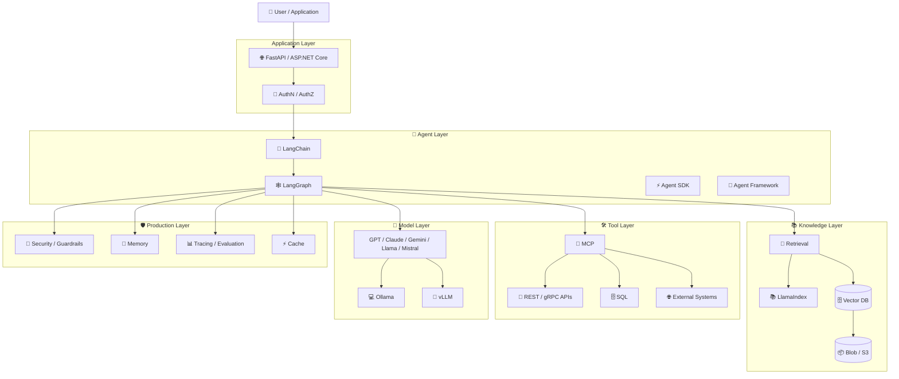

---

# 🧠 5. LLM — The Brain

The LLM is the reasoning and language component.

It is good at:
- Understanding natural language
- Selecting among available actions
- Extracting structured information
- Generating text
- Planning candidate next steps
- Interpreting tool results

It is **not** automatically:
- Your authorization layer
- Your database
- Your business rules engine
- Your source of truth
- Your transaction engine

### Critical production principle

```text
LLM proposes
     ↓
Application validates
     ↓
Application authorizes
     ↓
Application executes
```

---

# 🛠️ 6. Tool Calling — The Hands

An LLM alone can tell you:

> "The order appears to be shipped."

A tool-enabled agent can request:

`get_order_status(order_id="4821")`

The application executes the function and returns the result.

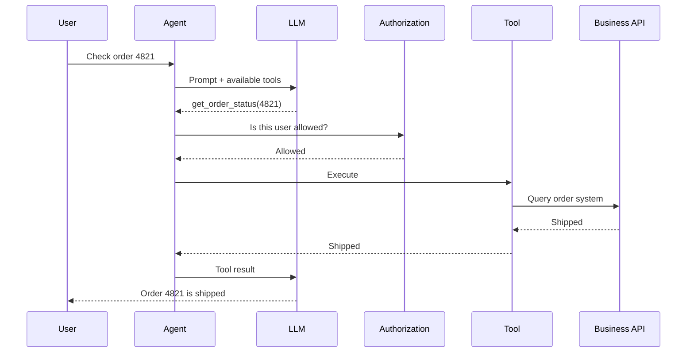

### Security boundary

```text
LLM Tool Call
      ↓
Tool Gateway
      ↓
Authentication
      ↓
Authorization
      ↓
Argument Validation
      ↓
Business Rules
      ↓
Execution
```

---

# 🦜 7. LangChain — The Toolbox

LangChain is a general-purpose framework/ecosystem for composing LLM applications with reusable abstractions around models, tools, prompts, retrieval, agents and middleware. Its current agent abstractions use a LangGraph-based runtime. citeturn383506search4

### Real-world analogy

Imagine a professional kitchen. You need an oven, mixer, knife, refrigerator, timer and measuring tools. You could build every appliance yourself, or use a toolbox of reusable components.

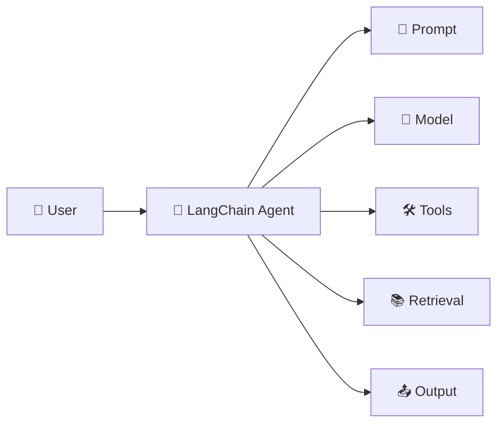

### Example

```python
from langchain.agents import create_agent

agent = create_agent(
    model="your-model",
    tools=[search_documents, get_order_status]
)

result = agent.invoke({
    "messages": [
        {
            "role": "user",
            "content": "Find the refund policy and check order 4821."
        }
    ]
})
```

> **Mental model: LangChain = reusable building blocks for LLM applications.**

---

# 🕸️ 8. LangGraph — The Control Room

At first, an agent looks simple:

`User → LLM → Tool → LLM → Answer`

Then production requirements arrive:

```text
What if a tool fails?
What if approval is required?
What if we need a retry?
What if the task pauses overnight?
What if we need branching?
What if we need to resume?
What if a human edits the state?
```

Now the problem is a **workflow state problem**.

LangGraph is designed for stateful, long-running agent workflows and supports durable execution, persistence and human-in-the-loop controls. citeturn383506search4

### Real-world analogy

LangGraph is like the **air-traffic control room**: routes change, flights wait, approvals happen, and exceptional conditions need explicit transitions.

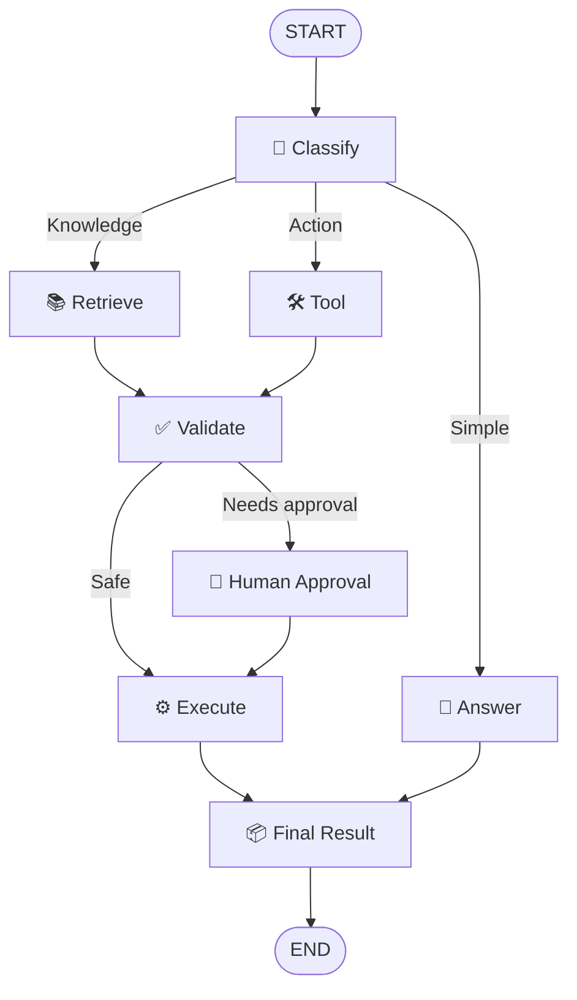

### Example state

```python
from typing import TypedDict

class AgentState(TypedDict):
    question: str
    retrieved_docs: list[str]
    tool_result: dict
    requires_approval: bool
    final_answer: str
```

> **Mental model: LangGraph = explicit state + control flow for agentic systems.**

---

# 📚 9. LlamaIndex — The Librarian

LlamaIndex is a data-focused framework for connecting LLM applications with data through ingestion, indexing, retrieval and knowledge-oriented workflows.

### Real-world analogy

Imagine a giant corporate library. The CEO asks for every policy related to customer refunds. The librarian does not read every book; the librarian indexes, finds and retrieves the relevant pages.

```text
Documents
   ↓
Ingestion
   ↓
Parsing / Chunking
   ↓
Index
   ↓
Retrieval
   ↓
Agent / LLM
```

> **Mental model: LlamaIndex = data + retrieval + knowledge layer.**

---

# 👥 10. CrewAI — The Team

CrewAI makes specialized agent roles intuitive.

```text
                 👨‍💼 Project Manager
                  /      |       \
                 /       |        \
          🔎 Research  📊 Analyst  ✍️ Writer
```

Use this model when specialist responsibilities are genuinely distinct.

```text
More agents
   ≠
Automatically better system
```

Every extra agent can add model calls, latency, state, failure modes and cost.

---

# ✅ 11. Pydantic AI — The Safety Inspector

LLMs like producing text. Software likes producing **typed structures**.

```json
{
  "decision": "approve",
  "reason": "Policy allows the request",
  "confidence": 0.91
}
```

Think of Pydantic-oriented boundaries as an order checker that converts free-form language into a contract another service can safely consume.

> **Mental model: typed AI outputs are application contracts, not just text.**

---

# ⚡ 12. OpenAI Agents SDK — The Lightweight Runtime

The OpenAI Agents SDK uses a small set of primitives such as agents, tools, handoffs/agents-as-tools and guardrails, with built-in tracing for agent execution. citeturn383506search2turn383506search10

```text
Agent
  ↓
Instructions
  ↓
Tools
  ↓
Guardrails
  ↓
Handoff if necessary
```

> **Mental model: compact agent runtime with a small set of composable primitives.**

---

# 🏢 13. Semantic Kernel & Microsoft Agent Framework

For C# and Microsoft-heavy environments, this layer is especially relevant.

### Semantic Kernel

```text
.NET Application
      ↓
Semantic Kernel
      ↓
Model + Plugins + Services
      ↓
Business Systems
```

### Microsoft Agent Framework

Microsoft's current Agent Framework is the unified direction for agents and workflows across the Semantic Kernel and AutoGen lineage, with orchestration, state, middleware, observability and interoperability capabilities. citeturn858704search0turn858704search1

```text
👨‍💼 Agent
   ↓
📋 Workflow
   ↓
🧾 Business Process
   ↓
🔐 Policies
   ↓
📊 Audit
   ↓
🏢 Enterprise Systems
```

---

# 🔬 14. AutoGen — The Multi-Agent Conversation Model

AutoGen became well known for multi-agent conversation and orchestration patterns.

However, **as of 2026, AutoGen is in maintenance mode** and Microsoft directs new projects toward Microsoft Agent Framework. citeturn383506search0

The concepts remain valuable:

- Agent-to-agent interaction
- Group coordination
- Human participation
- Tool use
- Multi-agent orchestration

> **Learn the architecture pattern, not only the package name.**

---

# 🔌 15. MCP — The Universal Adapter

MCP = **Model Context Protocol**.

MCP standardizes how AI applications can connect to tools and context providers. Its core server primitives include **tools, resources and prompts**. citeturn858704search2

### Real-world analogy

Imagine every electronic device used a different wall socket. A common standard removes the need for a custom adapter for every device.

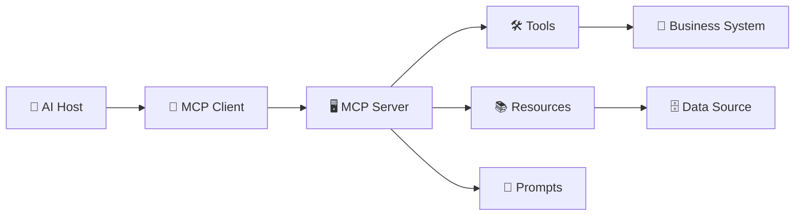

### Important separation

MCP does **not** replace your business API.

```text
Agent
  ↓
MCP Adapter
  ↓
REST / gRPC
  ↓
Business Service
  ↓
Database
```

> **Mental model: MCP = standard agent-facing connection layer for tools and context.**

---

# 🤝 16. A2A — The Agent-to-Agent Telephone

A2A is about **agent ↔ agent collaboration**.

Microsoft's current agent guidance distinguishes MCP, which connects applications to tools/context, from A2A, which enables independent agents to communicate and collaborate. citeturn858704search2

### Real-world analogy

You call one travel consultant who delegates specialist tasks to airline, hotel and car-rental agents.

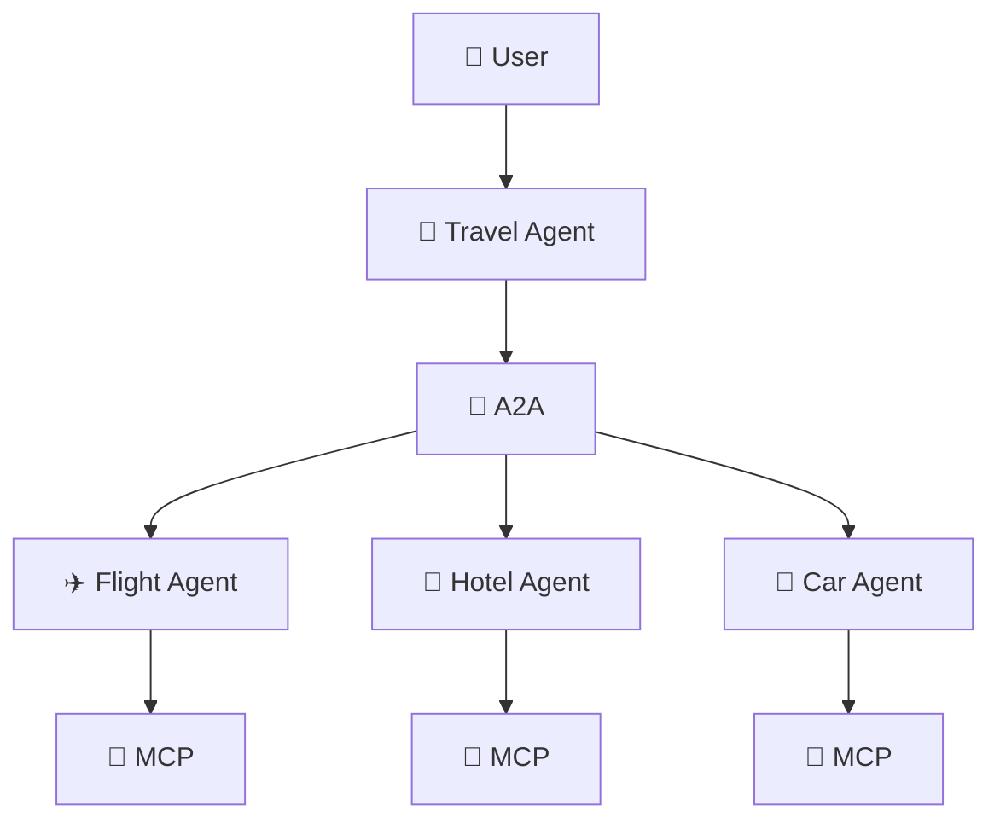

```text
MCP → Agent ↔ Tools / Context
A2A → Agent ↔ Agent
```

---

# 📚 17. RAG — The Company Knowledge Base

RAG = **Retrieval-Augmented Generation**.

Suppose your enterprise has thousands of PDFs, SOPs, SharePoint pages, engineering docs, policies and contracts. The LLM does not automatically know which private document is authoritative.

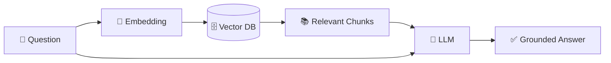

### Agentic RAG

A basic RAG application might always retrieve. An agent can decide:

```text
Question
   ↓
Need company knowledge?
 ┌──Yes──→ Search RAG
 │
 No
 ↓
Answer directly
```

Or:

```text
Search RAG
   ↓
Not enough evidence
   ↓
Reformulate query
   ↓
Search again
   ↓
Validate
```

That is **agentic retrieval**.

---

# 💾 18. Memory — The Notebook

### Short-term state

```text
User asked X
Tool returned Y
Approval = pending
Step = 4
```

### Long-term memory

```text
User prefers morning flights
User's reporting currency is INR
User prefers concise answers
```

> Store only what you need, define retention rules, and make memory access permission-aware.

---

# 🗄️ 19. Vector Databases — The Semantic Filing Cabinet

Traditional search may depend heavily on matching words. Vector retrieval searches by **semantic similarity**.

A query like:

> "Can I get my money back for an enterprise subscription?"

can retrieve:

> "Enterprise Subscription Cancellation and Credit Policy"

even though the wording differs.

Common open-source options include:

- **Qdrant**
- **pgvector**
- **FAISS**
- **Chroma**

Choice depends on scale, operations and surrounding architecture.

---

# 📊 20. Observability — The Flight Recorder

A single user request can become:

```text
API
 ↓
Agent
 ↓
LLM
 ↓
RAG
 ↓
Tool
 ↓
LLM
 ↓
Tool
 ↓
Human Approval
 ↓
Final Response
```

Track:

```text
Latency
Token usage
Cost
Tool success/failure
Retries
Agent steps
Retrieval quality
Task success
Human approvals/rejections
Error rate
```

---

# 🛡️ 21. Guardrails & Security

Agentic systems combine untrusted input, a probabilistic model and powerful tools. Security therefore has to be layered.

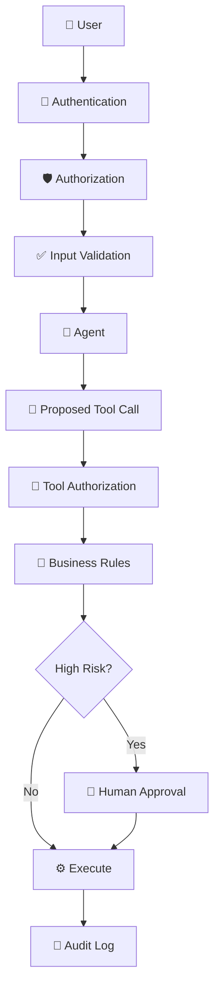

> **The LLM is not your security boundary.**

---

# 👥 22. Single Agent vs Multi-Agent

### Single Agent

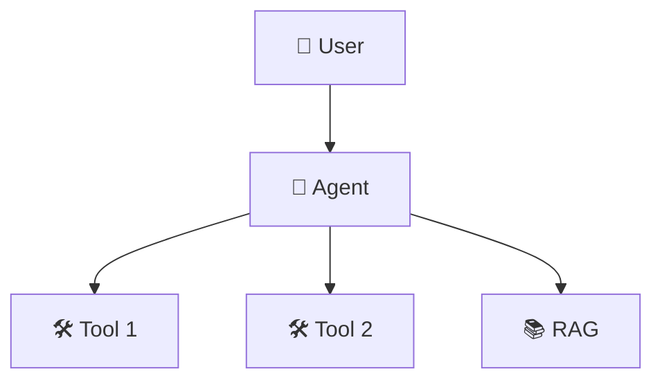

### Multi-Agent

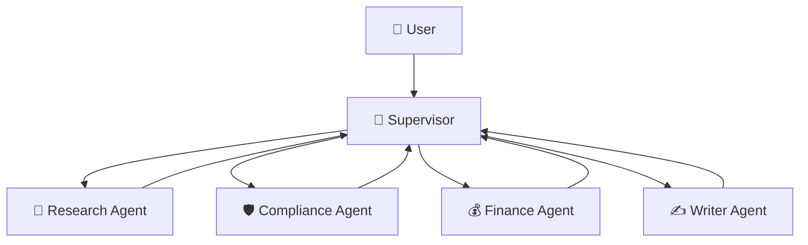

Use multi-agent designs when responsibilities are genuinely distinct, teams own capabilities independently, tasks can run in parallel, or different agents need different tools/models.

> **Do not introduce multi-agent complexity until the business problem actually needs it.**

---

# 🏢 23. A Real Enterprise Example

Consider an **Enterprise Document Intelligence Agent**.

> "Find the latest contract clause related to termination, explain it in plain English, check our internal policy, and create a review ticket if the clause violates policy."

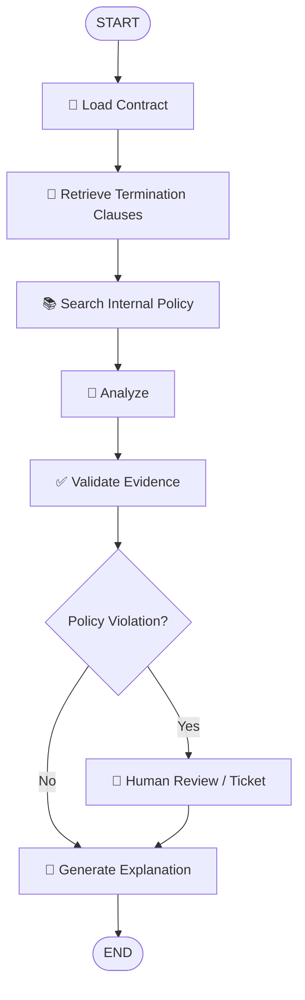

Possible stack:

```text
LangChain    → model/tool composition
LangGraph    → workflow and state
LlamaIndex   → data/retrieval layer
Vector DB    → semantic search
MCP          → standardized tool exposure
Guardrails   → policy and security
OpenTelemetry→ tracing
SQL + Blob   → metadata + raw documents
```

---

# 🏗️ 24. Reference Architecture

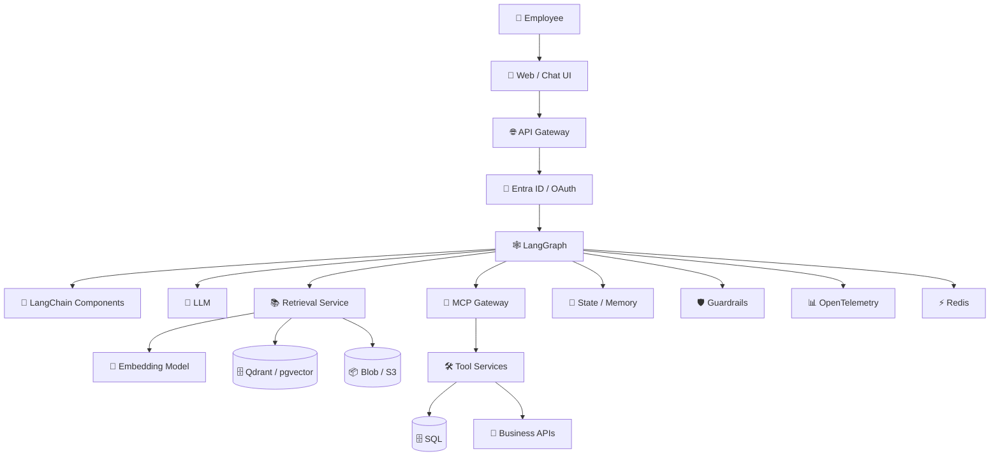

### Architectural separation

```text
                    ┌───────────────────────┐
                    │       BUSINESS        │
                    │   APIs / DB / Rules   │
                    └───────────▲───────────┘
                                │
                           controlled
                                │
                    ┌───────────┴───────────┐
                    │      TOOL LAYER       │
                    │  APIs / MCP / Plugins │
                    └───────────▲───────────┘
                                │
                    ┌───────────┴───────────┐
                    │     AGENT RUNTIME     │
                    │ LangChain / LangGraph │
                    └───────────▲───────────┘
                                │
                    ┌───────────┴───────────┐
                    │       MODEL           │
                    │   LLM / Local Model   │
                    └───────────────────────┘
```

---

# 🧭 25. Choosing the Right Tool

| Need | Consider |
|---|---|
| Reusable LLM components | **LangChain** |
| Explicit graph/state/branching/checkpoints | **LangGraph** |
| Data-heavy / retrieval-heavy applications | **LlamaIndex** |
| Role/task-oriented multi-agent teams | **CrewAI** |
| Strong Python schemas/types | **Pydantic AI** |
| Lightweight agents + tools + handoffs | **OpenAI Agents SDK** |
| Existing C# / .NET enterprise stack | **Semantic Kernel / Microsoft Agent Framework** |
| Existing AutoGen knowledge / migration | **AutoGen concepts** |
| Standardized agent ↔ tools/context integration | **MCP** |
| Agent ↔ agent collaboration | **A2A** |
| Local model experimentation | **Ollama** |
| High-throughput model serving | **vLLM** |
| Semantic retrieval | **Qdrant / pgvector / FAISS / Chroma** |

### Decision flow

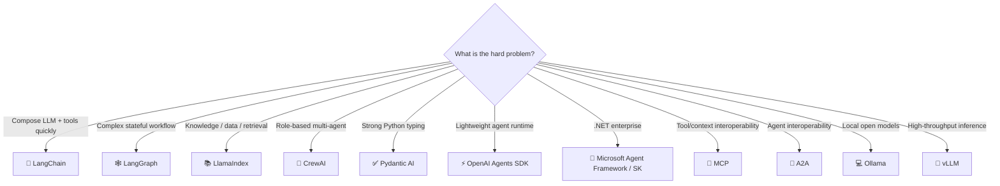

---

# ⚠️ 26. Common Architecture Mistakes

## Mistake 1 — "Let's use every framework"

Bad:

```text
LangChain + LangGraph + CrewAI + AutoGen + LlamaIndex + five protocols
```

Better:

> Pick the minimum set of abstractions that solves the actual problem.

## Mistake 2 — Making the LLM the business logic engine

Better:

```text
LLM → Tool → Authorization → Business Rule → Execute
```

## Mistake 3 — Giving an agent a giant tool list

Prefer focused capability boundaries:

```text
Research Agent → research tools
Finance Agent  → finance tools
Support Agent  → support tools
```

## Mistake 4 — Making everything agentic

Use deterministic code for:

```text
Tax calculation
Schema validation
Authorization
Payment calculation
Data integrity
Idempotency
Transaction handling
```

Use agents for:

```text
Ambiguous requests
Natural-language planning
Tool selection
Research
Classification with context
Open-ended workflows
```

> **Agentic where uncertainty exists. Deterministic where rules are known.**

## Mistake 5 — Ignoring cost

One user request may become:

```text
1 request → 4 model calls → 3 retrieval calls → 5 tool calls
```

> Track **cost per completed agent task**, not only cost per API request.

---

# 🎤 27. Interview Cheat Sheet

### Q: What is LangChain?

> "LangChain provides reusable building blocks for LLM applications, including models, tools, prompts, retrieval and agents."

### Q: What is LangGraph?

> "LangGraph adds explicit stateful orchestration for agent workflows where branching, retries, persistence and human approval matter."

### Q: LangChain vs LangGraph?

```text
LangChain  → composition
LangGraph  → orchestration + state
```

### Q: What is LlamaIndex?

> "A data-oriented framework for connecting LLM applications with private and external data through ingestion, indexing, retrieval and knowledge workflows."

### Q: What is CrewAI?

> "A role-oriented multi-agent framework where agents collaborate as a team with defined responsibilities."

### Q: What is MCP?

> "A standard protocol for connecting AI applications to tools and context providers."

### Q: What is A2A?

> "A protocol for communication and collaboration between independent AI agents."

### Q: MCP vs A2A?

```text
MCP → Agent ↔ Tools / Context
A2A → Agent ↔ Agent
```

### Q: Should every application use multi-agent?

> "No. I start with the simplest architecture and introduce multiple agents only when distinct roles, ownership boundaries or parallel specialist work justify the added coordination cost."

### Q: How do you secure an agent?

> "I treat the LLM as a decision component, not a security boundary. Every tool call goes through authentication, authorization, input validation and business rules, with human approval for high-risk operations."

### Q: When should you avoid an agent?

> "When the workflow is fully deterministic and can be implemented more safely and cheaply with normal application code."

---

# 📖 28. Official References

| Technology | Official resource |
|---|---|
| 🦜 LangChain | https://docs.langchain.com/ |
| 🕸️ LangGraph | https://docs.langchain.com/ |
| 📚 LlamaIndex | https://docs.llamaindex.ai/ |
| 👥 CrewAI | https://docs.crewai.com/ |
| ✅ Pydantic AI | https://ai.pydantic.dev/ |
| ⚡ OpenAI Agents SDK | https://openai.github.io/openai-agents-python/ |
| 🏢 Microsoft Agent Framework | https://microsoft.github.io/agent-framework/ |
| 🧩 Semantic Kernel | https://learn.microsoft.com/en-us/semantic-kernel/ |
| 🔬 AutoGen | https://github.com/microsoft/autogen |
| 🔌 MCP | https://modelcontextprotocol.io/ |
| 🤝 A2A | https://a2a-protocol.org/ |
| 💻 Ollama | https://docs.ollama.com/ |
| 🚀 vLLM | https://docs.vllm.ai/ |
| 🗄️ Qdrant | https://qdrant.tech/documentation/ |
| 📊 OpenTelemetry | https://opentelemetry.io/ |

> **Current note:** Microsoft documents AutoGen as being in maintenance mode and recommends Microsoft Agent Framework for new projects. citeturn383506search0

---

# 🚀 Final Mental Model

```text
                         👤 USER
                           │
                           ▼
                   🌐 APPLICATION API
                           │
                           ▼
                    🤖 AGENT RUNTIME
                           │
              ┌────────────┼────────────┐
              ▼            ▼            ▼
          🧠 LLM         📚 RAG      🛠️ TOOLS
              │            │            │
              │            │         🔌 MCP
              │            │            │
              │            │      🏢 Business APIs
              │            │
              │         🗄️ Vector DB
              │
              ▼
        🕸️ ORCHESTRATION
              │
      ┌───────┼────────┐
      ▼       ▼        ▼
    💾 State 👤 Human  🤝 A2A
              │
              ▼
         📊 OBSERVABILITY
              │
              ▼
          ✅ RESULT
```

### Easy memory map

```text
🦜 LangChain = TOOLBOX
🕸️ LangGraph = CONTROL ROOM
📚 LlamaIndex = LIBRARIAN
👥 CrewAI = TEAM
✅ Pydantic AI = SAFETY INSPECTOR
⚡ OpenAI Agents SDK = LIGHTWEIGHT AGENT RUNTIME
🏢 Microsoft Agent Framework = ENTERPRISE OFFICE
🔌 MCP = UNIVERSAL ADAPTER
🤝 A2A = AGENT TELEPHONE
📚 RAG = KNOWLEDGE BASE
💾 Memory = NOTEBOOK
📊 Observability = FLIGHT RECORDER
```

> **The goal of an AI Engineer is not to memorize frameworks. The goal is to understand which engineering problem each abstraction solves — and to build the smallest reliable architecture that solves the business problem.**

---

## 🔗 Related Guides in This Repository

- [🤖 Agentic AI Guide](./agentic-ai-guide.md)
- [🤖 Agent Frameworks & Protocols](./Agent-Frameworks-and-Protocols.md)
- [🏗️ Agentic AI System Design](./Agentic-AI-System-Design.md)
- [🏗️ Agentic AI System Design — Simple](./Agentic-AI-System-Design-Simple.md)
- [📚 Production GenAI & Agentic AI Guide](./production-genai-agentic-ai-guide.md)
- [🎤 AI Solution Architect Interview & Daily Working Playbook](./AI-Solution-Architect-Interview-and-Daily-Working-Playbook.md)

<div align="center">

### 🚀 Learn → Design → Build → Evaluate → Secure → Deploy

**Build agents. Understand the architecture. Ship production AI.**

</div>