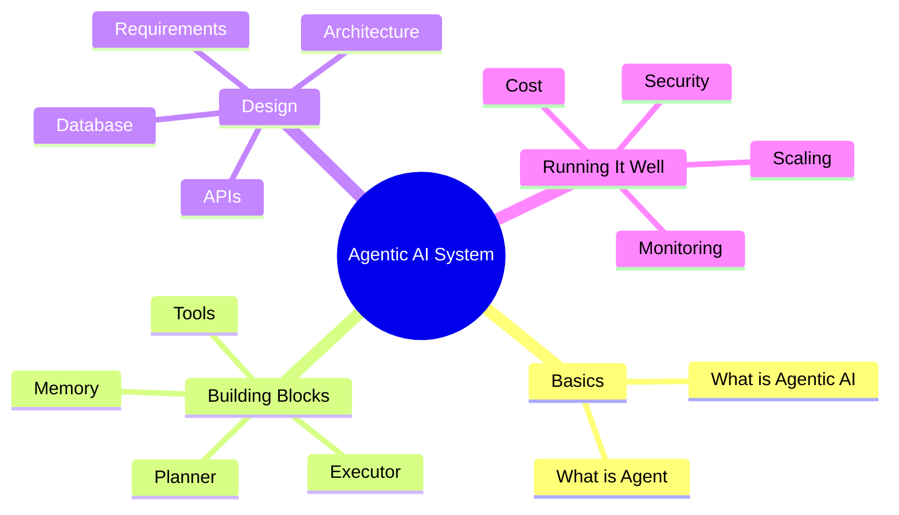
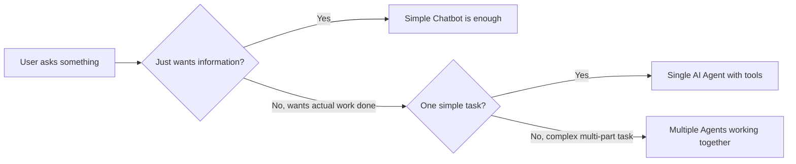
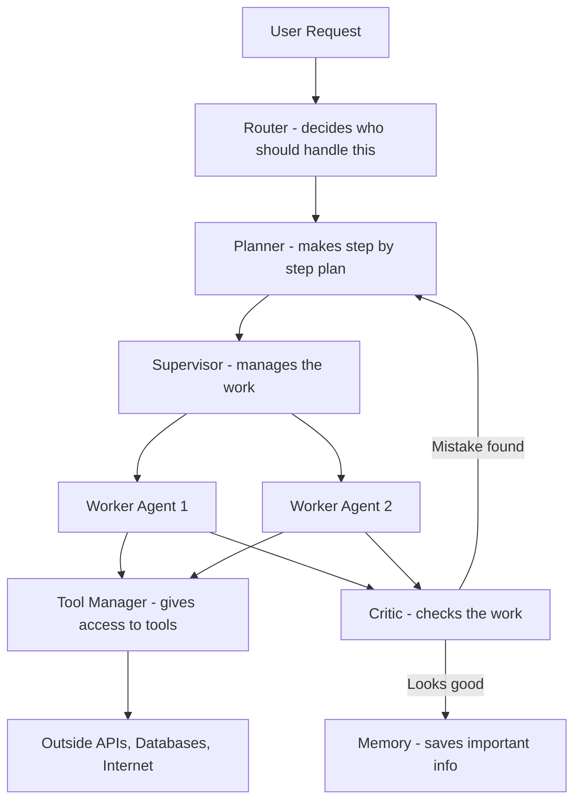
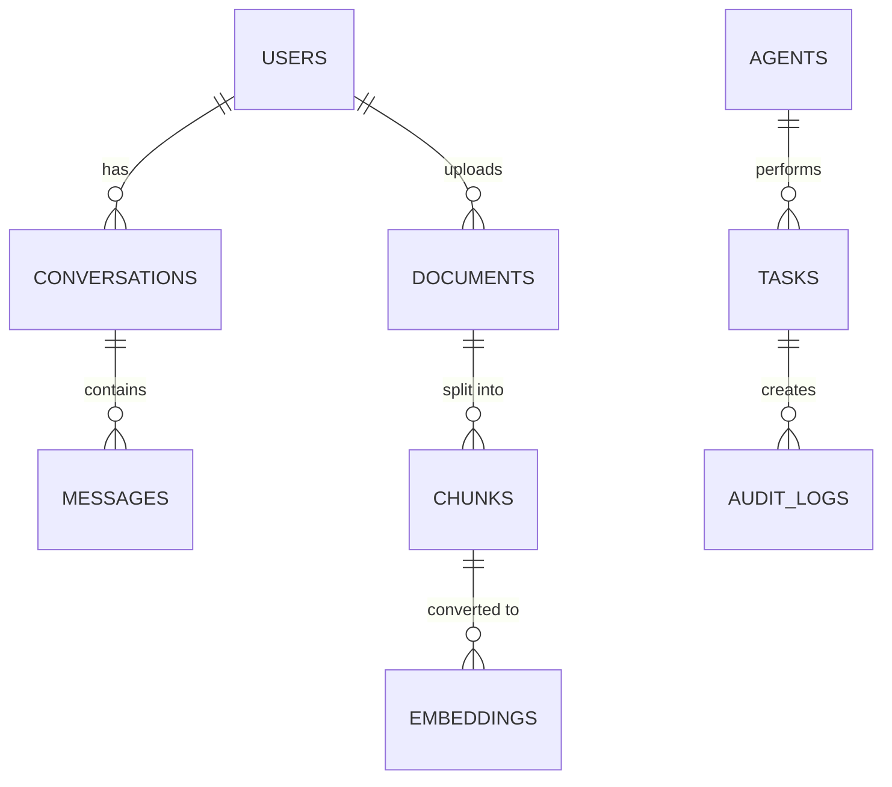
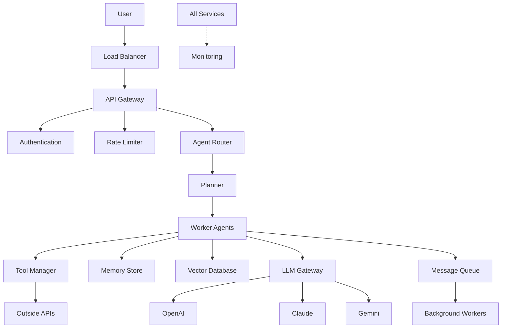
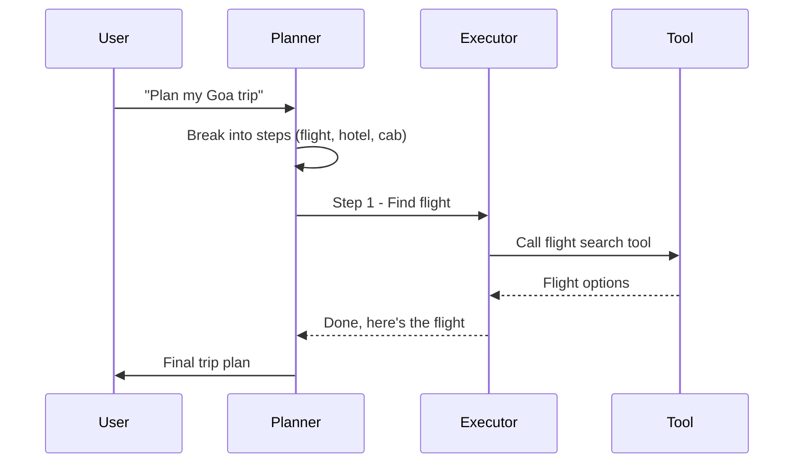
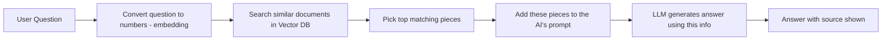
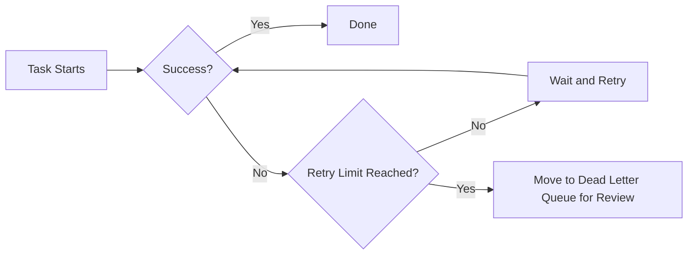
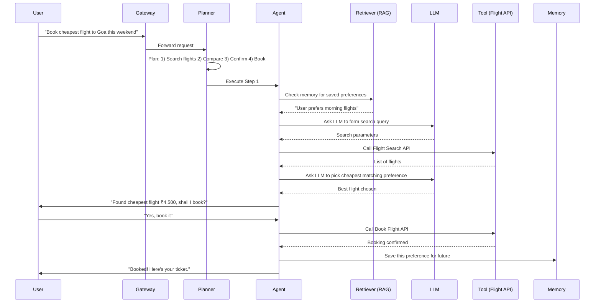

# 🤖 Agentic AI System Design — Simple Guide for Beginners

> Friends, this is a **simple, easy-to-understand guide** on Agentic AI System Design. No heavy jargon, no confusion — just plain simple explanation with real-life examples, so that even a fresher can understand it properly and also crack interviews.

---

## 📌 How to Read This Guide

- If you are totally new, read from top to bottom, one section at a time. No need to rush.
- If you are preparing for interview, just go through the **"In Interview, Say This"** boxes in each section.
- Don't worry if some terms feel new — we will explain everything with simple, everyday examples (like ordering food on Zomato, booking a cab, etc.)

---

## 📖 Table of Contents

1. [What is Agentic AI? (In Simple Words)](#1-what-is-agentic-ai-in-simple-words)
2. [Parts of an AI Agent](#2-parts-of-an-ai-agent)
3. [What Should the System Do? (Functional Requirements)](#3-what-should-the-system-do-functional-requirements)
4. [How Good Should the System Be? (Non-Functional Requirements)](#4-how-good-should-the-system-be-non-functional-requirements)
5. [How Many Users, How Much Load? (Capacity Planning)](#5-how-many-users-how-much-load-capacity-planning)
6. [Database Design — Where We Store Data](#6-database-design--where-we-store-data)
7. [Which Storage to Use, When](#7-which-storage-to-use-when)
8. [API Design — How Systems Talk to Each Other](#8-api-design--how-systems-talk-to-each-other)
9. [Full System Design (High Level)](#9-full-system-design-high-level)
10. [How Agents Work Together (Orchestration)](#10-how-agents-work-together-orchestration)
11. [RAG — Giving the AI Real, Fresh Information](#11-rag--giving-the-ai-real-fresh-information)
12. [Memory — How Agent Remembers Things](#12-memory--how-agent-remembers-things)
13. [Prompt Engineering — Talking to the AI Properly](#13-prompt-engineering--talking-to-the-ai-properly)
14. [Security — Keeping the System Safe](#14-security--keeping-the-system-safe)
15. [Monitoring — Keeping an Eye on the System](#15-monitoring--keeping-an-eye-on-the-system)
16. [Scaling — Handling More and More Users](#16-scaling--handling-more-and-more-users)
17. [Making It Fast (Performance)](#17-making-it-fast-performance)
18. [Saving Money (Cost Optimization)](#18-saving-money-cost-optimization)
19. [When Things Go Wrong (Failure Handling)](#19-when-things-go-wrong-failure-handling)
20. [Common Tradeoffs, Simply Explained](#20-common-tradeoffs-simply-explained)
21. [Full Example: One Request, Start to End](#21-full-example-one-request-start-to-end)
22. [One-Page Cheat Sheet](#22-one-page-cheat-sheet)
23. [50+ Interview Questions and Simple Answers](#23-50-interview-questions-and-simple-answers)

---

## 🗺️ Overview Picture



> 💡 **Simple Tip:** Keep this picture in mind. Whole guide is basically explaining each of these boxes one by one.

---

## 1. What is Agentic AI? (In Simple Words)

Let's start from the very basic, using easy comparison.

| Term | Simple Meaning | Everyday Example |
|---|---|---|
| **AI** | Making computers do smart things | Google Maps suggesting best route |
| **ML (Machine Learning)** | Computer learning from data/examples, instead of fixed rules | Netflix suggesting movies based on what you watched |
| **LLM (Large Language Model)** | A computer program trained on huge amount of text, so it can understand and write language | ChatGPT, Claude — they can chat like a human |
| **GenAI (Generative AI)** | AI that *creates* new things — text, images, code | AI writing an essay or drawing a picture for you |
| **AI Agent** | An LLM that can also **do things**, not just talk — it can search, click, call APIs | A smart assistant who can actually book your cab, not just tell you how to book it |
| **Agentic AI** | A full **system** where one or more agents plan, do the work, check their own work, and fix mistakes on their own | A personal assistant who plans your whole trip — hotel, cab, flights — without you telling every small step |
| **Multi-Agent System** | Many agents working together, each doing their own specialised job | Like a team — one person books flight, another books hotel, one more manages budget |

### Simple Example

Suppose you tell an app: **"Book me a flight to Goa, cheapest one, this weekend."**

- A **normal chatbot** will just tell you *how* to book — "Go to MakeMyTrip, search Goa, select dates."
- An **Agentic AI system** will actually **search flights, compare prices, pick the cheapest, and book it for you** — asking your confirmation only when needed (like OTP or payment).



### 🎯 In Interview, Say This
"First I will check — does this problem need just a chatbot, or an agent that takes action, or many agents working together? I will not over-design if a simple chatbot is enough."

### ⚠️ Common Mistakes
- Thinking every AI project needs "Agentic AI" — sometimes simple chatbot is enough, no need to make it complicated.
- Using multiple agents when one agent could do the job — this wastes money and time.

### ⚖️ Tradeoff (Simple)
- **One Agent** = simple, cheap, fast, easy to fix if something breaks.
- **Many Agents** = can handle bigger, complex tasks, but costs more and harder to debug.

### ✅ Best Practice
Always start simple. Add more agents/complexity only when really needed.

---

## 2. Parts of an AI Agent

Think of an AI Agent like a small company with different employees, each having own role.



| Part | Simple Job | Like in Real Life |
|---|---|---|
| **Planner** | Breaks big task into small steps | Manager writing a to-do list |
| **Executor** | Actually does each step | Employee doing the actual work |
| **Critic** | Checks if the work is correct | Team lead reviewing the work |
| **Memory** | Remembers useful facts for later | A notebook/diary |
| **Router** | Decides which agent should handle a request | Reception desk sending you to right department |
| **Tool Manager** | Controls which tools/apps the agent can use | IT team giving software access |
| **Supervisor** | Manages multiple agents, solves conflicts | Project Manager |
| **Observer** | Watches if everything is working fine | Security guard/CCTV |

### 🎯 In Interview, Say This
"Every agent needs a way to plan, act, and check its own work. Without the 'Critic' step, agent will keep making silent mistakes — so reflection/checking is very important, not optional."

### ⚠️ Common Mistakes
- Forgetting to add a "Critic" or checking step — many students design an agent that just acts, never verifies — this leads to wrong or unsafe actions.

### ⚖️ Tradeoff (Simple)
More checking steps = better quality, but slower and costlier (because more AI calls = more money, more time).

### ✅ Best Practice
Keep each part separate and replaceable — like Lego blocks. Tomorrow if you want to change the "Planner" logic, you should not need to touch "Executor" code.

---

## 3. What Should the System Do? (Functional Requirements)

These are the actual features your system must have. Let's go through the main ones, simply.

| Feature | Simple Purpose | Simple Challenge | Simple Fix |
|---|---|---|---|
| **Login** | Know who the user is | Session can expire during long task | Use refresh token, don't log out user mid-task |
| **Conversation** | Chat back and forth | Old messages take too much space | Summarise old chat, keep only recent messages fully |
| **Memory** | Remember user's preference next time | Too much saved data becomes messy | Save only important facts, delete old/unused ones |
| **File Upload** | User can upload PDF, image etc. | Big files, unsafe files | Scan files first, process them in background |
| **Search** | Find information | Wrong or old results | Mix keyword search + smart (semantic) search |
| **RAG** | Give AI real current data to answer from | AI may still guess wrong | Always show source, don't let AI answer without proof |
| **Tool Calling** | Let AI use outside tools/APIs | AI may call wrong tool, or get stuck in loop | Set a maximum number of tries, validate every input |
| **Workflow Automation** | Chain many steps together automatically | Task may fail in the middle | Save progress at every step (checkpoint) |
| **Notifications** | Tell user when work is done | Message may not reach user | Use reliable messaging system (queue) |
| **Human Approval** | Ask human before risky action | Task may get stuck waiting too long | Auto-expire if no response in some time |
| **Scheduling** | Run agent automatically at fixed time | Job may run twice by mistake | Use locks so job runs only once |
| **Retry** | Try again if something fails | May retry too many times, causing damage | Retry with waiting gap (not instantly), limit max retries |
| **Audit Log** | Keep record of what agent did | Huge amount of logs | Store logs separately, keep only necessary details |
| **Billing** | Charge user based on usage | Hard to calculate exact usage | Count tokens/tool-calls used, in real time |
| **Feedback** | Let user say if answer was good or bad | Very few users give feedback | Make it super easy — just one tap (👍/👎) |
| **Multi-Agent Teamwork** | Many agents solving one big task together | Agents may disagree or clash | Have one "Boss" agent to take final decision |

### 🎯 In Interview, Say This
"I will not list every single feature — I will pick the top 5-6 most important ones for this specific problem, and explain why."

### ⚠️ Common Mistakes
Trying to mention every possible feature without prioritising — interviewer wants to see you can **think what matters most**, not recite a list.

### ⚖️ Tradeoff (Simple)
More features = more useful system, but also more time to build and more things that can go wrong.

### ✅ Best Practice
Always separate "must have now" vs "can add later" features clearly.

---

## 4. How Good Should the System Be? (Non-Functional Requirements)

These are the "quality" promises of the system — not what it does, but **how well** it does it.

| Quality | Simple Meaning | Real-Life Example |
|---|---|---|
| **Availability** | System should be up and working, mostly all the time | Like a shop that's open 24x7 |
| **Latency** | System should respond fast | Answer should come in 2-3 seconds, not 2 minutes |
| **Scalability** | Should handle more users without breaking | Same app should work for 100 or 1 crore users |
| **Reliability** | Should give correct result every time, consistently | Same question, same good answer, every time |
| **Fault Tolerance** | Should survive small failures without crashing | If one server dies, others should still work |
| **Security** | Should keep data and actions safe | Only right user can see their own data |
| **Observability** | We should be able to see what's happening inside | Like a dashboard showing system health |
| **Cost** | Should not cost too much to run | Don't spend ₹10 to answer a ₹1 question |
| **Compliance** | Should follow laws (data privacy etc.) | Following GDPR/India's DPDP Act rules |

### 🎯 In Interview, Say This
"For this system, top 3 non-functional requirements I will focus on are ___, ___, ___ — because [reason specific to the problem]."

### ⚠️ Common Mistakes
Saying "system should be highly available, scalable, secure..." for every single question without connecting it to the actual problem given.

### ⚖️ Tradeoff (Simple)
You usually can't get everything perfect together. Example: More checking (for accuracy) = slower response (bad for latency). You must pick what matters most for your use case.

### ✅ Best Practice
Always explain **why** a particular NFR matters for **this** specific system, don't just list definitions.

---

## 5. How Many Users, How Much Load? (Capacity Planning)

This is simple maths, don't get scared. Interviewers just want to see you can estimate numbers logically.

### Simple Formula Example

```text
Let's say:
Daily Active Users (DAU) = 10 Lakh (1,000,000)
Average requests per user per day = 5

Total requests per day = 10,00,000 × 5 = 50,00,000 (50 Lakh)

Requests per second (average) = 50,00,000 / (24 × 60 × 60) ≈ 58 requests/sec

Peak traffic is usually 3-5x of average, so:
Peak RPS = 58 × 4 ≈ 232 requests/sec
```

> 💡 **Simple Tip:** Always say your assumptions out loud — "I am assuming DAU is X, average requests per user is Y." Interviewer does not expect exact numbers, just logical thinking.

### Things to also think about:
- **Tokens** — every AI request uses tokens (like words), and tokens cost money.
- **Concurrent Users** — how many users active at the exact same moment (not same as total daily users).
- **Storage** — how much data (chats, files, embeddings) will pile up over time.

### 🎯 In Interview, Say This
"I don't have exact numbers, so let me assume some reasonable numbers and show my calculation step by step."

### ⚠️ Common Mistakes
Getting stuck trying to find the "exact right number" — there is no exact right number, just logical estimation.

### ⚖️ Tradeoff (Simple)
Planning for very high peak load = safe, but costs more (extra unused servers most of the time).

### ✅ Best Practice
Use auto-scaling — servers automatically increase when traffic is high, and decrease when traffic is low. This saves cost.

---

## 6. Database Design — Where We Store Data

Simple list of what tables (like Excel sheets) you'll usually need:

| Table | What It Stores |
|---|---|
| Users | User info — name, email, login details |
| Conversations | Each chat session |
| Messages | Every single message in a chat |
| Agents | Details of each agent (name, role, config) |
| Tasks | Each task an agent is doing |
| Tools | List of tools agents can use |
| Documents / Chunks | Uploaded files, broken into small pieces |
| Embeddings | Number version of text, used for smart search |
| Audit Logs | Record of every action taken |
| Billing | Usage and payment records |

### Simple Picture (Relationship)



### 🎯 In Interview, Say This
"I will separate the data that changes fast (like messages) from data that's more stable (like user profile), because they have different access patterns."

### ⚠️ Common Mistakes
Putting everything in one giant table — makes it slow and messy as data grows.

### ⚖️ Tradeoff (Simple)
- **SQL (like PostgreSQL)** = good for data that needs strict rules (billing, users).
- **NoSQL (like MongoDB)** = good for data whose shape keeps changing (agent configs, flexible data).

### ✅ Best Practice
Use the right database for the right job — don't force everything into one type of database.

---

## 7. Which Storage to Use, When

| Storage Type | Best For | Simple Example |
|---|---|---|
| **PostgreSQL (SQL)** | Structured data with strict rules | User accounts, billing |
| **MongoDB (NoSQL)** | Flexible, changing data | Agent settings, logs |
| **Redis** | Very fast, temporary data | Login sessions, cache |
| **Vector Database** | Smart similarity search | Finding similar documents/questions |
| **Blob Storage (like S3)** | Storing files/images cheaply | User uploaded PDFs, images |
| **Elasticsearch/OpenSearch** | Fast text search | Searching through logs or documents |

### 🎯 In Interview, Say This
"I will pick storage based on the access pattern — is it read-heavy, write-heavy, needs exact match, or needs similarity search?"

### ⚠️ Common Mistakes
Using one database for everything just because it's familiar — wrong tool for the job causes performance problems later.

### ⚖️ Tradeoff (Simple)
More types of storage = each thing works better, but more systems to manage and more complexity.

### ✅ Best Practice
Don't over-engineer for a small project — 2-3 storage types are usually enough to start.

---

## 8. API Design — How Systems Talk to Each Other

APIs are simply the "menu" of things other systems/apps can ask your system to do.

### Simple Example API

```http
POST /v1/conversations/{id}/messages
Content-Type: application/json

{
  "message": "Book me a flight to Goa this weekend"
}
```

**Response:**
```json
{
  "status": "in_progress",
  "task_id": "task_12345",
  "message": "I am searching for flights now..."
}
```

### Important Simple Concepts

| Concept | Simple Meaning |
|---|---|
| **Status Codes** | Numbers that tell what happened — 200 = success, 404 = not found, 429 = too many requests |
| **Idempotency** | If same request is sent twice by mistake, it should not cause double action (like double payment) |
| **Pagination** | Loading data in small pages, not all at once |
| **Versioning** | Keeping old and new API versions both working (v1, v2) so old apps don't break |
| **Streaming** | Sending the AI's answer word-by-word as it's generated, instead of waiting for the full answer |

### 🎯 In Interview, Say This
"Since agent tasks can take time (searching, booking etc.), I will use an async API — return immediately with a task ID, and let the client check status or get notified later."

### ⚠️ Common Mistakes
Making the API wait (blocking) for a task that could take minutes — this causes timeouts and bad user experience.

### ⚖️ Tradeoff (Simple)
- **Sync API** = simple, but bad for long tasks.
- **Async API** = better for long tasks, but more complex to build.

### ✅ Best Practice
Use async (background processing) for anything that could take more than a few seconds.

---

## 9. Full System Design (High Level)

Let's put everything together in one big picture.



### 🎯 In Interview, Say This
"I'll draw the flow from user request to final response, showing each layer — gateway, agent logic, tools, storage, and monitoring — and explain why each layer exists."

### ⚠️ Common Mistakes
Jumping straight into agent logic without mentioning basic things like load balancer, authentication, rate limiting — these are expected in every good system design answer.

### ⚖️ Tradeoff (Simple)
More layers = safer and more scalable, but slower to build and more things to maintain.

### ✅ Best Practice
Always draw the diagram from left (user) to right (response), step by step — makes it easy for anyone to follow.

---

## 10. How Agents Work Together (Orchestration)

| Pattern | Simple Meaning | Simple Example |
|---|---|---|
| **Single Agent** | One agent does everything | One person doing a full task alone |
| **Supervisor Pattern** | One "boss" agent assigns work to other agents | Manager assigning tasks to team |
| **ReAct** | Agent thinks a little, acts a little, thinks again — step by step | Like solving a puzzle piece by piece |
| **Plan-and-Execute** | Agent makes the full plan first, then does all steps | Like writing a full to-do list, then completing it |
| **Reflection** | Agent checks its own answer and improves it | Like re-reading your exam paper before submitting |



### 🎯 In Interview, Say This
"For simple tasks I'll use ReAct (think-act loop). For complex multi-step tasks needing predictability, I'll use Plan-and-Execute so we can review the full plan before running it."

### ⚠️ Common Mistakes
Always using multi-agent setup even for simple tasks — this adds cost and complexity without real benefit.

### ⚖️ Tradeoff (Simple)
ReAct = flexible but less predictable. Plan-and-Execute = predictable but less flexible if things change mid-way.

### ✅ Best Practice
Add a "re-planning" step — if something unexpected happens, let the agent update its plan instead of blindly following the old one.

---

## 11. RAG — Giving the AI Real, Fresh Information

RAG means: instead of AI just guessing from what it learned long ago, we give it **fresh, real documents** to read before answering.

### Simple Flow



### Simple Example
Imagine asking, "What is our company's leave policy?" Instead of AI guessing, RAG system will:
1. Search company HR documents
2. Find the exact leave policy paragraph
3. Give that paragraph to the AI
4. AI answers using that real paragraph, and shows where it came from

### 🎯 In Interview, Say This
"RAG helps reduce hallucination by grounding answers in real data — but retrieval quality matters as much as the AI model quality. Bad search = bad answer, even with a great AI model."

### ⚠️ Common Mistakes
Assuming RAG completely stops the AI from making mistakes — it reduces mistakes, doesn't remove them 100%.

### ⚖️ Tradeoff (Simple)
More documents searched = more accurate, but slower and more expensive.

### ✅ Best Practice
Always show the source/reference along with the answer, so users can double check.

---

## 12. Memory — How Agent Remembers Things

| Type | Simple Meaning | Example |
|---|---|---|
| **Short-term Memory** | Remembers only within current conversation | Remembers what you said 2 messages ago |
| **Long-term Memory** | Remembers across different sessions, days, weeks | Remembers you like window seat, even next month |
| **Episodic Memory** | Remembers specific past events | "Last time you asked about Goa trip" |
| **Semantic Memory** | Remembers general facts/preferences | "You prefer vegetarian food" |

### 🎯 In Interview, Say This
"I won't save every single message as memory — I'll extract only the important, reusable facts, so memory doesn't become messy and huge over time."

### ⚠️ Common Mistakes
Saving everything as memory without any cleanup — leads to slow search and confusing, contradicting facts.

### ⚖️ Tradeoff (Simple)
More memory = more personalised experience, but more privacy risk and more cost to store/search.

### ✅ Best Practice
Let users see and delete their own saved memories — builds trust and also helps with privacy laws.

---

## 13. Prompt Engineering — Talking to the AI Properly

Simple techniques to get better answers from AI:

| Technique | Simple Meaning | Example |
|---|---|---|
| **Clear Instructions** | Be specific about what you want | "Give answer in 3 bullet points" instead of just "explain" |
| **Few-Shot** | Give 1-2 examples of correct answer format | Show a sample Q&A before asking real question |
| **Chain of Thought** | Ask AI to think step-by-step | "Explain your reasoning before giving final answer" |
| **Structured Output (JSON)** | Ask for answer in a fixed format | So your code can easily read the answer |
| **Prompt Versioning** | Keep track of prompt changes, like code | So you can roll back if a new prompt performs worse |

### 🎯 In Interview, Say This
"I will treat prompts like code — version them, test them, and track their performance, not just write once and forget."

### ⚠️ Common Mistakes
Writing a huge vague prompt with no clear structure or examples — leads to unpredictable answers.

### ⚖️ Tradeoff (Simple)
Longer, more detailed prompts = better accuracy, but more tokens = more cost and slightly more latency.

### ✅ Best Practice
Keep a central "prompt library" so the whole team uses tested, approved prompts, not random copies.

---

## 14. Security — Keeping the System Safe

| Risk | Simple Meaning | Simple Fix |
|---|---|---|
| **Prompt Injection** | Someone tries to trick the AI into ignoring its rules | Never fully trust user input; keep system instructions separate and protected |
| **Indirect Prompt Injection** | Bad instructions hidden inside a webpage/document the agent reads | Treat all outside content as "just data," never as a command |
| **Data Leakage** | AI accidentally reveals private info | Mask/remove sensitive data before it reaches the AI |
| **Unauthorized Access** | Wrong person accessing data/actions | Use proper login + permission checks (RBAC) |
| **Risky Actions** | Agent doing something big without checking (like sending money) | Require human approval for risky/irreversible actions |

### 🎯 In Interview, Say This
"For any action that is risky or can't be undone — like payment or deleting data — I will always add a human approval step before the agent executes it."

### ⚠️ Common Mistakes
Trusting content that comes from outside (websites, documents) as if it were a safe instruction — this is a common and dangerous mistake in agent systems.

### ⚖️ Tradeoff (Simple)
More security checks = safer system, but adds a bit of delay and complexity.

### ✅ Best Practice
Give every tool/agent only the **minimum access** it needs — nothing more (this is called "least privilege").

---

## 15. Monitoring — Keeping an Eye on the System

Just like a car has a dashboard showing speed, fuel, temperature — your AI system also needs a dashboard.

| What to Monitor | Why |
|---|---|
| **Latency** | To know if system is responding fast enough |
| **Errors** | To catch failures quickly |
| **Token Usage/Cost** | To avoid surprise bills |
| **Success Rate** | To know how often agent completes the task correctly |
| **Logs & Traces** | To debug when something goes wrong |

### 🎯 In Interview, Say This
"I will track cost and latency per request from day one — in agentic systems these can silently blow up if not monitored closely."

### ⚠️ Common Mistakes
Only monitoring "is the server up or down" — but ignoring cost, token usage, and answer quality, which are equally important for AI systems.

### ⚖️ Tradeoff (Simple)
More detailed monitoring = better visibility, but more storage/cost for logs.

### ✅ Best Practice
Set up alerts (not just dashboards) — so someone gets notified automatically when something goes wrong, instead of noticing it late.

---

## 16. Scaling — Handling More and More Users

| Method | Simple Meaning |
|---|---|
| **Horizontal Scaling** | Add more servers/machines |
| **Vertical Scaling** | Make one machine more powerful |
| **Auto-scaling** | Automatically add/remove servers based on traffic |
| **Caching** | Save common answers so we don't recompute every time |
| **Load Balancer** | Spread traffic evenly across servers |
| **Queue-based Scaling** | Put tasks in a queue, workers process them at their own pace |

### 🎯 In Interview, Say This
"For agent workloads, I'll scale based on queue length, not just CPU usage — because agents mostly wait on AI/API responses, not heavy computing."

### ⚠️ Common Mistakes
Only thinking about scaling database or servers, forgetting that AI model calls themselves can become the bottleneck.

### ⚖️ Tradeoff (Simple)
Horizontal scaling = more reliable, but more complex to manage than just using one big powerful machine.

### ✅ Best Practice
Cache repeated/common questions — this alone can cut cost and improve speed a lot.

---

## 17. Making It Fast (Performance)

Simple ways to make the system respond quickly:

- **Caching** — Save and reuse previous answers for repeated questions.
- **Streaming** — Show answer word by word, so user doesn't feel like waiting.
- **Smaller Models for Simple Tasks** — Don't use the biggest, most expensive AI model for every small question.
- **Parallel Processing** — Do independent steps at the same time, not one by one.
- **Reduce Prompt Size** — Send only necessary information to AI, not everything.

### 🎯 In Interview, Say This
"I'll route simple questions to a smaller, faster model, and only use the bigger model for complex reasoning tasks — this improves both speed and cost."

### ⚠️ Common Mistakes
Using the most powerful (and slowest/costliest) AI model for every single request, even simple ones.

### ⚖️ Tradeoff (Simple)
Faster responses sometimes mean slightly less detailed/accurate answers — you need to balance based on use case.

### ✅ Best Practice
Always test — measure actual speed and cost, don't just assume.

---

## 18. Saving Money (Cost Optimization)

AI systems can become costly quickly if not managed well. Simple ways to save:

| Technique | Simple Meaning |
|---|---|
| **Caching** | Don't pay AI again for the same repeated question |
| **Model Routing** | Use cheap model for easy tasks, expensive model only for hard tasks |
| **Token Reduction** | Send shorter, cleaner prompts |
| **Batch Processing** | Group non-urgent tasks together, process them cheaper in bulk |
| **Storage Tiering** | Move old, rarely-used data to cheaper storage |

### Simple Cost Comparison

| Approach | Cost | Speed | When to Use |
|---|---|---|---|
| Small Model | Low | Fast | Simple Q&A, classification |
| Large Model | High | Slower | Complex reasoning, planning |
| Cached Answer | Almost Free | Instant | Repeated/common questions |

### 🎯 In Interview, Say This
"I'll put a cost dashboard and alerts in place from day one, so we catch cost spikes early, not after the bill arrives."

### ⚠️ Common Mistakes
Not tracking cost at all until the monthly bill comes as a shock.

### ⚖️ Tradeoff (Simple)
Saving cost aggressively (like always using cheap model) can sometimes reduce answer quality — balance is needed.

### ✅ Best Practice
Review cost weekly, not just monthly — catch problems early.

---

## 19. When Things Go Wrong (Failure Handling)

| Technique | Simple Meaning |
|---|---|
| **Retry** | Try again after failure (with some waiting gap) |
| **Timeout** | Don't wait forever — give up after a fixed time and handle it |
| **Circuit Breaker** | If a service keeps failing, stop calling it for a while, instead of hammering it |
| **Fallback** | If main AI provider fails, switch to a backup one |
| **Checkpointing** | Save progress at each step, so we don't restart from zero if something fails |
| **Dead Letter Queue** | Failed tasks are moved here for someone to investigate later |



### 🎯 In Interview, Say This
"I will design for failure from the start — assuming things will fail sometimes, and making sure the system recovers gracefully instead of crashing completely."

### ⚠️ Common Mistakes
Assuming things will "just work" and not planning for failures — a common beginner mistake.

### ⚖️ Tradeoff (Simple)
More retries/fallback = more reliable, but adds complexity and sometimes extra cost.

### ✅ Best Practice
Always save progress at checkpoints — so a failure doesn't mean starting the whole task from zero again.

---

## 20. Common Tradeoffs, Simply Explained

| Option A | Option B | Simple Difference |
|---|---|---|
| SQL Database | NoSQL Database | SQL = strict rules, good for money/transactions. NoSQL = flexible, good for changing data |
| Single Agent | Multi-Agent | Single = simple, cheap. Multi = powerful for complex tasks, but costly |
| RAG | Fine-tuning | RAG = give fresh info at question time. Fine-tuning = train the model itself on your data (more effort, more permanent) |
| Small Model | Large Model | Small = fast, cheap, less smart. Large = slow, costly, smarter |
| Sync API | Async API | Sync = simple, but bad for long tasks. Async = better for long tasks, more complex |
| More Checking (Reflection) | Less Checking | More checking = better quality, slower. Less checking = faster, riskier |

### 🎯 In Interview, Say This
"There's no perfect answer — I'll pick based on what matters most for this specific problem: speed, cost, or accuracy."

### ⚠️ Common Mistakes
Saying one option is "always better" — in system design, almost everything is a tradeoff depending on situation.

### ⚖️ Tradeoff (Simple)
This whole section IS about tradeoffs — the key skill is explaining *why* you chose one over the other for a *given* situation.

### ✅ Best Practice
Always mention 2-3 options and clearly say why you picked one, don't just pick without reasoning.

---

## 21. Full Example: One Request, Start to End

Let's trace what happens when user asks: **"Find me the cheapest flight to Goa this weekend and book it."**



### 🎯 In Interview, Say This
"I'll walk through the full flow from user request to final response, showing every component involved — this proves I understand the complete system, not just individual pieces."

---

## 22. One-Page Cheat Sheet

Quick revision before your interview:

- **Architecture:** Planner → Executor → Critic → Memory
- **Requirements:** Always separate Functional vs Non-Functional, and prioritize
- **Capacity:** DAU → Requests/day → RPS → Peak RPS (assume peak = 3-5x average)
- **Database:** SQL for strict data, NoSQL for flexible data, Vector DB for similarity search
- **API:** Use async for long tasks, sync for quick ones
- **Orchestration:** Single agent for simple, multi-agent for complex; use ReAct or Plan-Execute
- **RAG:** Retrieval quality matters as much as model quality; always cite sources
- **Memory:** Save only important facts, allow users to delete their data
- **Security:** Treat all outside content as data, never as instruction; least privilege everywhere
- **Monitoring:** Track cost, latency, and success rate — not just uptime
- **Scaling:** Scale on queue depth, use caching heavily
- **Cost:** Route to cheap models for simple tasks, cache repeated answers
- **Failure Handling:** Retry + Timeout + Circuit Breaker + Checkpointing
- **Tradeoffs:** Always explain *why*, not just *what*

---

## 23. 50+ Interview Questions and Simple Answers

### 🧠 Basics

1. **What is an AI Agent?** An LLM that can take actions using tools, not just chat.
2. **What is Agentic AI?** A system where agents plan, act, check their own work, and improve, mostly on their own.
3. **Difference between Chatbot and Agent?** Chatbot only talks; Agent can actually do tasks (book, search, update).
4. **What is Multi-Agent System?** Many specialized agents working together on one big task.
5. **When should you NOT use multi-agent system?** When the task is simple enough for one agent — using many agents adds unnecessary cost and complexity.

### 🏗️ Architecture

6. **What does a Planner do?** Breaks a big goal into small, doable steps.
7. **What does a Critic do?** Checks the agent's work and points out mistakes.
8. **Why is the Critic/Reflection step important?** Without it, agent may silently give wrong or unsafe answers.
9. **What is a Router in agent system?** Decides which agent should handle a particular request.
10. **What is a Tool Manager?** Controls what tools an agent is allowed to use.

### 📋 Requirements

11. **What's the difference between Functional and Non-Functional requirements?** Functional = what the system does (features); Non-Functional = how well it does it (speed, safety, reliability).
12. **Name 3 important Non-Functional Requirements for an agent system.** Latency, Reliability, Security (can vary by use case).
13. **Why is Human-in-the-Loop important?** To add a safety check before risky or irreversible actions.

### 📊 Capacity Planning

14. **How do you calculate RPS from DAU?** `(DAU × avg requests per user) / seconds in a day`.
15. **What is peak factor?** A multiplier (usually 3-5x) applied to average traffic to estimate the busiest time.
16. **What should you do if exact numbers aren't given in interview?** State reasonable assumptions clearly, then calculate.

### 🗄️ Database

17. **When to use SQL vs NoSQL?** SQL for strict, structured data (billing); NoSQL for flexible, changing data (configs).
18. **What is a Vector Database used for?** Finding similar text/documents using meaning, not just exact words.
19. **Why separate raw files from processed chunks?** Raw files are cheap to store in blob storage; processed chunks need faster, costlier search-ready storage.

### 🌐 API Design

20. **Why use async API for agent tasks?** Because tasks can take a long time (minutes), and we don't want the request to time out.
21. **What is Idempotency and why does it matter?** Ensuring the same request sent twice doesn't cause the action twice (like double payment).
22. **What does status code 429 mean?** Too many requests — rate limit exceeded.

### 🤖 Orchestration

23. **What is ReAct pattern?** Agent thinks a bit, acts a bit, thinks again — step by step, adjusting as it goes.
24. **What is Plan-and-Execute pattern?** Agent makes the full plan first, then executes all steps.
25. **When to choose Plan-and-Execute over ReAct?** When you need predictability and want to review the plan before it runs.
26. **What is checkpointing?** Saving progress after each step, so failure doesn't mean starting over.

### 📚 RAG

27. **What does RAG stand for?** Retrieval-Augmented Generation.
28. **Why do we need RAG?** To give the AI real, fresh, or private information instead of relying only on what it learned before.
29. **What is chunking?** Breaking documents into small pieces so they can be searched and retrieved easily.
30. **How do you reduce hallucination in RAG?** Force the AI to answer only from retrieved data, and always show sources.

### 🧠 Memory

31. **Difference between short-term and long-term memory?** Short-term = remembered only during current chat; long-term = remembered across sessions.
32. **Why not save every message as memory?** It becomes messy, slow to search, and can have conflicting information.
33. **Why should users be able to delete their memory data?** For privacy and to follow data protection laws.

### 🔐 Security

34. **What is Prompt Injection?** When someone tries to trick the AI into ignoring its original instructions.
35. **What is Indirect Prompt Injection?** Malicious instructions hidden inside a document/webpage that the agent reads and mistakenly follows.
36. **How do you defend against it?** Treat all outside content as plain data, never as a command to follow.
37. **What is "Least Privilege"?** Giving each agent/tool only the minimum access it actually needs.
38. **When is human approval mandatory?** Before risky or irreversible actions, like payments or deleting important data.

### ⚙️ Monitoring, Scaling, Cost

39. **What should you monitor in an agentic system besides uptime?** Latency, cost/token usage, and task success rate.
40. **Why scale based on queue length, not CPU?** Because agents mostly wait for AI/API responses, not doing heavy computation.
41. **What is semantic caching?** Caching answers based on similar meaning of the question, not just exact match.
42. **What is model routing?** Sending simple questions to a cheap/fast model, and complex ones to a bigger model.
43. **How can caching save cost?** By avoiding repeated AI calls for the same or similar questions.

### 🔧 Failure Handling

44. **What is a Circuit Breaker?** Temporarily stopping calls to a failing service, so we don't waste time/resources on it.
45. **What is a Dead Letter Queue?** A place where permanently failed tasks are sent for someone to review later.
46. **Why is retry with backoff better than instant retry?** Instant retry can overload an already struggling system; waiting gives it time to recover.

### ⚖️ Tradeoffs

47. **RAG vs Fine-tuning — what's the difference?** RAG gives fresh info at answer-time; Fine-tuning changes the model itself using your data (more permanent, more effort).
48. **Single Agent vs Multi-Agent — main tradeoff?** Single = simpler and cheaper; Multi = more powerful for complex tasks but costlier and harder to manage.
49. **Small Model vs Large Model — main tradeoff?** Small = fast and cheap but less capable; Large = smarter but slower and costlier.
50. **Sync vs Async API — main tradeoff?** Sync is simple but risky for long tasks; Async handles long tasks well but is more complex to build.
51. **More Reflection/Checking vs Less — main tradeoff?** More checking = better quality but slower and costlier; Less checking = faster but riskier.

---

## 🎉 That's It!

This was a simple, beginner-friendly version of Agentic AI System Design. Practice explaining each section in your own words — that's the best way to really learn it, and also do well in interviews.

All the best! 🙌
