# Agentic AI System Design — The Complete Engineering & Interview Handbook

> **A free, open-source, end-to-end guide to designing, building, scaling, and interviewing for Agentic AI systems in production.**
>
> Written for Senior, Staff, Principal Engineers and Architects preparing for FAANG-style and enterprise system design interviews, and for engineers building real agentic platforms in 2026.

⭐ If this guide helps you, consider starring the repository and sharing it with your team.

---

## 📌 How to Use This Guide

- **Beginners**: Read Sections 1–4 first to build a mental model before jumping into design.
- **Interview Prep**: Focus on Sections 5, 9, 10, 20, 22, and 23.
- **Practitioners / Architects**: Sections 6–19 are your production reference.
- Every major section ends with **Interview Tips**, **Common Mistakes**, **Tradeoffs**, and **Best Practices** — skim these first if you're short on time.

> 💡 **Tip:** Use `Ctrl/Cmd + F` to jump to any keyword — this file is intentionally structured as a searchable reference.

---

## 📖 Table of Contents

1. [What is Agentic AI?](#section-1-what-is-agentic-ai)
2. [Agent Architecture](#section-2-agent-architecture)
3. [Functional Requirements](#section-3-functional-requirements)
4. [Non-Functional Requirements](#section-4-non-functional-requirements)
5. [Capacity Planning](#section-5-capacity-planning)
6. [Database Design](#section-6-database-design)
7. [Data Storage Strategy](#section-7-data-storage-strategy)
8. [API Design](#section-8-api-design)
9. [High-Level Design](#section-9-high-level-design)
10. [Agent Orchestration](#section-10-agent-orchestration)
11. [RAG (Retrieval-Augmented Generation)](#section-11-rag-retrieval-augmented-generation)
12. [Memory](#section-12-memory)
13. [Prompt Engineering](#section-13-prompt-engineering)
14. [Security](#section-14-security)
15. [Monitoring and Observability](#section-15-monitoring-and-observability)
16. [Scaling](#section-16-scaling)
17. [Performance Optimization](#section-17-performance-optimization)
18. [Cost Optimization](#section-18-cost-optimization)
19. [Failure Handling](#section-19-failure-handling)
20. [Tradeoffs](#section-20-tradeoffs)
21. [Complete End-to-End Request Flow](#section-21-complete-end-to-end-request-flow)
22. [Interview Cheat Sheet](#section-22-interview-cheat-sheet)
23. [Interview Questions (100+)](#section-23-interview-questions)

---

## 🗺️ Cover Diagram — The Agentic AI Ecosystem

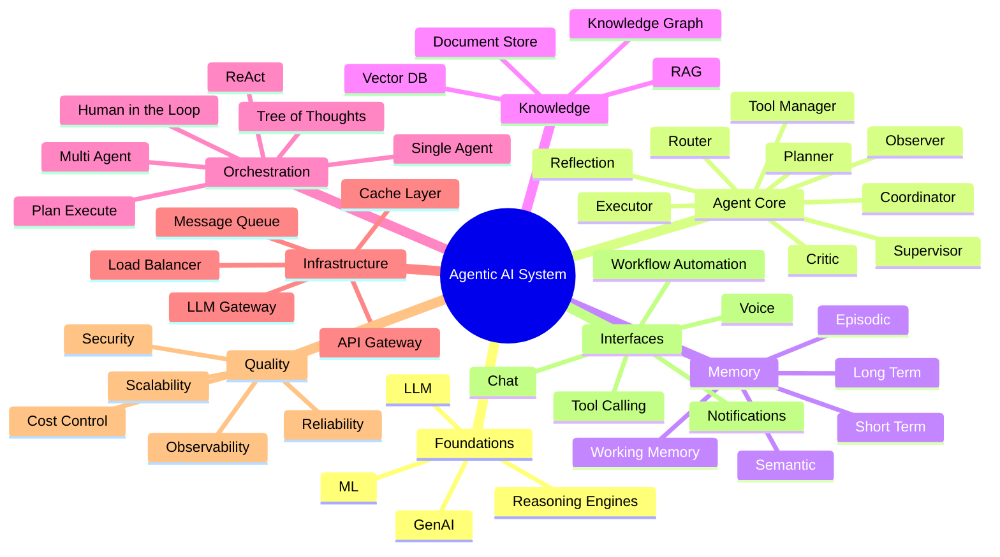

---

## Section 1: What is Agentic AI?

### 1.1 The Core Building Blocks

Before designing agentic systems, you need crisp definitions. Interviewers frequently start by testing whether you can distinguish these terms — vague answers here signal shallow understanding.

| Term | Definition | Real-World Analogy |
|---|---|---|
| **AI (Artificial Intelligence)** | Any system that mimics human-like decision-making. | The broad umbrella — "a machine that thinks." |
| **ML (Machine Learning)** | A subset of AI where systems learn patterns from data instead of being explicitly programmed. | A student who learns from examples instead of being told exact rules. |
| **LLM (Large Language Model)** | A neural network (usually Transformer-based) trained on massive text corpora to predict and generate language. | A widely-read expert who can generate fluent text on almost any topic. |
| **GenAI (Generative AI)** | AI that creates new content — text, code, images, audio — rather than just classifying or predicting. | A creative studio that produces new work on demand. |
| **AI Agent** | A system that uses an LLM (or other model) as a reasoning core, combined with tools, memory, and autonomy to accomplish goals. | A personal assistant who can not just answer questions, but *take actions* — book a flight, send an email. |
| **Agentic AI** | A broader design paradigm where AI systems plan, use tools, retain memory, self-correct, and pursue multi-step goals with partial or full autonomy. | An employee who is given a goal ("organize the quarterly report") and figures out the steps themselves. |
| **Autonomous AI** | Agentic AI operating with minimal or no human-in-the-loop, making independent decisions within defined guardrails. | A self-driving car — decides and acts without asking for permission at every turn. |
| **Multi-Agent System (MAS)** | Multiple specialized agents collaborating, each with a distinct role, coordinated to solve a larger problem. | A company org chart — a manager (supervisor agent) delegates to specialists (research agent, coding agent, QA agent). |

### 1.2 The Evolution Ladder

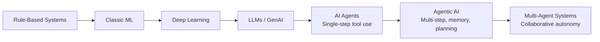

### 1.3 What Makes a System "Agentic"?

A system is genuinely **agentic** — not just "an LLM with a chat UI" — when it exhibits most of these properties:

| Property | Description | Non-Agentic Example | Agentic Example |
|---|---|---|---|
| **Goal-directed** | Works toward an objective, not just a single reply. | "Answer this question." | "Plan and book my entire trip to Tokyo." |
| **Multi-step planning** | Breaks a goal into ordered sub-tasks. | Single prompt → single response. | Decomposes into: search flights → compare → book → notify. |
| **Tool use** | Calls external APIs, functions, or systems. | Text-only chatbot. | Agent that queries a database, calls a payment API. |
| **Memory** | Retains context across steps/sessions. | Stateless Q&A. | Remembers your preferences across weeks. |
| **Self-correction / Reflection** | Evaluates its own output and iterates. | Returns first draft as final answer. | Critiques its own code, re-runs tests, fixes bugs. |
| **Autonomy** | Operates with reduced human oversight within guardrails. | Human approves every micro-step. | Executes an entire workflow, escalating only on edge cases. |

### 1.4 Comparison Table: LLM App vs AI Agent vs Agentic AI vs Multi-Agent System

| Dimension | LLM App (Chatbot) | AI Agent | Agentic AI System | Multi-Agent System |
|---|---|---|---|---|
| Interaction | Single turn / simple chat | Turn + tool calls | Multi-step autonomous workflow | Coordinated workflow across agents |
| Planning | None | Minimal (one-shot tool selection) | Explicit planner + re-planning | Distributed planning + delegation |
| Memory | None or short context window | Short-term | Short + long-term | Shared + per-agent memory |
| Tools | None | 1–few tools | Many tools, dynamic selection | Tools partitioned by agent role |
| Autonomy | None (fully reactive) | Low | Medium–High | High, with supervisor oversight |
| Example | FAQ chatbot | "Summarize this PDF" assistant | Autonomous customer support resolving tickets end-to-end | Software engineering "team" of agents (PM, coder, tester, reviewer) |

### 1.5 Enterprise Example

> **Scenario:** A bank wants to automate loan approvals.
>
> - **LLM App version:** A chatbot that explains loan terms to customers.
> - **AI Agent version:** An assistant that fetches a customer's credit score via an API when asked.
> - **Agentic AI version:** A system that receives a loan application, autonomously pulls credit data, runs risk models, drafts an approval/rejection memo, and routes edge cases to a human loan officer.
> - **Multi-Agent version:** A *Document Agent* extracts application data, a *Risk Agent* scores it, a *Compliance Agent* checks regulations, and a *Supervisor Agent* aggregates their outputs into a final decision — all coordinated automatically.

### Interview Tips

- Interviewers often ask: *"What's the difference between an AI agent and agentic AI?"* — Answer with **scope**: an agent is a single actor; agentic AI is the *system design paradigm* (planning + memory + tools + autonomy), which may involve one or many agents.
- Always ground your definitions with a **concrete example** — abstract definitions alone score lower.
- Be ready to whiteboard the evolution ladder diagram from memory.

### Common Mistakes

- ❌ Treating "agentic AI" and "chatbot" as synonyms.
- ❌ Assuming agentic = fully autonomous with zero human oversight (most production systems use human-in-the-loop checkpoints).
- ❌ Forgetting to mention **guardrails** when discussing autonomy — interviewers want to see you think about safety.

### Tradeoffs

| More Autonomy | More Human-in-the-Loop |
|---|---|
| Faster execution, less human cost | Slower, but safer and more auditable |
| Higher risk of cascading errors | Errors caught before they compound |
| Good for low-stakes, reversible actions | Necessary for high-stakes, irreversible actions (payments, deletions) |

### Best Practices

- ✅ Start every agentic system design with a clear **goal definition** and **success criteria**.
- ✅ Default to **human-in-the-loop** for irreversible or high-cost actions; scale toward autonomy as trust and evals mature.
- ✅ Use **multi-agent decomposition** only when a single agent's tool/prompt complexity becomes unmanageable — don't over-engineer.

---

## Section 2: Agent Architecture

### 2.1 Overview

Every production agent — regardless of framework (LangGraph, AutoGen, custom) — is built from a small set of recurring architectural components. Understanding these deeply is the single highest-leverage thing you can do for interviews.

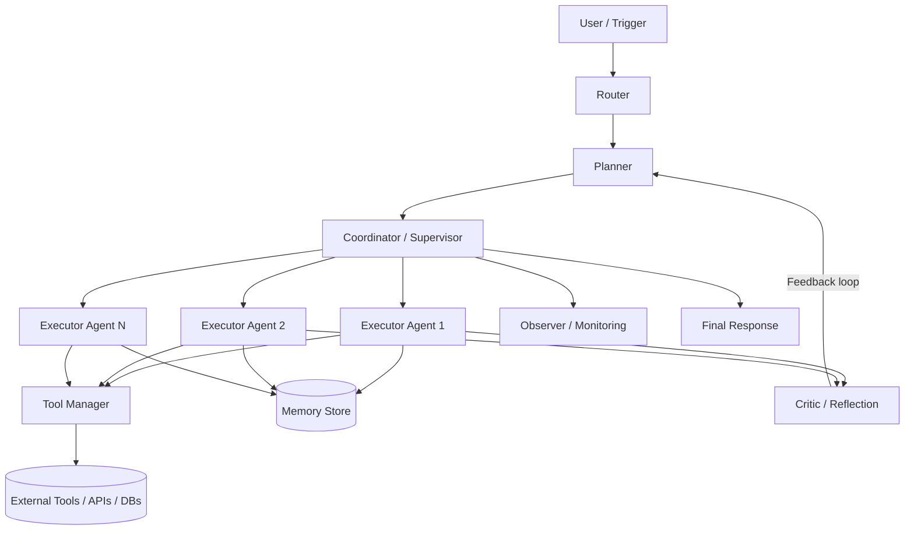

### 2.2 Component Deep Dive

| Component | Role | Real-World Analogy | Key Design Question |
|---|---|---|---|
| **Planner** | Breaks a high-level goal into an ordered (or graph-based) sequence of sub-tasks. | A project manager writing a task breakdown. | Static plan vs. dynamic re-planning? |
| **Executor** | Carries out a single sub-task — calls a tool, invokes an LLM, or delegates further. | An individual contributor doing the actual work. | How much autonomy per executor? |
| **Critic** | Evaluates output quality, correctness, and safety before finalizing. | A code reviewer or QA engineer. | Self-critique (same model) vs. separate critic model? |
| **Memory** | Persists context — conversation history, facts, embeddings — across steps and sessions. | An employee's notebook and long-term knowledge. | What's short-term vs long-term? What gets forgotten? |
| **Reflection** | A meta-loop where the agent reviews its own reasoning/output and revises. | "Let me double check my work before submitting." | How many reflection iterations before diminishing returns? |
| **Router** | Determines which agent, tool, or model should handle an incoming request. | A call center's IVR routing you to the right department. | Rule-based vs. learned (classifier/LLM) routing? |
| **Tool Manager** | Registers, validates, and invokes external tools/functions/APIs; handles auth and schemas. | An admin who manages employee access to software systems. | How to sandbox and rate-limit tool calls? |
| **Coordinator / Supervisor** | Orchestrates multiple agents, resolves conflicts, aggregates results. | A manager overseeing a team of specialists. | Centralized supervisor vs. peer-to-peer coordination? |
| **Observer** | Watches execution for anomalies, cost overruns, infinite loops, and safety violations. | A compliance officer auditing in real time. | Sync (blocking) vs. async (logging-only) observation? |
| **Reasoning Engine** | The underlying LLM (or ensemble) that performs the actual "thinking" — chain-of-thought, tool selection, synthesis. | The brain behind every decision. | Single large model vs. router across model sizes? |

### 2.3 Reference Architecture Diagram (Detailed)

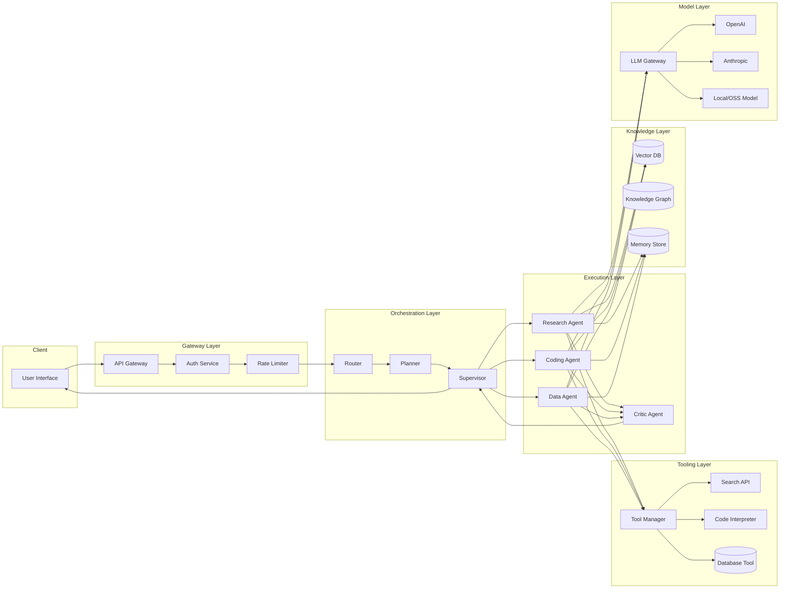

### 2.4 Sequence: A Single Agent Handling a Task

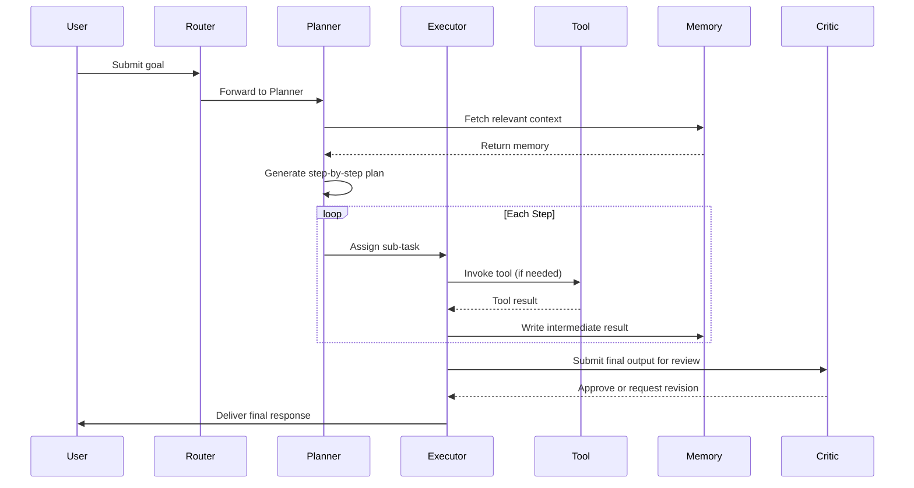

### Interview Tips

- When asked to "design an agent," always name the **Planner–Executor–Critic** loop explicitly — it's the most recognizable pattern and signals fluency.
- Clarify whether **Reflection** is baked into the Executor (self-critique) or a separate Critic component — interviewers probe this distinction.
- Mention **Observer/Monitoring** even if not asked — it demonstrates production maturity.

### Common Mistakes

- ❌ Conflating the Router (request dispatch) with the Coordinator (multi-agent orchestration) — they solve different problems.
- ❌ Designing a Planner that never re-plans — real-world tool failures require dynamic re-planning.
- ❌ Skipping the Critic component entirely, leading to unchecked hallucinated outputs in production.

### Tradeoffs

| Design Choice | Pros | Cons |
|---|---|---|
| Single monolithic agent (all roles in one prompt) | Simple, low latency, cheap | Hard to debug, prompt bloat, poor separation of concerns |
| Fully decomposed (separate Planner/Executor/Critic agents) | Modular, testable, easier to swap models per role | Higher latency (multiple LLM calls), higher cost |
| Static plan generated once | Predictable, easy to audit | Brittle — fails when a step's assumptions change |
| Dynamic re-planning after each step | Robust to failures | Expensive, harder to reason about determinism |

### Best Practices

- ✅ Keep each component's responsibility narrow — a Planner should not also execute tools.
- ✅ Log every Planner decision and Critic verdict for auditability.
- ✅ Cap reflection loops (e.g., max 2–3 iterations) to avoid runaway cost/latency.
- ✅ Use cheaper/faster models for routing and critique, reserve the most capable model for planning and complex synthesis.

---

## Section 3: Functional Requirements

> Functional requirements define **what the system must do**. In interviews, always drive this list from the prompt's scope — don't recite the full list if the question only concerns a chatbot.

For each requirement below: **Purpose → Workflow → Challenges → Best Practice**.

### 3.1 User Login & Authentication

- **Purpose:** Identify users, personalize sessions, enforce access control.
- **Workflow:** User submits credentials/OAuth token → Auth service validates → issues JWT/session → downstream services verify token on each request.
- **Challenges:** Supporting SSO across enterprise IdPs; token refresh without breaking long-running agent sessions.
- **Best Practice:** Use short-lived access tokens + refresh tokens; validate at the API Gateway, not in every microservice.

### 3.2 Conversation Management

- **Purpose:** Maintain coherent multi-turn dialogue.
- **Workflow:** Each message appended to a conversation thread; context window assembled from recent turns + summarized history.
- **Challenges:** Context window limits; maintaining coherence across very long conversations.
- **Best Practice:** Summarize/compact older turns; store full history in DB, only inject relevant window into the prompt.

### 3.3 Memory

- **Purpose:** Let agents recall facts and preferences beyond a single session.
- **Workflow:** Extract salient facts → embed and store → retrieve on future sessions via similarity search.
- **Challenges:** Deciding what's worth remembering; avoiding stale/contradictory memory.
- **Best Practice:** Use TTL and confidence scores on memories; periodically consolidate/deduplicate.

### 3.4 File Upload

- **Purpose:** Allow users to provide documents/images/data as agent input.
- **Workflow:** Upload to blob storage → virus/malware scan → parse/chunk → index for retrieval.
- **Challenges:** Large file handling, format diversity (PDF, DOCX, images), security scanning.
- **Best Practice:** Process uploads asynchronously; return an upload ID immediately, notify on completion.

### 3.5 Search

- **Purpose:** Let agents/users find relevant information from internal or external sources.
- **Workflow:** Query → hybrid (keyword + vector) search → rank → return results.
- **Challenges:** Balancing recall vs. precision; multi-source federation.
- **Best Practice:** Combine BM25 + dense retrieval (hybrid search) with a re-ranker.

### 3.6 RAG (Retrieval-Augmented Generation)

- **Purpose:** Ground LLM responses in factual, up-to-date, private data.
- **Workflow:** Query → retrieve chunks → assemble context → generate grounded response with citations.
- **Challenges:** Chunking strategy, hallucination despite retrieval, latency.
- **Best Practice:** Always cite sources; evaluate retrieval quality independently from generation quality (see Section 11).

### 3.7 Tool Calling

- **Purpose:** Let agents take real-world actions (query APIs, run code, send emails).
- **Workflow:** LLM emits structured tool call → Tool Manager validates schema → executes → returns result to LLM.
- **Challenges:** Schema drift, malformed tool calls, tool failures mid-execution.
- **Best Practice:** Strict JSON schema validation; retry with error feedback injected back into the prompt.

### 3.8 Workflow Automation

- **Purpose:** Chain multiple steps/agents/tools into a repeatable business process.
- **Workflow:** Define workflow as a DAG → trigger → execute nodes in order/parallel → track state.
- **Challenges:** Handling partial failures; long-running workflows spanning hours/days.
- **Best Practice:** Use a durable workflow engine (e.g., Temporal-style) with checkpointing.

### 3.9 Notifications

- **Purpose:** Inform users/systems of task completion, approvals needed, or failures.
- **Workflow:** Event triggers notification service → routes via email/SMS/push/webhook.
- **Challenges:** Avoiding notification fatigue; delivery guarantees.
- **Best Practice:** Use a pub/sub event bus decoupled from the core agent loop.

### 3.10 Approval Workflow (Human-in-the-Loop)

- **Purpose:** Insert human checkpoints before high-risk actions.
- **Workflow:** Agent proposes action → pauses execution → notifies approver → resumes on approval/rejection.
- **Challenges:** Keeping agent state durable while waiting (possibly hours); timeout handling.
- **Best Practice:** Persist paused workflow state to DB; use event-driven resume rather than polling.

### 3.11 Scheduling

- **Purpose:** Trigger agents on a time-based or event-based schedule.
- **Workflow:** Cron/scheduler service enqueues a job → agent runtime picks it up.
- **Challenges:** Timezone handling; avoiding duplicate execution in distributed schedulers.
- **Best Practice:** Use distributed locks / idempotency keys per scheduled job run.

### 3.12 Planning

- **Purpose:** Decompose goals into executable steps (see Section 2/10).
- **Workflow:** Goal → Planner LLM call → structured plan (list or DAG) → validated → executed.
- **Challenges:** Plans that are too rigid or too vague; infinite planning loops.
- **Best Practice:** Bound plan depth/step count; validate plan structure before execution.

### 3.13 Task Queue

- **Purpose:** Decouple task submission from execution; enable async, scalable processing.
- **Workflow:** Task enqueued (Kafka/SQS/Redis Streams) → worker pool consumes → executes → writes result.
- **Challenges:** Backpressure, poison messages, ordering guarantees.
- **Best Practice:** Use dead-letter queues; make tasks idempotent.

### 3.14 Retry

- **Purpose:** Recover automatically from transient failures.
- **Workflow:** On failure, retry with exponential backoff up to N attempts, then escalate.
- **Challenges:** Retrying non-idempotent operations (e.g., "send payment") can cause duplicates.
- **Best Practice:** Use idempotency keys for all side-effecting tool calls.

### 3.15 Human in the Loop (General)

- **Purpose:** Balance autonomy with safety/trust.
- **Workflow:** Confidence-based routing — low-confidence or high-risk actions pause for human review.
- **Challenges:** Defining the confidence/risk threshold; UX for review.
- **Best Practice:** Make HITL configurable per action-type/risk-tier, not a global on/off switch.

### 3.16 Versioning

- **Purpose:** Track changes to prompts, agents, models, and workflows over time.
- **Workflow:** Every prompt/agent config change is versioned (like Git) with rollback support.
- **Challenges:** Reproducing exact behavior of an old version when the underlying model itself changes.
- **Best Practice:** Version prompts, tool schemas, and pin model versions together as a single deployable "agent bundle."

### 3.17 Audit

- **Purpose:** Provide a traceable record of every decision and action for compliance/debugging.
- **Workflow:** Every plan, tool call, and output logged with timestamps, inputs, outputs, and actor identity.
- **Challenges:** Storage volume; balancing detail vs. PII exposure in logs.
- **Best Practice:** Structured, immutable audit logs (append-only store), redact PII before persisting.

### 3.18 Billing

- **Purpose:** Track and charge for token/compute usage.
- **Workflow:** Every LLM call logs token counts + cost → aggregated per user/org → billed.
- **Challenges:** Attributing cost accurately in multi-agent calls; real-time budget enforcement.
- **Best Practice:** Emit usage events to a stream processor; enforce budget caps before execution, not just after billing.

### 3.19 Analytics

- **Purpose:** Understand usage patterns, success rates, and bottlenecks.
- **Workflow:** Events streamed to a data warehouse; dashboards built on top.
- **Challenges:** High cardinality of agent/tool combinations.
- **Best Practice:** Define a small set of core KPIs (task success rate, latency, cost per task) before building dashboards.

### 3.20 Feedback

- **Purpose:** Capture user satisfaction/corrections to improve the system.
- **Workflow:** Thumbs up/down or corrections stored, linked to the specific agent run.
- **Challenges:** Low feedback volume; noisy signals.
- **Best Practice:** Use feedback to build eval datasets, not just dashboards.

### 3.21 Multi-Agent Collaboration

- **Purpose:** Solve problems too complex for a single agent by dividing labor.
- **Workflow:** Supervisor decomposes goal → delegates to specialist agents → aggregates results.
- **Challenges:** Coordination overhead, conflicting outputs, deadlocks.
- **Best Practice:** Define clear communication protocols and a single source of truth for shared state (see Section 10).

### Interview Tips

- When given an open-ended prompt ("design an agentic customer support system"), **enumerate functional requirements first**, then explicitly mark which are in-scope/out-of-scope before designing — this shows structured thinking.
- Use the **MoSCoW method** (Must/Should/Could/Won't) to prioritize requirements under time pressure.

### Common Mistakes

- ❌ Jumping straight to architecture diagrams without clarifying requirements.
- ❌ Treating "Human in the Loop" as an afterthought rather than a first-class requirement.
- ❌ Forgetting non-happy-path requirements like retry, audit, and billing.

### Tradeoffs

| Requirement | Build vs. Buy Consideration |
|---|---|
| Task Queue | Buy (Kafka/SQS) almost always beats building custom |
| Approval Workflow | Custom often needed — business logic is domain-specific |
| Audit Logging | Buy (structured logging + SIEM) for compliance-grade needs |

### Best Practices

- ✅ Map every functional requirement to a **specific component** in your architecture diagram.
- ✅ Treat HITL, retry, and audit as core requirements, not optional add-ons, for any production agentic system.

---

## Section 4: Non-Functional Requirements

> NFRs define **how well** the system performs its functions. For each NFR: Definition → Why Important → Real Examples → How to Achieve → Tradeoffs → Interview Questions.

### 4.1 Availability

- **Definition:** The percentage of time the system is operational and responsive.
- **Why important:** Agentic workflows often power customer-facing or revenue-critical automation.
- **Real example:** An agent-based support system targeting 99.9% ("three nines") uptime — roughly 8.7 hours of downtime/year.
- **How to achieve:** Multi-AZ deployment, health checks, graceful degradation (fallback to smaller model if primary LLM provider is down).
- **Tradeoffs:** Higher availability = higher infrastructure cost (redundancy, multi-region).
- **Interview Q:** *"How would you design for 99.99% availability if your LLM provider has an outage?"* → Multi-provider LLM Gateway with automatic failover (Section 9).

### 4.2 Latency

- **Definition:** Time from request to response (often p50/p95/p99 matter more than average).
- **Why important:** User-facing agents feel "broken" above ~2–3 seconds without streaming.
- **Real example:** Streaming token-by-token output to mask total generation latency.
- **How to achieve:** Streaming responses, model routing (small model for simple tasks), caching, parallel tool calls.
- **Tradeoffs:** Lower latency often means smaller/cheaper models → potential accuracy loss.
- **Interview Q:** *"How do you reduce p99 latency in a multi-agent pipeline?"* → Parallelize independent agent calls, cache retrieval results, use speculative execution.

### 4.3 Scalability

- **Definition:** Ability to handle growing load (users, tasks, data) without redesign.
- **Why important:** Agentic workloads are bursty and unpredictable (e.g., viral usage spikes).
- **Real example:** Autoscaling worker pools based on queue depth.
- **How to achieve:** Stateless services behind load balancers, horizontally scalable queues, sharded databases.
- **Tradeoffs:** Statelessness simplifies scaling but pushes complexity into external memory/state stores.

### 4.4 Reliability

- **Definition:** The system consistently produces correct results under expected conditions.
- **Why important:** Wrong agent actions (e.g., wrong refund amount) have real business cost.
- **Real example:** Idempotent tool calls + retries ensure a payment isn't processed twice.
- **How to achieve:** Idempotency keys, schema validation, automated eval suites in CI/CD.
- **Tradeoffs:** More validation = more latency and engineering overhead.

### 4.5 Fault Tolerance

- **Definition:** The system continues operating (possibly degraded) despite component failures.
- **Why important:** LLM providers, tools, and databases all fail independently.
- **Real example:** Circuit breaker trips after 5 consecutive tool failures, falls back to a cached response.
- **How to achieve:** Circuit breakers, bulkheads, redundant providers (see Section 19).

### 4.6 Consistency

- **Definition:** All parts of the system see the same data state (strong vs. eventual).
- **Why important:** Multi-agent systems sharing memory can act on stale/conflicting data.
- **Real example:** Two agents both reading a "task status" — need consistent reads to avoid duplicate work.
- **How to achieve:** Strong consistency for critical state (task status), eventual consistency for analytics/logs.
- **Tradeoffs:** Strong consistency costs latency and availability (CAP theorem).

### 4.7 Durability

- **Definition:** Once data is written (memory, conversation, audit log), it is not lost.
- **Why important:** Losing conversation history or audit trails breaks trust and compliance.
- **How to achieve:** Replicated storage, write-ahead logs, regular backups.

### 4.8 Security

- **Definition:** Protection against unauthorized access, data leakage, and malicious manipulation (see Section 14 for depth).
- **Why important:** Agents with tool access are a much larger attack surface than static chatbots.
- **Real example:** Prompt injection tricking an agent into exfiltrating data via a tool call.
- **How to achieve:** Least-privilege tool scopes, input/output filtering, sandboxing.

### 4.9 Performance

- **Definition:** Efficient use of compute/resources to deliver results (throughput + latency combined).
- **How to achieve:** Batching, caching, model right-sizing (see Section 17).

### 4.10 Maintainability

- **Definition:** Ease of understanding, modifying, and extending the system.
- **How to achieve:** Clear separation of Planner/Executor/Tool code, versioned prompts, modular agent definitions.

### 4.11 Observability

- **Definition:** Ability to understand internal system state from external outputs (logs, metrics, traces).
- **Why important:** Agentic pipelines are non-deterministic — debugging requires full execution traces.
- **How to achieve:** Structured tracing per agent step (see Section 15).

### 4.12 Cost

- **Definition:** Total spend on compute, tokens, storage, and infrastructure.
- **Why important:** Token costs scale directly with usage — can spiral quickly without controls.
- **How to achieve:** Caching, model routing, budget alerts (see Section 18).

### 4.13 Compliance

- **Definition:** Adherence to legal/regulatory standards (GDPR, HIPAA, SOC2).
- **How to achieve:** Data residency controls, PII redaction, audit trails, consent management.

### 4.14 Extensibility

- **Definition:** Ease of adding new agents, tools, or capabilities without breaking existing ones.
- **How to achieve:** Plugin-style tool registration, standardized agent interfaces (e.g., MCP-style protocols).

### 4.15 Elasticity

- **Definition:** Ability to scale resources up *and down* automatically in response to load.
- **How to achieve:** Kubernetes HPA, serverless functions for spiky workloads.

### 4.16 Disaster Recovery

- **Definition:** Ability to recover from catastrophic failure (region outage, data corruption).
- **How to achieve:** Cross-region backups, defined RTO/RPO targets, regular DR drills.

### NFR Summary Table

| NFR | Primary Lever | Typical Target (Enterprise) |
|---|---|---|
| Availability | Redundancy, failover | 99.9%–99.99% |
| Latency (p95) | Caching, streaming, model routing | < 2–3s for interactive, minutes for async workflows |
| Scalability | Stateless services, queues | Elastic to 10x baseline traffic |
| Reliability | Idempotency, validation | > 99% task success rate |
| Durability | Replication, backups | 99.999999999% (11 nines, e.g., S3-style) |
| Cost | Caching, model routing | Defined $/task budget |
| RTO / RPO | DR strategy | RTO < 1hr, RPO < 5min (varies by tier) |

### Interview Tips

- Always **quantify** NFRs when possible ("99.9% availability" beats "highly available").
- Connect each NFR back to a **specific design decision** — interviewers reward NFR-to-architecture traceability.

### Common Mistakes

- ❌ Listing NFRs without explaining *how* the architecture achieves them.
- ❌ Ignoring the CAP theorem tension when discussing consistency + availability together.
- ❌ Treating cost as an afterthought instead of a first-class NFR in agentic systems (token costs are uniquely significant here).

### Tradeoffs

| Optimize For | At the Expense Of |
|---|---|
| Latency | Cost (bigger/faster models cost more) |
| Consistency | Availability (CAP theorem) |
| Autonomy | Reliability/Safety |
| Extensibility | Simplicity |

### Best Practices

- ✅ Define NFR targets (SLAs/SLOs) *before* designing architecture.
- ✅ Treat cost and latency as NFRs with dashboards and alerts, not just "nice to track."
- ✅ Design degraded-mode behavior explicitly (what happens when the LLM provider is down?).

---

## Section 5: Capacity Planning

> This is the section interviewers use to test whether you can turn ambiguous requirements into concrete numbers. Always **state your assumptions out loud**.

### 5.1 The Standard Approach

```mermaid
flowchart LR
    A[Clarify Assumptions] --> B[Estimate DAU/MAU]
    B --> C[Estimate Requests per User]
    C --> D[Compute Daily Requests]
    D --> E[Apply Peak Factor]
    E --> F[Compute RPS/QPS]
    F --> G[Estimate Tokens per Request]
    G --> H[Compute Compute/GPU Needs]
    H --> I[Estimate Storage]
    I --> J[Estimate Cost]
    J --> K[Define Autoscaling Policy]
```

### 5.2 Worked Example: Enterprise Agentic Assistant

**Assumptions (always state these explicitly in an interview):**

```text
DAU (Daily Active Users)         = 5,000,000
Avg requests per user per day    = 10
Peak factor                      = 3x average
Avg tokens per request (in+out)  = 2,000 tokens
Avg agent steps per request      = 3 (planner + 2 tool calls)
Working day active window        = 16 hours (not evenly distributed)
```

**Step 1 — Daily Requests**

```text
Daily Requests = DAU × Avg requests/user
               = 5,000,000 × 10
               = 50,000,000 requests/day
```

**Step 2 — Average RPS**

```text
Average RPS = Daily Requests / (24 × 3600)
            = 50,000,000 / 86,400
            ≈ 579 RPS
```

**Step 3 — Peak RPS**

```text
Peak RPS = Average RPS × Peak Factor
         = 579 × 3
         ≈ 1,737 RPS
```

**Step 4 — Total Daily Tokens**

```text
Total Tokens/day = Daily Requests × Avg tokens/request × Steps/request
                  = 50,000,000 × 2,000 × 3
                  = 300,000,000,000 tokens/day (300B)
```

**Step 5 — Concurrent Users (Little's Law)**

```text
Concurrent Users = Peak RPS × Avg Session Duration (sec)
Assume avg agent task takes 8 seconds end-to-end:
Concurrent Users = 1,737 × 8 ≈ 13,900 concurrent in-flight tasks
```

**Step 6 — Worker/Compute Sizing**

```text
If one inference worker handles 5 concurrent requests:
Workers needed = Concurrent Users / 5
               = 13,900 / 5 ≈ 2,780 workers at peak
```

**Step 7 — Vector Storage Estimate**

```text
Assume 50M documents, avg 5 chunks/doc, 1536-dim embeddings (float32):
Total chunks = 50,000,000 × 5 = 250,000,000
Storage per embedding = 1536 × 4 bytes = 6,144 bytes ≈ 6 KB
Total vector storage = 250,000,000 × 6 KB ≈ 1.5 PB (raw)
→ Apply quantization (int8) to cut ~4x → ~375 TB
```

**Step 8 — Cost Estimate (Order of Magnitude)**

```text
Assume blended LLM cost = $3 / 1M tokens (mixed input/output, cached where possible)
Daily token cost = 300,000,000,000 / 1,000,000 × $3
                  = 300,000 × $3
                  = $900,000/day (before caching/optimization)

With 40% cache hit rate + model routing to cheaper models for simple steps:
Effective cost ≈ $900,000 × 0.5 ≈ $450,000/day
```

> ⚠️ **Warning:** This is exactly why **Section 18 (Cost Optimization)** is not optional in agentic system design — unoptimized token spend can dominate the entire infra budget.

### 5.3 Formula Reference Sheet

| Metric | Formula |
|---|---|
| Daily Requests | `DAU × requests/user/day` |
| Average RPS | `Daily Requests / 86,400` |
| Peak RPS | `Average RPS × Peak Factor (typically 2–5x)` |
| Concurrent Users | `RPS × Avg session duration (Little's Law)` |
| Storage/day | `Requests/day × avg payload size` |
| Tokens/day | `Requests/day × avg tokens/request × steps/request` |
| GPU count | `Peak concurrent inferences / throughput per GPU` |
| Cache hit savings | `Total cost × cache hit rate × cost per cached call reduction` |

### 5.4 What Interviewers Expect

- You don't need *exact* numbers — round aggressively (powers of 10) and reason clearly.
- Always state assumptions before calculating ("Let's assume peak factor of 3x, typical for consumer apps...").
- Show the **chain of derivation** — DAU → requests → RPS → concurrency → infra — rather than jumping to a final number.
- Sanity-check results ("2,780 workers seems high — let's reconsider batching or a larger per-worker concurrency").
- Always connect capacity numbers back to **cost** and **autoscaling policy**.

### 5.5 Autoscaling Policy Example

```yaml
autoscaling:
  metric: queue_depth
  target_value: 100
  min_replicas: 50
  max_replicas: 3000
  scale_up_cooldown: 30s
  scale_down_cooldown: 300s
  fallback_policy: "route overflow to smaller/cheaper model"
```

### Interview Tips

- Practice doing this math **out loud** without a calculator — round to 1–2 significant figures.
- If given no numbers, propose reasonable ones yourself and label them as assumptions.
- Always end capacity planning with a **cost sanity check** — this differentiates senior candidates.

### Common Mistakes

- ❌ Forgetting the "steps per request" multiplier — agentic tasks call the LLM multiple times, not once (this is the #1 estimation error).
- ❌ Ignoring peak vs. average traffic.
- ❌ Not converting token counts to dollar costs.

### Tradeoffs

| Approach | Pros | Cons |
|---|---|---|
| Over-provision for peak | No throttling, best UX | Wasted spend during off-peak |
| Autoscale aggressively | Cost efficient | Risk of cold-start latency during spikes |
| Queue + backpressure | Protects downstream systems | Adds latency under load |

### Best Practices

- ✅ Always multiply by **agent steps per request**, not just request count — this is the most agentic-specific capacity factor.
- ✅ Separate capacity planning for **synchronous** (interactive chat) vs **asynchronous** (batch workflow) workloads.
- ✅ Build a cost dashboard from day one — token costs at agentic scale can 10x unexpectedly.

---

## Section 6: Database Design

### 6.1 Entity Relationship Diagram

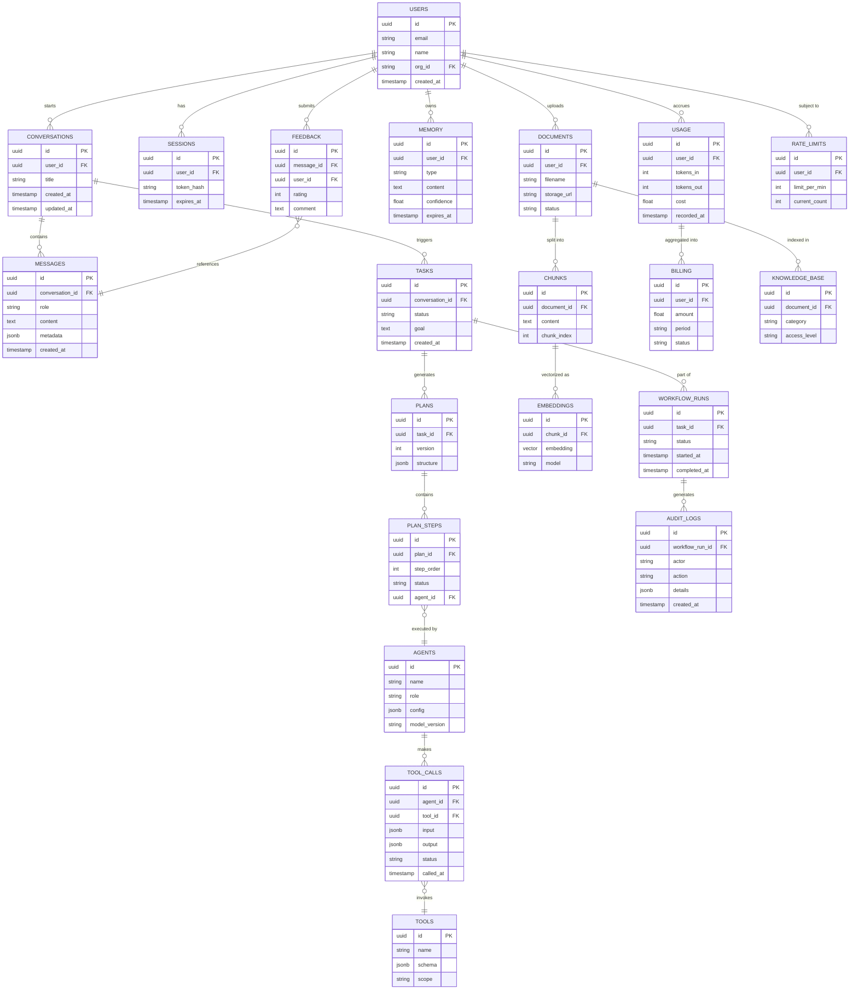

### 6.2 Table Design Notes

| Table | Storage Choice | Rationale |
|---|---|---|
| `users`, `sessions`, `billing` | PostgreSQL (relational) | Strong consistency, transactional integrity needed for billing/auth |
| `messages` | PostgreSQL or MongoDB | High write volume, semi-structured `metadata` — either works; Postgres with `jsonb` is a strong default |
| `embeddings` | Vector DB (Pinecone/Qdrant/pgvector) | Optimized for ANN similarity search |
| `audit_logs` | Append-only store (e.g., partitioned Postgres or a log store) | Immutability + compliance requirements |
| `memory` | Postgres + vector index, or hybrid KV+vector store | Needs both structured filtering (TTL, user_id) and semantic search |
| `usage` | Time-series-friendly store (Postgres partitioned by day, or ClickHouse) | High write throughput, aggregation-heavy queries |

### 6.3 Indexing Strategy

```sql
-- Fast conversation lookups
CREATE INDEX idx_messages_conversation_id ON messages (conversation_id, created_at DESC);

-- Task status dashboard queries
CREATE INDEX idx_tasks_status ON tasks (status) WHERE status IN ('pending', 'running');

-- Tool call audit trail
CREATE INDEX idx_tool_calls_agent_id ON tool_calls (agent_id, called_at DESC);

-- Vector similarity index (pgvector example, HNSW)
CREATE INDEX idx_embeddings_vector ON embeddings
  USING hnsw (embedding vector_cosine_ops);

-- Memory expiration sweep
CREATE INDEX idx_memory_expires_at ON memory (expires_at) WHERE expires_at IS NOT NULL;
```

### 6.4 Normalization vs. Denormalization

- **Normalize** transactional/financial tables (`users`, `billing`, `usage`) — correctness matters more than read speed.
- **Denormalize** read-heavy, latency-sensitive paths — e.g., store a denormalized `conversation_summary` field on `conversations` to avoid re-aggregating `messages` on every load.

### 6.5 Partitioning & Sharding

| Technique | Applied To | Why |
|---|---|---|
| **Time-based partitioning** | `messages`, `audit_logs`, `usage` | High-volume append-only tables; enables cheap archival of old partitions |
| **Hash sharding by `user_id`** | `conversations`, `memory` | Even distribution, keeps a user's data co-located for low-latency access |
| **Sharding by `org_id`** (enterprise) | Multi-tenant tables | Data isolation per tenant; simplifies compliance/data residency |

### 6.6 Replication

- **Primary-replica (read replicas)** for read-heavy dashboards/analytics.
- **Multi-region replication** for global latency + disaster recovery, with a clear consistency model (usually eventual consistency for replicas, strong for primary writes).

### 6.7 SQL vs. NoSQL Decision Table

| Criteria | Choose SQL (Postgres) | Choose NoSQL (MongoDB/DynamoDB) |
|---|---|---|
| Strong transactional needs (billing, auth) | ✅ | ❌ |
| Flexible/evolving schema (agent configs, tool outputs) | ⚠️ (use `jsonb`) | ✅ |
| Complex relational joins | ✅ | ❌ |
| Massive horizontal write scale | ⚠️ (needs sharding effort) | ✅ (native) |
| Strong consistency required | ✅ | ⚠️ (depends on config) |

### Interview Tips

- Always draw the ER diagram **before** discussing SQL vs. NoSQL — structure first, storage engine second.
- Explicitly separate **transactional** tables (need ACID) from **analytical/log** tables (need throughput).

### Common Mistakes

- ❌ Putting everything in one database "for simplicity" — leads to contention between OLTP and analytics workloads.
- ❌ Forgetting indexes on foreign keys used in hot-path queries.
- ❌ Storing embeddings in a general-purpose SQL table without a proper ANN index — kills search performance at scale.

### Tradeoffs

| Choice | Pros | Cons |
|---|---|---|
| Single Postgres w/ pgvector | Operational simplicity, ACID | Scales less elastically than dedicated vector DBs at very large scale |
| Dedicated vector DB (Pinecone/Qdrant) | Purpose-built ANN performance | Extra operational complexity, data sync overhead |
| Full normalization | Data integrity | More joins, potential latency |
| Full denormalization | Fast reads | Update anomalies, storage bloat |

### Best Practices

- ✅ Separate OLTP (transactional) from OLAP (analytics) workloads — use CDC (Change Data Capture) to stream from one to the other.
- ✅ Always add `created_at`/`updated_at` and soft-delete (`deleted_at`) columns for auditability.
- ✅ Partition high-volume log/audit tables by time from day one.

---

## Section 7: Data Storage Strategy

| Store | Why Use It | Advantages | Disadvantages | Typical Use in Agentic Systems |
|---|---|---|---|---|
| **PostgreSQL** | Default relational store | ACID, mature, `jsonb` flexibility, `pgvector` extension | Vertical scaling limits without sharding | Users, billing, tasks, plans |
| **MongoDB** | Flexible document schema | Easy schema evolution, horizontal scaling | Weaker multi-document transactions historically | Storing raw tool outputs, agent configs |
| **Redis** | In-memory cache/state | Sub-millisecond latency, pub/sub, TTL support | Volatile (unless persisted), memory-cost bound | Session state, rate limiting, semantic cache, short-term memory |
| **Vector Database** (Pinecone/Qdrant/Weaviate/Milvus) | Similarity search at scale | Purpose-built ANN indexes (HNSW/IVF), metadata filtering | Extra system to operate, eventual consistency with source data | RAG retrieval, long-term semantic memory |
| **Blob Storage** (S3/Azure Blob) | Store large unstructured files | Cheap, durable (11 nines), infinitely scalable | Not queryable directly | Uploaded documents, images, model artifacts |
| **Knowledge Graph** (Neo4j) | Model explicit relationships | Great for multi-hop reasoning, explainability | Complex to build/maintain, needs curation | Enterprise knowledge with strong entity relationships (org charts, compliance rules) |
| **ElasticSearch / OpenSearch** | Full-text + hybrid search | Fast keyword search, aggregations, mature ecosystem | Operational overhead, eventual consistency | Hybrid search (BM25 + vectors), log search |
| **Data Lake** (Delta Lake/Iceberg on S3) | Store raw + processed data at scale | Cheap, schema-on-read, great for analytics/ML training | Query latency higher than warehouses | Usage analytics, model fine-tuning datasets |

### 7.1 Decision Flow

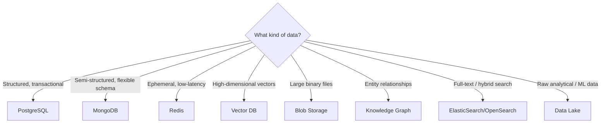

### Interview Tips

- Justify each storage choice by **access pattern**, not by popularity — "Redis because it's fast" is weak; "Redis because we need sub-10ms reads for rate limiting" is strong.
- Be ready to discuss **polyglot persistence** — production agentic systems almost always use 4–6 different stores simultaneously.

### Common Mistakes

- ❌ Using a vector DB for everything, including data that's naturally relational.
- ❌ Forgetting that Redis is volatile by default — enable AOF/RDB persistence for anything you can't afford to lose.
- ❌ Underestimating blob storage egress costs when serving large files frequently.

### Tradeoffs

| Choice | Pros | Cons |
|---|---|---|
| Managed vector DB (Pinecone) | No ops burden, fast to start | Vendor lock-in, cost at scale |
| Self-hosted vector DB (Qdrant/Milvus) | Cost control, data locality | Requires ops expertise |
| Knowledge Graph | Explainable multi-hop reasoning | High curation cost, slower to build |

### Best Practices

- ✅ Use Redis as a **semantic cache** in front of the LLM Gateway to cut redundant calls (Section 17/18).
- ✅ Store raw documents in blob storage; store only parsed chunks/embeddings in the vector DB.
- ✅ Tier storage — hot (Redis/Postgres), warm (vector DB/ElasticSearch), cold (data lake/blob archive).

---

## Section 8: API Design

### 8.1 Design Principles

- RESTful resource naming, versioned via URL path (`/v1/...`).
- All mutating side-effecting endpoints (tool-triggering, workflow-starting) **require an `Idempotency-Key` header**.
- Long-running agent tasks use **async pattern**: `202 Accepted` + polling or webhook, never a blocking call held open for minutes.
- Streaming endpoints use **Server-Sent Events (SSE)** or chunked HTTP for token-by-token output.

### 8.2 Authentication

```http
POST /v1/auth/token
Content-Type: application/json

{
  "grant_type": "client_credentials",
  "client_id": "abc123",
  "client_secret": "***"
}
```

```json
{
  "access_token": "eyJhbGciOi...",
  "token_type": "Bearer",
  "expires_in": 3600
}
```

### 8.3 Conversation & Messaging API

```http
POST /v1/conversations/{conversation_id}/messages
Authorization: Bearer {token}
Idempotency-Key: 3f29a1b2-...
Content-Type: application/json

{
  "role": "user",
  "content": "Plan a 3-day trip to Tokyo under $1500",
  "stream": true
}
```

**Streaming Response (SSE):**

```text
event: token
data: {"delta": "Sure"}

event: token
data: {"delta": ", let's"}

event: tool_call
data: {"tool": "flight_search", "status": "started"}

event: done
data: {"message_id": "msg_789", "finish_reason": "stop"}
```

### 8.4 Agent / Task API

```http
POST /v1/tasks
Content-Type: application/json

{
  "goal": "Generate Q3 sales report and email to finance team",
  "priority": "normal",
  "callback_url": "https://client.example.com/webhooks/task-complete"
}
```

**Response — `202 Accepted` (async pattern):**

```json
{
  "task_id": "task_456",
  "status": "queued",
  "poll_url": "/v1/tasks/task_456"
}
```

```http
GET /v1/tasks/task_456
```

```json
{
  "task_id": "task_456",
  "status": "running",
  "current_step": "retrieving_sales_data",
  "progress": 0.4,
  "created_at": "2026-07-20T10:00:00Z"
}
```

### 8.5 Memory API

```http
GET /v1/users/{user_id}/memory?type=preference&limit=20
```

```json
{
  "memories": [
    {
      "id": "mem_001",
      "type": "preference",
      "content": "Prefers window seats on flights",
      "confidence": 0.92,
      "created_at": "2026-06-01T00:00:00Z"
    }
  ],
  "next_cursor": "eyJvZmZzZXQiOjIwfQ=="
}
```

### 8.6 Workflow API

```http
POST /v1/workflows/{workflow_id}/runs
```

```json
{
  "run_id": "run_321",
  "status": "pending_approval",
  "pending_step": "send_customer_refund",
  "approval_url": "/v1/approvals/appr_555"
}
```

### 8.7 Knowledge / Document API

```http
POST /v1/documents
Content-Type: multipart/form-data

file=@quarterly_report.pdf
```

```json
{
  "document_id": "doc_789",
  "status": "processing",
  "estimated_completion_seconds": 12
}
```

### 8.8 Search API

```http
GET /v1/search?q=refund+policy&mode=hybrid&top_k=5
```

```json
{
  "results": [
    {
      "chunk_id": "chunk_11",
      "score": 0.87,
      "content_preview": "Refunds are processed within 5-7 business days...",
      "source": "refund_policy.pdf"
    }
  ]
}
```

### 8.9 Feedback API

```http
POST /v1/messages/{message_id}/feedback

{
  "rating": -1,
  "comment": "Wrong flight price quoted"
}
```

### 8.10 Status Codes Convention

| Code | Meaning in Agentic APIs |
|---|---|
| `200 OK` | Synchronous success |
| `201 Created` | Resource created (document, workflow) |
| `202 Accepted` | Async task queued — poll or await webhook |
| `400 Bad Request` | Invalid schema/tool arguments |
| `401/403` | Auth/authorization failure |
| `409 Conflict` | Idempotency key reused with different payload |
| `422 Unprocessable Entity` | Valid schema, but semantically invalid (e.g., plan validation failed) |
| `429 Too Many Requests` | Rate limit / budget cap exceeded |
| `500/502/503` | Internal, upstream LLM/tool failure |
| `504 Gateway Timeout` | Long-running agent step exceeded timeout |

### 8.11 Pagination & Versioning

- **Pagination:** Cursor-based (`next_cursor`) preferred over offset-based for high-write tables like `messages`.
- **Versioning:** URL-based major versioning (`/v1`, `/v2`); breaking changes require a new major version; additive fields are non-breaking.

### 8.12 Minimal OpenAPI Snippet

```yaml
openapi: 3.0.3
info:
  title: Agentic AI Platform API
  version: "1.0"
paths:
  /v1/tasks:
    post:
      summary: Create an agent task
      requestBody:
        required: true
        content:
          application/json:
            schema:
              type: object
              required: [goal]
              properties:
                goal:
                  type: string
                priority:
                  type: string
                  enum: [low, normal, high]
                callback_url:
                  type: string
                  format: uri
      responses:
        "202":
          description: Task accepted
          content:
            application/json:
              schema:
                type: object
                properties:
                  task_id:
                    type: string
                  status:
                    type: string
```

### Interview Tips

- Always mention **idempotency** for any endpoint that triggers side effects — this is a top signal of production maturity.
- Distinguish clearly between **sync** (chat message) and **async** (long-running workflow) API patterns.

### Common Mistakes

- ❌ Designing blocking synchronous APIs for multi-minute agent workflows.
- ❌ Forgetting idempotency keys — leads to duplicate charges/emails/tool actions on retry.
- ❌ Not versioning the API from day one.

### Tradeoffs

| Pattern | Pros | Cons |
|---|---|---|
| Polling | Simple to implement | Wastes requests, added latency |
| Webhooks | Efficient, real-time | Requires reliable delivery/retry infra on both sides |
| SSE Streaming | Great UX, low perceived latency | More complex client handling, proxy/timeout issues |

### Best Practices

- ✅ Use `202 Accepted` + webhook/polling for anything that might exceed ~5 seconds.
- ✅ Version tool schemas independently from the main API version.
- ✅ Return structured error bodies with a machine-readable `error_code` alongside the HTTP status.

---

## Section 9: High-Level Design

### 9.1 Production-Ready Agentic AI Architecture

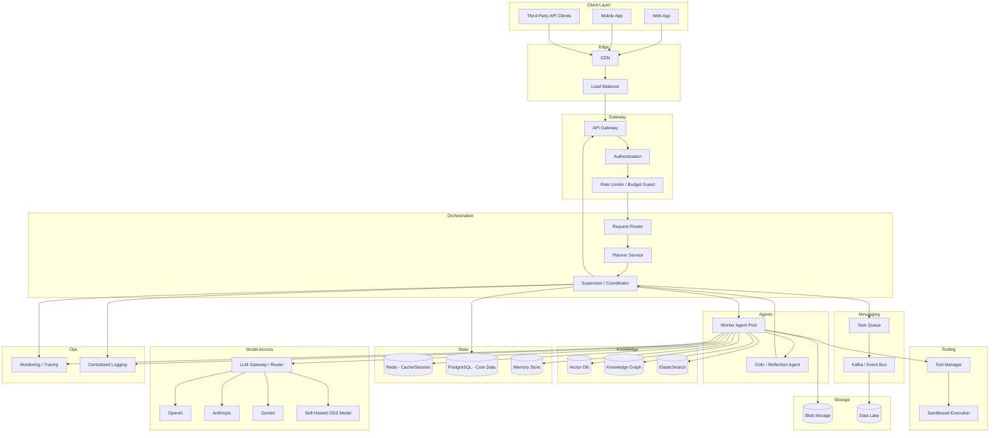

### 9.2 Component Responsibilities

| Layer | Component | Responsibility |
|---|---|---|
| Edge | CDN + Load Balancer | Static asset delivery, TLS termination, traffic distribution |
| Gateway | API Gateway | Routing, request validation, protocol translation |
| Gateway | Auth | Token validation, RBAC/ABAC enforcement |
| Gateway | Rate Limiter | Per-user/org quota, token budget enforcement |
| Orchestration | Router | Dispatches to the correct agent/workflow based on intent |
| Orchestration | Planner | Decomposes goals into executable plans |
| Orchestration | Supervisor | Coordinates multi-agent execution, aggregates results |
| Agents | Worker Pool | Executes individual sub-tasks |
| Agents | Critic | Validates/reflects on outputs before finalizing |
| Tooling | Tool Manager | Tool registration, schema validation, auth scoping |
| Tooling | Sandbox | Isolated execution of code/tool calls (security boundary) |
| Knowledge | Vector DB / KG / Search | Retrieval backends for RAG |
| State | Redis / Postgres / Memory Store | Session, transactional, and long-term memory state |
| Model Access | LLM Gateway | Unified interface across providers, handles failover/routing |
| Messaging | Kafka / Queue | Async task distribution, event streaming |
| Storage | Blob / Data Lake | Large file storage, analytics/training data |
| Ops | Monitoring / Logging | Observability across the full pipeline |

### 9.3 Why an LLM Gateway?

> 💡 **Tip:** Never call LLM providers directly from application code. Always route through a gateway.

- **Provider abstraction:** Swap OpenAI ↔ Anthropic ↔ Gemini without touching business logic.
- **Failover:** If Anthropic has an outage, automatically retry on OpenAI.
- **Cost control:** Central place to enforce token budgets, apply semantic caching.
- **Observability:** Single choke point to log every model call for tracing/audit.

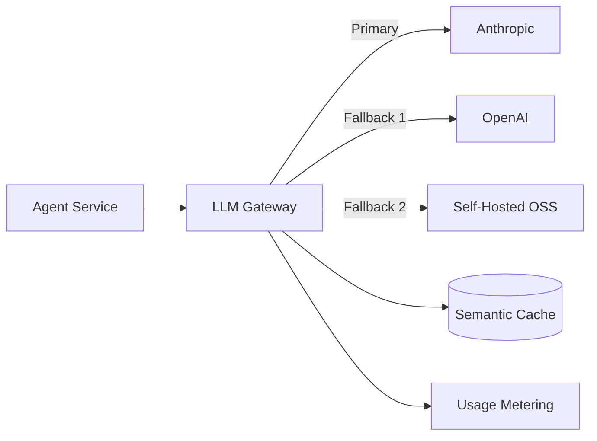

### Interview Tips

- Draw the architecture top-down: Client → Edge → Gateway → Orchestration → Agents → Tools/Knowledge → Models → Storage/Ops.
- Explicitly call out the **LLM Gateway** — many candidates forget this and call providers directly in their diagram, which is a red flag.

### Common Mistakes

- ❌ Missing async task queue for long-running workflows.
- ❌ No mention of observability/monitoring layer.
- ❌ Single point of failure on one LLM provider.

### Tradeoffs

| Choice | Pros | Cons |
|---|---|---|
| Centralized Supervisor | Simple to reason about, single source of truth | Potential bottleneck/SPOF |
| Decentralized peer agents | No single bottleneck | Harder to debug, coordination complexity |

### Best Practices

- ✅ Make every component in the orchestration/agent layer **stateless**; push all state to Redis/Postgres/Memory Store.
- ✅ Put a **circuit breaker** between the Agent layer and the LLM Gateway.
- ✅ Design the Tool Manager with a **sandboxed execution environment** for anything running code.

---

## Section 10: Agent Orchestration

### 10.1 Orchestration Patterns Overview

| Pattern | Description | Best For |
|---|---|---|
| **Single Agent** | One agent handles the entire task with tool access. | Simple, narrow-scope tasks |
| **Multi-Agent** | Multiple specialized agents collaborate. | Complex tasks needing distinct expertise |
| **Supervisor Pattern** | A central supervisor delegates to worker agents and aggregates results. | Most enterprise multi-agent systems |
| **Planner Pattern** | A dedicated planner generates the full plan upfront; executors follow it. | Predictable, auditable workflows |
| **Reflection Pattern** | Agent critiques and revises its own output iteratively. | Quality-critical outputs (code, legal text) |
| **Tree of Thoughts (ToT)** | Explores multiple reasoning branches, prunes weak ones. | Complex reasoning/search problems |
| **Graph of Thoughts (GoT)** | Generalizes ToT into a graph, allowing merging of reasoning paths. | Highly complex, non-linear reasoning |
| **ReAct** | Interleaves Reasoning and Acting (thought → action → observation loop). | Tool-heavy, exploratory tasks |
| **Plan-and-Execute** | Separate planning phase, then execution phase (less re-planning than ReAct). | Long, structured workflows |
| **Human Approval** | Explicit pause points for human sign-off. | High-risk/regulated actions |
| **Dynamic Workflow** | Workflow structure changes at runtime based on intermediate results. | Unpredictable, exploratory tasks |

### 10.2 ReAct Pattern

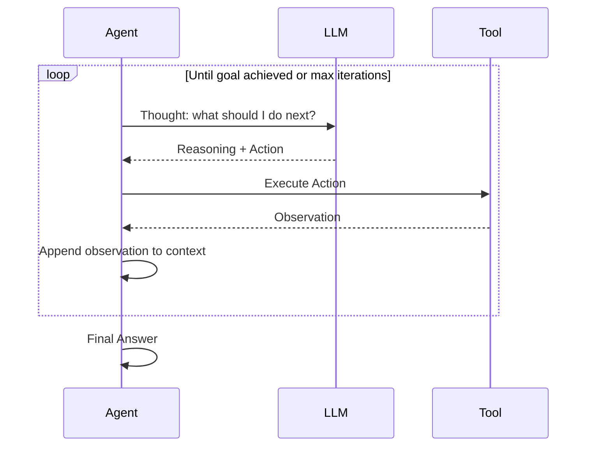

### 10.3 Plan-and-Execute Pattern

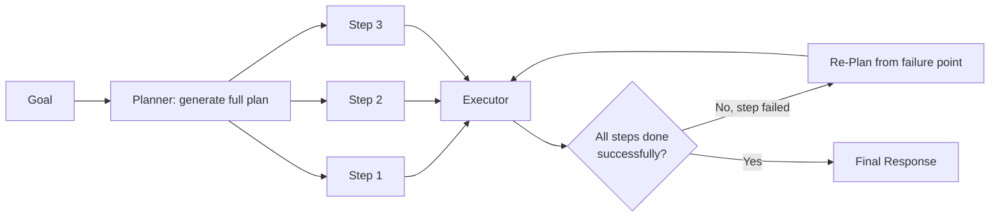

### 10.4 Supervisor Pattern (Multi-Agent)

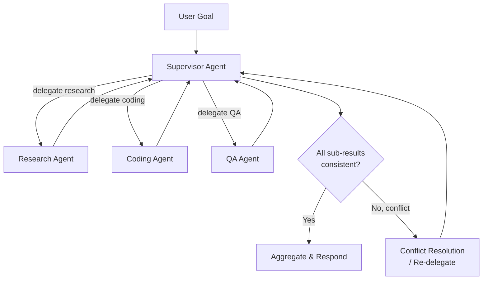

### 10.5 Human Approval / Checkpointing State Diagram

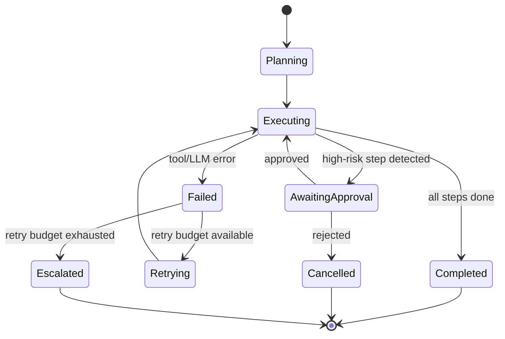

### 10.6 Parallel vs. Sequential Execution

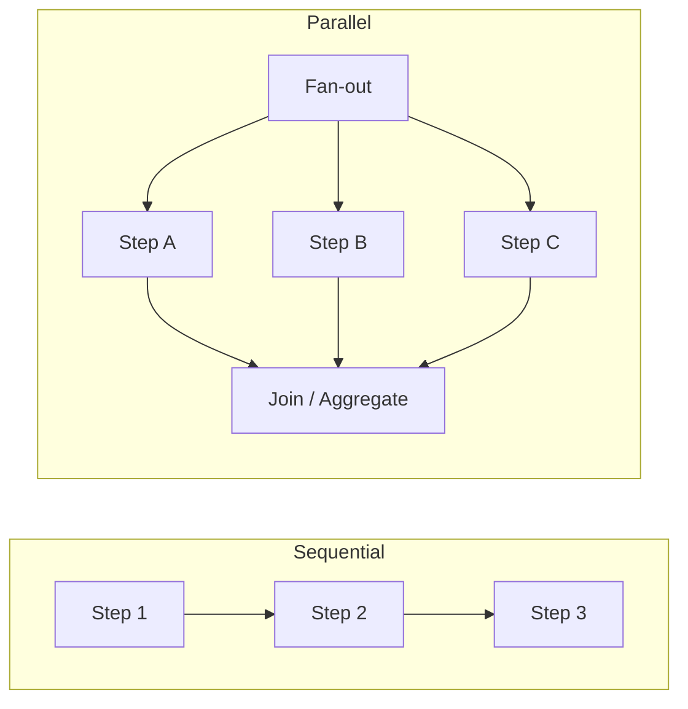

- **Sequential:** Required when steps have data dependencies (e.g., "search flights" must complete before "book flight").
- **Parallel:** Used when steps are independent (e.g., "check weather" and "check flight prices" can run concurrently) — cuts wall-clock latency significantly.

### 10.7 Checkpointing & Recovery

- Persist plan + step state after **every** step completion, not just at the end.
- On crash/restart, resume from the last completed checkpoint rather than restarting the whole plan (critical for long-running, expensive workflows).

### Interview Tips

- When asked "design a multi-agent system," always start with the **Supervisor pattern** — it's the most interview-friendly and maps cleanly to a diagram.
- Be ready to explain **when NOT to use multi-agent** — added latency/cost/coordination overhead isn't justified for simple tasks.
- Know the difference between **ReAct** (interleaved reasoning+acting, good for exploration) and **Plan-and-Execute** (plan upfront, good for predictability/auditability).

### Common Mistakes

- ❌ Using multi-agent systems for tasks a single well-prompted agent could handle — adds cost/latency without benefit.
- ❌ No re-planning strategy when a step fails mid-execution.
- ❌ Sequential execution of independent steps — wastes latency.

### Tradeoffs

| Pattern | Pros | Cons |
|---|---|---|
| ReAct | Flexible, handles novel situations well | Can loop indefinitely without bounds, harder to audit |
| Plan-and-Execute | Predictable, auditable, cheaper (fewer LLM calls) | Less adaptive to surprises mid-execution |
| Tree/Graph of Thoughts | Higher quality on hard reasoning problems | Very expensive (many parallel LLM calls) |
| Multi-Agent (Supervisor) | Specialization, parallelism | Coordination overhead, higher cost |

### Best Practices

- ✅ Always cap iteration/reflection loops with a **max_steps** guard to prevent runaway costs.
- ✅ Checkpoint state after every step for durability and cheap recovery.
- ✅ Default to **Plan-and-Execute** for auditable enterprise workflows; reserve **ReAct/ToT** for exploratory or research-heavy tasks.
- ✅ Run independent steps **in parallel** whenever there's no data dependency.

---

## Section 11: RAG (Retrieval-Augmented Generation)

### 11.1 Full RAG Pipeline

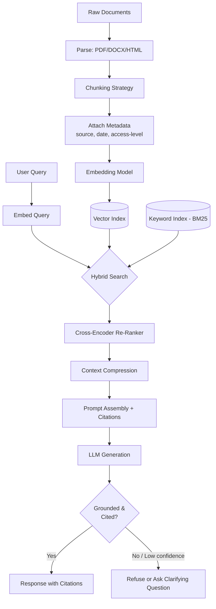

### 11.2 Chunking Strategies

| Strategy | Description | Best For |
|---|---|---|
| **Fixed-size** | Split every N tokens with overlap. | Simple, uniform documents |
| **Recursive** | Split by structure (paragraph → sentence → token) recursively until chunks fit size limit. | General-purpose, most common default |
| **Semantic** | Split at points of topic change, detected via embedding similarity drops. | Long-form, topic-shifting documents |
| **Sliding Window** | Overlapping windows (e.g., 500 tokens, 100 overlap). | Preserving cross-boundary context |
| **Document-structure-aware** | Split by headings/sections (e.g., Markdown headers, DOCX styles). | Structured docs (manuals, contracts) |

> ⚠️ **Warning:** Too-small chunks lose context; too-large chunks dilute relevance and waste tokens. **400–800 tokens with ~10–15% overlap** is a strong default starting point.

### 11.3 Hybrid Search

- **BM25 (Sparse/Keyword):** Excellent for exact terms, IDs, acronyms, rare words the embedding model may not represent well.
- **Dense Retrieval (Vector):** Excellent for semantic/paraphrased matches.
- **Hybrid:** Combine both (e.g., Reciprocal Rank Fusion) — consistently outperforms either alone in production benchmarks.

```python
def reciprocal_rank_fusion(bm25_results, vector_results, k=60):
    scores = {}
    for rank, doc_id in enumerate(bm25_results):
        scores[doc_id] = scores.get(doc_id, 0) + 1 / (k + rank + 1)
    for rank, doc_id in enumerate(vector_results):
        scores[doc_id] = scores.get(doc_id, 0) + 1 / (k + rank + 1)
    return sorted(scores.items(), key=lambda x: x[1], reverse=True)
```

### 11.4 Re-Ranking

- After retrieving top-K (e.g., 50) candidates via hybrid search, use a **cross-encoder** to re-score query-document pairs jointly (much more accurate than bi-encoder similarity alone).
- Keep only the **top-N (e.g., 5)** after re-ranking to control prompt size.

### 11.5 Context Compression

- Summarize or extract only the relevant sentences from each retrieved chunk before inserting into the prompt.
- Reduces token cost and helps the LLM focus on relevant information, reducing hallucination.

### 11.6 Grounding & Citation

```json
{
  "answer": "Refunds are processed within 5-7 business days.",
  "citations": [
    {"source": "refund_policy.pdf", "chunk_id": "chunk_11", "page": 3}
  ]
}
```

> 💡 **Tip:** Always instruct the model to **only answer from retrieved context** and to explicitly say "I don't know" when the context doesn't contain the answer — this is the single biggest lever against hallucination in RAG systems.

### 11.7 Hallucination Mitigation Checklist

- ✅ Retrieval quality evaluated independently (recall@k) from generation quality.
- ✅ Force citations for every factual claim.
- ✅ Add a **self-verification** step: "Does the answer follow strictly from the provided context? If not, flag it."
- ✅ Set retrieval confidence thresholds — below threshold, respond with "insufficient information" rather than guessing.

### 11.8 Knowledge Refresh

| Strategy | Description |
|---|---|
| **Batch re-indexing** | Nightly/weekly full re-embed of updated documents |
| **Incremental indexing** | Event-driven — re-embed only changed documents via CDC |
| **TTL-based invalidation** | Expire stale chunks after N days for fast-changing data (pricing, inventory) |

### 11.9 RAG Evaluation Metrics

| Metric | Measures |
|---|---|
| **Recall@K** | Did the correct chunk appear in the top-K retrieved? |
| **Precision@K** | What fraction of retrieved chunks were actually relevant? |
| **Faithfulness** | Does the generated answer only use information from retrieved context? |
| **Answer Relevance** | Does the answer actually address the query? |
| **Latency (p95)** | End-to-end retrieval + generation time |

### 11.10 RAG vs. Fine-Tuning (Preview — full comparison in Section 20)

| | RAG | Fine-Tuning |
|---|---|---|
| Update freshness | Instant (re-index) | Requires retraining |
| Cost to update | Low | High |
| Best for | Factual grounding, private/dynamic data | Style, format, domain-specific behavior |

### Interview Tips

- Always mention **hybrid search + re-ranking** — pure vector search is a common "beginner" answer that experienced interviewers push back on.
- Discuss **evaluation** (Recall@K, faithfulness) — most candidates only discuss the retrieval pipeline and forget how to measure if it's actually working.

### Common Mistakes

- ❌ Using only dense vector search, ignoring keyword/BM25 for exact-match queries (IDs, codes, names).
- ❌ Chunking without any metadata (source, date, permissions) — makes citation and access control impossible.
- ❌ No re-ranking step — raw vector similarity top-K is often noisy.
- ❌ Not handling the "no relevant context found" case explicitly.

### Tradeoffs

| Choice | Pros | Cons |
|---|---|---|
| Large chunks | More context per chunk | Less precise retrieval, higher token cost |
| Small chunks | Precise retrieval | May lose surrounding context |
| Re-ranking with cross-encoder | Much better precision | Added latency (extra model call) |
| Aggressive context compression | Lower cost, focused context | Risk of dropping relevant nuance |

### Best Practices

- ✅ Always attach metadata (source, access-level, timestamp) to chunks for filtering and citation.
- ✅ Use hybrid search + re-ranking as the default production pattern, not pure vector similarity.
- ✅ Build a RAG-specific eval set (query → expected chunk) and track Recall@K over time as data changes.
- ✅ Enforce access control at the **retrieval** layer (filter by user permissions before the LLM ever sees a chunk).

---

## Section 12: Memory

### 12.1 Memory Taxonomy

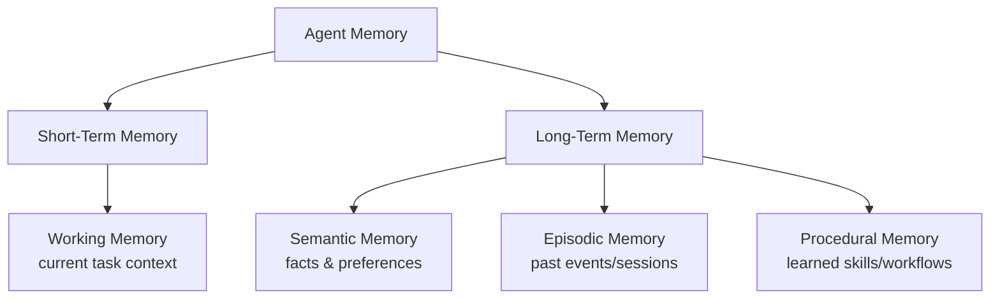

| Memory Type | Description | Analogy | Storage |
|---|---|---|---|
| **Short-Term / Working Memory** | Active context for the current task — recent turns, intermediate tool outputs. | What you're actively holding in your head right now. | In-context window / Redis |
| **Long-Term Memory** | Persists across sessions. | Your long-term knowledge and habits. | Vector DB + Postgres |
| **Semantic Memory** | Facts and preferences ("user prefers metric units"). | Knowledge you "just know." | Vector DB with structured metadata |
| **Episodic Memory** | Specific past events/interactions ("last week you booked a flight to Paris"). | Personal memories of specific events. | Time-indexed vector store |
| **Procedural Memory** | Learned patterns of *how* to do something (successful past workflows/tool sequences). | Muscle memory / learned skills. | Structured workflow templates, few-shot examples |

### 12.2 Memory Lifecycle

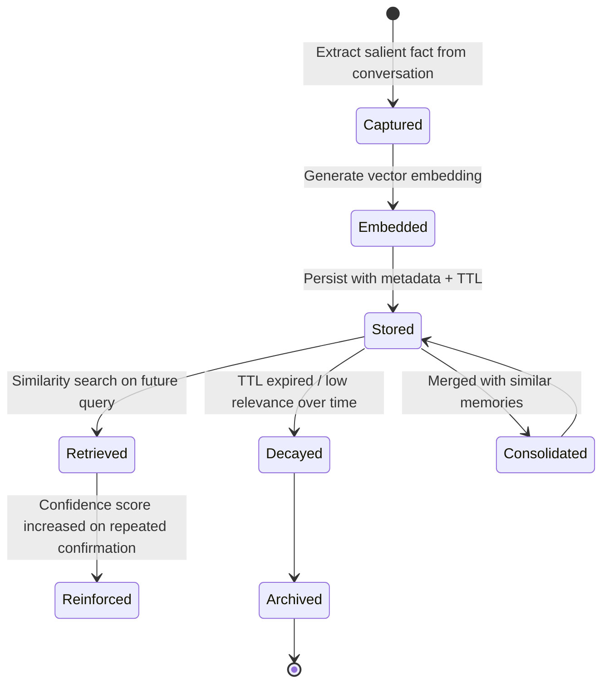

### 12.3 Memory Compression & Consolidation

- Periodically **summarize** clusters of related memories into a single condensed fact (avoids unbounded growth).
- Example: 10 individual "user asked about refund" events → consolidated into "user frequently inquires about refund status."

### 12.4 Memory Expiration

| Approach | Use Case |
|---|---|
| **TTL (Time-to-live)** | Time-sensitive facts (e.g., "currently traveling") |
| **Confidence decay** | Memory relevance score decreases over time unless reinforced |
| **Explicit user deletion** | GDPR "right to be forgotten" compliance |

### 12.5 Memory Ranking & Retrieval

At retrieval time, rank candidate memories by a combination of:

```text
score = (semantic_similarity × 0.5) + (recency × 0.3) + (confidence × 0.2)
```

- **Semantic similarity:** How relevant is this memory to the current query?
- **Recency:** Recent memories are often more relevant (recency bias, tunable).
- **Confidence:** How many times has this fact been reinforced/confirmed?

### 12.6 Memory Search Example (Conceptual)

```python
def retrieve_memories(user_id, query_embedding, top_k=5):
    candidates = vector_db.search(
        namespace=f"user:{user_id}",
        vector=query_embedding,
        top_k=20,
        filter={"expires_at": {"$gt": now()}}
    )
    ranked = sorted(
        candidates,
        key=lambda m: (0.5 * m.similarity + 0.3 * recency_score(m) + 0.2 * m.confidence),
        reverse=True
    )
    return ranked[:top_k]
```

### Interview Tips

- Distinguish **short-term (in-context)** from **long-term (persisted, retrieved)** memory clearly — this is a very common interview probe.
- Mention **memory decay/consolidation** — naive "store everything forever" designs get pushback for unbounded growth and staleness.

### Common Mistakes

- ❌ Treating the LLM's context window itself as "memory" — real memory must persist beyond a single session.
- ❌ No expiration/consolidation strategy — leads to bloated, contradictory memory stores over time.
- ❌ Storing every single message as a "memory" instead of extracting salient facts.

### Tradeoffs

| Choice | Pros | Cons |
|---|---|---|
| Store everything | No information loss | Expensive, noisy retrieval, privacy risk |
| Aggressive extraction (only key facts) | Cheap, focused | Risk of losing nuance/context |
| Long TTL | Rich long-term personalization | Staleness risk, compliance risk |
| Short TTL | Fresh, low compliance risk | Loses long-term personalization value |

### Best Practices

- ✅ Extract and store only **salient, reusable facts** — not raw conversation transcripts — as long-term memory.
- ✅ Always support **explicit deletion** for compliance (GDPR/CCPA "right to be forgotten").
- ✅ Periodically consolidate and deduplicate memories to control growth and contradictions.

---

## Section 13: Prompt Engineering

### 13.1 Prompt Templates

Use parameterized, versioned templates rather than inline hardcoded strings.

```yaml
# prompts/customer_support/v3.yaml
name: customer_support_response
version: 3
model: claude-sonnet
template: |
  You are a customer support agent for {company_name}.
  Use ONLY the provided context to answer. If the answer isn't in the context, say so.

  Context:
  {retrieved_context}

  Conversation history:
  {history}

  User: {user_message}
variables: [company_name, retrieved_context, history, user_message]
```

### 13.2 Structured Output / JSON Mode

Always request structured output for anything downstream code will parse.

```json
{
  "type": "object",
  "properties": {
    "intent": {"type": "string", "enum": ["refund", "complaint", "question"]},
    "confidence": {"type": "number"},
    "response": {"type": "string"}
  },
  "required": ["intent", "confidence", "response"]
}
```

> ⚠️ **Warning:** Always validate structured LLM output against the schema before using it downstream — models occasionally emit malformed JSON, especially under high temperature.

### 13.3 Few-Shot Prompting

Provide 2–5 high-quality examples demonstrating the desired input→output mapping, especially for classification/extraction tasks where zero-shot accuracy is inconsistent.

### 13.4 Chain of Thought (CoT)

Ask the model to reason step-by-step before answering for complex tasks — improves accuracy on multi-step reasoning, at the cost of extra tokens/latency. For production, consider whether to **expose** or **hide** the reasoning trace from the end user.

### 13.5 Self-Reflection Prompting

```text
Step 1: Generate an initial answer.
Step 2: Critique the answer — identify any factual errors, missing steps, or unclear parts.
Step 3: Produce a revised, final answer based on the critique.
```

### 13.6 Prompt Versioning

- Every prompt template is versioned (Git-style), with a changelog.
- Deploy new prompt versions behind a feature flag; A/B test against the previous version before full rollout.

### 13.7 Prompt Testing

| Test Type | Purpose |
|---|---|
| **Golden dataset regression tests** | Ensure new prompt version doesn't regress on known cases |
| **Adversarial tests** | Check resilience against prompt injection / jailbreak attempts |
| **Format tests** | Ensure structured output always validates against schema |
| **Latency/token tests** | Ensure prompt changes don't blow up cost/latency |

### 13.8 Prompt Registry

A central, versioned store of all production prompt templates — enables auditability ("which prompt version generated this response?") and safe rollback.

```sql
CREATE TABLE prompt_registry (
    id UUID PRIMARY KEY,
    name TEXT NOT NULL,
    version INT NOT NULL,
    template TEXT NOT NULL,
    model TEXT NOT NULL,
    created_by TEXT,
    created_at TIMESTAMP DEFAULT now(),
    is_active BOOLEAN DEFAULT false,
    UNIQUE (name, version)
);
```

### Interview Tips

- Mention **prompt versioning and testing** even if not directly asked — it signals you think about prompts as production artifacts, not throwaway strings.
- Know when to use **structured output/JSON mode** vs. free text — anything consumed programmatically should be structured.

### Common Mistakes

- ❌ Hardcoding prompts directly in application code with no versioning.
- ❌ Not validating structured output before using it downstream.
- ❌ Overusing chain-of-thought for simple tasks, wasting tokens/latency unnecessarily.

### Tradeoffs

| Choice | Pros | Cons |
|---|---|---|
| Chain-of-thought | Better accuracy on complex reasoning | More tokens, higher latency/cost |
| Few-shot examples | Improves consistency | Increases prompt size/cost |
| Strict JSON mode | Reliable downstream parsing | Slightly constrains model expressiveness |

### Best Practices

- ✅ Version every prompt template like code, with a registry and rollback capability.
- ✅ Use structured output for anything parsed programmatically; free text only for final user-facing display.
- ✅ Maintain a golden regression test set and run it in CI before deploying prompt changes.

---

## Section 14: Security

### 14.1 Security Layers Overview

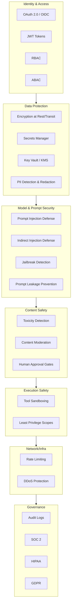

### 14.2 Identity & Access

| Mechanism | Purpose |
|---|---|
| **OAuth 2.0 / OIDC** | Delegated auth, SSO with enterprise identity providers |
| **JWT** | Stateless, verifiable session tokens |
| **RBAC** | Role-based access ("admin", "agent-operator", "viewer") |
| **ABAC** | Attribute-based, fine-grained ("only users in EU region can access EU customer data") |

### 14.3 Data Protection

- **Encryption at rest** (AES-256) and **in transit** (TLS 1.2+) for all data stores.
- **Secrets Manager / Key Vault** — never hardcode API keys or tool credentials; inject at runtime with short-lived scoped credentials.
- **PII Detection** — run inputs/outputs through a PII detector before logging or storing; redact before persisting to logs.

### 14.4 Prompt Injection & Jailbreaks

| Threat | Description | Mitigation |
|---|---|---|
| **Direct Prompt Injection** | User directly tries to override system instructions ("ignore previous instructions..."). | Instruction hierarchy enforcement, input sanitization, system-prompt hardening |
| **Indirect Prompt Injection** | Malicious instructions embedded in retrieved documents/tool outputs (e.g., a webpage the agent reads contains hidden instructions). | Treat all retrieved/tool content as **untrusted data**, never as instructions; use content-source tagging |
| **Jailbreak** | Attempts to bypass safety guardrails via roleplay, encoding tricks, etc. | Layered classifiers, refusal training, output filtering |
| **Prompt Leakage** | Attempts to extract the system prompt or internal instructions. | Instruct model not to reveal system prompt; monitor for leakage patterns in outputs |

> ⚠️ **Warning:** Indirect prompt injection is the **#1 unique security risk in agentic systems** — any tool that fetches external/untrusted content (web pages, emails, documents) is a potential injection vector. Never let retrieved content be treated with the same trust level as system instructions.

### 14.5 Content Moderation

- Run both **input** (user messages) and **output** (agent responses) through a moderation classifier for toxicity, self-harm, and policy violations.
- For high-risk domains (medical, legal, financial), add **human approval gates** before the agent's action is finalized/executed.

### 14.6 Tool Sandboxing & Least Privilege

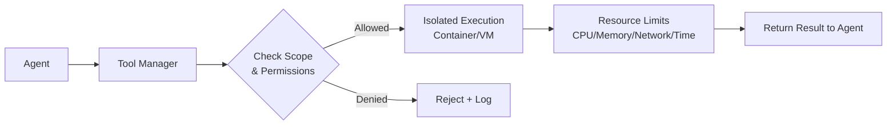

- **Least privilege:** Each tool/agent gets only the scopes it strictly needs (e.g., a "read customer info" agent should not have "issue refund" permissions).
- **Sandboxing:** Code execution tools run in isolated, network-restricted containers with strict resource/time limits.

### 14.7 Rate Limiting & DDoS Protection

- Per-user, per-org, and global rate limits, enforced at the API Gateway.
- Token-budget-aware rate limiting (not just request count) — a single request can consume wildly different amounts of compute in agentic systems.

### 14.8 Audit Logs & Compliance

| Standard | Focus | Agentic-Specific Consideration |
|---|---|---|
| **SOC 2** | Security, availability, confidentiality controls | Audit trail for every tool call and agent decision |
| **HIPAA** | Healthcare data privacy | PII/PHI redaction before logging; strict access controls on medical data tools |
| **GDPR** | EU data privacy, right to be forgotten | Memory deletion API, data residency for EU users |

### Interview Tips

- Always raise **indirect prompt injection** proactively when discussing agent security — it's the differentiator between candidates who understand *traditional* app security vs. *agentic-specific* security.
- Discuss **least privilege for tools** explicitly — this is the agentic analog of the principle of least privilege in classic systems.

### Common Mistakes

- ❌ Treating tool outputs / retrieved documents as trusted instructions.
- ❌ Giving every agent broad, unscoped tool permissions "for flexibility."
- ❌ Logging raw user PII without redaction.
- ❌ No human approval gate for irreversible high-risk actions (payments, deletions, external communications).

### Tradeoffs

| Choice | Pros | Cons |
|---|---|---|
| Strict least-privilege scoping | Much safer | More configuration overhead, potential friction |
| Broad tool access | More flexible/capable agents | Much larger blast radius on compromise/injection |
| Human approval gates | Strong safety net | Slower, added operational cost |

### Best Practices

- ✅ Tag all content by trust level (system instruction vs. user input vs. retrieved/tool content) and never let lower-trust content override higher-trust instructions.
- ✅ Scope every tool credential to the minimum required permission, ideally per-agent, short-lived.
- ✅ Run both input and output through moderation/PII classifiers.
- ✅ Maintain immutable, structured audit logs for every plan, tool call, and decision.

---

## Section 15: Monitoring and Observability

### 15.1 Observability Pipeline

```mermaid
flowchart LR
    AGENT[Agent Runtime] --> OTEL[OpenTelemetry SDK]
    OTEL --> TRACE[Traces]
    OTEL --> METRIC[Metrics]
    OTEL --> LOGS[Logs]
    TRACE --> LANGFUSE[LangFuse / Phoenix\nLLM-specific tracing]
    METRIC --> PROM[Prometheus]
    PROM --> GRAF[Grafana Dashboards]
    LOGS --> ELASTIC[ElasticSearch / CloudWatch / Azure Monitor]
    PROM --> ALERT[Alertmanager]
    ALERT --> ONCALL[On-Call / PagerDuty]
```

### 15.2 Tooling Landscape

| Tool | Purpose |
|---|---|
| **Prometheus** | Metrics collection and alerting (time-series) |
| **Grafana** | Dashboarding/visualization |
| **OpenTelemetry** | Vendor-neutral tracing/metrics/logs instrumentation standard |
| **LangFuse / Phoenix** | LLM & agent-specific tracing — prompts, completions, token usage, latency per step |
| **ElasticSearch / CloudWatch / Azure Monitor** | Centralized log aggregation and search |

### 15.3 What to Track (Agentic-Specific Metrics)

| Category | Metrics |
|---|---|
| **Latency** | p50/p95/p99 per agent step, per tool call, end-to-end task latency |
| **Tokens** | Input/output tokens per request, per agent, per model |
| **Cost** | $ per task, $ per user, $ per day, cache hit rate |
| **Failures** | Tool call failure rate, LLM error rate, plan validation failure rate |
| **Quality** | Task success rate, human override rate, user feedback score |
| **Loops** | Reflection iteration counts, re-planning frequency (proxy for agent "confusion") |

### 15.4 Full Execution Trace Example

```json
{
  "trace_id": "trc_9f8a",
  "task_id": "task_456",
  "spans": [
    {"span": "planner", "duration_ms": 820, "tokens": {"in": 500, "out": 150}},
    {"span": "tool:flight_search", "duration_ms": 1200, "status": "success"},
    {"span": "executor:summarize", "duration_ms": 640, "tokens": {"in": 900, "out": 200}},
    {"span": "critic:review", "duration_ms": 410, "verdict": "approved"}
  ],
  "total_duration_ms": 3070,
  "total_cost_usd": 0.014
}
```

### 15.5 Alerting Examples

```yaml
alerts:
  - name: high_tool_failure_rate
    condition: "tool_failure_rate > 5% over 5m"
    severity: critical
    action: page_oncall

  - name: token_budget_exceeded
    condition: "daily_token_spend > budget_cap"
    severity: warning
    action: notify_finance_team

  - name: p99_latency_regression
    condition: "p99_latency > 8s over 10m"
    severity: warning
    action: notify_eng_channel
```

### Interview Tips

- Mention **LLM-specific tracing tools** (LangFuse/Phoenix) in addition to generic infra tools (Prometheus/Grafana) — shows domain awareness beyond generic backend systems.
- Always tie observability back to **cost and quality**, not just uptime — these are the metrics unique to agentic systems.

### Common Mistakes

- ❌ Only tracking infra-level metrics (CPU/latency) while ignoring token cost and task success rate.
- ❌ No per-step tracing — makes debugging multi-agent failures nearly impossible.
- ❌ Alerting only on hard failures, missing "soft failures" like excessive reflection loops or low-confidence outputs.

### Tradeoffs

| Choice | Pros | Cons |
|---|---|---|
| Full detailed tracing of every step | Excellent debuggability | Storage/cost overhead, potential PII exposure in traces |
| Sampled tracing | Lower overhead | May miss rare failure patterns |

### Best Practices

- ✅ Instrument every agent step (Planner, Executor, Tool call, Critic) as a distinct trace span.
- ✅ Build dashboards around **cost per task** and **task success rate** as top-line KPIs, not just system uptime.
- ✅ Alert on both hard failures (errors) and soft failures (excessive loops, low confidence, budget overruns).

---

## Section 16: Scaling

### 16.1 Scaling Architecture

```mermaid
flowchart TB
    USERS[Users - Global] --> DNS[GeoDNS / Global LB]
    DNS --> R1[Region: US]
    DNS --> R2[Region: EU]
    DNS --> R3[Region: APAC]

    subgraph R1
        CDN1[CDN] --> LB1[Load Balancer] --> SVC1[Stateless Agent Services]
        SVC1 --> Q1[Kafka / Redis Streams]
        Q1 --> W1[Worker Pool - Autoscaled]
    end

    R1 -.->|Async Replication| GLOBAL[(Global Data Layer)]
    R2 -.-> GLOBAL
    R3 -.-> GLOBAL
```

### 16.2 Horizontal vs. Vertical Scaling

| Dimension | Horizontal Scaling | Vertical Scaling |
|---|---|---|
| Approach | Add more instances/nodes | Add more CPU/RAM/GPU to existing nodes |
| Ceiling | Very high (near-unlimited) | Hardware-limited |
| Agentic fit | ✅ Default for stateless agent/API services | Sometimes needed for single large-context inference (big GPU) |
| Complexity | Requires statelessness, load balancing | Simpler operationally, but risk of single point of failure |

### 16.3 Queue-Based Scaling

- Producers (API layer) push tasks to **Kafka / Redis Streams / SQS**.
- Consumer worker pools autoscale based on **queue depth**, not just CPU — this is the correct primary scaling signal for agentic workloads since bottlenecks are often I/O-bound (waiting on LLM/tool responses), not CPU-bound.

### 16.4 Inference Scaling & GPU Scheduling

| Technique | Description |
|---|---|
| **Model routing** | Route simple requests to smaller/cheaper models, complex ones to larger models |
| **Batching** | Group concurrent inference requests to maximize GPU utilization |
| **GPU scheduling** | Bin-pack multiple model instances per GPU using fractional GPU allocation (e.g., MIG) |
| **Prompt caching** | Cache and reuse KV-cache for repeated prompt prefixes (system prompts, few-shot examples) |
| **Semantic caching** | Cache full responses for semantically similar queries, skip inference entirely on cache hit |

### 16.5 CDN & Geo-Replication

- Static assets (UI, docs) via CDN.
- **Geo-replicate** vector indexes and knowledge bases to reduce cross-region retrieval latency; keep a single source-of-truth region for writes with async replication to others.

### 16.6 Multi-Region Considerations

```mermaid
flowchart LR
    WRITE[Write] --> PRIMARY[(Primary Region DB)]
    PRIMARY -->|Async Replication| REPLICA_EU[(EU Read Replica)]
    PRIMARY -->|Async Replication| REPLICA_APAC[(APAC Read Replica)]
    READ_EU[EU Reads] --> REPLICA_EU
    READ_APAC[APAC Reads] --> REPLICA_APAC
```

- Data residency laws (GDPR) may require **EU customer data to stay in EU region** — plan sharding by region, not just for latency but for compliance.

### Interview Tips

- When asked "how would you scale this to 10x traffic," always start with **what's actually the bottleneck** — usually LLM inference latency/throughput, not the API layer itself.
- Mention **queue-depth-based autoscaling** as the correct signal for agentic worker pools — CPU-based autoscaling is often the wrong metric here.

### Common Mistakes

- ❌ Scaling API/web layer aggressively while ignoring the actual bottleneck (LLM inference capacity).
- ❌ Using CPU utilization as the autoscaling signal for I/O-bound agent workers.
- ❌ Ignoring data residency/compliance constraints when designing multi-region architecture.

### Tradeoffs

| Choice | Pros | Cons |
|---|---|---|
| Multi-region active-active | Best latency + resilience globally | Highest complexity, consistency challenges |
| Single-region + CDN | Simple | Higher latency for distant users, single-region risk |
| Aggressive prompt/semantic caching | Big cost + latency wins | Risk of serving stale/incorrect cached responses |

### Best Practices

- ✅ Autoscale agent worker pools on **queue depth**, not CPU.
- ✅ Use prompt caching (KV-cache reuse) for repeated system prompts/few-shot examples — often a top cost/latency win.
- ✅ Plan data residency and sharding strategy around compliance requirements early, not as an afterthought.

---

## Section 17: Performance Optimization

| Technique | Description | Example |
|---|---|---|
| **Prompt Compression** | Remove redundant/low-value tokens from prompts before sending to the LLM. | Summarize long conversation history instead of sending full transcript. |
| **Caching** | Cache exact or semantic-match responses. | Cache "What's your refund policy?" answer for 24 hours. |
| **Parallel Agents** | Run independent sub-tasks concurrently. | Fetch weather + flight prices simultaneously. |
| **Streaming** | Stream tokens to the client as generated. | Reduces perceived latency even if total generation time is unchanged. |
| **Smaller Models** | Use a smaller/cheaper model for simple sub-tasks (routing, classification). | Use a small model for intent classification, large model for final synthesis. |
| **Dynamic Routing** | Route requests to the cheapest model that can handle them adequately. | Simple FAQ → small model; complex reasoning → frontier model. |
| **Context Optimization** | Only include relevant context, not the entire history/knowledge base. | Retrieve top-5 relevant chunks instead of dumping the whole document. |
| **Lazy Retrieval** | Only trigger RAG retrieval when the query actually needs external knowledge. | Skip retrieval for purely conversational turns ("thanks!"). |
| **Speculative Decoding** | Use a small draft model to propose tokens, verified by the large model. | Speeds up generation without quality loss. |
| **Batch Embeddings** | Batch multiple documents into a single embedding API call. | Embed 100 chunks in one batched request instead of 100 separate calls. |
| **Token Reduction** | Shorten system prompts, remove unnecessary formatting instructions. | Trim boilerplate instructions that don't affect output quality. |
| **Connection Pooling** | Reuse HTTP/DB connections instead of creating new ones per request. | Pool connections to Postgres/Redis/LLM Gateway. |
| **Async Processing** | Non-blocking I/O for tool calls and LLM requests. | Use `async`/`await` to run independent tool calls concurrently. |

### 17.1 Example: Parallel Tool Calls (Python)

```python
import asyncio

async def gather_context(query):
    weather, flights, hotels = await asyncio.gather(
        fetch_weather(query.destination),
        search_flights(query.origin, query.destination, query.dates),
        search_hotels(query.destination, query.dates),
    )
    return {"weather": weather, "flights": flights, "hotels": hotels}
```

### 17.2 Example: Semantic Cache Check Before LLM Call

```python
def get_response(query: str):
    query_embedding = embed(query)
    cached = semantic_cache.search(query_embedding, threshold=0.95)
    if cached:
        return cached.response  # cache hit — skip LLM call entirely
    response = llm_gateway.generate(query)
    semantic_cache.store(query_embedding, response)
    return response
```

### 17.3 Model Routing Decision Table

| Task Complexity | Model Tier | Example |
|---|---|---|
| Trivial (classification, routing) | Small/fast model | Intent detection, yes/no gating |
| Moderate (summarization, extraction) | Mid-tier model | Document summarization |
| Complex (multi-step reasoning, synthesis) | Frontier model | Final report generation, complex planning |

### Interview Tips

- Always propose **at least 3 layered optimizations** (caching + routing + parallelization) rather than a single fix — shows systems thinking.
- Be ready to explain **why streaming helps perceived latency** even when total generation time is unchanged.

### Common Mistakes

- ❌ Always using the largest/most expensive model for every sub-task "to be safe."
- ❌ Sequential tool calls when there's no data dependency between them.
- ❌ No caching layer at all — recomputing identical/similar responses repeatedly.

### Tradeoffs

| Optimization | Gains | Risk |
|---|---|---|
| Smaller models for sub-tasks | Cost + latency | Potential accuracy drop on edge cases |
| Aggressive caching | Big cost/latency wins | Stale or incorrect cached answers if not invalidated properly |
| Prompt compression | Lower token cost | Risk of losing important nuance/context |

### Best Practices

- ✅ Default to **model routing** — reserve the most expensive model for the step that actually needs its capability.
- ✅ Parallelize all independent tool/agent calls.
- ✅ Cache aggressively but with clear invalidation rules (TTL, event-based invalidation).

---

## Section 18: Cost Optimization

> Token cost is the single most agentic-specific cost driver in these systems — this section deserves the same rigor as capacity planning.

### 18.1 Cost Optimization Flow

```mermaid
flowchart TB
    START[Incoming Request] --> CACHE{Semantic Cache Hit?}
    CACHE -->|Yes| RETURN[Return Cached Response\n~$0 cost]
    CACHE -->|No| ROUTE{Complexity Classification}
    ROUTE -->|Simple| SMALL[Small/Cheap Model]
    ROUTE -->|Complex| LARGE[Frontier Model]
    SMALL --> COMPRESS[Context Compression\n+ Selective Retrieval]
    LARGE --> COMPRESS
    COMPRESS --> BATCH{Can be Batched?}
    BATCH -->|Yes, async ok| BATCHRUN[Batch Inference Job]
    BATCH -->|No, real-time| SYNC[Real-Time Inference]
    BATCHRUN --> STORE[Store Result + Update Cache]
    SYNC --> STORE
    STORE --> MONITOR[Cost Dashboard + Alerts]
```

### 18.2 Cost Levers

| Lever | Description | Typical Savings |
|---|---|---|
| **Prompt Optimization** | Trim unnecessary system prompt boilerplate | 5–15% |
| **Token Reduction** | Summarize history, compress retrieved context | 20–40% |
| **Caching (exact)** | Cache identical repeated queries | Up to 100% on cache hits |
| **Semantic Caching** | Cache semantically similar queries | 20–50% on FAQ-heavy workloads |
| **Embedding Reuse** | Don't re-embed unchanged documents | Near 100% on unchanged data |
| **Model Routing** | Use cheaper models for simple tasks | 30–70% |
| **Smaller Models** | Fine-tuned small models for narrow tasks | 50–90% vs. frontier model |
| **Async / Batch Inference** | Batch API pricing (many providers offer ~50% discount for async batch jobs) | ~50% |
| **Storage Tiering** | Move cold data to cheaper storage tiers | 60–80% on storage cost |
| **Compression** | Compress stored documents/logs | 40–70% storage savings |
| **Spot/Preemptible GPUs** | Use spot instances for non-latency-critical batch workloads | 60–90% on compute |
| **Adaptive Retrieval (Top-K tuning)** | Retrieve fewer, higher-quality chunks | 10–30% token savings |
| **Selective Context** | Only include context relevant to current step, not entire history | 20–40% |

### 18.3 Cost Comparison Table (Illustrative — verify current pricing)

| Approach | Relative Cost per 1K Requests | Notes |
|---|---|---|
| Frontier model, no caching, full context | 100% (baseline) | Naive approach |
| + Semantic caching (40% hit rate) | ~65% | Simple to implement, high ROI |
| + Model routing (60% routed to small model) | ~40% | Requires complexity classifier |
| + Batch/async for non-real-time tasks | ~25% | Only where latency tolerance allows |
| + Prompt/context compression | ~18% | Combined with above |

### 18.4 Cost Dashboard & Alerts

```yaml
cost_dashboard:
  metrics:
    - cost_per_task
    - cost_per_user_per_day
    - cache_hit_rate
    - model_distribution  # % requests per model tier
  alerts:
    - name: daily_budget_80_percent
      condition: "daily_spend >= 0.8 * daily_budget"
      action: notify_slack
    - name: daily_budget_exceeded
      condition: "daily_spend >= daily_budget"
      action: [notify_slack, throttle_non_critical_requests]
```

### 18.5 Budget Enforcement Pattern

```python
def enforce_budget(user_id, estimated_cost):
    current_spend = billing_service.get_daily_spend(user_id)
    budget = billing_service.get_budget(user_id)
    if current_spend + estimated_cost > budget:
        raise BudgetExceededError(
            "Request would exceed daily budget; route to smaller model or queue for tomorrow."
        )
```

### Interview Tips

- Always propose a **layered cost strategy** (cache → route → compress → batch), not a single trick.
- Quantify savings roughly when possible ("semantic caching alone often cuts 20–40% of spend on FAQ-heavy workloads").

### Common Mistakes

- ❌ Optimizing cost only after a "bill shock" incident instead of designing cost controls in from day one.
- ❌ No budget enforcement — treating cost monitoring as purely observational rather than actionable (e.g., throttling).
- ❌ Caching without invalidation — serving stale cached answers indefinitely.

### Tradeoffs

| Choice | Cost Impact | Risk |
|---|---|---|
| Aggressive model downgrading | Big savings | Quality degradation risk |
| Long cache TTLs | Big savings | Staleness risk |
| Batch/async processing | Big savings | Not viable for real-time interactive use cases |

### Best Practices

- ✅ Treat token cost as a first-class NFR with dashboards, budgets, and automated alerts.
- ✅ Implement semantic caching and model routing as default architecture patterns, not optional add-ons.
- ✅ Use batch/async inference pricing wherever the task doesn't require real-time response.

---

## Section 19: Failure Handling

### 19.1 Failure Handling Patterns

| Pattern | Description | Example |
|---|---|---|
| **Timeout** | Bound how long any step can run. | Tool call times out after 10s. |
| **Retry (with backoff)** | Automatically retry transient failures. | Retry LLM call 3x with exponential backoff on 5xx errors. |
| **Circuit Breaker** | Stop calling a failing dependency temporarily after repeated failures. | After 5 consecutive tool failures, open circuit for 60s. |
| **Bulkhead** | Isolate failures to prevent cascading across the system. | Separate worker pools per agent type so one agent's overload doesn't starve others. |
| **Fallback Models** | Switch to a backup model/provider on failure. | Anthropic down → fallback to OpenAI automatically. |
| **Dead Letter Queue (DLQ)** | Route permanently failing tasks to a separate queue for investigation. | Task fails after max retries → DLQ → alert on-call. |
| **Compensation (Saga)** | Undo prior side-effecting steps if a later step fails. | If "charge customer" succeeds but "send confirmation" fails permanently, trigger a refund compensation action. |
| **Checkpointing** | Persist progress so execution can resume without restarting from scratch. | Long workflow saves state after every completed step. |
| **Workflow Recovery** | Resume in-flight workflows after a crash/restart. | On service restart, reload paused workflows from DB and resume. |
| **Chaos Engineering** | Proactively inject failures to test resilience. | Randomly kill worker pods in staging to verify auto-recovery. |

### 19.2 Circuit Breaker State Diagram

```mermaid
stateDiagram-v2
    [*] --> Closed
    Closed --> Open: failure_count > threshold
    Open --> HalfOpen: after cooldown period
    HalfOpen --> Closed: test request succeeds
    HalfOpen --> Open: test request fails
    Closed --> Closed: request succeeds
```

### 19.3 Saga Pattern for Multi-Step Side Effects

```mermaid
sequenceDiagram
    participant Agent
    participant Payment
    participant Inventory
    participant Notification

    Agent->>Payment: Charge customer
    Payment-->>Agent: Success
    Agent->>Inventory: Reserve item
    Inventory-->>Agent: Failure (out of stock)
    Agent->>Payment: Compensate: Refund customer
    Payment-->>Agent: Refund confirmed
    Agent->>Notification: Notify user of failure
```

### 19.4 Retry Policy Example

```python
import time
import random

def call_with_retry(fn, max_retries=3, base_delay=0.5):
    for attempt in range(max_retries):
        try:
            return fn()
        except TransientError:
            if attempt == max_retries - 1:
                raise
            delay = base_delay * (2 ** attempt) + random.uniform(0, 0.3)  # exponential backoff + jitter
            time.sleep(delay)
```

### 19.5 Failure Handling Decision Tree

```mermaid
flowchart TD
    F[Step Fails] --> Q1{Is failure transient?\ne.g., timeout, 503}
    Q1 -->|Yes| RETRY[Retry with backoff]
    RETRY --> Q2{Retries exhausted?}
    Q2 -->|No| RETRY
    Q2 -->|Yes| Q3{Fallback available?\ne.g., backup model/provider}
    Q1 -->|No, permanent error| Q3
    Q3 -->|Yes| FALLBACK[Use Fallback]
    Q3 -->|No| Q4{Side effects already\noccurred?}
    Q4 -->|Yes| COMPENSATE[Trigger Compensation / Saga]
    Q4 -->|No| DLQ[Send to Dead Letter Queue\n+ Alert]
```

### Interview Tips

- Always mention **idempotency** alongside retries — retrying non-idempotent side-effecting operations without idempotency keys is a classic interview trap.
- Bring up the **Saga pattern** specifically when discussing multi-step workflows with real-world side effects (payments, inventory).

### Common Mistakes

- ❌ Retrying without backoff/jitter — causes thundering herd problems on recovery.
- ❌ No circuit breaker — a single failing dependency can cascade and take down the whole pipeline.
- ❌ No compensation logic for partially-completed multi-step workflows.

### Tradeoffs

| Choice | Pros | Cons |
|---|---|---|
| Aggressive retries | Higher success rate on transient issues | Can worsen outages (thundering herd) if not backed off properly |
| Circuit breakers | Protects system from cascading failure | Adds complexity, may reject requests during a false-positive trip |
| Full saga/compensation logic | Correctness for complex workflows | Significant engineering investment |

### Best Practices

- ✅ Make every side-effecting tool call idempotent via idempotency keys.
- ✅ Use circuit breakers + bulkheads to isolate failure domains between agents/tools.
- ✅ Checkpoint workflow state after every step to enable cheap, correct recovery.
- ✅ Run periodic chaos engineering exercises against agentic pipelines, not just traditional services.

---

## Section 20: Tradeoffs

> A dedicated reference of the classic tradeoff comparisons interviewers love to probe.

### 20.1 SQL vs. MongoDB

| | SQL (PostgreSQL) | MongoDB |
|---|---|---|
| Schema | Fixed, strongly typed (with `jsonb` flexibility) | Flexible, document-based |
| Transactions | Mature, strong ACID | Improved but historically weaker multi-doc transactions |
| Best for | Billing, auth, structured relations | Rapidly evolving agent/tool configs |

### 20.2 Redis vs. In-Process Memory

| | Redis | In-Process Memory |
|---|---|---|
| Persistence | Optional (AOF/RDB) | None — lost on restart |
| Sharing across instances | ✅ Shared across all service instances | ❌ Local to a single process |
| Latency | Sub-millisecond (network hop) | Nanoseconds (no network) |
| Best for | Distributed session/cache state | Single-instance hot-path caching only |

### 20.3 PostgreSQL vs. Cassandra

| | PostgreSQL | Cassandra |
|---|---|---|
| Consistency | Strong (ACID) | Tunable, typically eventual |
| Write scale | Vertical + sharding effort | Native massive horizontal write scale |
| Best for | Transactional core data | Extremely high-volume append-only data (e.g., raw event logs) |

### 20.4 Pinecone vs. Qdrant

| | Pinecone (Managed) | Qdrant (Self-hosted or managed) |
|---|---|---|
| Ops burden | None (fully managed) | Requires self-hosting expertise (or use their cloud) |
| Cost at scale | Can get expensive | Often cheaper self-hosted, open-source |
| Data control | Vendor-hosted | Full control, can run in your own VPC |

### 20.5 Kafka vs. RabbitMQ

| | Kafka | RabbitMQ |
|---|---|---|
| Model | Distributed log, high-throughput streaming | Traditional message broker, flexible routing |
| Ordering | Strong per-partition ordering | Per-queue ordering |
| Best for | High-volume event streaming, replay-able logs | Complex routing, task queues with priority |

### 20.6 REST vs. gRPC

| | REST | gRPC |
|---|---|---|
| Format | JSON over HTTP | Protobuf over HTTP/2 |
| Performance | Good | Better (binary, multiplexed streams) |
| Best for | Public APIs, broad client compatibility | Internal service-to-service, streaming agent step updates |

### 20.7 Single Agent vs. Multi-Agent

| | Single Agent | Multi-Agent |
|---|---|---|
| Complexity | Lower | Higher (coordination overhead) |
| Cost/Latency | Lower | Higher (multiple LLM calls) |
| Specialization | Limited | High (each agent optimized for its role) |
| Best for | Narrow, well-defined tasks | Complex tasks needing distinct expertise/parallelism |

### 20.8 GPT vs. Claude (General Framing — Verify Current Benchmarks)

> ⚠️ Model capabilities and benchmarks change frequently — always verify current-generation comparisons rather than relying on memorized rankings in an interview. Focus your answer on **evaluation criteria** rather than a fixed verdict.

| Evaluation Axis | What to Consider |
|---|---|
| Reasoning/coding quality | Benchmark on your own eval set, not marketing claims |
| Context window | Matters heavily for RAG-heavy or long-document agentic tasks |
| Tool-calling reliability | Test structured output/tool-call adherence directly |
| Cost | Compare $/1M tokens for your actual traffic mix |
| Latency | Test p95 latency under your real load patterns |

### 20.9 RAG vs. Fine-Tuning

| | RAG | Fine-Tuning |
|---|---|---|
| Update freshness | Instant | Requires retraining cycle |
| Cost | Lower ongoing cost | Higher upfront + retraining cost |
| Best for | Factual grounding, private/dynamic knowledge | Style/tone/format adaptation, narrow task specialization |
| Combinable? | ✅ Often used together — fine-tune for behavior, RAG for facts | |

### 20.10 Reflection vs. Cost

| More Reflection Iterations | Fewer/No Reflection |
|---|---|
| Higher output quality, fewer errors | Faster, cheaper |
| Diminishing returns after 2–3 iterations | Risk of shipping unrefined/incorrect output |

### 20.11 Latency vs. Accuracy

| Optimize for Latency | Optimize for Accuracy |
|---|---|
| Smaller models, less retrieval, no reflection | Larger models, more retrieval/re-ranking, multi-step reflection |
| Good for real-time chat | Good for high-stakes async workflows (legal, medical, financial) |

### Interview Tips

- For any "X vs. Y" question, structure your answer as: **criteria → tradeoff table → recommendation based on stated requirements.** Never give a context-free absolute answer.

### Common Mistakes

- ❌ Giving a single "winner" without discussing context/requirements.
- ❌ Citing specific model benchmark numbers from memory without caveating that they change frequently.

### Tradeoffs

*(This entire section is a tradeoffs reference — see tables above.)*

### Best Practices

- ✅ Always tie a tradeoff decision back to the **specific requirements** given in the prompt (e.g., "given the strict consistency requirement for billing, I'd choose PostgreSQL over Cassandra here").

---

## Section 21: Complete End-to-End Request Flow

### 21.1 Full Sequence Diagram

```mermaid
sequenceDiagram
    autonumber
    participant U as User
    participant GW as API Gateway
    participant AUTH as Auth Service
    participant R as Router
    participant P as Planner
    participant SUP as Supervisor
    participant AG as Worker Agent
    participant RET as Retriever (RAG)
    participant VDB as Vector DB
    participant LLM as LLM Gateway
    participant T as Tool
    participant MEM as Memory Store
    participant CR as Critic

    U->>GW: Submit request ("Refund my order #123")
    GW->>AUTH: Validate token
    AUTH-->>GW: Authorized
    GW->>R: Route request
    R->>MEM: Fetch relevant memory
    MEM-->>R: User preferences, past orders
    R->>P: Forward goal + context
    P->>LLM: Generate plan
    LLM-->>P: Plan: [verify order, check policy, process refund, notify]
    P->>SUP: Submit plan for execution
    SUP->>AG: Assign step 1 - verify order
    AG->>T: Call order-lookup tool
    T-->>AG: Order details
    AG->>SUP: Step 1 complete
    SUP->>AG: Assign step 2 - check refund policy
    AG->>RET: Retrieve refund policy context
    RET->>VDB: Similarity search
    VDB-->>RET: Top-K relevant chunks
    RET-->>AG: Policy context + citations
    AG->>LLM: Generate policy-grounded decision
    LLM-->>AG: "Eligible for refund"
    AG->>SUP: Step 2 complete
    SUP->>AG: Assign step 3 - process refund (high-risk)
    AG->>SUP: Requires human approval
    SUP->>U: Notify: awaiting approval
    U->>SUP: Approve refund
    SUP->>AG: Resume step 3
    AG->>T: Call payment-refund tool (idempotency key)
    T-->>AG: Refund processed
    AG->>SUP: Step 3 complete
    SUP->>AG: Assign step 4 - notify customer
    AG->>T: Call notification tool
    T-->>AG: Notification sent
    AG->>CR: Submit final output for review
    CR-->>AG: Approved
    AG->>SUP: All steps complete
    SUP->>MEM: Write updated memory (refund history)
    SUP->>GW: Final response
    GW->>U: "Your refund has been processed."
```

### 21.2 Key Observations for Interviews

- Notice the **human approval checkpoint** inserted mid-workflow for the high-risk "process refund" step — this is what separates a naive design from a production-grade one.
- **Memory** is read at the start (personalization) and written at the end (learning from this interaction).
- The **Critic** reviews the final output before it's returned — a last line of defense against errors.
- Every tool call (especially the refund) uses an **idempotency key** to survive retries safely.

### Interview Tips

- When asked to "walk through the request flow," narrate it in the same order as this diagram: Auth → Route → Plan → Execute (with retrieval/tools) → Approval (if needed) → Critic review → Memory write → Response.
- Always insert at least one **human approval** or **critic review** step in your narrated flow for any interview scenario involving real-world side effects — evaluators specifically look for this.

### Common Mistakes

- ❌ Skipping the approval/critic steps to "keep it simple" — this signals lack of production awareness.
- ❌ Forgetting to mention memory writes at the end of the flow (agents that don't learn/persist anything across sessions).

### Tradeoffs

| Choice | Pros | Cons |
|---|---|---|
| Approval gate on every risky step | Maximum safety | Slower end-to-end completion |
| Critic review as final gate only | Faster | Errors caught later (higher cost to fix) |

### Best Practices

- ✅ Always show memory read (start) and memory write (end) in your end-to-end flow.
- ✅ Insert human approval before any irreversible action.
- ✅ Use idempotency keys on every tool call with real-world side effects.

---

## Section 22: Interview Cheat Sheet

> One-page revision notes. Read this section the night before your interview.

### 🏗️ Architecture (30-second recap)
Client → CDN/LB → API Gateway (Auth + Rate Limit) → Router → Planner → Supervisor → Worker Agents → [Tool Manager | Vector DB/RAG | Memory | LLM Gateway] → Critic → Response. Async work goes through a Task Queue (Kafka/SQS) with checkpointing.

### 🔢 Capacity (formulas)
```text
Daily Requests = DAU × requests/user/day
Avg RPS = Daily Requests / 86,400
Peak RPS = Avg RPS × Peak Factor (2–5x)
Concurrent Users = RPS × Avg Session Duration (Little's Law)
Tokens/day = Requests/day × tokens/request × steps/request
```
Always multiply by **agent steps per request** — the #1 agentic-specific capacity factor.

### 🔐 Security (top 5 to always mention)
1. Treat retrieved/tool content as **untrusted data**, never instructions (indirect prompt injection defense).
2. **Least privilege** scopes per tool/agent.
3. Sandbox all code execution tools.
4. PII redaction before logging.
5. Human approval gates for irreversible actions.

### ⚖️ Scaling
- Autoscale on **queue depth**, not CPU.
- Model routing: small model for simple tasks, frontier model for complex synthesis.
- Prompt/semantic caching to cut both latency and cost.

### 💾 Caching Layers
| Layer | What's Cached |
|---|---|
| Semantic cache (Redis) | Full LLM responses for similar queries |
| Prompt/KV cache | Repeated system prompt prefixes |
| Retrieval cache | Frequently retrieved chunks |
| Embedding cache | Avoid re-embedding unchanged documents |

### 🗄️ Storage (which DB for what)
- **PostgreSQL:** users, billing, tasks, plans (transactional)
- **Vector DB:** embeddings, RAG, long-term semantic memory
- **Redis:** sessions, rate limits, cache, short-term memory
- **Blob Storage:** raw uploaded files
- **Knowledge Graph:** explicit entity relationships
- **Data Lake:** analytics, training data

### 🌐 APIs
- Async pattern (`202 Accepted` + poll/webhook) for anything > ~5s.
- Idempotency keys on all side-effecting endpoints.
- SSE streaming for chat responses.

### 🔍 RAG (one-liner)
Hybrid search (BM25 + vector) → re-rank (cross-encoder) → compress → assemble with citations → generate → verify grounding.

### 📊 Monitoring (top metrics)
Cost per task, task success rate, p95/p99 latency per step, tool failure rate, cache hit rate, reflection/re-plan loop count.

### ⚖️ Tradeoffs (memorize the shape of the answer)
"It depends on [specific requirement]. If we prioritize X, choose A; if we prioritize Y, choose B." Always end with a recommendation grounded in the stated requirements.

### 🧭 The Golden Interview Structure

```mermaid
flowchart LR
    A[1. Clarify Requirements] --> B[2. Functional + NFRs]
    B --> C[3. Capacity Estimation]
    C --> D[4. High-Level Architecture]
    D --> E[5. Deep Dive: 1-2 Components]
    E --> F[6. Data Model / APIs]
    F --> G[7. Scaling / Failure Handling]
    G --> H[8. Security & Cost]
    H --> I[9. Tradeoffs & Wrap-up]
```

---

## Section 23: Interview Questions

> 100+ questions with concise answers, grouped by category. Use these for rapid-fire review.

### 🧠 Agentic AI Fundamentals

1. **What is the difference between an AI Agent and Agentic AI?** An AI Agent is a single autonomous actor; Agentic AI is the broader system design paradigm involving planning, memory, tools, and autonomy, possibly across multiple agents.
2. **What makes a system "agentic" vs. a simple chatbot?** Goal-directed multi-step planning, tool use, memory, and reduced human oversight — not just single-turn Q&A.
3. **What is a Multi-Agent System?** Multiple specialized agents collaborating under a coordinator/supervisor to solve a problem too complex for one agent.
4. **What's the difference between GenAI and Agentic AI?** GenAI creates content; Agentic AI uses GenAI (LLMs) as a reasoning core to plan and take actions toward a goal.
5. **Why use multiple agents instead of one large prompt?** Specialization, parallelism, easier debugging/testing per role — at the cost of coordination overhead and latency.
6. **What is autonomous AI?** Agentic AI operating with minimal human oversight, within defined guardrails.
7. **Give an example of a non-agentic vs. agentic version of the same product.** FAQ chatbot (non-agentic) vs. an assistant that autonomously resolves support tickets end-to-end (agentic).
8. **What's the risk of full autonomy?** Cascading errors without human review; mitigated via approval gates on high-risk actions.
9. **When would you NOT use a multi-agent architecture?** When a single, well-scoped agent can handle the task — multi-agent adds cost/latency without benefit for simple tasks.
10. **What's the role of a Reasoning Engine?** The underlying LLM(s) performing the actual "thinking" — tool selection, synthesis, chain-of-thought.

### 🏗️ Agent Architecture

11. **What does a Planner do?** Decomposes a goal into an ordered set of executable sub-tasks.
12. **What does an Executor do?** Carries out a single sub-task, invoking tools/LLMs as needed.
13. **What's the role of a Critic?** Evaluates output quality/correctness/safety before finalizing, may trigger revision.
14. **What is Reflection in agent design?** A meta-loop where the agent reviews and revises its own output.
15. **Difference between Router and Coordinator?** Router dispatches an incoming request to the right agent/tool; Coordinator orchestrates multiple agents during execution.
16. **What does a Tool Manager handle?** Tool registration, schema validation, auth scoping, and invocation of external tools.
17. **What's the purpose of an Observer component?** Monitors execution for anomalies, cost overruns, infinite loops, and safety violations.
18. **How do you prevent infinite reflection loops?** Cap iterations with a max_steps guard.
19. **Static plan vs. dynamic re-planning — when to use each?** Static for predictable/auditable workflows; dynamic when tool failures or new information require adaptation.
20. **Why keep Planner and Executor as separate roles?** Separation of concerns — easier testing, model right-sizing, and auditability.

### 📋 Functional & Non-Functional Requirements

21. **Name 5 core functional requirements of an agentic platform.** Conversation management, memory, tool calling, workflow automation, human-in-the-loop approval.
22. **What is Human-in-the-Loop and when is it required?** A checkpoint where a human approves/rejects an agent action; required for high-risk, irreversible actions.
23. **Why is idempotency a functional requirement, not just an implementation detail?** Prevents duplicate side effects (e.g., double refunds) on retries — a core correctness requirement.
24. **What's the difference between Availability and Reliability?** Availability = system is up and responsive; Reliability = system produces correct results consistently.
25. **What is Durability?** Once data is written, it's not lost — achieved via replication and backups.
26. **What's the CAP theorem tradeoff in agentic memory stores?** Consistency vs. Availability under network partition — most agentic memory stores favor availability + eventual consistency.
27. **Why is Cost treated as an NFR here specifically?** Token costs scale directly and unpredictably with usage/multi-step agent calls, unlike traditional fixed-compute NFRs.
28. **What is Elasticity vs. Scalability?** Scalability = can grow to handle more load; Elasticity = can scale both up AND down automatically with demand.
29. **What's a typical availability target for enterprise agentic systems?** 99.9%–99.99%, depending on criticality.
30. **How do you define RTO and RPO?** RTO = max acceptable downtime to recover; RPO = max acceptable data loss window, both set per disaster recovery tier.

### 🔢 Capacity Planning

31. **How do you estimate RPS from DAU?** `Daily Requests = DAU × requests/user`, then `Avg RPS = Daily Requests / 86400`, then apply a peak factor.
32. **Why multiply by "steps per request" in agentic capacity planning?** Each user request may trigger multiple LLM/tool calls (planning, execution, critique) — a key agentic-specific multiplier.
33. **What is Little's Law and how is it used here?** `Concurrent Users = Arrival Rate × Average Time in System` — used to estimate concurrent in-flight tasks from RPS and task duration.
34. **How do you estimate vector storage needs?** `chunks × embedding_dim × bytes_per_value`, then apply quantization to reduce footprint.
35. **What's a typical peak factor for consumer-facing traffic?** Commonly 2–5x average, depending on usage patterns.
36. **How would you estimate GPU/worker count needed at peak?** `Concurrent requests / throughput per worker(GPU)`.
37. **Why is token-based cost estimation critical in capacity planning?** Compute cost in agentic systems is driven by tokens, not just request count — must be estimated explicitly, not assumed proportional to requests.
38. **What do you do if you're not given specific numbers in an interview?** State reasonable assumptions explicitly, then proceed with the calculation.
39. **How does caching affect capacity planning?** Effective RPS to backend/LLM is reduced by the cache hit rate — factor this into both cost and worker sizing.
40. **What's a sanity check step after capacity calculations?** Compare resulting infra/cost numbers against reasonable business expectations; flag and revisit if wildly off.

### 🗄️ Database & Storage

41. **Why use PostgreSQL for billing/auth but a vector DB for embeddings?** Different access patterns — billing needs ACID transactions; embeddings need ANN similarity search at scale.
42. **What is HNSW?** Hierarchical Navigable Small World — a graph-based ANN index algorithm used in vector databases for fast approximate similarity search.
43. **When would you shard by `user_id` vs `org_id`?** `user_id` for even load distribution in consumer apps; `org_id` for enterprise multi-tenant data isolation/compliance.
44. **Why partition audit logs by time?** High write volume, enables cheap archival/deletion of old partitions, and most queries are time-range based.
45. **SQL vs NoSQL for agent configs?** NoSQL/`jsonb` favored due to flexible, evolving schema; SQL still useful if strong relational integrity is needed.
46. **What is CDC and why use it here?** Change Data Capture — streams changes from the OLTP DB to analytics/other systems without impacting the primary transactional workload.
47. **Why separate raw documents (blob storage) from parsed chunks (vector DB)?** Cost efficiency — blob storage is cheap for large raw files; vector DB is optimized (and pricier) for search-ready chunks.
48. **What's the tradeoff of full normalization in agent schemas?** Better data integrity, but more joins/latency on read-heavy paths — often worth denormalizing hot-path tables.
49. **Why use a Knowledge Graph in addition to a vector DB?** Vector DB captures semantic similarity; Knowledge Graph captures explicit, explainable multi-hop relationships.
50. **How do you handle replication for global latency?** Multi-region read replicas with async replication from a primary write region, respecting data residency laws.

### 🌐 API Design

51. **Why use `202 Accepted` instead of a blocking call for agent tasks?** Agentic tasks can take minutes; blocking calls risk timeouts and poor UX — async + polling/webhook is more robust.
52. **What's an Idempotency-Key and why is it critical here?** A client-supplied unique key ensuring a retried request doesn't duplicate side effects (e.g., double-charging).
53. **When would you use SSE vs. webhooks?** SSE for real-time streaming to an active client (chat); webhooks for async task completion notifications to a server.
54. **How should you version a public agentic API?** URL-based major versioning (`/v1`, `/v2`); additive fields are non-breaking, structural changes require a new version.
55. **What HTTP status code indicates a budget/rate limit exceeded?** `429 Too Many Requests`.
56. **Why version tool schemas separately from the main API?** Tools evolve independently and are often plugged in/out dynamically — decoupled versioning avoids unnecessary API-wide version bumps.
57. **What's the risk of polling vs. webhooks?** Polling wastes requests/adds latency; webhooks require reliable retry/delivery infrastructure on both ends.
58. **How do you paginate high-write tables like `messages`?** Cursor-based pagination, not offset-based, to avoid consistency issues with concurrent writes.
59. **What should a structured error response include?** HTTP status + machine-readable `error_code` + human-readable message.
60. **How do you design an API for a paused (awaiting-approval) workflow?** Return status `pending_approval` with an `approval_url`; resume execution via a separate approval endpoint/event.


### 🤖 Multi-Agent Systems & Orchestration

61. **What's the Supervisor pattern?** A central agent delegates sub-tasks to specialist agents and aggregates their outputs.
62. **Difference between ReAct and Plan-and-Execute?** ReAct interleaves reasoning and acting step-by-step (adaptive, less predictable); Plan-and-Execute generates the full plan upfront then executes (predictable, auditable).
63. **What is Tree of Thoughts?** A reasoning pattern that explores multiple branches of reasoning and prunes weaker ones, useful for complex search/reasoning problems.
64. **When do you parallelize vs. sequence agent steps?** Parallelize independent steps with no data dependency; sequence steps where later steps depend on earlier outputs.
65. **How do you handle conflicting outputs from multiple agents?** A conflict-resolution step in the Supervisor — re-delegate, apply a tie-breaking policy, or escalate to a human.
66. **What is checkpointing in agent orchestration?** Persisting plan/step state after each completed step to enable cheap, correct recovery from failures.
67. **Why cap the number of re-planning iterations?** To prevent runaway cost/latency from unbounded planning loops.
68. **What's a Dead Letter Queue used for in agent workflows?** Capturing tasks that fail permanently after exhausting retries, for investigation/alerting.
69. **How would you design approval checkpoints into a plan-execute workflow?** Mark specific plan steps as `requires_approval`; pause execution and persist state until a human approves/rejects.
70. **What's the main cost of using multi-agent architectures?** Increased latency and token cost from multiple LLM calls plus coordination overhead.

### 📚 RAG

71. **What is RAG?** Retrieval-Augmented Generation — grounding LLM outputs in retrieved external/private data rather than relying solely on parametric knowledge.
72. **Why use hybrid search instead of pure vector search?** Combines keyword precision (BM25, good for exact terms/IDs) with semantic recall (vector), outperforming either alone.
73. **What does a re-ranker do?** Re-scores top-K retrieved candidates using a more accurate (but slower) cross-encoder model to improve final ranking precision.
74. **What is chunking, and why does chunk size matter?** Splitting documents into retrievable units; too small loses context, too large dilutes relevance and wastes tokens.
75. **How do you reduce hallucination in RAG systems?** Force citations, instruct the model to answer only from context, add a self-verification/grounding check, and refuse when confidence is low.
76. **What is context compression?** Extracting/summarizing only the relevant portions of retrieved chunks before inserting into the prompt, reducing tokens and noise.
77. **How do you keep a RAG knowledge base fresh?** Batch or incremental re-indexing (event-driven via CDC), with TTL-based invalidation for fast-changing data.
78. **What metric measures whether the right chunk was retrieved?** Recall@K.
79. **What metric measures whether the answer only uses retrieved context?** Faithfulness (groundedness).
80. **RAG vs. Fine-Tuning — when would you combine them?** Fine-tune for style/format/domain behavior, use RAG for up-to-date/private factual grounding — often used together.

### 🧠 Memory

81. **Difference between short-term and long-term memory?** Short-term = active context for the current task (in-context window); long-term = persisted across sessions (vector DB/Postgres).
82. **What is episodic vs. semantic memory?** Episodic = specific past events; semantic = general facts/preferences extracted over time.
83. **Why not just store every message as a memory?** Leads to noisy, bloated, unbounded storage — better to extract and store only salient, reusable facts.
84. **How do you rank retrieved memories?** Weighted combination of semantic similarity, recency, and confidence score.
85. **How do you handle memory conflicts/staleness?** Confidence decay over time, periodic consolidation/deduplication, explicit reinforcement on repeated confirmation.
86. **Why is memory deletion an important design requirement?** GDPR/CCPA "right to be forgotten" compliance requires supporting explicit user-initiated memory deletion.
87. **What is memory consolidation?** Merging/summarizing clusters of related memories into a single condensed fact to control growth.

### 🔐 Security

88. **What is prompt injection?** An attempt to override the system's instructions via crafted user input.
89. **What is indirect prompt injection, and why is it uniquely dangerous in agentic systems?** Malicious instructions hidden in retrieved/tool content (e.g., a webpage) that the agent may mistakenly treat as commands — dangerous because agents act on tool outputs, unlike static chatbots.
90. **How do you defend against indirect prompt injection?** Treat all retrieved/tool content as untrusted data, never instructions; tag content by trust level.
91. **What is least privilege in the context of agent tools?** Each tool/agent is granted only the minimum permissions it needs to perform its specific task.
92. **Why sandbox code-execution tools?** To isolate and limit the blast radius of malicious or buggy generated code (resource/network/time limits).
93. **What's the difference between RBAC and ABAC?** RBAC grants access based on role; ABAC grants access based on finer-grained attributes (e.g., region, data sensitivity).
94. **Why redact PII before logging?** To reduce compliance risk and limit exposure in case of a log/audit trail breach.
95. **When should a human approval gate be mandatory?** Before irreversible, high-risk, or high-cost actions (payments, deletions, external communications).
96. **What compliance standard focuses on healthcare data?** HIPAA.
97. **What compliance standard grants users the right to be forgotten?** GDPR.
98. **How do you prevent prompt leakage?** Instruct the model not to reveal system instructions, and monitor outputs for leakage patterns.

### ⚙️ Scaling, Performance & Cost

99. **Why autoscale on queue depth instead of CPU for agent workers?** Agentic workloads are often I/O-bound (waiting on LLM/tool responses), so CPU utilization is a poor scaling signal.
100. **What is semantic caching?** Caching full LLM responses keyed by semantic similarity of the query, allowing cache hits on paraphrased/similar queries, not just exact matches.
101. **What is model routing?** Dynamically selecting a smaller/cheaper model for simple tasks and a larger/frontier model for complex tasks.
102. **How does prompt caching (KV-cache reuse) help?** Reuses the computed key-value cache for repeated prompt prefixes (e.g., system prompts), reducing latency and cost on repeated calls.
103. **What is speculative decoding?** Using a small draft model to propose tokens, verified/corrected by the larger model — speeds up generation without quality loss.
104. **Name three cost levers unique to agentic (vs. traditional) systems.** Token usage per multi-step task, model routing across tiers, and semantic/embedding caching.
105. **What's the tradeoff of batch/async inference pricing?** Cheaper (often ~50% discount), but not viable for real-time interactive use cases due to added latency.
106. **How do you enforce a cost budget in real time?** Check estimated cost against remaining daily budget before executing; throttle or downgrade model tier if the budget would be exceeded.
107. **Why is context/token reduction important beyond just cost?** Also reduces latency and helps the model focus on relevant information, improving output quality.
108. **What's a circuit breaker, and why is it relevant to LLM Gateways?** Temporarily stops calling a failing provider after repeated failures, preventing cascading failures and wasted retries; enables automatic failover.
109. **What is the Saga pattern, and when do you need it?** A sequence of compensating actions to undo prior side effects when a later step in a multi-step workflow fails — needed whenever a workflow has multiple real-world side effects (payments, inventory, notifications).
110. **How would you design for a total LLM provider outage?** Multi-provider LLM Gateway with automatic failover, plus a degraded-mode fallback (cached responses or a smaller self-hosted model).

---
