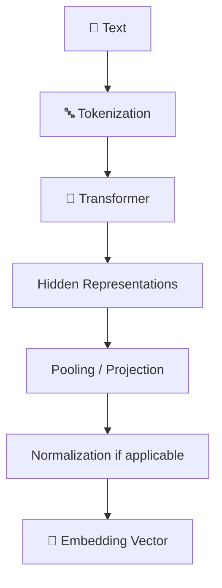
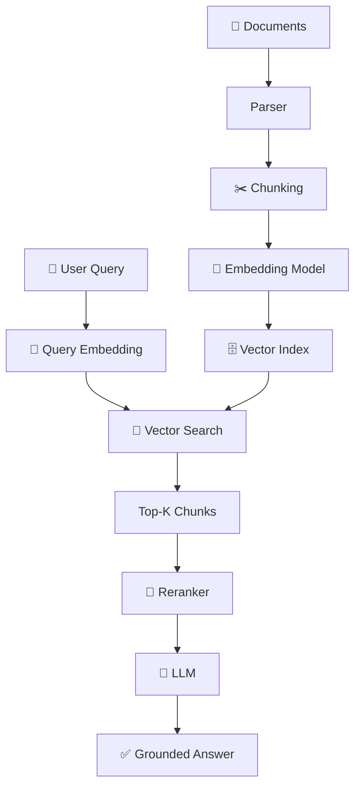
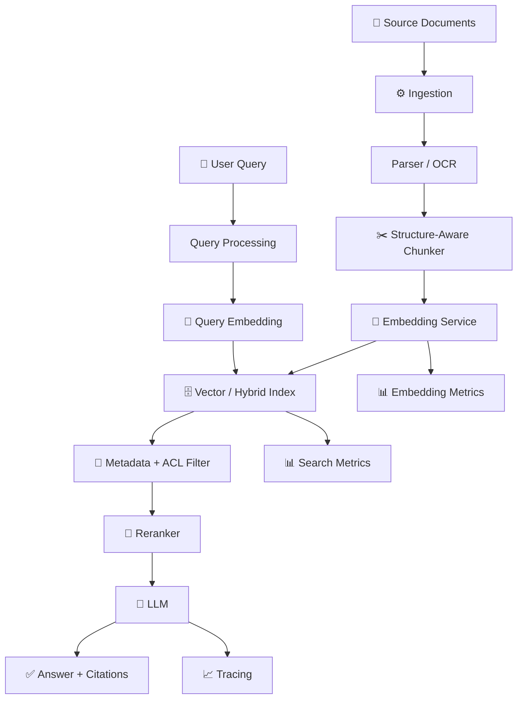

<!-- Embeddings Deep Dive -->

<div align="center">

# 🧠 Embeddings Deep Dive

### From **Words → Vectors → Similarity → Retrieval → RAG → Production Search**


</div>

---

> **One-line definition:** An **embedding** converts data such as text, an image, or code into a list of numbers called a **vector**, so a computer can compare meaning mathematically.

## 🏷️ Tags

`Embeddings` • `Vector Search` • `Semantic Search` • `RAG` • `LLM` • `Transformers` • `Cosine Similarity` • `ANN` • `HNSW` • `Vector Database` • `Hybrid Search` • `Reranking` • `Chunking` • `Multilingual Embeddings` • `Code Embeddings` • `Evaluation` • `Python` • `C#` • `Azure AI Search`

---

# 📚 Table of Contents

1. [What Is an Embedding?](#-1-what-is-an-embedding)
2. [Why Do We Need Embeddings?](#-2-why-do-we-need-embeddings)
3. [The Vector Intuition](#-3-the-vector-intuition)
4. [How Text Becomes a Vector](#-4-how-text-becomes-a-vector)
5. [Dimensions](#-5-dimensions)
6. [Semantic Similarity](#-6-semantic-similarity)
7. [Cosine Similarity](#-7-cosine-similarity)
8. [Other Similarity Measures](#-8-other-similarity-measures)
9. [Embedding Model Types](#-9-embedding-model-types)
10. [Bi-Encoder vs Cross-Encoder](#-10-bi-encoder-vs-cross-encoder)
11. [Chunking and Embeddings](#-11-chunking-and-embeddings)
12. [Embeddings in RAG](#-12-embeddings-in-rag)
13. [Vector Databases](#-13-vector-databases)
14. [ANN and HNSW](#-14-ann-and-hnsw)
15. [Metadata Filtering](#-15-metadata-filtering)
16. [Hybrid Search](#-16-hybrid-search)
17. [Multilingual and Code Embeddings](#-17-multilingual-and-code-embeddings)
18. [Embedding Quality](#-18-embedding-quality)
19. [Evaluation](#-19-evaluation)
20. [Production Architecture](#-20-production-architecture)
21. [Python Example](#-21-python-example)
22. [C# Example](#-22-c-example)
23. [Common Mistakes](#-23-common-mistakes)
24. [Interview Q&A](#-24-interview-qa)
25. [Quick Revision](#-25-quick-revision)
26. [Official Resources](#-26-official-resources)

---

# 🔢 1. What Is an Embedding?

Imagine you have these sentences:

```text
"How do I reset my password?"
"I forgot my password. How can I change it?"
"What is the weather today?"
```

A keyword search may notice that the first two sentences use different words.

An embedding model tries to represent their **meaning** in vector space.

```text
Sentence
   ↓
Embedding Model
   ↓
[0.021, -0.143, 0.812, ...]
   ↓
Vector
```

The first two vectors should generally be closer to each other than to the weather question.

> **Easy rule:** Embeddings turn **meaning into numbers**.

---

# 🔎 2. Why Do We Need Embeddings?

Traditional keyword search is excellent when the exact words matter.

But users often express the same idea differently.

| Query | Document | Keyword overlap | Semantic relationship |
|---|---|---:|---:|
| "forgot password" | "credential reset procedure" | Low | High |
| "car insurance" | "vehicle coverage" | Low | High |
| "leave balance" | "annual vacation allowance" | Low | High |

Embeddings allow search systems to look beyond exact word matches.

### Traditional search

```text
Query → keywords → matching words
```

### Semantic search

```text
Query → vector → nearest vectors → related meaning
```

---

# 📐 3. The Vector Intuition

A vector is simply a list of numbers.

For learning purposes:

```text
"cat" → [0.8, 0.2, 0.9]
"dog" → [0.7, 0.3, 0.8]
"car" → [0.1, 0.9, 0.2]
```

Real embedding vectors usually contain hundreds or thousands of dimensions.

We cannot easily visualize those dimensions, but the mathematical idea is the same.


---

# 🧮 4. How Text Becomes a Vector

A simplified pipeline looks like:



The exact architecture depends on the embedding model.

A useful mental model is:

1. Split text into tokens.
2. Convert tokens into internal representations.
3. Use the model to capture relationships between tokens.
4. Aggregate/project the representation.
5. Produce a fixed-size vector.

> Do not assume every embedding model uses exactly the same pooling or normalization strategy.

---

# 📏 5. Dimensions

If a model produces a 1536-dimensional vector:

```text
[ x₁, x₂, x₃, ... x₁₅₃₆ ]
```

Each number is one coordinate in a high-dimensional space.

### Does more dimensions always mean better?

**No.**

Higher dimensionality can provide capacity, but quality depends on:

- Training data
- Model architecture
- Training objective
- Domain fit
- Language coverage
- Retrieval task
- Index/search configuration
- Storage and latency constraints

### Production trade-off

```text
Higher dimensions
      ↓
More storage + more compute
      ↓
Potentially richer representation

Lower dimensions
      ↓
Less storage + faster operations
      ↓
Potential information loss
```

Some modern embedding APIs also support configurable dimensions or dimensionality reduction. Always evaluate the chosen setting on your own retrieval dataset.

---

# 📐 6. Semantic Similarity

Suppose:

```text
A = "How can I reset my password?"
B = "I forgot my password."
C = "How do I bake a cake?"
```

An embedding system may produce:

```text
similarity(A, B) → high
similarity(A, C) → low
```

The exact scores depend on the model and similarity metric.

> **Important:** A similarity score is not a universal probability that two sentences have the same meaning.

---

# 📐 7. Cosine Similarity

A common similarity measure is cosine similarity.

[
cos(	heta)=rac{Acdot B}{||A||||B||}
]

In simple English:

> Compare the **direction** of two vectors rather than only their size.

Conceptually:

```text
             B
            /
           /
          / θ
         /
        A
```

For normalized vectors, cosine similarity is closely related to the dot product.

### Python

```python
import math

def cosine_similarity(a: list[float], b: list[float]) -> float:
    dot = sum(x * y for x, y in zip(a, b))
    norm_a = math.sqrt(sum(x * x for x in a))
    norm_b = math.sqrt(sum(y * y for y in b))

    if norm_a == 0 or norm_b == 0:
        return 0.0

    return dot / (norm_a * norm_b)
```

---

# 📊 8. Other Similarity Measures

| Metric | Basic idea | Common use |
|---|---|---|
| Cosine | Angle/direction | Text semantic similarity |
| Dot product | Vector product | Many embedding/search systems |
| Euclidean distance | Straight-line distance | Some vector spaces |
| Manhattan distance | Sum of absolute differences | Specialized use cases |

### Interview rule

Do not say:

> "Cosine is always the best."

Say:

> "The correct metric depends on the embedding model, normalization assumptions and vector index. I evaluate it empirically."

---

# 🧠 9. Embedding Model Types

## 1. Text embeddings

Used for:

- Semantic search
- RAG
- Clustering
- Recommendations
- Duplicate detection

## 2. Image embeddings

Represent visual information as vectors.

## 3. Multimodal embeddings

Can place different modalities into a compatible representation space, depending on the model.

## 4. Code embeddings

Useful for:

- Code search
- Repository understanding
- Similar-code detection
- Developer assistants

## 5. Multilingual embeddings

Designed to represent multiple languages in a useful shared semantic space.

---

# ⚖️ 10. Bi-Encoder vs Cross-Encoder

This is a very important RAG interview topic.

## Bi-Encoder

Encode query and documents independently.

```text
Query ─────→ Encoder ─────→ Query Vector
Document ──→ Encoder ─────→ Document Vector
                              ↓
                         Similarity
```

### Advantage

Very fast at large scale because document vectors can be precomputed.

### Cross-Encoder

Give query and candidate document together to a model.

```text
(Query + Document)
        ↓
   Cross-Encoder
        ↓
    Relevance Score
```

### Advantage

Can model the interaction between query and document more deeply.

### Typical architecture

```text
1,000,000 documents
       ↓
Bi-Encoder / Vector Search
       ↓
Top 50
       ↓
Cross-Encoder Reranker
       ↓
Top 5
       ↓
LLM
```

> **Easy rule:** Bi-encoder = fast retrieval. Cross-encoder = precise reranking.

---

# ✂️ 11. Chunking and Embeddings

A common beginner mistake is embedding an entire 500-page document as one vector.

Instead:

```text
Document
   ↓
Parse
   ↓
Split into meaningful chunks
   ↓
Create embedding for each chunk
   ↓
Store vectors + metadata
```

### Good chunk metadata

```json
{
  "document_id": "POL-1001",
  "version": 7,
  "page": 12,
  "section": "Password Policy",
  "tenant_id": "company-a",
  "access_level": "employee"
}
```

### Structure-aware chunking

Prefer meaningful boundaries:

- Heading
- Section
- Paragraph
- Table
- List
- Code block

rather than blindly cutting every N characters.

> **Key idea:** Better chunks usually produce better retrieval because the embedding represents a more focused piece of meaning.

---

# 📚 12. Embeddings in RAG

Embeddings are one part of a complete RAG system.



### Two different embedding operations

**Document embedding**

```text
Document chunk → embedding → index
```

**Query embedding**

```text
User query → embedding → search
```

For many semantic-search systems, the query and document embeddings are produced by the same model family or a compatible retrieval model.

---

# 🗄️ 13. Vector Databases

A vector database/index stores vectors and allows efficient similarity search.

Common technologies include:

- Azure AI Search
- PostgreSQL + pgvector
- Elasticsearch
- OpenSearch
- Pinecone
- Weaviate
- Qdrant
- Milvus
- Redis vector search

### Conceptual record

```text
ID
Vector
Text
Metadata
```

Example:

```json
{
  "id": "chunk-10042",
  "vector": [0.12, -0.04, 0.91],
  "text": "Employees receive 24 annual leave days.",
  "document_id": "HR-001",
  "page": 8
}
```

The vector is only part of the record. **Metadata is essential for production filtering and access control.**

---

# ⚡ 14. ANN and HNSW

Comparing a query against every vector is expensive at large scale.

Approximate Nearest Neighbor (**ANN**) indexes reduce search cost by avoiding exhaustive comparison.

One popular approach is **HNSW — Hierarchical Navigable Small World**.

Conceptually:

```text
Query
  ↓
Coarse graph navigation
  ↓
More detailed neighborhood
  ↓
Nearest candidates
```

### Trade-off

ANN search often trades some exactness for speed and scalability.

Important tuning concepts include:

- Number of candidates searched
- Graph construction parameters
- Top-K
- Recall
- Latency
- Memory

> **Interview tip:** Say **recall vs latency trade-off**, not simply "HNSW is faster."

---

# 🔐 15. Metadata Filtering

Semantic similarity alone is not enough for enterprise search.

Imagine two documents have almost identical content:

```text
Document A → Tenant A
Document B → Tenant B
```

A user from Tenant A must not receive Tenant B's document.

Use metadata filters:

```text
Similarity Search
      +
Tenant Filter
      +
Permission Filter
      +
Document Version Filter
      ↓
Safe Results
```

### Critical principle

> **Security filtering must not depend on the LLM.**

The retrieval layer/application must enforce access control.

---

# 🔀 16. Hybrid Search

Vector search understands semantic similarity.

Keyword search is often better for exact identifiers.

Example:

```text
"INC-2026-009182"
"AZ-305"
"SQLSTATE 23505"
"ERROR 4012"
```

A pure semantic search may not be ideal for these.

### Hybrid architecture

```text
                    Query
                      ↓
          ┌───────────┴───────────┐
          ↓                       ↓
   Keyword Search          Vector Search
          ↓                       ↓
          └───────────┬───────────┘
                      ↓
                  Fusion
                      ↓
                 Reranking
                      ↓
                 Top Results
```

> **Easy rule:** Semantic search finds **meaning**; keyword search finds **exact terms**. Hybrid search uses both.

---

# 🌍 17. Multilingual and Code Embeddings

Do not assume an embedding model performs equally well across every language or domain.

For multilingual systems evaluate:

- Language coverage
- Cross-language retrieval
- Script differences
- Transliteration
- Domain vocabulary
- Code-switching

For code:

- Programming language
- Repository conventions
- Identifiers
- Comments
- API names
- Code structure

### Example

```text
English: "Reset password"
Hindi:   "पासवर्ड रीसेट करना है"
```

A multilingual embedding system may place these concepts near each other, but **measure it on your actual data**.

---

# 🎯 18. Embedding Quality

Good embeddings are not simply "vectors that look good."

For a retrieval system, ask:

1. Does the correct document appear in Top-K?
2. Does the vector distinguish relevant from irrelevant content?
3. Does it work on domain terminology?
4. Does it work across expected languages?
5. Does latency meet the SLA?
6. Is storage acceptable?
7. Does it preserve security filtering?
8. Does it improve final answer quality?

### Quality chain

```text
Embedding Quality
      ↓
Retrieval Quality
      ↓
Context Quality
      ↓
Generation Quality
      ↓
User Experience
```

---

# 📈 19. Evaluation

Do not evaluate embeddings only by looking at a few vectors.

Build a retrieval evaluation dataset:

```text
Query
Expected relevant documents/chunks
Relevant section
Optional relevance grade
```

Then measure retrieval.

### Recall@K

```text
Did the relevant result appear in the first K results?
```

### Precision@K

```text
How many of the first K results were relevant?
```

### MRR

Mean Reciprocal Rank focuses on how high the first relevant result appears.

### NDCG

Useful when relevance has multiple grades.

### RAG-level evaluation

Also measure:

- Faithfulness
- Groundedness
- Citation correctness
- Answer relevance
- Task success

> **Important:** Better embedding retrieval does not automatically guarantee a better final answer. Evaluate the entire pipeline.

---

# 🏭 20. Production Architecture



### Production checklist

- Version the embedding model.
- Record the model used for each indexed chunk.
- Keep chunking configuration versioned.
- Reindex when changing incompatible embedding models.
- Monitor vector-search latency.
- Monitor Recall@K on a golden dataset.
- Keep tenant/ACL metadata with every searchable record.
- Avoid mixing incompatible vector spaces.
- Use batching during ingestion.
- Cache repeated query embeddings where appropriate.
- Protect sensitive data sent to external embedding services.

---

# 🐍 21. Python Example

A minimal example using an embedding client looks like this:

```python
from openai import OpenAI

client = OpenAI()

response = client.embeddings.create(
    model="text-embedding-3-small",
    input=[
        "How do I reset my password?",
        "I forgot my password and need to change it."
    ],
)

vectors = [item.embedding for item in response.data]

print("Vector dimensions:", len(vectors[0]))
print("First five values:", vectors[0][:5])
```

### Important production improvement

Do not embed every document one-by-one.

Prefer:

```text
Documents
   ↓
Batch
   ↓
Embedding API
   ↓
Validate
   ↓
Persist
```

Also record:

```text
document_id
chunk_id
embedding_model
embedding_version
dimensions
created_at
```

---

# 💜 22. C# Example

A clean .NET application should hide the provider behind an interface.

```csharp
public interface IEmbeddingService
{
    Task<IReadOnlyList<float>> CreateEmbeddingAsync(
        string text,
        CancellationToken cancellationToken);
}
```

Application code can then depend on the abstraction:

```csharp
public sealed class DocumentIndexer
{
    private readonly IEmbeddingService _embeddingService;

    public DocumentIndexer(IEmbeddingService embeddingService)
    {
        _embeddingService = embeddingService;
    }

    public async Task<IReadOnlyList<float>> IndexChunkAsync(
        string chunk,
        CancellationToken cancellationToken)
    {
        return await _embeddingService.CreateEmbeddingAsync(
            chunk,
            cancellationToken);
    }
}
```

### Why this design?

It lets you change:

```text
OpenAI
  ↓
Azure-hosted model
  ↓
Open-source model
```

without rewriting the application layer.

---

# 🚫 23. Common Mistakes

## ❌ Mistake 1 — Embedding the whole document

A huge document can contain many unrelated topics.

**Better:** chunk by semantic/structural boundaries.

## ❌ Mistake 2 — Using only vector search

Exact identifiers may require keyword search.

**Better:** evaluate hybrid search.

## ❌ Mistake 3 — Ignoring metadata

You can retrieve semantically relevant but unauthorized content.

**Better:** enforce tenant and ACL filters.

## ❌ Mistake 4 — Changing the embedding model without reindexing

Vectors from different model spaces generally cannot simply be mixed.

**Better:** version and reindex consistently.

## ❌ Mistake 5 — Choosing a model only by benchmark score

Your enterprise vocabulary may differ from public benchmarks.

**Better:** create a representative evaluation set.

## ❌ Mistake 6 — Assuming higher dimensions always win

More dimensions can increase cost and latency.

**Better:** measure quality/cost/latency together.

## ❌ Mistake 7 — Ignoring query/document mismatch

A model optimized for one retrieval style may perform differently for your use case.

**Better:** evaluate query-to-document retrieval on real examples.

---

# 🎤 24. Interview Q&A

## Q1. What is an embedding?

### Simple explanation
An embedding is a numerical representation of data that lets us compare semantic relationships mathematically.

### STAR-style answer
**Situation:** We needed semantic search over enterprise documents.

**Task:** Users could ask questions using words different from the documents.

**Action:** I converted document chunks and user queries into embeddings and searched for nearby vectors.

**Result:** The retrieval system could find semantically related content instead of depending only on exact keywords.

### Interview tip
> **Embedding = meaning represented as numbers.**

---

## Q2. Why are embeddings useful in RAG?

### Answer
RAG needs to find relevant context before asking the LLM to answer. Embeddings allow semantic retrieval of document chunks.

```text
Question
 ↓
Query Embedding
 ↓
Vector Search
 ↓
Relevant Chunks
 ↓
LLM
```

---

## Q3. What is cosine similarity?

### Answer
Cosine similarity measures how closely two vectors point in the same direction.

> It is commonly used for semantic similarity, but the correct metric depends on the model and index configuration.

---

## Q4. Cosine similarity vs Euclidean distance?

### Answer
Cosine focuses on vector direction, while Euclidean measures geometric distance. For normalized vectors, cosine similarity and Euclidean distance have a close mathematical relationship.

---

## Q5. What is the difference between an embedding model and an LLM?

### Answer

| Embedding model | LLM |
|---|---|
| Produces vectors | Produces/generated text or other outputs |
| Used for retrieval/similarity | Used for generation/reasoning |
| Usually optimized for representation | Usually optimized for language generation/reasoning |
| Output is numerical vector | Output is often tokens/text |

They can be based on related transformer technology but serve different purposes.

---

## Q6. What is a vector database?

### Answer
A vector database/index stores vectors and supports efficient similarity search, often together with metadata.

---

## Q7. What is HNSW?

### Answer
HNSW is an approximate nearest-neighbor graph indexing technique. It helps find nearby vectors efficiently without comparing the query with every vector.

---

## Q8. Why do we need ANN?

### Answer
Exact nearest-neighbor search can become expensive when the index contains millions or billions of vectors. ANN reduces search cost by exploring a smaller candidate space.

---

## Q9. What is hybrid search?

### Answer
Hybrid search combines lexical/keyword retrieval with vector/semantic retrieval.

> It is particularly useful when users search for both concepts and exact identifiers.

---

## Q10. What is reranking?

### Answer
Reranking takes an initial candidate set and applies a more precise relevance model to reorder it.

```text
Vector / Keyword Search
        ↓
Top 50
        ↓
Reranker
        ↓
Top 5
```

---

## Q11. Bi-encoder vs cross-encoder?

### Answer
A bi-encoder independently encodes queries and documents and is efficient for large-scale retrieval. A cross-encoder processes the query and candidate document together and is usually more computationally expensive but useful for precise reranking.

---

## Q12. How do you choose an embedding model?

### STAR-style answer
**Situation:** We needed semantic retrieval for enterprise documents.

**Task:** Choose a model that balanced retrieval quality, latency, cost and domain coverage.

**Action:** I created a golden query-document dataset and compared candidate models using Recall@K, latency, storage and downstream answer quality.

**Result:** The decision was based on measured application performance rather than model popularity alone.

---

## Q13. What happens if we change the embedding model?

### Answer
The vector space can change. Existing vectors and new query vectors may become incompatible or produce poor retrieval.

A safe migration is:

```text
New Model
   ↓
New Index
   ↓
Evaluate
   ↓
Shadow / Validate
   ↓
Switch
```

Keep the old index until the new index has been validated.

---

## Q14. How do you improve poor embedding retrieval?

### Structured answer

1. Check the evaluation dataset.
2. Inspect chunk quality.
3. Check query/document preprocessing.
4. Verify the embedding model.
5. Test Top-K.
6. Test ANN parameters.
7. Add metadata filtering.
8. Test hybrid search.
9. Add reranking.
10. Measure downstream answer quality.

---

## Q15. Can embeddings detect duplicate documents?

### Answer
They can help identify semantically similar content, but similarity does not always mean exact duplication.

For exact duplicate detection, hashing is often better:

```text
Exact duplicate → Hash
Semantic duplicate → Embedding similarity
```

---

## Q16. Are embeddings enough for security?

### Answer
**No.**

Embeddings represent semantic information. They do not enforce authorization.

Security must be implemented through application identity, access-control metadata, filtering and authorization checks.

---

## Q17. What metrics would you use?

### Answer

For retrieval:

- Recall@K
- Precision@K
- MRR
- NDCG

For the complete RAG application:

- Groundedness
- Faithfulness
- Citation correctness
- Answer relevance
- Task success
- Latency
- Cost

---

## Q18. What is embedding drift?

### Simple explanation
Embedding behavior can change when the underlying model, data distribution or domain vocabulary changes.

### Production approach

Monitor:

```text
Query distribution
       ↓
Retrieval metrics
       ↓
Quality evaluation
       ↓
Model / index review
```

---

## Q19. How would you design embeddings for a multi-tenant enterprise system?

### Sample answer
> "I would store tenant and authorization metadata with every chunk, enforce tenant and ACL filters during retrieval, version the embedding model, isolate incompatible indexes when required, and test cross-tenant leakage explicitly. I would never depend on the LLM to decide whether a retrieved document is authorized."

---

## Q20. Explain embeddings in 60 seconds.

### Sample answer
> "An embedding converts text or other data into a numerical vector that captures useful semantic information. In a RAG system, I split documents into meaningful chunks, generate embeddings for those chunks and store them in a vector index with metadata. When a user asks a question, I generate a query embedding and retrieve nearby chunks. For better precision, I can combine vector search with keyword search and reranking. In production I version the embedding model, evaluate Recall@K and downstream answer quality, enforce authorization through metadata filters, and monitor latency, cost and retrieval quality."

---

# 🧠 25. Quick Revision

Remember these:

1. **Embedding = data → vector**
2. **Vector = list of numbers**
3. **Semantic search = search by meaning**
4. **Cosine = directional similarity**
5. **Bi-encoder = fast retrieval**
6. **Cross-encoder = precise reranking**
7. **ANN = scalable approximate search**
8. **HNSW = graph-based ANN**
9. **Hybrid = keyword + vector**
10. **Metadata = filtering + security context**
11. **RAG = retrieve before generation**
12. **Recall@K = did we retrieve the relevant result?**
13. **Version your embedding model**
14. **Evaluate on your own data**
15. **Never use embeddings as an authorization mechanism**

### 🧩 The whole concept in one diagram

```text
                 📝 DOCUMENT
                      ↓
                 ✂️ CHUNK
                      ↓
              🧠 EMBEDDING MODEL
                      ↓
                 🔢 VECTOR
                      ↓
              🗄️ VECTOR INDEX
                      ↑
                      │
👤 QUERY → 🧠 QUERY EMBEDDING
                      ↓
              🔎 VECTOR SEARCH
                      ↓
                🎯 RERANK
                      ↓
                🤖 LLM / RAG
                      ↓
               ✅ ANSWER
```

---

# 📖 26. Official Resources

| Resource | Why learn it |
|---|---|
| [OpenAI Embeddings](https://platform.openai.com/docs/guides/embeddings) | API concepts and embedding usage |
| [Azure AI Search Vector Search](https://learn.microsoft.com/azure/search/vector-search-overview) | Enterprise vector/hybrid retrieval |
| [Sentence Transformers](https://www.sbert.net/) | Practical embedding and semantic-search models |
| [FAISS](https://github.com/facebookresearch/faiss) | Similarity search and vector indexing |
| [Hugging Face](https://huggingface.co/) | Open models and embedding ecosystem |
| [pgvector](https://github.com/pgvector/pgvector) | Vector search with PostgreSQL |

---

# 🎯 Final Interview Formula

When asked about embeddings:

```text
1. Define embedding
       ↓
2. Explain why semantic representation is needed
       ↓
3. Explain vector similarity
       ↓
4. Explain retrieval architecture
       ↓
5. Mention chunking + metadata
       ↓
6. Explain ANN / HNSW
       ↓
7. Mention hybrid + reranking
       ↓
8. Explain evaluation
       ↓
9. Mention security + versioning
       ↓
10. Give a production example
```

> **Principal Engineer answer:** Don't stop at "embeddings convert text to vectors." Explain how embedding choice affects **retrieval quality, index design, latency, cost, security, versioning and final RAG quality**.

---

## ⭐ Key Takeaway

> **Embeddings are the mathematical bridge between human meaning and machine-searchable representations.**

For a production RAG system:

**Good chunking + good embeddings + good retrieval + metadata filtering + reranking + evaluation = useful semantic search.**

---

<div align="center">

### 🚀 Learn → Experiment → Evaluate → Optimize → Productionize

**Don't just know embeddings. Learn how to engineer an embedding-powered retrieval system.**

</div>
