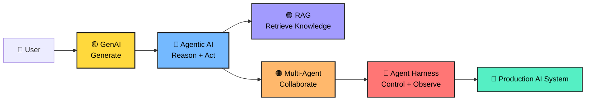
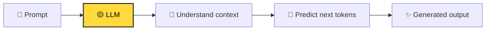
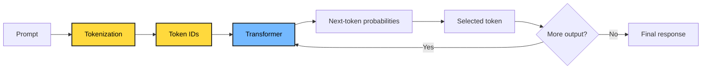
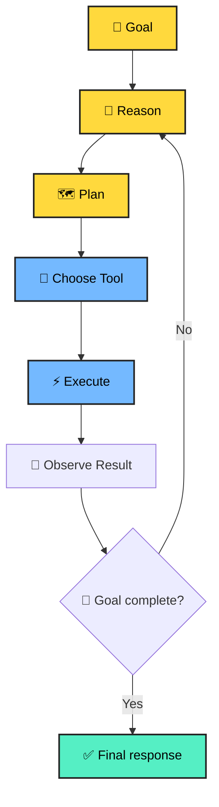
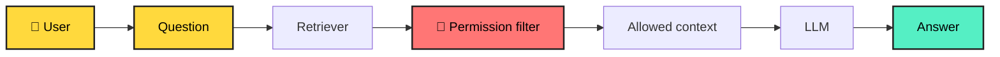
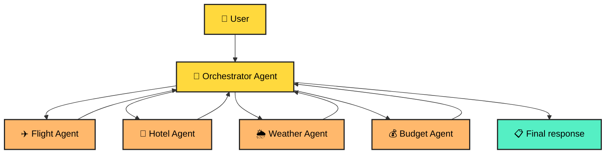
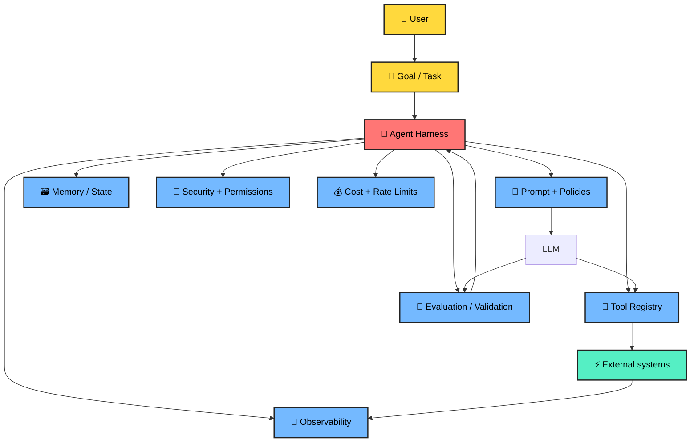
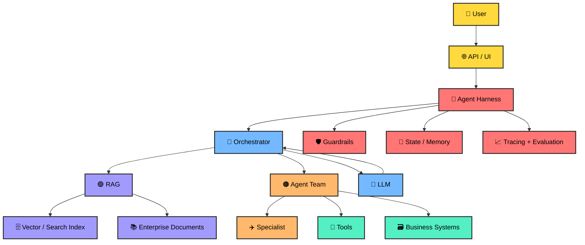
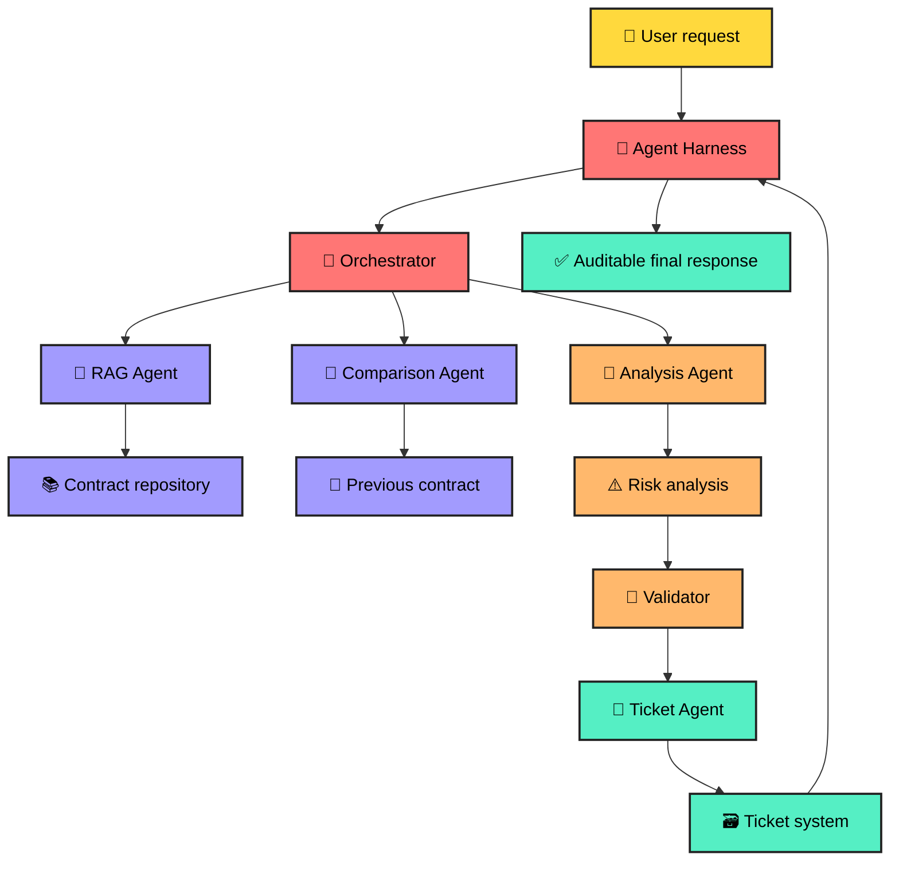

# 🧠 GenAI → Agentic AI → Multi-Agent Systems → RAG → Agent Harness


**Tags:** `#GenAI` `#GenerativeAI` `#LLM` `#AgenticAI` `#AIAgents` `#MultiAgentSystems` `#RAG` `#AgentHarness` `#VectorDatabase` `#Embeddings` `#AIEngineering` `#SystemDesign`

> 🎮 **Learning mode:** Each concept is a level. Learn → visualize → see a real-world analogy → solve a mini challenge → unlock the next level.

---

## 🗺️ The journey

| Level | Topic | The simple question |
|---|---|---|
| 🟢 01 | **GenAI** | Can AI create something new? |
| 🔵 02 | **Agentic AI** | Can AI decide what to do next? |
| 🟣 03 | **RAG** | Can AI use my trusted knowledge? |
| 🟠 04 | **Multi-Agent System** | Can multiple specialized agents collaborate? |
| 🔴 05 | **Agent Harness** | Can we make agents reliable enough for production? |

### 🌟 The big picture



---

# 🟡 Level 01 — Generative AI

## 1. What is GenAI?

**Generative AI is AI that creates new content from a prompt.**

It can generate:

- 📝 Text
- 💻 Code
- 🖼️ Images
- 🎵 Audio
- 🎬 Video
- 📊 Structured output
- 🧠 Summaries and explanations

A Large Language Model (LLM) does not simply retrieve a paragraph from a database. It predicts and generates a response based on patterns learned during training plus the context supplied at runtime.

### 🧩 Simple mental model



### 🍕 Real-world analogy

Imagine a chef.

You say:

> "Make me a spicy vegetarian pizza."

The chef does not copy one exact pizza from a single page. The chef combines knowledge about ingredients, cooking methods and your instructions to create a new pizza.

**LLM = chef**  
**Prompt = order**  
**Generated answer = pizza**

### 💡 Example

**Prompt:**

```text
Explain cloud computing to a 10-year-old.
```

**Possible output:**

> Cloud computing is like renting a computer in someone else's huge computer building instead of buying and maintaining the computer yourself.

### 🧪 Mini Challenge

You are building a support chatbot.

Which task is naturally suited to GenAI?

A. Generate a polite reply to a customer  
B. Store customer records  
C. Authenticate a user  
D. Execute a database transaction

<details>
<summary>🎯 Reveal answer</summary>

**A — Generate a polite reply to a customer.**

GenAI is particularly useful for creating or transforming content.

</details>

---

## 2. How an LLM produces text

At a simplified level:



### 🔑 Important terms

| Term | Easy meaning |
|---|---|
| **Token** | Small piece of text processed by the model |
| **Context window** | Amount of context the model can consider |
| **Prompt** | Instructions/context supplied to the model |
| **Temperature** | Controls randomness in generation |
| **Embedding** | Numerical representation of meaning |
| **Transformer** | Neural-network architecture behind modern LLMs |

### 🎮 Level 01 checkpoint

If GenAI can **generate**, what is it missing?

**Answer:** It does not automatically know your private data, decide a multi-step plan, call business systems safely, or verify every answer.

That leads to the next level.

---

# 🔵 Level 02 — Agentic AI

## 3. What is Agentic AI?

An **AI agent** is a system that uses an AI model to reason about a goal, decide what action may be needed, use tools, observe results, and continue until it reaches an appropriate stopping point.

A useful simplified loop is:

> **Goal → Reason → Plan → Act → Observe → Re-plan**

### 🧠 GenAI vs Agentic AI

| GenAI | Agentic AI |
|---|---|
| Produces an answer | Pursues a goal |
| Mostly response-oriented | Action-oriented |
| Prompt → response | Goal → multiple steps |
| May not use tools | Can use tools |
| Usually stateless per request | Can maintain task state |
| Human often coordinates steps | Agent can coordinate steps |

### 🏨 Real-world analogy

Imagine booking a trip.

A basic GenAI assistant says:

> "Here are some hotels in Tokyo."

An agentic travel assistant might:

1. Ask for dates.
2. Search flights.
3. Search hotels.
4. Compare prices.
5. Check constraints.
6. Build an itinerary.
7. Ask for confirmation before booking.
8. Execute the booking if authorized.

The difference is **action + orchestration**, not simply a more impressive chatbot.

### 🔄 Agent loop



### 🧰 What is a tool?

A tool is an operation the agent can invoke.

Examples:

```text
search_documents()
get_customer()
query_database()
send_email()
create_ticket()
call_payment_api()
calculate_tax()
search_web()
```

The model decides **what should happen**; deterministic application code should decide **what is actually permitted to happen**.

### 🧪 Mini Challenge

A user says:

> "Find my unpaid invoices, summarize them and create a payment plan."

A useful agent might need:

```text
1. Authenticate user
2. Query invoice system
3. Identify unpaid invoices
4. Calculate totals
5. Generate summary
6. Create proposed plan
7. Ask for approval
8. Execute only after approval
```

🎯 **Question:** Which part should require a strong authorization boundary?

<details>
<summary>🎯 Reveal answer</summary>

The actual financial action. Reading data and drafting a proposal can have different permissions from executing a payment or changing financial records.

</details>

---

# 🟣 Level 03 — RAG (Retrieval-Augmented Generation)

## 4. Why do we need RAG?

An LLM can know a lot, but your enterprise application may contain information that is:

- Private
- Frequently changing
- Domain-specific
- Too large to place into every prompt
- Permission-sensitive

Examples:

- HR policies
- Product manuals
- Legal documents
- Customer contracts
- Engineering runbooks
- Internal knowledge bases

**RAG connects an LLM to external knowledge at query time.**

### 📚 Library analogy

Imagine an extremely intelligent student taking an open-book exam.

The student already knows many concepts.

But for a question about **your company's latest travel policy**, the student needs the company handbook.

So:

**LLM = intelligent student**  
**Knowledge base = library**  
**Retriever = librarian**  
**Retrieved chunks = books/pages handed to the student**  
**Answer = student's response using those pages**

### 🏗️ RAG pipeline

```mermaid
flowchart LR
    D["📄 Documents"] --> C["✂️ Chunk"]
    C --> E["🔢 Embeddings"]
    E --> V["🗄️ Vector DB"]

    Q["👤 Question"] --> QE["🔢 Query embedding"]
    QE --> S["🔎 Similarity search"]
    V --> S
    S --> K["📚 Top-k chunks"]
    K --> P["🧩 Prompt + context"]
    P --> L["🧠 LLM"]
    L --> A["✨ Grounded answer"]

    classDef yellow fill:#FFD93D,color:#000,stroke:#222,stroke-width:2px
    classDef purple fill:#A29BFE,color:#000,stroke:#222,stroke-width:2px
    classDef blue fill:#74B9FF,color:#000,stroke:#222,stroke-width:2px
    class D,C,E,Q, QE yellow
    class V,S,K purple
    class P,L blue
```

## 5. RAG step by step

### Step 1 — Ingest

Collect documents from sources such as:

```text
SharePoint
S3 / Azure Blob
Databases
Confluence
Google Drive
APIs
File uploads
```

### Step 2 — Chunk

A 100-page document is usually too large to retrieve as one unit.

Break it into meaningful pieces.

```text
Document
   ↓
Pages
   ↓
Sections
   ↓
Chunks
```

Good chunking tries to preserve enough context for the retrieved passage to remain meaningful.

### Step 3 — Embed

An embedding model converts text into a numerical vector representing semantic information.

Example:

```text
"How many vacation days do employees get?"

        ↓ embedding

[0.12, -0.87, 0.34, ...]
```

### Step 4 — Store

Store vectors plus metadata:

```json
{
  "document_id": "HR-2026-001",
  "chunk_id": "chunk-17",
  "text": "Employees receive...",
  "department": "HR",
  "region": "India",
  "access_level": "employee"
}
```

### Step 5 — Retrieve

Convert the user question into an embedding and find semantically similar chunks.

### Step 6 — Generate

Provide the retrieved evidence to the LLM.

### 🔐 Critical enterprise idea: authorization-aware retrieval

Never assume:

> "If the vector database can find it, the user can see it."

Retrieval should respect document permissions.



### 🍕 RAG analogy

A restaurant chef has the cooking skills but does not memorize every customer's dietary restrictions.

Before preparing your order, the waiter checks your profile.

That is similar to **retrieval + metadata filtering**.

---

## 6. RAG quality checklist

A production RAG system is more than "vector search + prompt."

Consider:

- Chunking strategy
- Metadata
- Hybrid search
- Keyword search
- Vector search
- Re-ranking
- Query rewriting
- Filters
- Access control
- Citation generation
- Evaluation
- Freshness
- Duplicate detection
- Prompt injection defense
- Observability

### 🧪 RAG Quiz

**Q1. Why is chunking needed?**

A. To make the UI colorful  
B. To retrieve smaller relevant pieces of knowledge  
C. To eliminate embeddings  
D. To replace the LLM

<details>
<summary>Answer</summary>

**B.** Smaller meaningful chunks can improve retrieval precision and keep the context supplied to the model focused.

</details>

**Q2. What is an embedding?**

A. A password  
B. A numerical representation used to capture semantic relationships  
C. A database table  
D. A chatbot

<details>
<summary>Answer</summary>

**B.**

</details>

---

# 🟠 Level 04 — Multi-Agent Systems

## 7. What is a Multi-Agent System?

Instead of one giant agent doing everything, we can create multiple specialized agents.

For example:

```text
Travel Manager
├── Flight Agent
├── Hotel Agent
├── Weather Agent
├── Budget Agent
└── Itinerary Agent
```

Each agent has a focused responsibility.

### 🏢 Real-world analogy

Think about a company.

The CEO does not personally:

- book flights,
- write invoices,
- maintain servers,
- negotiate contracts,
- analyze every dataset.

Different specialists handle different jobs.

The CEO coordinates them.

A multi-agent architecture applies a similar idea to AI systems.

### 🧩 Basic architecture



## 8. Agent communication patterns

### Pattern A — Supervisor

One agent coordinates specialists.

```text
Supervisor
   ├── Researcher
   ├── Analyst
   ├── Writer
   └── Reviewer
```

### Pattern B — Sequential pipeline

```text
Researcher → Analyst → Writer → Reviewer
```

### Pattern C — Parallel specialists

```text
             ┌→ Agent A ─┐
User → Router├→ Agent B ─┼→ Aggregator
             └→ Agent C ─┘
```

### Pattern D — Debate / reviewer loop

```text
Generator → Critic → Generator → Finalizer
```

### ⚠️ More agents does NOT automatically mean better AI.

More agents can introduce:

- More latency
- More token usage
- More failure points
- More coordination complexity
- More difficult debugging
- More security boundaries

Use multiple agents when **specialization or independent reasoning/workflows justify the complexity**.

### 🎮 Multi-Agent Challenge

You are building an enterprise document assistant.

Which separation is sensible?

A. One agent for every sentence  
B. Retrieval agent + analysis agent + response agent  
C. 100 agents for every request  
D. No deterministic services

<details>
<summary>🎯 Reveal answer</summary>

**B** can be a sensible architecture when each component has a clear responsibility and the orchestration overhead is justified.

</details>

---

# 🔴 Level 05 — Agent Harness

## 9. What is an Agent Harness?

The **agent harness** is the surrounding engineering system that makes an agent usable and controllable in a real application.

Think of the LLM as the **brain**.

The harness is everything that gives the brain:

- 🧭 Direction
- 🛠️ Tools
- 🧠 State
- 🔐 Permissions
- 🧪 Validation
- 👀 Observability
- 🚦 Limits
- 🧯 Recovery
- 📊 Evaluation

### 🏎️ Real-world analogy

An AI model is like a powerful racing engine.

An engine alone is not a racing car.

You still need:

- steering,
- brakes,
- dashboard,
- fuel control,
- safety systems,
- telemetry,
- suspension,
- driver controls.

**Agent harness = engineering system around the model.**

### 🧱 Harness architecture



---

## 10. What belongs inside an Agent Harness?

### 🧭 1. Task orchestration

Defines the lifecycle:

```text
START
 ↓
Understand task
 ↓
Select strategy
 ↓
Call tools
 ↓
Validate results
 ↓
Continue / stop
 ↓
Return response
```

### 🧰 2. Tool registry

Every tool should have a clear contract.

Example:

```json
{
  "name": "search_customer_orders",
  "description": "Search orders for an authenticated customer",
  "input": {
    "customer_id": "string",
    "status": "optional"
  },
  "authorization": "customer.read"
}
```

### 🔐 3. Permissions

Use least privilege.

Instead of:

```text
Agent → Everything
```

prefer:

```text
Agent
 ├── search_orders: READ
 ├── create_ticket: WRITE
 └── refund_payment: APPROVAL_REQUIRED
```

### 🧠 4. State and memory

Not every piece of information belongs in long-term memory.

Useful state can include:

- Current task
- Tool results
- Intermediate decisions
- User preferences when appropriate
- Conversation context
- Workflow status

### 🛡️ 5. Guardrails

Examples:

- Input validation
- Output validation
- Tool allowlists
- Schema validation
- PII protection
- Prompt injection defense
- Sensitive action approval
- Rate limits
- Maximum iteration count

### 👀 6. Observability

Capture useful telemetry:

```text
trace_id
request_id
agent_id
model
prompt/version
tool
latency
tokens
cost
result
error
retry_count
```

### 🧪 7. Evaluation

Do not evaluate an agent only by asking:

> "Did the API return HTTP 200?"

Evaluate:

- Accuracy
- Groundedness
- Tool correctness
- Task completion
- Safety
- Latency
- Cost
- Regression behavior

---

# 🧩 Putting everything together

## 11. Production AI architecture

Here is the complete mental model:



### 🏆 One-sentence mental model

> **GenAI generates. Agentic AI acts. RAG grounds. Multi-agent systems specialize. The agent harness makes the whole system controllable and production-ready.**

---

# 🎮 Final Boss — Build a Document Intelligence Agent

Imagine an enterprise user asks:

> **"Find our latest contract, summarize the obligations, identify renewal risks, compare it with last year's contract, and create a review ticket."**

A production architecture could execute this workflow:



### 🧠 Step-by-step reasoning

**Step 1 — Understand**

Identify the user intent and required outputs.

**Step 2 — Retrieve**

Find the latest contract using metadata, permissions and semantic search.

**Step 3 — Analyze**

Extract obligations, dates, parties, clauses and risks.

**Step 4 — Compare**

Retrieve the previous contract and identify meaningful changes.

**Step 5 — Validate**

Check that important claims are supported by source evidence.

**Step 6 — Act**

Create the review ticket using an authorized tool.

**Step 7 — Report**

Return the summary, evidence and ticket reference.

---

# 🧪 Master Quiz

### Q1. Which technology primarily creates new content?

- [ ] RAG
- [x] GenAI
- [ ] Vector DB
- [ ] API Gateway

### Q2. Which pattern best describes an agent?

- [ ] Prompt → static answer
- [x] Goal → reason → act → observe → continue
- [ ] Database → dashboard
- [ ] Document → PDF

### Q3. What problem does RAG primarily address?

- [ ] It replaces every LLM
- [x] It provides relevant external knowledge to the generation process
- [ ] It removes the need for authorization
- [ ] It eliminates databases

### Q4. Why use multiple agents?

- [ ] More agents are always better
- [x] To divide complex work into meaningful specialized responsibilities
- [ ] To avoid testing
- [ ] To eliminate orchestration

### Q5. What is the agent harness?

- [ ] A new LLM
- [ ] A vector database
- [x] The surrounding control, orchestration, security, tools, state, observability and evaluation layer
- [ ] A prompt template only

### Q6. Which action should usually have the strongest authorization?

- [ ] Reading a public document
- [ ] Formatting text
- [ ] Drafting a proposal
- [x] Executing a sensitive business transaction

---

# 🏅 Scoreboard

| Score | Level |
|---:|---|
| 0–2 | 🐣 AI Explorer |
| 3–4 | 🧑‍💻 AI Builder |
| 5 | 🧠 AI Engineer |
| 6 | 🚀 Agentic AI Architect |

> 🎯 **Do not memorize the labels.** The real goal is to explain the architecture, identify trade-offs, and build a small working system.

---

# 🛠️ Hands-on progression

## 🟢 Mission 1 — GenAI

Build:

```text
Prompt
  ↓
LLM
  ↓
Answer
```

Add:

- Prompt templates
- Structured JSON output
- Streaming
- Token/cost tracking

## 🔵 Mission 2 — Agent

Build:

```text
User
 ↓
Agent
 ├── Calculator
 ├── Search
 └── Database
```

Add:

- Tool schemas
- Tool authorization
- Retry limits
- Maximum iterations

## 🟣 Mission 3 — RAG

Build:

```text
Documents
 ↓
Chunking
 ↓
Embeddings
 ↓
Vector/Search index
 ↓
Retriever
 ↓
LLM
```

Add:

- Metadata filters
- Citations
- Hybrid retrieval
- Re-ranking
- Evaluation dataset

## 🟠 Mission 4 — Multi-Agent

Build:

```text
             ┌→ Research Agent
User → Router├→ Analysis Agent
             └→ Writer Agent
                    ↓
                Reviewer
```

Measure:

- Latency
- Cost
- Accuracy
- Failure rate

## 🔴 Mission 5 — Agent Harness

Add:

- Authentication
- Authorization
- Tool registry
- State management
- Guardrails
- Tracing
- Evaluation
- Human approval
- Cost limits
- Retry policies
- Audit logs

---

# 🧠 Interview Cheat Sheet

| Question | Short answer |
|---|---|
| **What is GenAI?** | AI that generates new content from learned patterns and runtime context. |
| **What is an agent?** | A goal-oriented system that can reason, use tools, observe results and continue a workflow. |
| **What is RAG?** | A pattern that retrieves relevant external knowledge and supplies it to generation. |
| **Why embeddings?** | They represent semantic information numerically so similar concepts can be searched efficiently. |
| **Why multi-agent?** | To divide complex work among specialized agents when that complexity is justified. |
| **What is an agent harness?** | The control plane around agents: orchestration, tools, state, security, guardrails, evaluation and observability. |
| **Biggest production concern?** | Reliability requires more than model quality: permissions, tool safety, grounding, evaluation, observability and controlled execution matter. |

---

# 🌟 The final mental model

```text
                 ┌──────────────────────┐
                 │       GenAI          │
                 │      Generate        │
                 └──────────┬───────────┘
                            ↓
                 ┌──────────────────────┐
                 │    Agentic AI        │
                 │   Reason + Act       │
                 └──────────┬───────────┘
                            ↓
             ┌──────────────┴──────────────┐
             ↓                             ↓
      ┌─────────────┐              ┌─────────────┐
      │     RAG     │              │ Multi-Agent │
      │   Ground    │              │ Specialize  │
      └──────┬──────┘              └──────┬──────┘
             └──────────────┬─────────────┘
                            ↓
                 ┌──────────────────────┐
                 │    Agent Harness     │
                 │ Secure • Observe     │
                 │ Validate • Control   │
                 └──────────┬───────────┘
                            ↓
                    🚀 Production AI
```

## 🎓 What to remember

1. **GenAI** gives you generation.
2. **Agentic AI** gives you goal-directed action.
3. **RAG** gives your AI access to relevant external knowledge.
4. **Multi-agent systems** give you specialization and collaboration.
5. **Agent harnesses** give you the engineering controls required to operate agents responsibly in production.

---

## 📚 Continue learning

Explore the related guides in this repository:

- [Agentic AI Guide](./agentic-ai-guide.md)
- [Production GenAI + Agentic AI Guide](./production-genai-agentic-ai-guide.md)
- [RAG Explained](./RAG-Explained-1.md)
- [Agentic AI System Design](./Agentic-AI-System-Design.md)
- [Agentic AI System Design — Simple](./Agentic-AI-System-Design-Simple.md)

---

<div align="center">

### 🚀 Learn → Build → Evaluate → Ship

**The fastest way to understand Agentic AI is to build one.**

⭐ Star the repository if this guide helped you.

</div>
