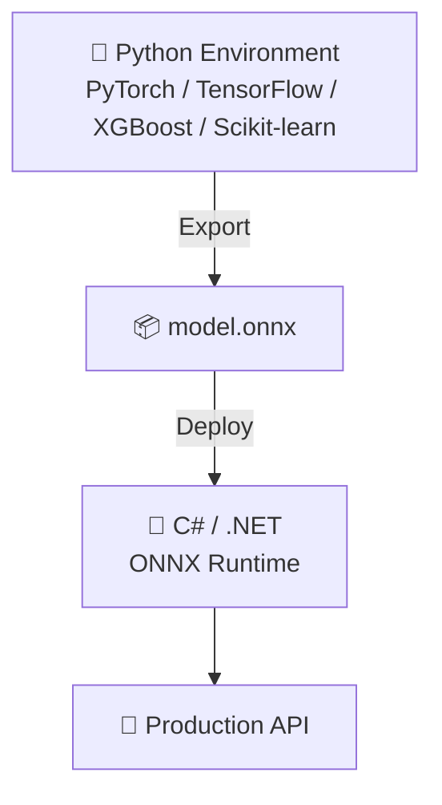
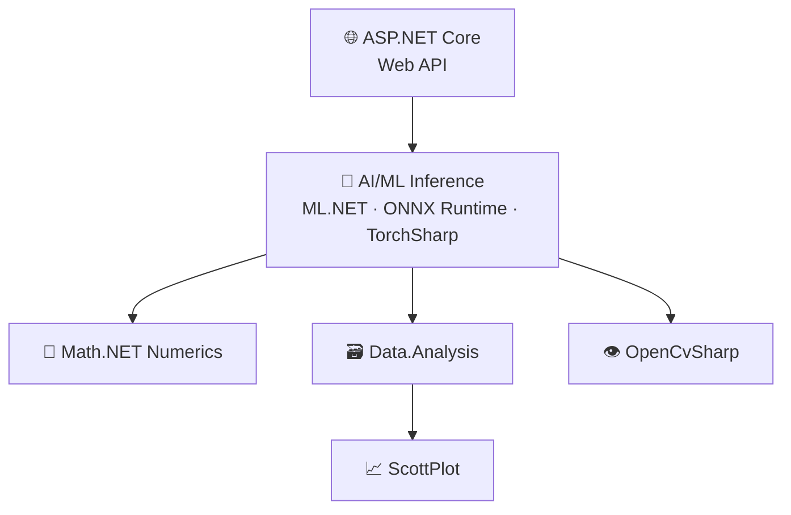
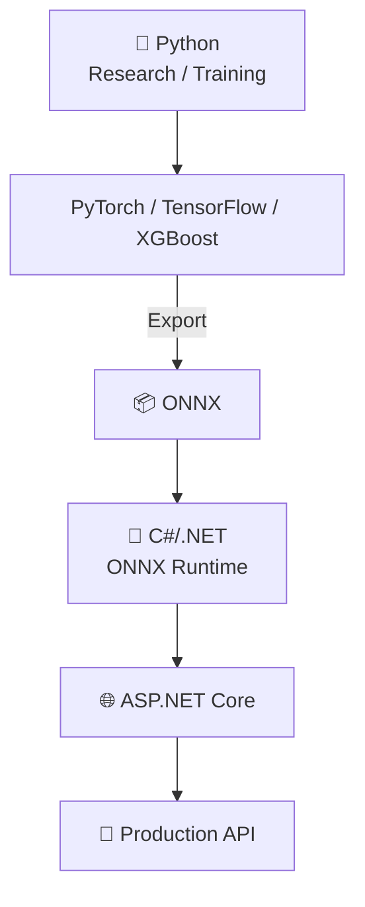

# 🚀 Python AI/ML & Data Science → C#/.NET Equivalents

<p align="center">
  <b>A practical migration guide for Python AI/ML developers moving to the C#/.NET ecosystem</b>
</p>

<p align="center">
  
  
  
  
</p>

<p align="center">
  
  
  
  
</p>

> 🎯 **Goal**: Help Python AI/ML engineers understand the .NET equivalent for every major library, see side-by-side code, and learn how to architect production AI systems using C#/.NET — without giving up Python where it shines.

---

## 🧭 Table of Contents

- [📊 Quick Cheat Sheet](#-quick-cheat-sheet)
- [🌐 FastAPI → ASP.NET Core](#-1-fastapi--aspnet-core)
- [🔢 NumPy → Math.NET Numerics](#-2-numpy--mathnet-numerics)
- [🗃️ Pandas → Microsoft.Data.Analysis / Deedle](#️-3-pandas--microsoftdataanalysis--deedle)
- [🤖 Scikit-learn → ML.NET](#-4-scikit-learn--mlnet)
- [🌳 XGBoost → XGBoost.NET](#-5-xgboost--xgboostnet)
- [🌲 LightGBM → LightGBM.NET](#-6-lightgbm--lightgbmnet)
- [🧠 PyTorch → TorchSharp](#-7-pytorch--torchsharp)
- [🧬 TensorFlow → TensorFlow.NET](#-8-tensorflow--tensorflownet)
- [👁️ OpenCV → OpenCvSharp](#️-9-opencv--opencvsharp)
- [⚡ ONNX → ONNX Runtime](#-10-onnx--onnx-runtime)
- [📈 Matplotlib/Seaborn → ScottPlot](#-11-matplotlibseaborn--scottplot)
- [📓 Jupyter → .NET Interactive](#-12-jupyter--net-interactive)
- [🏗️ Putting the Stack Together](#️-putting-the-stack-together)
- [🔄 Migration Strategy](#-migration-strategy)
- [🎓 Learning Path](#-learning-path)
- [🆚 Python vs .NET: The Bigger Picture](#-python-vs-net-the-bigger-picture)
- [🔥 Final Cheat Sheet](#-final-cheat-sheet)
- [🏷️ Tags & Keywords](#️-tags--keywords)
- [🤝 Contributing](#-contributing)

---

## 📊 Quick Cheat Sheet

| 🐍 Python | 🔷 .NET | 🎯 Primary Use |
|---|---|---|
| FastAPI | ASP.NET Core | REST APIs / ML serving |
| NumPy | Math.NET Numerics | Numerical computing |
| Pandas | Microsoft.Data.Analysis / Deedle | DataFrames |
| Scikit-learn | ML.NET | Classical ML |
| XGBoost | XGBoost.NET | Gradient boosting |
| LightGBM | LightGBM.NET | Gradient boosting |
| PyTorch | TorchSharp | Deep learning |
| TensorFlow | TensorFlow.NET | Deep learning |
| OpenCV | OpenCvSharp | Computer vision |
| ONNX | ONNX Runtime | Model inference |
| Matplotlib / Seaborn | ScottPlot | Visualization |
| Jupyter | .NET Interactive | Interactive notebooks |

> 💡 **Note:** These are *practical* equivalents, not always 1:1 replacements. Some .NET libraries are wrappers/bindings around native engines; others are idiomatic .NET implementations.

---

## 🌐 1. FastAPI → ASP.NET Core

FastAPI is commonly used to expose machine learning models through REST APIs. In .NET, the natural equivalent is **ASP.NET Core Web API**.

<table>
<tr><th>🐍 Python — FastAPI</th><th>🔷 C# — ASP.NET Core</th></tr>
<tr>
<td>

```python
from fastapi import FastAPI

app = FastAPI()

@app.get("/predict")
def predict(x: float):
    return {"prediction": x * 2}
```

</td>
<td>

```csharp
var builder = WebApplication.CreateBuilder(args);
var app = builder.Build();

app.MapGet("/predict", (double x) =>
{
    return Results.Ok(new { prediction = x * 2 });
});

app.Run();
```

</td>
</tr>
</table>

**⭐ Why ASP.NET Core?**
- 🚀 High-performance APIs
- 🔐 Authentication & authorization
- 💉 Dependency injection
- 📋 Logging and observability
- ☁️ Azure integration
- 🧩 Enterprise application integration
- 🏗️ Microservice architecture

---

## 🔢 2. NumPy → Math.NET Numerics

NumPy provides arrays, linear algebra, statistics, and numerical operations. **Math.NET Numerics** is the strongest general-purpose numerical computing option for .NET.

<table>
<tr><th>🐍 Python — NumPy</th><th>🔷 C# — Math.NET Numerics</th></tr>
<tr>
<td>

```python
import numpy as np

x = np.array([1, 2, 3, 4, 5])
print(np.mean(x))
print(np.std(x))
```

</td>
<td>

```csharp
using MathNet.Numerics.Statistics;

double[] x = { 1, 2, 3, 4, 5 };
Console.WriteLine(x.Mean());
Console.WriteLine(x.StandardDeviation());
```

</td>
</tr>
</table>

**🧮 Matrix Operations**

<table>
<tr><th>🐍 Python</th><th>🔷 C#</th></tr>
<tr>
<td>

```python
A = np.array([[1, 2], [3, 4]])
B = np.array([[5, 6], [7, 8]])
C = A @ B
```

</td>
<td>

```csharp
using MathNet.Numerics.LinearAlgebra;

var A = Matrix<double>.Build.DenseOfArray(new double[,] { { 1, 2 }, { 3, 4 } });
var B = Matrix<double>.Build.DenseOfArray(new double[,] { { 5, 6 }, { 7, 8 } });
var C = A * B;
```

</td>
</tr>
</table>

**🎯 Best for:** Linear Algebra • Statistics • Matrices • Numerical Algorithms

---

## 🗃️ 3. Pandas → Microsoft.Data.Analysis / Deedle

Pandas provides 📊 DataFrames, 🔎 filtering, 🧮 grouping/aggregation, 🧹 missing-value handling, 📥 CSV loading, and 🔄 data transformation.

<table>
<tr><th>🐍 Python — Pandas</th><th>🔷 C# — Microsoft.Data.Analysis</th></tr>
<tr>
<td>

```python
import pandas as pd

df = pd.DataFrame({
    "Name": ["A", "B", "C"],
    "Age": [20, 30, 40],
    "Salary": [50000, 70000, 90000]
})

print(df[df["Age"] > 25])
```

</td>
<td>

```csharp
using Microsoft.Data.Analysis;

var df = new DataFrame(
    new StringDataFrameColumn("Name", new[] { "A", "B", "C" }),
    new Int32DataFrameColumn("Age", new[] { 20, 30, 40 }),
    new Int32DataFrameColumn("Salary", new[] { 50000, 70000, 90000 })
);

Console.WriteLine(df);
```

</td>
</tr>
</table>

**🔷 Deedle** is another option, covering DataFrames, Series, time series, data transformation, and statistical analysis.

> 💡 Think of Pandas → Microsoft.Data.Analysis / Deedle as the closest *conceptual* mapping rather than an exact API translation.

---

## 🤖 4. Scikit-learn → ML.NET

Scikit-learn is widely used for classical ML: 📈 regression, 🏷️ classification, 🌳 decision trees, 🌲 random forests, 🎯 clustering, 🧰 feature engineering. **ML.NET** is Microsoft's machine learning framework for .NET.

<table>
<tr><th>🐍 Python — Scikit-learn</th><th>🔷 C# — ML.NET</th></tr>
<tr>
<td>

```python
from sklearn.linear_model import LinearRegression

X = [[1], [2], [3], [4]]
y = [2, 4, 6, 8]

model = LinearRegression()
model.fit(X, y)

prediction = model.predict([[5]])
print(prediction)
```

</td>
<td>

```csharp
using Microsoft.ML;

var mlContext = new MLContext();

var data = new[]
{
    new ModelInput { Feature = 1, Label = 2 },
    new ModelInput { Feature = 2, Label = 4 },
    new ModelInput { Feature = 3, Label = 6 },
    new ModelInput { Feature = 4, Label = 8 }
};

var trainingData = mlContext.Data.LoadFromEnumerable(data);

var pipeline = mlContext.Transforms
    .Concatenate("Features", nameof(ModelInput.Feature))
    .Append(mlContext.Regression.Trainers.Sdca());

var model = pipeline.Fit(trainingData);

public class ModelInput
{
    public float Feature { get; set; }
    public float Label { get; set; }
}
```

</td>
</tr>
</table>

**⭐ ML.NET shines when** you want ML functionality directly inside an existing C#/.NET application without introducing a separate Python service.

---

## 🌳 5. XGBoost → XGBoost.NET

XGBoost is a popular gradient-boosting framework, especially for structured/tabular data.

<table>
<tr><th>🐍 Python</th><th>🔷 C# — XGBoost.NET</th></tr>
<tr>
<td>

```python
from xgboost import XGBRegressor

model = XGBRegressor(
    n_estimators=100,
    max_depth=5,
    learning_rate=0.1
)

model.fit(X_train, y_train)
predictions = model.predict(X_test)
```

</td>
<td>

.NET bindings such as `XGBoost.NET` allow XGBoost models to be used from C#. The workflow remains:

```
Load Data → Configure XGBoost → Train Model → Evaluate → Predict
```

</td>
</tr>
</table>

**Common parameters**

| Parameter | Meaning |
|---|---|
| `n_estimators` | Number of trees / boosting rounds |
| `max_depth` | Maximum tree depth |
| `learning_rate` | Learning step size |
| `subsample` | Training sample ratio |
| `colsample_bytree` | Feature sampling ratio |

> ⚠️ The exact .NET API depends on the XGBoost binding/package version. Always check package docs before copying production code.

---

## 🌲 6. LightGBM → LightGBM.NET

Another high-performance gradient-boosting framework.

<table>
<tr><th>🐍 Python</th><th>🔷 C# — Conceptual Flow</th></tr>
<tr>
<td>

```python
import lightgbm as lgb

model = lgb.LGBMClassifier(
    n_estimators=100,
    learning_rate=0.05,
    num_leaves=31
)

model.fit(X_train, y_train)
predictions = model.predict(X_test)
```

</td>
<td>

```
Training Data → LightGBM → Gradient Boosting Trees → Trained Model → Prediction
```

.NET bindings provide access to the LightGBM engine.

</td>
</tr>
</table>

**🎯 Excellent for:** Large tabular datasets • Classification • Regression • Ranking • High-dimensional features

---

## 🧠 7. PyTorch → TorchSharp

**TorchSharp** provides official .NET bindings for PyTorch.

<table>
<tr><th>🐍 Python — PyTorch</th><th>🔷 C# — TorchSharp</th></tr>
<tr>
<td>

```python
import torch

x = torch.tensor([1.0, 2.0, 3.0])
y = x * 2

print(y)
```

</td>
<td>

```csharp
using TorchSharp;
using static TorchSharp.torch;

var x = tensor(new float[] { 1.0f, 2.0f, 3.0f });
var y = x * 2;

Console.WriteLine(y);
```

</td>
</tr>
</table>

**🧠 Neural Network**

<table>
<tr><th>🐍 Python</th><th>🔷 C#</th></tr>
<tr>
<td>

```python
import torch.nn as nn

model = nn.Sequential(
    nn.Linear(10, 32),
    nn.ReLU(),
    nn.Linear(32, 1)
)
```

</td>
<td>

```csharp
using static TorchSharp.torch.nn;

var model = Sequential(
    Linear(10, 32),
    ReLU(),
    Linear(32, 1)
);
```

</td>
</tr>
</table>

**🚀 Useful for:** Deep Learning • Computer Vision • NLP • Custom Neural Networks

---

## 🧬 8. TensorFlow → TensorFlow.NET

**TensorFlow.NET** provides .NET bindings for TensorFlow.

<table>
<tr><th>🐍 Python</th><th>🔷 C#</th></tr>
<tr>
<td>

```python
import tensorflow as tf

x = tf.constant([1, 2, 3])
y = x * 2

print(y)
```

</td>
<td>

```csharp
using Tensorflow;
using static Tensorflow.Binding;

var x = tf.constant(new[] { 1, 2, 3 });
var y = x * 2;

Console.WriteLine(y);
```

</td>
</tr>
</table>

> 💡 For many production inference scenarios, also consider **ONNX Runtime**, particularly when your model was trained in Python and needs to run inside a .NET service.

---

## 👁️ 9. OpenCV → OpenCvSharp

**OpenCvSharp** provides a .NET wrapper around OpenCV.

<table>
<tr><th>🐍 Python</th><th>🔷 C# — OpenCvSharp</th></tr>
<tr>
<td>

```python
import cv2

image = cv2.imread("image.jpg")
gray = cv2.cvtColor(image, cv2.COLOR_BGR2GRAY)
cv2.imwrite("gray.jpg", gray)
```

</td>
<td>

```csharp
using OpenCvSharp;

using var image = Cv2.ImRead("image.jpg");
using var gray = new Mat();

Cv2.CvtColor(image, gray, ColorConversionCodes.BGR2GRAY);
Cv2.ImWrite("gray.jpg", gray);
```

</td>
</tr>
</table>

**🎯 Common applications:** 📷 Image processing • 🎥 Video processing • 👤 Face detection • 🔍 Object detection pipelines • 🧹 Image preprocessing • 🖼️ Computer vision

---

## ⚡ 10. ONNX → ONNX Runtime

> 🔑 **One of the most important bridges between Python AI and .NET production systems**

ONNX is primarily a model interchange format. **ONNX Runtime** is the inference engine.



<table>
<tr><th>🐍 Python — Export</th><th>🔷 C# — Load Model</th></tr>
<tr>
<td>

```python
torch.onnx.export(
    model,
    sample_input,
    "model.onnx"
)
```

</td>
<td>

```csharp
using Microsoft.ML.OnnxRuntime;

using var session = new InferenceSession("model.onnx");
using var results = session.Run(inputs);
```

</td>
</tr>
</table>

**⭐ Why this matters:** 🐍 Train in Python → 📦 Export to ONNX → 🔷 Deploy using C# → ⚡ Run inference using ONNX Runtime → 🚀 Serve through ASP.NET Core — avoiding the need for a Python runtime in many production deployments.

---

## 📈 11. Matplotlib/Seaborn → ScottPlot

**ScottPlot** is a popular plotting library for .NET.

<table>
<tr><th>🐍 Python — Matplotlib</th><th>🔷 C# — ScottPlot</th></tr>
<tr>
<td>

```python
import matplotlib.pyplot as plt

x = [1, 2, 3, 4]
y = [10, 20, 15, 30]

plt.plot(x, y)
plt.show()
```

</td>
<td>

```csharp
using ScottPlot;

double[] x = { 1, 2, 3, 4 };
double[] y = { 10, 20, 15, 30 };

var plot = new Plot();
plot.Add.Scatter(x, y);
plot.SavePng("chart.png", 800, 600);
```

</td>
</tr>
</table>

**📊 Useful for:** Line charts • Scatter plots • Histograms • Signal plots • Scientific visualization • Statistical visualization

---

## 📓 12. Jupyter → .NET Interactive

**.NET Interactive** provides a notebook-style environment for C#, F#, and PowerShell.

```csharp
var numbers = new[] { 1, 2, 3, 4, 5 };
var average = numbers.Average();
average
```

**🎯 Useful for:** Data Exploration • ML Experiments • Learning • Prototyping • Documentation

---

## 🏗️ Putting the Stack Together

A production-oriented .NET AI/ML architecture:



---

## 🔄 Migration Strategy

You do **not** always need to rewrite an entire Python AI system in C#. A **hybrid architecture** is often more practical:



**💡 Why use this architecture?**

| Keep in 🐍 Python | Move to 🔷 .NET |
|---|---|
| Research | Enterprise integration |
| Experimentation | Production APIs |
| Model training | Cloud deployment |

---

## 🎓 Learning Path

If your goal is to become a **.NET AI/ML Engineer**, a practical order is:

| Order | Library | Focus Areas |
|---|---|---|
| 🥇 1 | **Math.NET Numerics** | Vectors, matrices, statistics, numerical operations |
| 🥈 2 | **Microsoft.Data.Analysis** | DataFrames, data cleaning, feature engineering, transformation |
| 🥉 3 | **ML.NET** | Classification, regression, clustering, model evaluation, pipelines |
| 4️⃣ | **ONNX Runtime** | Model loading, tensor inputs, inference, production serving |
| 5️⃣ | **TorchSharp** | Tensors, neural networks, deep learning, GPU inference/training |
| 6️⃣ | **ASP.NET Core** | REST APIs, dependency injection, auth, model-serving, deployment |

---

## 🆚 Python vs .NET: The Bigger Picture

| Area | 🐍 Python | 🔷 .NET |
|---|:---:|:---:|
| AI Research | ⭐⭐⭐⭐⭐ | ⭐⭐⭐ |
| Latest ML Libraries | ⭐⭐⭐⭐⭐ | ⭐⭐⭐ |
| Data Science | ⭐⭐⭐⭐⭐ | ⭐⭐⭐ |
| Classical ML | ⭐⭐⭐⭐⭐ | ⭐⭐⭐⭐ |
| Enterprise Integration | ⭐⭐⭐ | ⭐⭐⭐⭐⭐ |
| ASP.NET APIs | ⭐⭐ | ⭐⭐⭐⭐⭐ |
| Microsoft/Azure Ecosystem | ⭐⭐⭐⭐ | ⭐⭐⭐⭐⭐ |
| Existing C# Systems | ⭐⭐ | ⭐⭐⭐⭐⭐ |
| Production Inference | ⭐⭐⭐⭐ | ⭐⭐⭐⭐⭐ |
| Deep Learning | ⭐⭐⭐⭐⭐ | ⭐⭐⭐ |
| Model Interoperability | ⭐⭐⭐⭐ | ⭐⭐⭐⭐⭐ |

> 🧠 **The key point:** Python and .NET don't have to compete. They can work together.

---

## 🔥 Final Cheat Sheet

| 🐍 Python | 🔷 .NET | 🎯 Use Case |
|---|---|---|
| FastAPI | ASP.NET Core | 🌐 API / Model Serving |
| NumPy | Math.NET Numerics | 🔢 Numerical Computing |
| Pandas | Microsoft.Data.Analysis / Deedle | 🗃️ DataFrames |
| Scikit-learn | ML.NET | 🤖 Classical ML |
| XGBoost | XGBoost.NET | 🌳 Gradient Boosting |
| LightGBM | LightGBM.NET | 🌲 Gradient Boosting |
| PyTorch | TorchSharp | 🧠 Deep Learning |
| TensorFlow | TensorFlow.NET | 🧬 Deep Learning |
| OpenCV | OpenCvSharp | 👁️ Computer Vision |
| ONNX | ONNX Runtime | ⚡ Model Inference |
| Matplotlib / Seaborn | ScottPlot | 📈 Visualization |
| Jupyter | .NET Interactive | 📓 Interactive Data Science |

### 🎯 Bottom Line

> 🚀 **You don't need Python to build production AI systems in a .NET environment.**

A strong C#/.NET AI stack combines:

```
C#
 ├── ASP.NET Core       → APIs
 ├── ML.NET             → Classical ML
 ├── Math.NET           → Numerical Computing
 ├── Data.Analysis      → DataFrames
 ├── TorchSharp         → Deep Learning
 ├── ONNX Runtime       → Model Inference
 ├── OpenCvSharp        → Computer Vision
 └── ScottPlot          → Visualization
```

For many enterprise systems, one of the most powerful patterns is:

**🐍 Python for model development + ⚡ ONNX for portability + 🔷 .NET for production integration.**

---

## 🏷️ Tags & Keywords

`#dotnet` `#csharp` `#python` `#machinelearning` `#deeplearning` `#mlnet` `#onnx` `#onnxruntime` `#torchsharp` `#tensorflownet` `#opencvsharp` `#scottplot` `#aspnetcore` `#mathnet` `#dataanalysis` `#ai` `#artificialintelligence` `#datascience` `#xgboost` `#lightgbm` `#enterprisearchitecture` `#cloudnative` `#azure` `#modelinference` `#mlops` `#developerguide` `#cheatsheet` `#migrationguide` `#dotnetai` `#pythonvsdotnet`

**Topics:** `python` · `dotnet` · `csharp` · `machine-learning` · `deep-learning` · `ml-net` · `onnx-runtime` · `torchsharp` · `tensorflow-net` · `opencvsharp` · `data-science` · `aspnet-core` · `ai-engineering` · `cheat-sheet` · `developer-guide`

---

## 🤝 Contributing

Contributions are welcome! If you know of a better .NET equivalent, a newer library version, or want to add more side-by-side examples (NLP, LLMs, vector databases, etc.), feel free to open a PR or issue.

1. 🍴 Fork the repo
2. 🌿 Create a feature branch
3. ✍️ Add your section following the existing format
4. 📬 Open a pull request

---

<p align="center">
  ⭐ If you found this useful, consider starring the repo and sharing it with other Python developers exploring .NET AI/ML! ⭐
</p>
