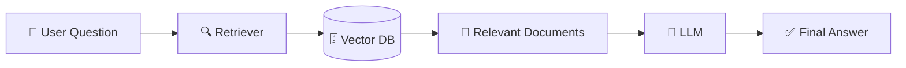
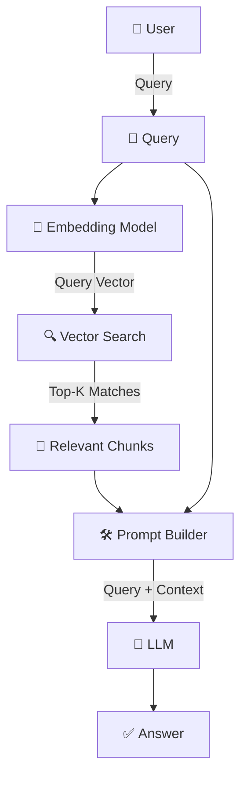
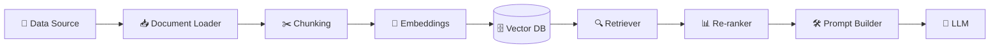
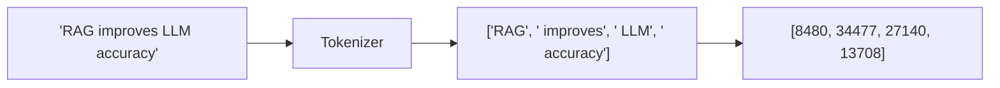
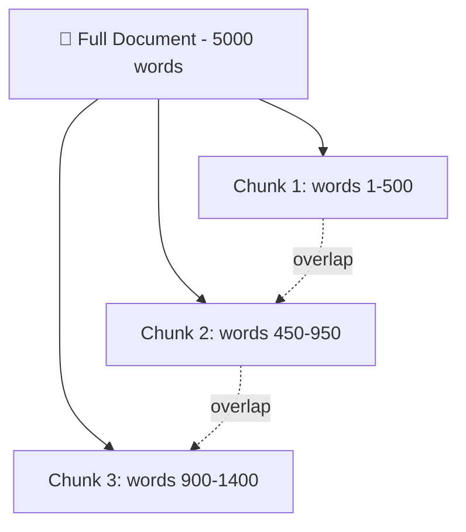
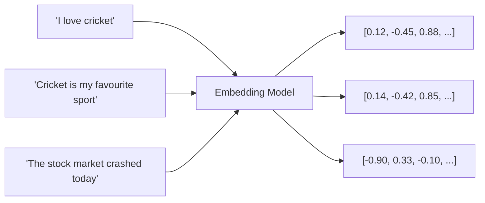
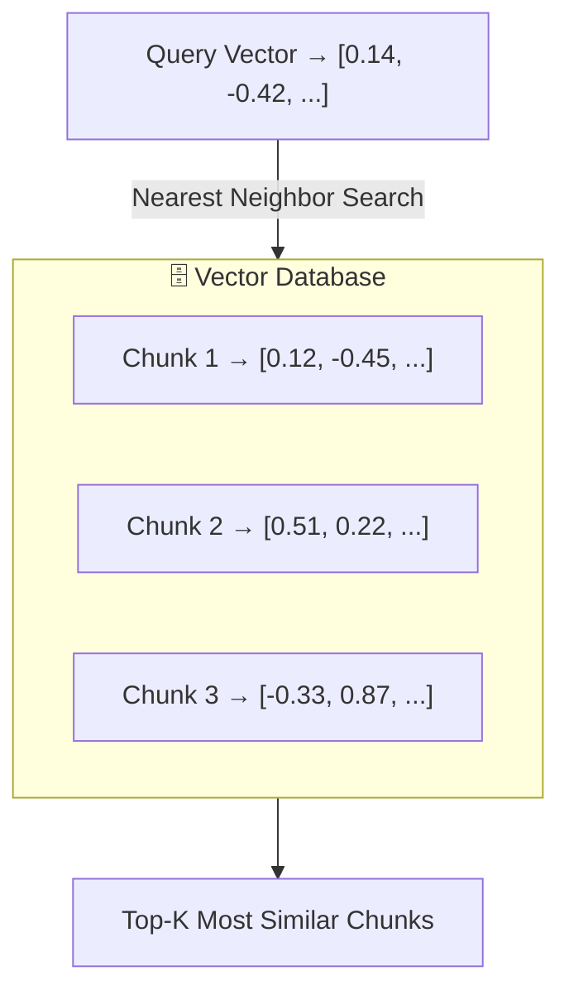
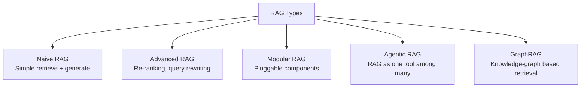
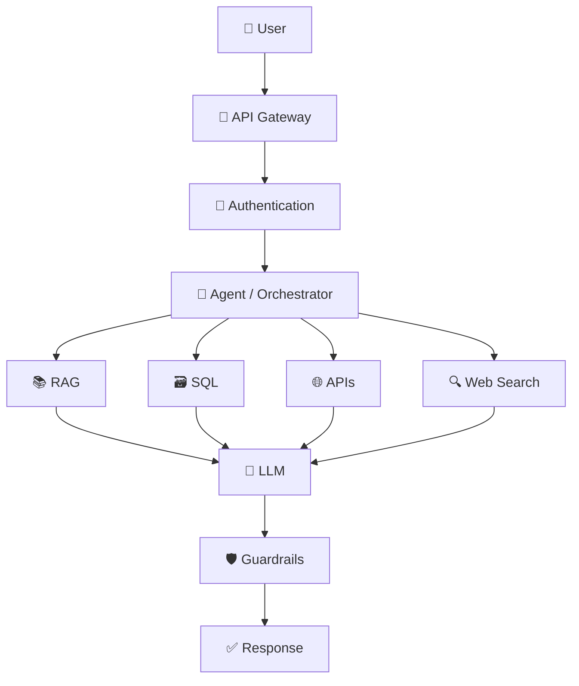

# 🔎 RAG Explained — From Zero to Production (Beginner Friendly Guide)

> **A complete, beginner-friendly guide to Retrieval-Augmented Generation (RAG) — with diagrams, Python code, and .NET code.**
>
> Written in simple Indian English, so that even if you are a fresher or a working professional switching to GenAI, you will understand each concept without any confusion.

<div align="center">


**If this guide helped you, please ⭐ star this repo — it motivates me to write more such guides!**

</div>

---

## 📑 Table of Contents

1. [What is RAG? (In Simple Words)](#1-what-is-rag-in-simple-words)
2. [Why do LLMs Need RAG?](#2-why-do-llms-need-rag)
3. [Problems Solved by RAG](#3-problems-solved-by-rag)
4. [Why AI Engineers Should Learn RAG](#4-why-ai-engineers-should-learn-rag)
5. [RAG Architecture (High Level Design)](#5-rag-architecture-high-level-design)
6. [Core Components of RAG (Explained One by One)](#6-core-components-of-rag-explained-one-by-one)
7. [Hands-On: Tokenization Explained with Code](#7-hands-on-tokenization-explained-with-code)
8. [Hands-On: Chunking Explained with Code](#8-hands-on-chunking-explained-with-code)
9. [Hands-On: Embeddings Explained with Code](#9-hands-on-embeddings-explained-with-code)
10. [Hands-On: Vector Database Explained with Code](#10-hands-on-vector-database-explained-with-code)
11. [Hands-On: Retrieval Explained with Code](#11-hands-on-retrieval-explained-with-code)
12. [Putting It All Together — Full RAG Pipeline](#12-putting-it-all-together--full-rag-pipeline)
13. [.NET Example — RAG with Semantic Kernel](#13-net-example--rag-with-semantic-kernel)
14. [Types of RAG](#14-types-of-rag)
15. [Python & .NET Libraries for RAG](#15-python--net-libraries-for-rag)
16. [LangChain, LangGraph, LangSmith & Hugging Face](#16-langchain-langgraph-langsmith--hugging-face)
17. [Popular Tools & Vector Databases](#17-popular-tools--vector-databases)
18. [Where RAG Fits in System Design](#18-where-rag-fits-in-system-design)
19. [Common Challenges in RAG](#19-common-challenges-in-rag)
20. [Is RAG Dead? (Agentic RAG)](#20-is-rag-dead-agentic-rag)
21. [Securing AI Applications](#21-securing-ai-applications)
22. [Next Reading & Keywords](#22-next-reading--keywords)

---

## 1. What is RAG? (In Simple Words)

Suppose you ask a very intelligent friend a question, but that friend read his last book 2 years back. He is very smart, but he does not know what happened yesterday, and he definitely does not know the private data of your company.

Now imagine, before answering, this friend quickly opens Google, searches your company's internal documents, reads the relevant pages, and *then* answers you using both his own intelligence and the fresh information he just read.

**That is exactly what RAG (Retrieval-Augmented Generation) does for an LLM.**

> **RAG = Retrieval (finding relevant information) + Augmented (adding that information to the prompt) + Generation (LLM writing the final answer)**

Instead of the LLM answering only from what it "remembers" from training, RAG fetches relevant chunks of text from an external knowledge source (PDFs, websites, databases, SharePoint, etc.) and feeds it to the LLM **at the time of asking the question**. This way, the answer is grounded, current, and specific to your data.

**Simple Flow:**



---

## 2. Why do LLMs Need RAG?

LLMs (like GPT, Claude, Gemini, Llama) are trained on a huge amount of internet data, but they have some genuine limitations:

| Limitation | Explanation |
|---|---|
| 📅 **Knowledge cutoff** | The model only knows data up to its training date. It doesn't know today's news. |
| 🔒 **No access to private data** | It has never seen your company's internal HR policy or product manual. |
| 🤥 **Hallucination** | When the model doesn't know the answer, sometimes it confidently makes up a wrong answer. |
| 🔄 **Static knowledge** | It cannot know that your company changed a policy last week. |

RAG solves all of the above by **grounding** the model's answer with real, current, and trusted documents at query time — without having to retrain the whole model (which is very costly).

---

## 3. Problems Solved by RAG

- ✅ Reduces hallucinations by giving the model actual facts to work with
- ✅ Answers questions from your own enterprise documents
- ✅ Always uses the latest, up-to-date information (no retraining needed)
- ✅ Improves factual accuracy and trustworthiness of answers
- ✅ Enables document-aware chatbots (e.g., "Ask your PDF" type apps)
- ✅ Cheaper than fine-tuning the whole model for new knowledge

---

## 4. Why AI Engineers Should Learn RAG

RAG is one of the most in-demand, foundational skills in GenAI today. It powers:

- 🏢 Enterprise chatbots and internal knowledge assistants
- 🎧 Customer support automation
- ⚖️ Legal AI (contract search, case law lookup)
- 🏥 Healthcare AI (clinical guideline lookup)
- 🏦 Banking assistants (policy, compliance Q&A)
- 👨‍💻 Developer copilots (codebase-aware assistants)

If you are preparing for GenAI/AI Engineer interviews, RAG is almost always asked — from theory to hands-on system design.

---

## 5. RAG Architecture (High Level Design)



**Step by step, in plain words:**

1. User asks a question.
2. That question is converted into a vector (a list of numbers) using an embedding model.
3. This vector is used to search a Vector Database for the most semantically similar chunks of text.
4. The top matching chunks are picked up (this is called "retrieval").
5. A prompt is built by combining the user's question + the retrieved chunks + instructions.
6. This combined prompt is sent to the LLM.
7. The LLM generates the final answer, grounded in the retrieved data.

---

## 6. Core Components of RAG (Explained One by One)



### 1️⃣ Data Source
The raw material — PDFs, Word files, websites, SharePoint, databases, Confluence, etc.

### 2️⃣ Document Loader
Reads the raw documents into your pipeline so they can be processed further.

```python
from langchain_community.document_loaders import PyPDFLoader

docs = PyPDFLoader("policy.pdf").load()
print(f"Loaded {len(docs)} pages")
```

### 3️⃣ Chunking
Big documents are broken into small, digestible pieces (chunks) so the LLM and vector DB can handle them efficiently. Covered in detail in [Section 8](#8-hands-on-chunking-explained-with-code).

### 4️⃣ Embeddings
Each chunk of text is converted into a vector (list of numbers) that captures its *meaning*. Covered in detail in [Section 9](#9-hands-on-embeddings-explained-with-code).

### 5️⃣ Vector Database
Stores these embeddings so that similarity search can be done fast, even across millions of chunks. Covered in [Section 10](#10-hands-on-vector-database-explained-with-code).

### 6️⃣ Retriever
Given a query, finds the most relevant chunks from the vector DB. Types: Similarity Search, Hybrid Search, MMR (Maximal Marginal Relevance), Metadata Filtering.

### 7️⃣ Re-ranker (Optional but Powerful)
After initial retrieval, a re-ranker model (like Cohere Rerank or BGE Reranker) re-scores the chunks for better precision, since the first-pass similarity search is not always perfect.

### 8️⃣ Prompt Builder
Combines the user's query + retrieved context + system instructions into one final prompt for the LLM.

### 9️⃣ LLM
The final brain that reads everything and generates a fluent, grounded answer — GPT, Claude, Gemini, Llama, etc.

---

## 7. Hands-On: Tokenization Explained with Code

Before any text can be embedded or fed to an LLM, it must be broken into **tokens** — the smallest units a model understands (this could be a word, sub-word, or even a single character).

> Think of tokenization like cutting a roti into small pieces before eating — the LLM "eats" text in these small token pieces, not the whole sentence at once.



### Python Example (using `tiktoken` — the tokenizer used by OpenAI models)

```python
# pip install tiktoken
import tiktoken

# Load the tokenizer used by GPT-4 / GPT-3.5 family
encoding = tiktoken.encoding_for_model("gpt-4")

text = "RAG improves LLM accuracy by retrieving relevant documents."

# Convert text -> token IDs
token_ids = encoding.encode(text)
print("Token IDs:", token_ids)
print("Number of tokens:", len(token_ids))

# Convert token IDs back -> text (to see how it was split)
tokens_as_text = [encoding.decode([tid]) for tid in token_ids]
print("Tokens:", tokens_as_text)
```

**Sample Output:**
```
Token IDs: [49, 1929, 18142, 445, 11237, 13708, 555, 100191, 9959, 9477, 13]
Number of tokens: 11
Tokens: ['R', 'AG', ' improves', ' LL', 'M', ' accuracy', ' by', ' retrieving', ' relevant', ' documents', '.']
```

**Why tokenization matters in RAG:**
- LLMs have a **context window limit** measured in tokens (e.g., 128K tokens), not words.
- Chunk sizes are usually decided in terms of tokens, not characters — so you must count tokens correctly to avoid exceeding limits.
- API cost is billed per token, so knowing token count helps you estimate cost.

---

## 8. Hands-On: Chunking Explained with Code

A 200-page PDF cannot be sent to an LLM directly (context window limit + poor retrieval accuracy). So we break it into small, meaningful **chunks** — usually 200 to 1000 tokens each, often with some **overlap** so that context is not lost at chunk boundaries.



### Python Example — Recursive Character Chunking

```python
# pip install langchain-text-splitters
from langchain_text_splitters import RecursiveCharacterTextSplitter

text = """
Retrieval-Augmented Generation (RAG) is a technique that combines a
retrieval system with a generative language model. Instead of relying
purely on the parameters learned during training, RAG fetches relevant
documents from an external knowledge base at inference time.

This helps in reducing hallucinations, since the model has real
context to base its answer on. It also allows the system to stay
up-to-date without expensive retraining, because you only need to
update the knowledge base, not the model itself.
"""

splitter = RecursiveCharacterTextSplitter(
    chunk_size=150,      # max characters per chunk
    chunk_overlap=30,    # overlap so context isn't lost at the boundary
    separators=["\n\n", "\n", ". ", " ", ""]
)

chunks = splitter.split_text(text)

for i, chunk in enumerate(chunks, 1):
    print(f"--- Chunk {i} ({len(chunk)} chars) ---")
    print(chunk.strip())
    print()
```

**Chunking strategies comparison:**

| Strategy | How it works | Best for |
|---|---|---|
| **Fixed-size** | Splits by a fixed number of characters/tokens | Simple, fast, generic text |
| **Recursive** | Tries to split at natural boundaries (paragraph → sentence → word) | Most general-purpose use cases |
| **Semantic** | Splits based on meaning shift (using embeddings) | High-precision RAG apps |
| **Token-based** | Splits based on token count (using tiktoken) | When you must respect LLM token limits exactly |

---

## 9. Hands-On: Embeddings Explained with Code

An embedding is a way to convert text into a list of numbers (a vector) such that texts with **similar meaning** end up **close together** in that number-space — even if they don't share the same words.

> Example: "I love cricket" and "Cricket is my favourite sport" will have vectors that are close to each other, even though the words are different — because the *meaning* is similar.



### Python Example (using `sentence-transformers` — free, open-source, runs locally)

```python
# pip install sentence-transformers scikit-learn
from sentence_transformers import SentenceTransformer
from sklearn.metrics.pairwise import cosine_similarity

# Load a small, fast, open-source embedding model
model = SentenceTransformer("all-MiniLM-L6-v2")

sentences = [
    "I love watching cricket on weekends.",
    "Cricket is my favourite sport to watch.",
    "The stock market crashed heavily today."
]

# Convert sentences into embedding vectors
embeddings = model.encode(sentences)
print("Embedding shape:", embeddings.shape)   # e.g. (3, 384)

# Compare similarity between sentence 1 and 2, and 1 and 3
sim_1_2 = cosine_similarity([embeddings[0]], [embeddings[1]])[0][0]
sim_1_3 = cosine_similarity([embeddings[0]], [embeddings[2]])[0][0]

print(f"Similarity (cricket vs cricket): {sim_1_2:.4f}")
print(f"Similarity (cricket vs stock market): {sim_1_3:.4f}")
```

**Expected Output:**
```
Embedding shape: (3, 384)
Similarity (cricket vs cricket): 0.7621
Similarity (cricket vs stock market): 0.0563
```

Notice how the two cricket-related sentences score much higher similarity (closer to 1.0) than the unrelated stock market sentence (closer to 0.0). **This is the core magic that makes RAG retrieval work.**

---

## 10. Hands-On: Vector Database Explained with Code

Once you have embeddings for thousands (or millions) of chunks, you need a place to **store** them and **search** them fast. A normal SQL database is not built for "find me the most similar vector" queries — that's exactly what a **Vector Database** is optimized for.



### Python Example (using FAISS — a free, local, in-memory vector DB by Meta)

```python
# pip install faiss-cpu sentence-transformers numpy
import faiss
import numpy as np
from sentence_transformers import SentenceTransformer

model = SentenceTransformer("all-MiniLM-L6-v2")

# Our small "knowledge base" of chunks
chunks = [
    "RAG combines retrieval with generation to reduce hallucinations.",
    "Chunking breaks large documents into smaller pieces for processing.",
    "Cricket is a popular sport played in India, Australia, and England.",
    "Vector databases store embeddings for fast similarity search.",
]

# Step 1: Convert all chunks into embeddings
chunk_embeddings = model.encode(chunks).astype("float32")

# Step 2: Create a FAISS index and add our vectors to it
dimension = chunk_embeddings.shape[1]
index = faiss.IndexFlatL2(dimension)   # L2 = Euclidean distance
index.add(chunk_embeddings)

print(f"Total vectors stored in index: {index.ntotal}")

# Step 3: Save index to disk (optional, for persistence)
faiss.write_index(index, "knowledge_base.index")
```

---

## 11. Hands-On: Retrieval Explained with Code

Retrieval is the step where, given a user's query, we search the vector DB and pull out the **top-K most relevant chunks**.

```python
# Continuing from the FAISS example above

query = "How does RAG help in reducing wrong answers from LLMs?"

# Step 1: Convert the query into a vector using the SAME embedding model
query_vector = model.encode([query]).astype("float32")

# Step 2: Search the FAISS index for the top 2 most similar chunks
top_k = 2
distances, indices = index.search(query_vector, top_k)

print(f"Query: {query}\n")
print("Top matching chunks:")
for rank, idx in enumerate(indices[0], 1):
    print(f"{rank}. {chunks[idx]}  (distance: {distances[0][rank-1]:.4f})")
```

**Sample Output:**
```
Query: How does RAG help in reducing wrong answers from LLMs?

Top matching chunks:
1. RAG combines retrieval with generation to reduce hallucinations.  (distance: 0.8123)
2. Vector databases store embeddings for fast similarity search.  (distance: 1.4521)
```

Notice that even though the query doesn't use the exact words "hallucination" or "RAG combines" — the retriever still finds the most semantically related chunk, thanks to embeddings. **Lower distance = more similar.**

---

## 12. Putting It All Together — Full RAG Pipeline

```python
# pip install sentence-transformers faiss-cpu openai

from sentence_transformers import SentenceTransformer
import faiss
import numpy as np
from openai import OpenAI

# ---------- 1. Setup ----------
embed_model = SentenceTransformer("all-MiniLM-L6-v2")
client = OpenAI()  # requires OPENAI_API_KEY env variable

knowledge_base = [
    "Our company's leave policy allows 18 paid leaves per year.",
    "Employees can work from home twice a week as per WFH policy.",
    "The notice period for resignation is 60 days for all full-time employees.",
]

# ---------- 2. Index the knowledge base ----------
kb_embeddings = embed_model.encode(knowledge_base).astype("float32")
index = faiss.IndexFlatL2(kb_embeddings.shape[1])
index.add(kb_embeddings)

# ---------- 3. RAG function ----------
def rag_answer(user_query: str, top_k: int = 2) -> str:
    # Retrieve
    query_vec = embed_model.encode([user_query]).astype("float32")
    _, indices = index.search(query_vec, top_k)
    retrieved_chunks = [knowledge_base[i] for i in indices[0]]
    context = "\n".join(retrieved_chunks)

    # Augment + Generate
    prompt = f"""Answer the question using ONLY the context below.
If the answer is not in the context, say "I don't know."

Context:
{context}

Question: {user_query}
Answer:"""

    response = client.chat.completions.create(
        model="gpt-4o-mini",
        messages=[{"role": "user", "content": prompt}],
    )
    return response.choices[0].message.content

# ---------- 4. Try it ----------
print(rag_answer("How many paid leaves do I get in a year?"))
```

---

## 13. .NET Example — RAG with Semantic Kernel

For .NET / C# developers, Microsoft's **Semantic Kernel** is the most popular framework to build RAG applications.

```csharp
// dotnet add package Microsoft.SemanticKernel
// dotnet add package Microsoft.SemanticKernel.Connectors.OpenAI

using Microsoft.SemanticKernel;
using Microsoft.SemanticKernel.Embeddings;
using Microsoft.SemanticKernel.Memory;

var kernelBuilder = Kernel.CreateBuilder();

kernelBuilder.AddOpenAIChatCompletion(
    modelId: "gpt-4o-mini",
    apiKey: Environment.GetEnvironmentVariable("OPENAI_API_KEY")!);

var kernel = kernelBuilder.Build();

// Build an in-memory vector store for our knowledge base
var memoryBuilder = new MemoryBuilder();
memoryBuilder.WithOpenAITextEmbeddingGeneration(
    "text-embedding-3-small",
    Environment.GetEnvironmentVariable("OPENAI_API_KEY")!);
memoryBuilder.WithMemoryStore(new VolatileMemoryStore());
var memory = memoryBuilder.Build();

// Step 1: Save chunks into memory (embeds + stores them)
await memory.SaveInformationAsync(
    collection: "company-policy",
    text: "Our company's leave policy allows 18 paid leaves per year.",
    id: "chunk-1");

await memory.SaveInformationAsync(
    collection: "company-policy",
    text: "The notice period for resignation is 60 days.",
    id: "chunk-2");

// Step 2: Retrieve the most relevant chunk for a user query
var query = "How many leaves do employees get?";
var results = memory.SearchAsync(
    collection: "company-policy",
    query: query,
    limit: 1,
    minRelevanceScore: 0.5);

string context = "";
await foreach (var result in results)
{
    context += result.Metadata.Text + "\n";
}

// Step 3: Augment + Generate final answer
var prompt = $"""
Answer using only the context below.
Context: {context}
Question: {query}
""";

var response = await kernel.InvokePromptAsync(prompt);
Console.WriteLine(response);
```

---

## 14. Types of RAG



| Type | Description |
|---|---|
| **Naive RAG** | Simple retrieve → generate. Good for prototypes and learning. |
| **Advanced RAG** | Adds query rewriting, re-ranking, and hybrid search for better accuracy. |
| **Modular RAG** | Components (retriever, ranker, generator) are swappable and independently improvable. |
| **Agentic RAG** | An AI agent decides *when* and *whether* to retrieve, and can combine RAG with SQL, APIs, web search, etc. |
| **GraphRAG** | Uses a knowledge graph instead of (or along with) plain vector search — great for relationship-heavy data. |

---

## 15. Python & .NET Libraries for RAG

**Python:**
- LangChain
- LlamaIndex
- Haystack
- ChromaDB
- FAISS
- sentence-transformers
- transformers
- openai
- qdrant-client

**.NET:**
- Microsoft.Extensions.AI
- Microsoft Semantic Kernel
- Azure.AI.OpenAI
- Azure.Search.Documents
- OpenAI .NET SDK
- Qdrant.Client
- Pinecone SDK

---

## 16. LangChain, LangGraph, LangSmith & Hugging Face

| Framework | Purpose |
|---|---|
| **LangChain** | Build RAG pipelines — prompt templates, chains, retrievers |
| **LangGraph** | Multi-step workflows, AI agents, state management |
| **LangSmith** | Debugging, evaluation, observability for LLM apps |
| **Hugging Face** | Open-source models, embedding models, transformers, datasets |

---

## 17. Popular Tools & Vector Databases

| Tool | Purpose | Benefit |
|---|---|---|
| Azure AI Search | Enterprise Retrieval | Fully managed search |
| Pinecone | Vector DB | Serverless, easy to scale |
| Qdrant | Vector DB | Open source, fast |
| Chroma | Local DB | Great for quick development |
| FAISS | Local similarity search | Extremely fast, free |
| Weaviate | Vector DB | Built-in hybrid search |
| OpenSearch | Search | Scalable, open source |
| Cohere | Re-ranking | Improves final accuracy |

---

## 18. Where RAG Fits in System Design



---

## 19. Common Challenges in RAG

- 🤥 Hallucinations (still possible even with retrieval)
- ✂️ Poor chunking → loss of context
- 🧠 Wrong choice of embedding model for domain
- 📉 Low-quality or irrelevant retrieval
- ⏱️ Latency (multiple steps = slower response)
- 💰 Cost (embedding + LLM calls add up)
- 💉 Prompt injection through retrieved documents
- 🔑 Access control (users should only retrieve what they're allowed to see)
- 🕐 Freshness (keeping the vector DB updated with latest docs)

---

## 20. Is RAG Dead? (Agentic RAG)

**Short answer: No, not at all.**

Classic RAG is evolving into **Agentic RAG**, where an AI agent intelligently decides:
- Whether retrieval is even needed for this query
- Which knowledge source to retrieve from (RAG, SQL, APIs, web search, memory)
- How many retrieval rounds are needed to properly answer

RAG remains an essential building block for enterprise knowledge retrieval — it has just become one smart tool in a bigger AI agent's toolbox, rather than being the entire system.

---

## 21. Securing AI Applications

RAG alone is not enough for a production-grade application. You also need:

- 🔐 Authentication & Authorization
- 🛡️ Guardrails & Content Safety
- 💉 Prompt Injection Protection
- 🕵️ PII Masking
- 📊 Monitoring & Logging

➡️ **Read the companion guide: *AI Guardrails Explained***

---

## 22. Next Reading & Keywords

**Keywords:** RAG, Retrieval-Augmented Generation, GenAI, AI Engineer, LLM, Vector Database, Embeddings, Chunking, Tokenization, Pinecone, ChromaDB, FAISS, Qdrant, Azure AI Search, LangChain, LangGraph, LangSmith, Semantic Kernel, Hugging Face, Prompt Engineering, Agentic AI, AI Architecture, Semantic Search, Hybrid Search.

---

<div align="center">

### ⭐ If this guide helped you, please star this repository and share it with your network!

**Found an error or want to contribute? PRs are welcome! 🙌**

</div>
