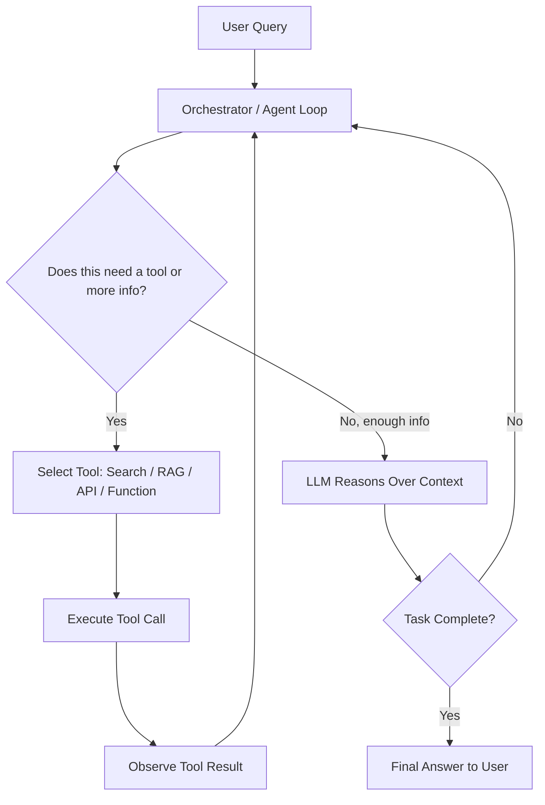
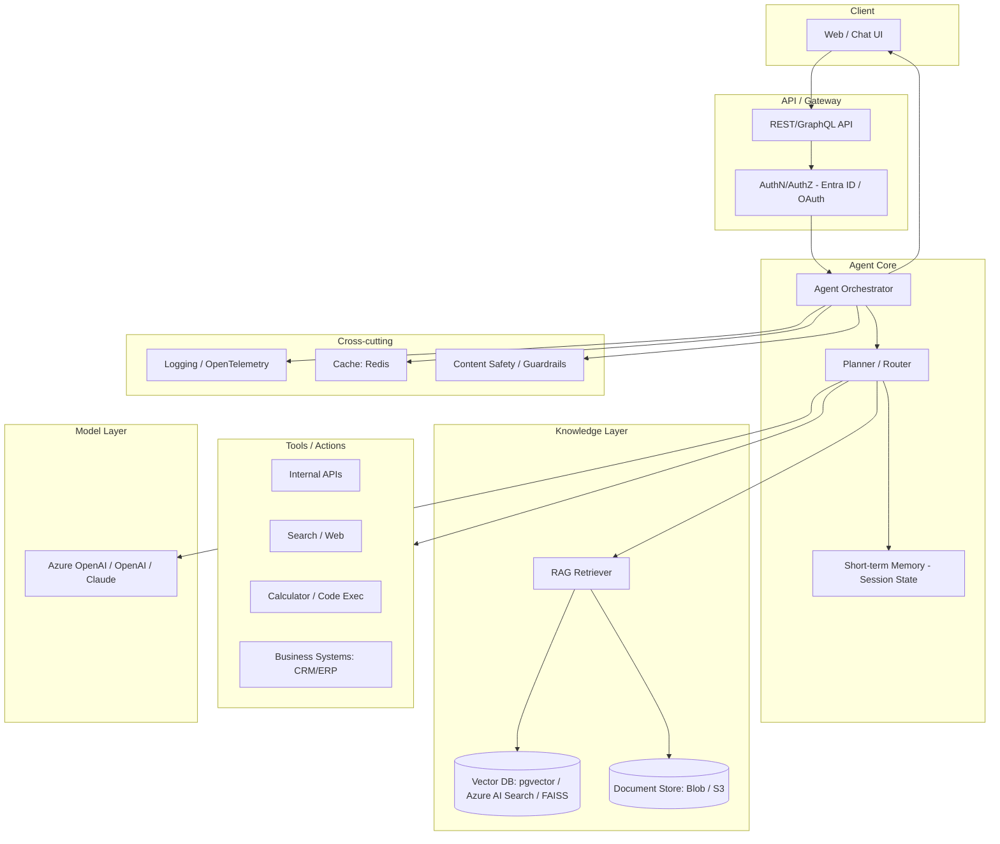
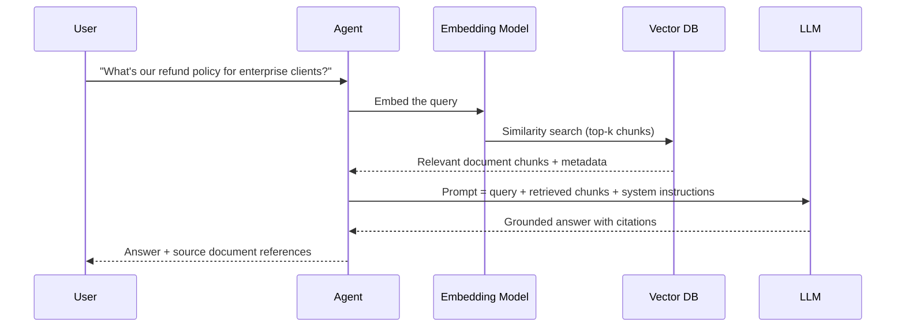
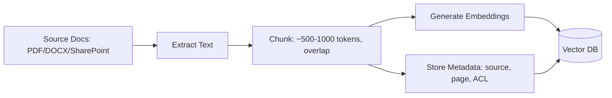
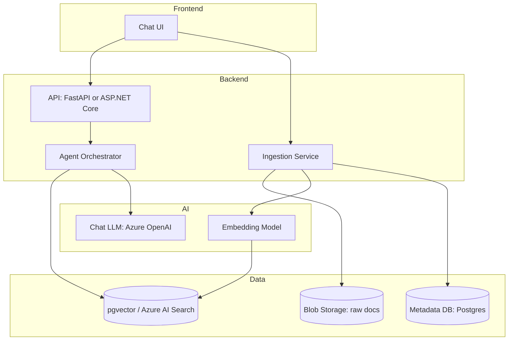

# Agentic AI Explained: A Practical Guide with Python & C# (Beginner to Production)

*A hands-on guide covering concepts, architecture, tooling, a real RAG project (document ingestion + chat), and production practices for security, performance, and cost.*

---

## 1. What Is Agentic AI?

**Agentic AI** refers to AI systems built around Large Language Models (LLMs) that don't just respond to a single prompt — they **reason, plan, call tools, use memory, and take multi-step actions autonomously** to achieve a goal, adjusting their approach based on intermediate results.

| Traditional / Prompt-based AI | Agentic AI |
|---|---|
| One prompt → one response | Goal → plan → multiple steps → result |
| No memory across steps | Maintains short/long-term memory |
| Can't call external systems | Calls tools/APIs/databases (function calling) |
| Human decides every next step | Agent decides the next step (with guardrails) |
| Stateless | Stateful, often with a control loop (ReAct, Plan-Execute) |

An agent is typically composed of four things: an **LLM (the brain)**, **tools** (functions/APIs it can call), **memory** (short-term conversation state + long-term knowledge, often via RAG), and an **orchestrator/loop** that decides what happens next.

## 2. Why Do We Need Agentic AI?

- **Multi-step problems**: Real business tasks (raise a ticket, check inventory, then email a summary) need more than one LLM call.
- **Tool grounding**: LLMs hallucinate; giving them tools (search, DB query, calculator, APIs) grounds answers in real data.
- **Automation of judgment-heavy work**: Triage, document review, research summarization — tasks that need reasoning, not just retrieval.
- **Enterprise integration**: Agents can talk to CRMs, ticketing systems, internal document stores, and legacy APIs.
- **Scalability of expertise**: One well-designed agent + RAG pipeline can encode institutional knowledge (SOPs, HR policies, engineering runbooks) and serve thousands of employee queries consistently.

The typical enterprise driver is: *"We have a mountain of internal documents and repetitive multi-step processes; humans are the bottleneck."* Agentic AI + RAG is the current best answer.

---

## 3. Step-by-Step Flow: How an Agent Thinks



This is the classic **ReAct loop**: *Reason → Act → Observe → repeat until done*. Frameworks like LangGraph, Semantic Kernel, and Microsoft Agent Framework implement this loop for you, with guardrails on max steps, retries, and human-in-the-loop checkpoints.

## 4. High-Level Design (HLD) — Generic Agentic System



---

## 5. Tools & Libraries for Agentic AI

### Python (most mature ecosystem)

| Library | Purpose |
|---|---|
| **LangChain / LangGraph** | General-purpose agent framework; LangGraph adds explicit graph-based state control — best for production reliability |
| **CrewAI** | Role-based multi-agent "crews" — intuitive for beginners |
| **AutoGen (Microsoft)** | Multi-agent conversation patterns, research-oriented |
| **LlamaIndex** | Started as a RAG/data-indexing library, now has agent workflows too |
| **Pydantic AI** | Lightweight, type-safe agent framework |
| **Semantic Kernel (Python)** | Microsoft's enterprise-oriented SDK, also available for Python |
| **OpenAI Agents SDK** | OpenAI's own lightweight agent/tool-calling SDK |
| **ChromaDB / FAISS / Qdrant / pgvector** | Vector stores for RAG |

### C# / .NET

| Library | Purpose |
|---|---|
| **Semantic Kernel (SK)** | Microsoft's SDK for plugins, memory, planners, and agents in .NET; widely used in production today |
| **Microsoft Agent Framework** | The newer, unified successor to Semantic Kernel + AutoGen (namespace `Microsoft.Agents.AI`), built on `Microsoft.Extensions.AI`. Recommended for new projects once you're comfortable with SK basics <cite index="16-1,17-1">it combines AutoGen's simple agent abstractions with Semantic Kernel's enterprise-grade features such as session-based state management, type safety, filters, telemetry, and adds graph-based workflows for explicit multi-agent orchestration</cite> |
| **Microsoft.Extensions.AI** | Common abstraction layer for chat clients/embeddings across providers |
| **Pgvector.NET / Azure AI Search SDK** | Vector search from .NET |
| **Polly** | Resilience — retries, circuit breakers, timeouts for LLM/API calls |

> Practical note: <cite index="16-1">if you have an existing project using Semantic Kernel, or need to ship quickly, it's fine to keep using it; if starting new and you can wait for GA, Microsoft recommends starting with Microsoft Agent Framework</cite>. Given your current RAG platform is already built on Semantic Kernel-adjacent patterns, a phased migration path is worth planning for later this year.

---

## 6. How to Start — Learning Path for Beginners

**Suggested order (4–6 weeks, part-time):**
1. Learn LLM basics + prompt engineering.
2. Learn function/tool calling with one SDK (start with whichever has the best docs for you).
3. Build a plain ReAct loop **without** a framework, by hand — this demystifies what frameworks automate.
4. Pick one framework (LangGraph for Python, Semantic Kernel for C#) and rebuild the same agent.
5. Add RAG (a vector DB + retrieval step).
6. Add a second tool and observability (logging every step).

**Top 3 resources to start with:**

1. **Article — GeeksforGeeks: "Agentic AI Tutorial"** — a structured, free reference covering agent types, frameworks, and multi-agent systems, good as a running reference while you build.
   `https://www.geeksforgeeks.org/artificial-intelligence/agentic-ai-tutorial/`

2. **Article — "The Beginner's Guide to Learning Agentic AI: From Zero to Your First AI Agent" (Medium)** — a week-by-week roadmap that explicitly has you write a ReAct loop from scratch before touching frameworks, which is the fastest way to actually understand agents rather than just use them.
   `https://medium.com/@jahangir80842/the-beginners-guide-to-learning-agentic-ai-from-zero-to-your-first-ai-agent-18e7ac984e0a`

3. **YouTube — Krish Naik: "Learn Agentic AI in 2026 With These 7 Steps"** — a practical, sequenced roadmap video with an accompanying written roadmap link, well suited if you prefer video-first learning.
   `https://www.youtube.com/watch?v=ghPb2T0ygSE`

For the C#/.NET side specifically, once comfortable with the above, go straight to **Microsoft Learn's Semantic Kernel Agent Framework docs** and the **Microsoft Agent Framework overview** — they're free, official, and updated as the SDKs evolve:
`https://learn.microsoft.com/en-us/semantic-kernel/frameworks/agent/` and `https://learn.microsoft.com/en-us/agent-framework/overview/`

---

## 7. RAG in Agentic AI

**Retrieval-Augmented Generation (RAG)** grounds an agent's answers in your actual documents instead of relying purely on the model's training data.



In an **agentic** system, RAG is just one *tool* the agent can decide to call — the agent might also call a database query tool, or decide the question needs no retrieval at all (e.g., "summarize what you just said"). This is the key difference from a plain "RAG chatbot": the agent **decides when and what to retrieve**, potentially retrieving multiple times or reformulating the query.

Ingestion pipeline (offline, run whenever documents change):



---

## 8. Project Example: Organization Document Ingestion & Answer-Chat Application

**Goal:** Employees upload internal documents (policies, SOPs, engineering docs); the system ingests them, and an agent answers employee questions with citations, using RAG plus a couple of tools (e.g., "search documents," "get document metadata").

### 8.1 Architecture



### 8.2 Project Structure — Python

```
doc-chat-agent/
├── app/
│   ├── main.py                 # FastAPI entrypoint
│   ├── api/
│   │   ├── routes_chat.py
│   │   └── routes_ingest.py
│   ├── agent/
│   │   ├── orchestrator.py     # LangGraph agent loop
│   │   ├── tools.py            # search_documents(), get_metadata()
│   │   └── prompts.py
│   ├── rag/
│   │   ├── chunker.py
│   │   ├── embedder.py
│   │   └── retriever.py
│   ├── ingestion/
│   │   ├── loaders.py          # PDF/DOCX loaders
│   │   └── pipeline.py
│   ├── models/                 # Pydantic schemas
│   └── core/
│       ├── config.py
│       └── logging.py
├── tests/
├── requirements.txt
├── .env.example
└── README.md
```

**Minimal agent (Python, LangGraph-style tool-calling agent):**

```python
# app/agent/orchestrator.py
from langgraph.prebuilt import create_react_agent
from langchain_openai import AzureChatOpenAI
from app.agent.tools import search_documents, get_document_metadata

llm = AzureChatOpenAI(
    azure_deployment="gpt-4o",
    api_version="2024-10-21",
    temperature=0,
)

tools = [search_documents, get_document_metadata]

agent = create_react_agent(llm, tools)

def ask(question: str, session_id: str) -> dict:
    result = agent.invoke({"messages": [("user", question)]})
    return {"answer": result["messages"][-1].content, "session_id": session_id}
```

```python
# app/agent/tools.py
from langchain_core.tools import tool
from app.rag.retriever import retrieve_chunks

@tool
def search_documents(query: str) -> str:
    """Search internal organization documents and return the most relevant chunks with source names."""
    chunks = retrieve_chunks(query, top_k=5)
    return "\n\n".join(f"[{c.source}] {c.text}" for c in chunks)

@tool
def get_document_metadata(doc_id: str) -> str:
    """Fetch title, owner, and last-updated date for a document by ID."""
    # look up from Postgres metadata table
    ...
```

### 8.3 Project Structure — C# (.NET, Clean Architecture style)

```
DocChatAgent/
├── src/
│   ├── DocChatAgent.Api/                # ASP.NET Core minimal API
│   │   ├── Program.cs
│   │   └── Endpoints/ChatEndpoints.cs
│   ├── DocChatAgent.Application/        # CQRS: commands/queries, agent orchestration
│   │   ├── Agents/DocumentAgentService.cs
│   │   ├── Commands/IngestDocumentCommand.cs
│   │   └── Queries/AskQuestionQuery.cs
│   ├── DocChatAgent.Domain/             # Entities: Document, Chunk, Citation
│   ├── DocChatAgent.Infrastructure/
│   │   ├── VectorStore/PgVectorStore.cs
│   │   ├── AzureOpenAI/ChatClientFactory.cs
│   │   └── Resilience/PollyPolicies.cs
│   └── DocChatAgent.Tools/              # Semantic Kernel plugins / Agent Framework tools
│       └── DocumentSearchPlugin.cs
├── tests/
├── DocChatAgent.sln
└── README.md
```

**Minimal agent (C#, Semantic Kernel plugin + agent):**

```csharp
// DocChatAgent.Tools/DocumentSearchPlugin.cs
using Microsoft.SemanticKernel;
using System.ComponentModel;

public class DocumentSearchPlugin
{
    private readonly IVectorStore _vectorStore;
    public DocumentSearchPlugin(IVectorStore vectorStore) => _vectorStore = vectorStore;

    [KernelFunction("search_documents")]
    [Description("Search internal organization documents and return relevant chunks with sources.")]
    public async Task<string> SearchDocumentsAsync(string query)
    {
        var chunks = await _vectorStore.SimilaritySearchAsync(query, topK: 5);
        return string.Join("\n\n", chunks.Select(c => $"[{c.Source}] {c.Text}"));
    }
}
```

```csharp
// DocChatAgent.Application/Agents/DocumentAgentService.cs
using Microsoft.SemanticKernel;
using Microsoft.SemanticKernel.ChatCompletion;

public class DocumentAgentService
{
    private readonly Kernel _kernel;
    public DocumentAgentService(Kernel kernel) => _kernel = kernel;

    public async Task<string> AskAsync(string question)
    {
        var chat = _kernel.GetRequiredService<IChatCompletionService>();
        var history = new ChatHistory();
        history.AddSystemMessage(
            "You are an internal knowledge assistant. Always call search_documents before answering and cite sources.");
        history.AddUserMessage(question);

        var settings = new OpenAIPromptExecutionSettings
        {
            ToolCallBehavior = ToolCallBehavior.AutoInvokeKernelFunctions
        };

        var response = await chat.GetChatMessageContentAsync(history, settings, _kernel);
        return response.Content ?? string.Empty;
    }
}
```

```csharp
// Program.cs (registration)
var builder = Kernel.CreateBuilder();
builder.AddAzureOpenAIChatCompletion(
    deploymentName: config["AzureOpenAI:Deployment"],
    endpoint: config["AzureOpenAI:Endpoint"],
    apiKey: config["AzureOpenAI:ApiKey"]);
builder.Plugins.AddFromType<DocumentSearchPlugin>();
var kernel = builder.Build();
```

### 8.4 Installation & Setup

**Python:**
```bash
git clone <repo-url> && cd doc-chat-agent
python -m venv .venv && source .venv/bin/activate   # Windows: .venv\Scripts\activate
pip install -r requirements.txt
cp .env.example .env   # fill in AZURE_OPENAI_KEY, AZURE_OPENAI_ENDPOINT, DB connection string
# run local Postgres with pgvector extension, e.g. via docker:
docker run -d --name pgvector -e POSTGRES_PASSWORD=pass -p 5432:5432 ankane/pgvector
alembic upgrade head          # apply DB migrations
uvicorn app.main:app --reload --port 8000
```

**C# / .NET:**
```bash
git clone <repo-url> && cd DocChatAgent
dotnet restore
cp appsettings.Example.json src/DocChatAgent.Api/appsettings.Development.json
# fill in AzureOpenAI:Endpoint, AzureOpenAI:ApiKey, ConnectionStrings:PgVector
docker run -d --name pgvector -e POSTGRES_PASSWORD=pass -p 5432:5432 ankane/pgvector
dotnet ef database update --project src/DocChatAgent.Infrastructure
dotnet run --project src/DocChatAgent.Api
```

**Running/testing the flow:**
1. `POST /ingest` with a document (PDF/DOCX) → chunked, embedded, stored.
2. `POST /chat` with `{"question": "..."}` → agent retrieves relevant chunks, calls the LLM, returns a cited answer.
3. Check logs/traces to confirm the tool was actually invoked (don't just trust the answer — verify retrieval happened).

---

## 9. Best Practices

- **Keep tools narrow and well-described.** A tool named `search_documents` with a precise docstring performs far better than a vague `do_task` tool.
- **Limit agent steps.** Set a max iteration count (e.g., 5–8) to prevent infinite loops and runaway cost.
- **Always cite sources** for RAG answers — don't let the agent present retrieved content as its own unsourced claim.
- **Use structured outputs** (Pydantic / JSON schema in C#) for anything downstream code consumes, not free text.
- **Separate ingestion from serving.** Ingestion is a batch/async pipeline; serving is a low-latency request path — don't couple them.
- **Version your prompts** like code (source control, review, rollback).
- **Human-in-the-loop for high-stakes actions** (sending emails, modifying records) — require confirmation before the agent executes irreversible tools.
- **Test with adversarial and edge-case queries**, not just happy-path questions.

## 10. Security

- **AuthN/AuthZ on every layer**: use Entra ID/OAuth at the API gateway; don't rely on the LLM to enforce access control.
- **Document-level ACLs in the vector store**: filter retrieval results by the requesting user's permissions *before* they reach the LLM — never retrieve-then-trust-the-model-to-hide-it.
- **Prompt-injection defense**: treat retrieved document content and tool outputs as untrusted input; use system-prompt hardening, output validation, and consider a separate "guard" model pass for high-risk actions.
- **Secrets management**: API keys in a vault (Azure Key Vault / AWS Secrets Manager), never in code or `.env` committed to source control.
- **PII/data classification**: redact or mask sensitive fields before they're embedded or logged.
- **Content safety filters** on both input and output (Azure AI Content Safety, OpenAI moderation endpoint).
- **Audit logging**: log every tool call and the retrieved sources for traceability and compliance review.

## 11. Performance

- **Cache aggressively**: cache embeddings for unchanged documents, and cache frequent Q&A pairs (semantic cache) to skip LLM calls entirely for repeat questions.
- **Batch embedding generation** during ingestion rather than one-at-a-time calls.
- **Stream responses** to the UI (token streaming) to reduce perceived latency.
- **Right-size chunking**: too small → lost context; too large → noisy retrieval and higher token cost. Start at 500–800 tokens with ~10–15% overlap and tune from evaluation results.
- **Use async/parallel tool calls** where tools are independent (e.g., searching two data sources concurrently).
- **Add retries with backoff (Polly in .NET, `tenacity` in Python)** around LLM/API calls to smooth over transient failures without user-visible errors.
- **Monitor latency per stage** (retrieval, LLM call, tool call) with OpenTelemetry so you know exactly where time goes.

## 12. Cost Optimization

- **Route by complexity**: use a cheaper/smaller model for classification/routing steps, and reserve the frontier model for the final reasoning/answer step.
- **Limit context size**: send only the top-k relevant chunks, not entire documents; trim chat history to a summarized window for long conversations.
- **Cache and reuse**: semantic caching for repeated questions; cache tool results with a sensible TTL.
- **Batch/async ingestion** during off-peak hours where provider pricing tiers allow it.
- **Set hard token/step budgets per request** so a misbehaving agent loop can't run unbounded cost.
- **Track cost per conversation** (input/output tokens × rate) in your observability stack — you can't optimize what you don't measure.
- **Right-size embeddings**: smaller embedding models are often "good enough" for internal document retrieval and are significantly cheaper than the largest available option.

---

## 13. References

- GeeksforGeeks — Agentic AI Tutorial: `https://www.geeksforgeeks.org/artificial-intelligence/agentic-ai-tutorial/`
- Medium — The Beginner's Guide to Learning Agentic AI: `https://medium.com/@jahangir80842/the-beginners-guide-to-learning-agentic-ai-from-zero-to-your-first-ai-agent-18e7ac984e0a`
- YouTube — Krish Naik, Learn Agentic AI in 2026: `https://www.youtube.com/watch?v=ghPb2T0ygSE`
- Microsoft Learn — Semantic Kernel Agent Framework: `https://learn.microsoft.com/en-us/semantic-kernel/frameworks/agent/`
- Microsoft Learn — Microsoft Agent Framework Overview: `https://learn.microsoft.com/en-us/agent-framework/overview/`
- Microsoft Agent Framework — Migration Guide from Semantic Kernel: `https://learn.microsoft.com/en-us/agent-framework/migration-guide/from-semantic-kernel/`
- LangGraph documentation: `https://langchain-ai.github.io/langgraph/`

*Note: course/tutorial platforms change frequently — always sanity-check a resource's publish date and check the official framework docs (Microsoft Learn, LangChain docs) for anything version-specific before following a tutorial's exact code.*
