# AI Harness / Agentic Harness: The Next Big Shift in AI Engineering

`#ai` `#agentic-ai` `#ai-agents` `#agent-harness` `#llm` `#genai` `#mcp` `#rag` `#devtools` `#ai-engineering` `#machine-learning` `#llmops` `#autonomous-agents` `#anthropic-claude` `#openai`

> **GitHub Topics to add in repo settings:** `ai`, `agentic-ai`, `ai-agents`, `agent-harness`, `llm`, `genai`, `mcp`, `rag`, `llmops`, `ai-engineering`

> **Note for readers:** This guide uses simple English and short sentences on purpose, so it is easy to follow even if English is not your first language. Technical words are explained the first time they appear.

> **Credits:** This guide is inspired by content from the **AI with Hasan** YouTube channel. Check out the channel for more explanations on AI, agents, and related topics.

---

## What You Will Learn (Step by Step)

1. What is an AI Agent
2. What is an AI Harness
3. Why the harness matters
4. How the "agent loop" works
5. The main parts of a harness (with code examples)
6. Real examples (coding, support, DevOps)
7. Tools and frameworks you can use today
8. The big picture

---

## Step 1: What Is an AI Agent?

An **LLM** (Large Language Model, like GPT or Claude) is very good at understanding language and writing text.

But by itself, an LLM can only **talk**. It cannot **do** things.

An **AI Agent** is different. An agent can:

1. Understand a goal
2. Decide what to do
3. Use tools (search, APIs, code)
4. Look at the result
5. Try again if needed
6. Finish the task

### Simple example

You ask:
> "Find the cheapest flight from Hyderabad to Dubai next Friday."

- A plain LLM will just **explain** how to search for flights.
- An **agent** will actually **search**, **compare prices**, and **give you a real answer**.

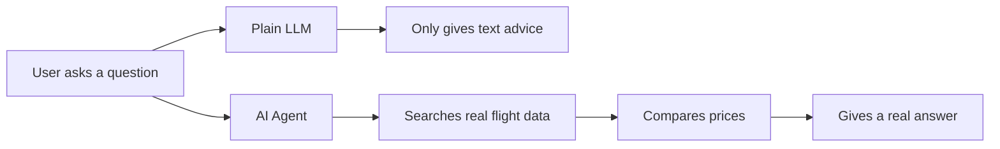

The difference is simple: **an agent takes action, not just talks.**

---

## Step 2: What Is an AI Harness?

Imagine you hire a new employee. This person is very smart. But smart is not enough.

To do real work, they also need:

- A laptop
- Internet access
- Passwords and permissions
- Company rules
- A manager to check their work

An AI agent needs the same kind of support. This support system is called the **Agent Harness**.

### Simple formula

```
AI Agent  =  Model (the brain)  +  Harness (the workplace)
```

- The **model** gives intelligence.
- The **harness** gives tools, memory, rules, and safety.

```mermaid
flowchart TB
    subgraph Harness["Agent Harness (the workplace)"]
        direction TB
        Tools[Tools]
        Memory[Memory]
        Rules[Guardrails / Rules]
        Sandbox[Safe Testing Area]
    end
    Model[LLM - the brain] --> Harness
    Harness --> Result[Real World Action]
```

This is why **two apps using the same LLM can give very different results.** The harness around the model makes the difference.

---

## Step 3: A Simple Analogy (Two Engineers)

Imagine two engineers, both equally smart.

| | Engineer A | Engineer B |
|---|---|---|
| Task | "Build a payment system" | "Build a payment system" |
| Tools given | None | GitHub, docs, database, tests, cloud, review process |
| Result | Struggles, guesses a lot | Builds it properly and safely |

The LLM is like the brain of the engineer. **The harness is everything around the brain that helps the work get done correctly.**

---

## Step 4: Agent Without Harness vs. With Harness

### Without a harness (just a chatbot)

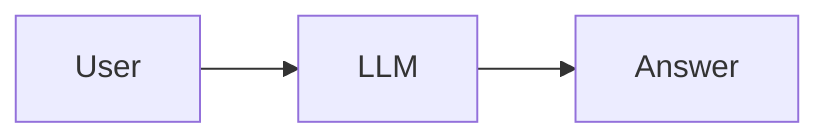

### With a harness (a real agent)

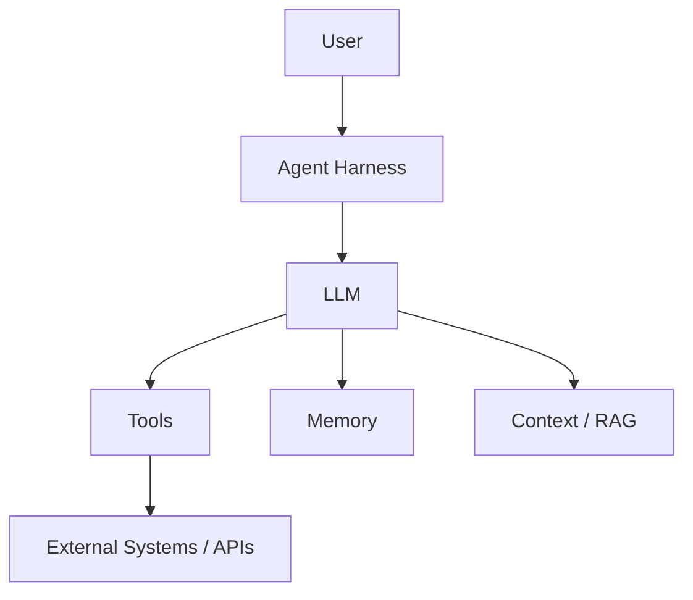

The harness controls everything happening around the model.

---

## Step 5: Why the Harness Matters

LLMs are **probabilistic**. This means they are usually right, but not always 100% right.

That is fine for a casual chat. But it is **not fine** when the agent can:

- Send money
- Delete files
- Change customer data
- Deploy production code

Even a 95%-correct model can cause real damage at scale. The harness adds **checks and limits** so mistakes are caught before they cause harm.

---

## Step 6: The Agent Loop (Step by Step)

A basic chatbot works like this:

```
Prompt → Answer → Done
```

An agent works in a **loop**, repeating steps until the task is really finished:

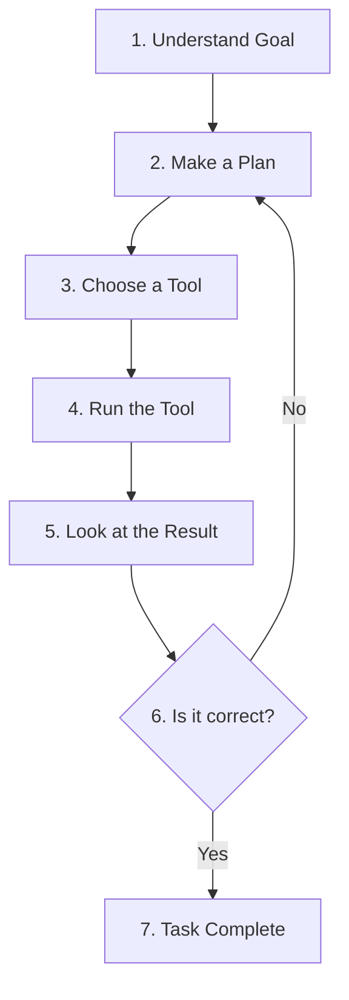

### Example: "Fix the production API issue"

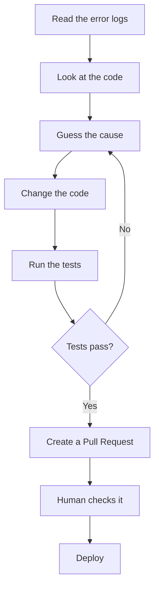

### Code example: a simple agent loop in Python

This is a simplified example to show the *idea*, not production code.

```python
def run_agent(goal, tools, model, max_steps=5):
    """A very simple agent loop."""
    history = []

    for step in range(max_steps):
        # 1. Ask the model what to do next
        decision = model.decide(goal=goal, history=history)

        # 2. If the model says the task is done, stop
        if decision["action"] == "finish":
            return decision["final_answer"]

        # 3. Otherwise, run the chosen tool
        tool_name = decision["tool"]
        tool_input = decision["input"]
        result = tools[tool_name](tool_input)

        # 4. Save what happened so the model can learn from it
        history.append({
            "tool": tool_name,
            "input": tool_input,
            "result": result
        })

    return "Stopped: reached max steps without finishing."
```

This loop repeats: **think → act → observe → repeat**, until the goal is done.

---

## Step 7: The Main Parts of a Harness

### 7.1 The Model (the brain)

This is the LLM itself: GPT, Claude, Gemini, Llama, etc. It reasons and decides what to do.

### 7.2 Tools (the hands)

Tools let the agent act in the real world.

```python
# Example tool definitions an agent can call

def search_web(query: str) -> str:
    """Search the internet and return a summary."""
    ...

def get_customer(customer_id: str) -> dict:
    """Look up a customer's account."""
    ...

def send_email(to: str, subject: str, body: str) -> bool:
    """Send an email to a customer."""
    ...
```

Anthropic recommends designing tools **specifically for agents**, with clear names and simple inputs, because agents work better with clean, well-documented tools.

### 7.3 Memory (remembering things)

An agent may need to remember earlier conversations, decisions, or documents.

```python
memory = {}

def remember(user_id, key, value):
    memory.setdefault(user_id, {})[key] = value

def recall(user_id, key):
    return memory.get(user_id, {}).get(key)

# Example
remember("user_123", "last_project", "payment system redesign")
print(recall("user_123", "last_project"))
# Output: payment system redesign
```

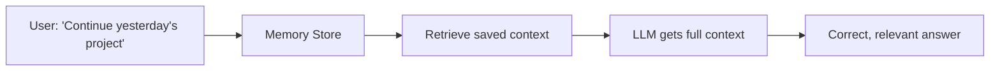

### 7.4 Context Engineering (giving the right information)

You cannot give an LLM your **entire** company database. You must find and give only the **relevant** parts.

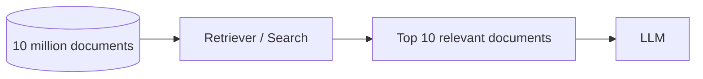

This process is often called **RAG** (Retrieval-Augmented Generation).

### 7.5 Guardrails (safety rules)

Guardrails stop the agent from doing dangerous things without permission.

```python
def check_guardrail(action, amount=None):
    if action == "delete_database":
        return "BLOCKED: needs human approval"
    if action == "refund" and amount and amount > 1000:
        return "BLOCKED: needs human approval"
    return "ALLOWED"

print(check_guardrail("refund", amount=1500))
# Output: BLOCKED: needs human approval
```

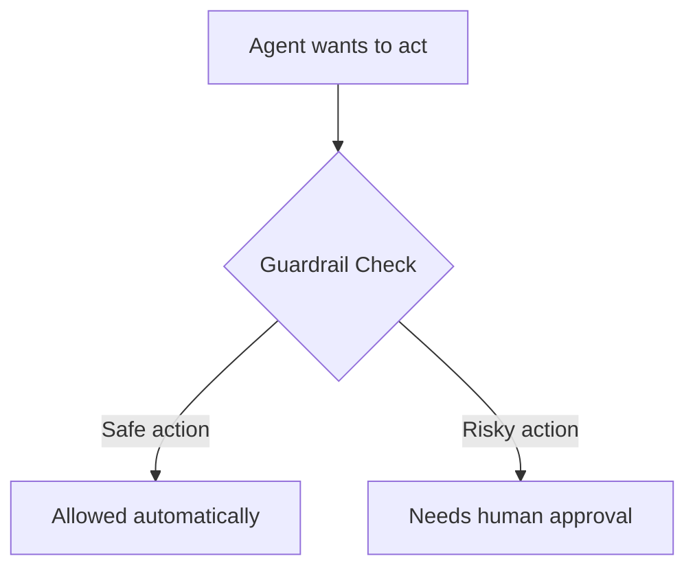

### 7.6 Sandbox (a safe testing room)

A sandbox is a safe, isolated space where the agent can try things (like running code) without touching real, live systems.

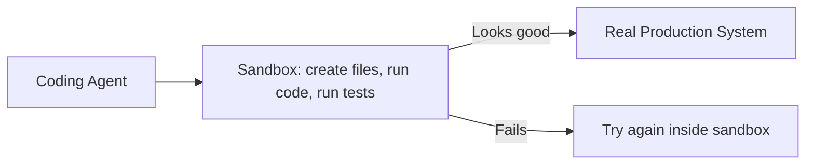

### 7.7 Evaluation (checking the work)

After the agent finishes, the harness checks if the work is actually correct.

```python
def evaluate(result, tests):
    passed = sum(1 for t in tests if t(result))
    total = len(tests)
    return f"{passed}/{total} checks passed"

tests = [
    lambda r: "error" not in r.lower(),
    lambda r: len(r) > 0
]

print(evaluate("Payment processed successfully", tests))
# Output: 2/2 checks passed
```

Only when checks pass does the harness mark the task as **complete**.

---

## Step 8: Real-World Examples

### Example A: Software Development

Goal: *"Add login-with-Google to our app."*

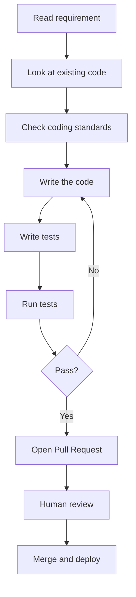

### Example B: Customer Support

Goal: *"Customer says payment failed."*

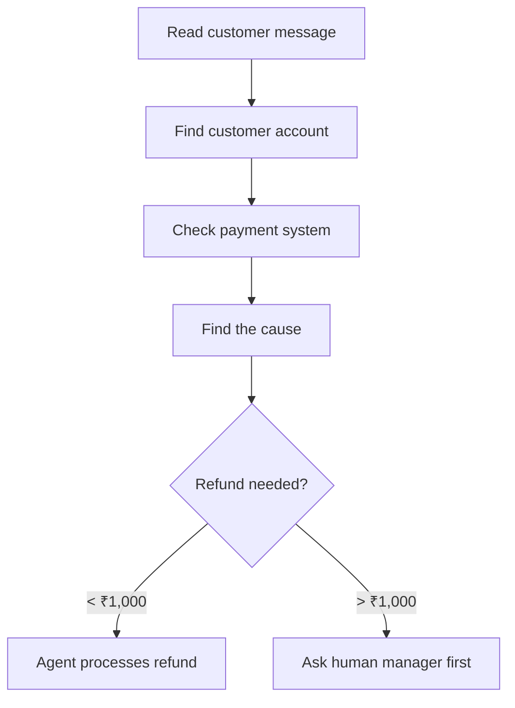

### Example C: DevOps / Site Reliability

Goal: *"API is slow. Find out why."*

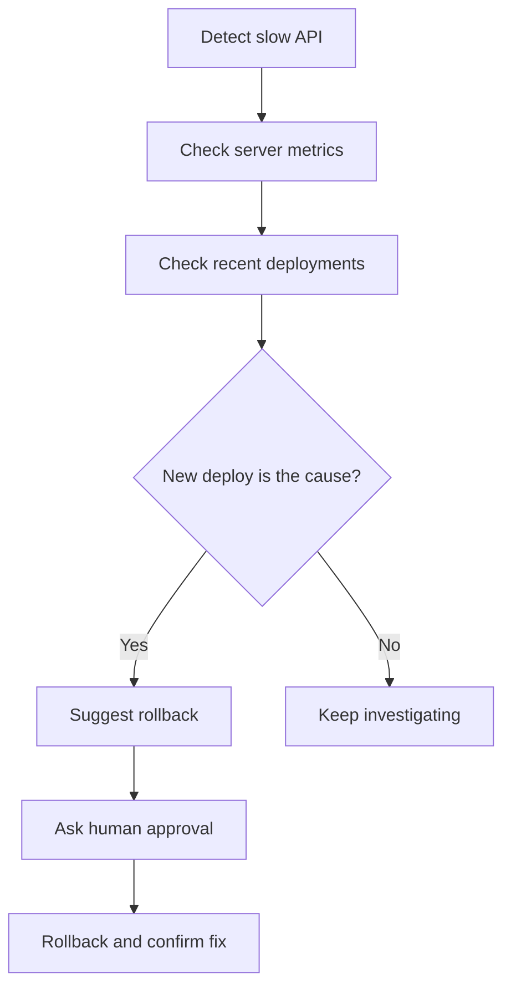

---

## Step 9: Tools, Libraries, and Frameworks You Can Use Today

| Category | What it does | Examples |
|---|---|---|
| Agent orchestration | Build the agent loop, tool calls, and multi-step logic | LangChain, LangGraph, CrewAI, AutoGen, Semantic Kernel, LlamaIndex |
| Vendor agent SDKs | Official kits from model makers | Anthropic Claude Agent SDK, OpenAI Agents SDK |
| Tool/data protocol | Standard way to connect tools and data to an agent | MCP (Model Context Protocol) |
| Memory / vector search | Store and search past information | Pinecone, Weaviate, Chroma, Qdrant, Mem0 |
| Sandboxing | Safe place to run agent-generated code | E2B, Modal, Docker, Daytona |
| Guardrails & validation | Check outputs before they are used | Guardrails AI, NVIDIA NeMo Guardrails, Instructor (with Pydantic) |
| Evaluation & monitoring | Track and score agent performance | LangSmith, Langfuse, Arize Phoenix, Ragas, DeepEval |
| Workflow control | Manage long, multi-step, human-approved workflows | Temporal, Prefect, Airflow |

> Tip: Start small. Pick **one** orchestration framework, **one** memory tool, and **one** guardrail library. Add more only as your agent's responsibilities grow.

---

## Step 10: The Big Picture

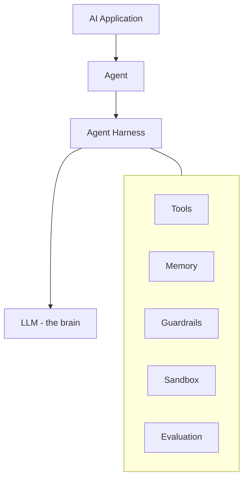

### In one simple sentence:

> **The LLM is the brain. The agent is the worker. The harness is the workplace — it gives the worker tools, memory, rules, and safety to get real work done correctly.**

That is why **Harness Engineering** is becoming one of the most important new skills in AI development.

---

## Suggested Repo Metadata

- **Description:** A simple, visual guide to the AI/Agent Harness concept — how model, tools, memory, guardrails, and sandboxing work together to build reliable AI agents.
- **Topics:** `ai`, `agentic-ai`, `ai-agents`, `agent-harness`, `llm`, `genai`, `mcp`, `rag`, `llmops`, `ai-engineering`, `autonomous-agents`

> **Note:** The diagrams in this file use [Mermaid](https://mermaid.js.org/), which renders automatically as flowcharts on GitHub, GitLab, and most modern Markdown viewers.

---

## Credits

This guide is inspired by explanations from the **AI with Hasan** YouTube channel. Go subscribe for more accessible, easy-to-follow AI content.
