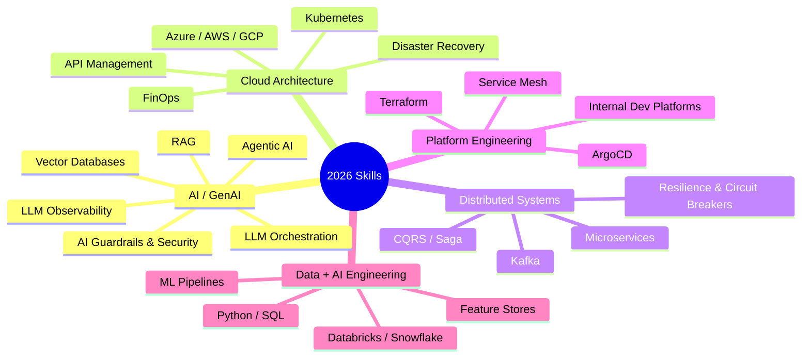
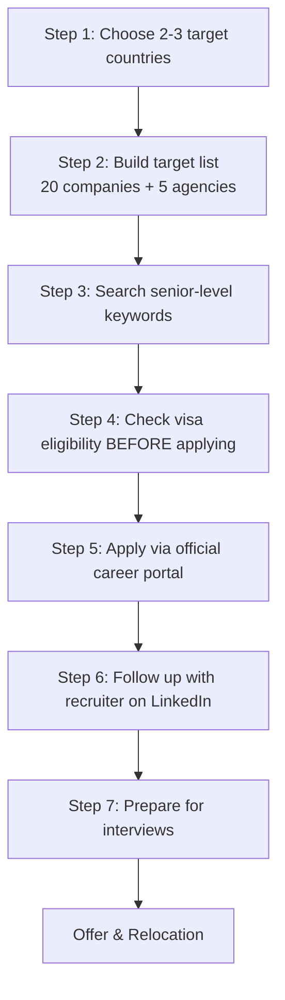

<!--
title: How to Get a Sponsored Tech Job in Europe in 2026
description: A practical, company-by-company guide for experienced Software Architects, Principal Engineers, Cloud/Integration Architects and AI/GenAI engineers targeting visa-sponsored roles in Europe.
keywords: europe tech jobs, visa sponsorship jobs europe, software architect jobs germany, principal engineer europe, cloud architect jobs, AI architect jobs, GenAI engineer jobs, relocation jobs europe, EU Blue Card jobs, luxembourg IT recruitment, solutions architect europe, kubernetes jobs europe, staff engineer europe, data engineer europe, immigration tech jobs
tags: [career, europe, tech-jobs, visa-sponsorship, cloud-architecture, ai, genai, kubernetes, software-architecture, relocation, principal-engineer, solutions-architect, job-search, 2026]
-->

# 🇪🇺 How to Get a Sponsored Tech Job in Europe in 2026

**Companies · Career Paths · High-Demand Skills**

`#europe-jobs` `#visa-sponsorship` `#cloud-architecture` `#genai` `#principal-engineer` `#solutions-architect` `#kubernetes` `#relocation` `#tech-careers-2026`

> A field guide for experienced **Software Architects, Principal/Staff Engineers, Cloud & Integration Architects, and AI/GenAI Engineers** targeting visa-sponsored roles in Europe.

### 🔥 Top Skills in Demand — Europe 2026

---

## 📋 Table of Contents

1. [Quick-Start Rule](#-quick-start-rule)
2. [Companies to Target](#-companies-to-target)
   - [Germany-Centric](#germany-centric)
   - [Nordics & Baltics](#nordics--baltics)
   - [UK / Fintech](#uk--fintech)
   - [Big Tech](#big-tech)
   - [Enterprise / Insurance](#enterprise--insurance)
3. [Luxembourg Recruitment Agencies](#-luxembourg-recruitment-agencies)
4. [In-Demand Skills for 2026](#-in-demand-skills-for-2026)
5. [How to Position Yourself](#-how-to-position-yourself)
6. [Step-by-Step Job Search Roadmap](#-step-by-step-job-search-roadmap)
7. [2026 Priority List](#-2026-priority-list)
8. [Final Strategy](#-final-strategy)

---

## 🎯 Quick-Start Rule

Don't search for **"software developer jobs."** Target senior titles instead:

`Principal Engineer` · `Staff Engineer` · `Solutions Architect` · `Cloud Architect` · `Integration Architect` · `Platform Architect` · `AI Architect`

> ⚠️ **Visa sponsorship is role- and country-dependent.** Never assume a company sponsors every vacancy. Look for the phrases **"visa sponsorship," "relocation support," "immigration support," "work permit,"** or **"EU Blue Card"** — or confirm directly with the recruiter.

---

## 🏢 Companies to Target

### Germany-Centric

| Company | Location | Focus / Notes | Careers Link |
|---|---|---|---|
| **adjoe (Applike Group)** | Hamburg 🇩🇪 | Go, DevOps, backend, adtech — explicit visa/relocation support | [Open Roles](https://adjoe.io/careers/open-positions/) |
| **Emma – The Sleep Company** | Germany 🇩🇪 | ML, data, platform engineering | [Careers](https://team.emma-sleep.com/careers) |
| **Delivery Hero** | Berlin 🇩🇪 | ⭐ Strongest relocation package: visa help, housing, insurance, family relocation | [Careers](https://careers.deliveryhero.com/) |
| **GetYourGuide** | Berlin 🇩🇪 | AI platform, MLOps, backend | [Careers](https://www.getyourguide.careers/) |
| **Zalando** | Berlin + EU 🇩🇪 | Backend, platform, AI/ML — hires internationally | [Careers](https://jobs.zalando.com/en/jobs) |
| **N26** | Berlin/Barcelona 🇩🇪🇪🇸 | Fintech, backend, platform | [Careers](https://n26.com/en-eu/careers) |
| **Siemens** | Germany 🇩🇪 | Enterprise/cloud/industrial AI architecture | [Careers](https://jobs.siemens.com/) |
| **HelloFresh** | Berlin 🇩🇪 | Backend, ML, platform | [Careers](https://careers.hellofresh.com/) |
| **Holidu** | Germany 🇩🇪 | Backend, data, ML | [Careers](https://www.holidu.com/careers) |
| **Personio** | Germany/UK/Ireland | HR-tech, backend, platform, AI | [Careers](https://www.personio.com/about-personio/careers/) |
| **Celonis** | Germany 🇩🇪 | Process intelligence, data, AI | [Careers](https://www.celonis.com/careers/) |
| **AUTO1 Group** | Germany 🇩🇪 | Backend, data, platform | [Careers](https://www.auto1-group.com/careers/) |
| **Flix** | Germany 🇩🇪 | Mobility tech, APIs, microservices | [Careers](https://flix.careers/) |
| **SAP** | Germany + EU 🇩🇪 | ⭐ Top target for Architects — Solution/Enterprise/Cloud/AI Architect roles | [Careers](https://jobs.sap.com/) |
| **FREE NOW** | Germany + EU 🇩🇪 | Mobility, backend, data | [Careers](https://www.free-now.com/career/) |

### Nordics & Baltics

| Company | Location | Focus / Notes | Careers Link |
|---|---|---|---|
| **Wolt** | Finland + EU 🇫🇮 | Go/Kotlin, Kafka, platform — hundreds of roles across FI, DE, SE, DK, PL, RO, GR, LU, UK | [Careers](https://careers.wolt.com/) |
| **Bolt** | Tallinn, Estonia 🇪🇪 | ⭐ Very strong relocation program (visa, flights, housing, family/pet support) | [Careers](https://bolt.eu/en/careers/) |

### UK / Fintech

| Company | Location | Focus / Notes | Careers Link |
|---|---|---|---|
| **Revolut** | UK + EU 🇬🇧 | Large international footprint, fintech engineering | [Careers](https://www.revolut.com/careers/) |

### Big Tech

| Company | Location | Focus / Notes | Careers Link |
|---|---|---|---|
| **Google** | DE/IE/CH/UK + EU | Staff Eng, Cloud/Solutions Architect, AI/ML | [Careers](https://www.google.com/about/careers/applications/) |
| **Amazon / AWS** | DE/UK/IE/LU + EU | ⭐ Solutions Architect track is highly relevant for architects | [Careers](https://www.amazon.jobs/) |

### Enterprise / Insurance

| Company | Location | Focus / Notes | Careers Link |
|---|---|---|---|
| **Allianz** | Germany + EU 🇩🇪 | Dedicated "AI, Technology & Data" career track | [Careers](https://careers.allianz.com/global/en) |

---

## 🇱🇺 Luxembourg Recruitment Agencies

If Luxembourg specifically is your target, register directly with specialist agencies — don't rely only on company career pages.

| Agency | Specialization | Link |
|---|---|---|
| **Manpower Luxembourg** | IT, infrastructure, cloud, fintech | [manpower.lu](https://www.manpower.lu/) |
| **Adecco Luxembourg** | Permanent & temporary, multi-industry | [adecco.lu](https://www.adecco.lu/en-gb/) |
| **Randstad Luxembourg** | 100+ vacancies, filterable by specialism | [randstad.lu](https://www.randstad.lu/en/jobs/) |
| **Hays Luxembourg** | Banking, IT, engineering, insurance | [hays.lu](https://www.hays.lu/en/job-search) |
| **Michael Page Luxembourg (Belux)** | Banking/financial services, engineering | [michaelpage.lu](https://www.michaelpage.lu/en/jobs/region-luxembourg) |

---

## 🚀 In-Demand Skills for 2026

### 🤖 1. AI + GenAI
  

Move beyond "I know Azure OpenAI." Build demonstrable expertise in: RAG, agentic AI, LLM orchestration, vector databases, embeddings, evaluation, guardrails, prompt-injection defense, AI governance, model routing, token optimization.

### ☁️ 2. Cloud Architecture
   

Go deep on **one** cloud (Azure / AWS / GCP): Kubernetes, API management, IAM, networking, serverless, event-driven architecture, cloud security, FinOps, HA/DR.

### 🔗 3. Distributed Systems
  

Microservices, Kafka, event-driven architecture, CQRS, Saga, distributed transactions, caching, rate limiting, circuit breakers, CAP theorem.

### 🛠️ 4. Platform Engineering
   

`Cloud + Kubernetes + Platform Engineering + Developer Experience` — Helm, Terraform, GitHub Actions, Azure DevOps, ArgoCD, service mesh, Internal Developer Platforms.

### 📊 5. Data + AI Engineering
   

`Python + SQL + Data Engineering + AI` — PySpark, Kafka, Databricks, Snowflake, PostgreSQL, vector databases, ML pipelines, feature stores.

---

## 🎯 How to Position Yourself

Don't present yourself as a generic developer — present yourself as an **outcomes-driven architect**.

**Title framing:**
> Principal Software / Solutions Architect | Cloud & Integration Architecture | AI/GenAI | Distributed Systems | Azure/AWS | Kubernetes

**CV framing — show outcomes, not just tools:**

| ❌ Weak | ✅ Strong |
|---|---|
| Worked with Azure, Kubernetes, Docker and microservices. | Designed and implemented a cloud-native microservices platform on Azure AKS supporting scalable document processing, event-driven integration and AI-powered search. |

---

## 🗺️ Step-by-Step Job Search Roadmap

**Step 1 — Choose 2–3 countries**
Start with **Germany → Netherlands → Ireland**, then **Luxembourg → Finland → Sweden → Estonia → Spain**.

**Step 2 — Build a target-company list**
Aim for ~20 companies + 5 recruitment agencies (see [priority list](#-2026-priority-list) below).

**Step 3 — Search using senior-level keywords**
`"Solutions Architect" + visa` · `"Principal Engineer" + relocation` · `"Staff Engineer" + Germany` · `"Cloud Architect" + Europe` · `"AI Architect" + Germany` · `"Integration Architect" + Luxembourg` · `"GenAI Architect" + Europe` · `"Platform Architect" + EU`

**Step 4 — Check visa eligibility before spending time**
✅ Visa sponsorship · ✅ Relocation support · ✅ Work permit · ✅ Immigration support · ✅ EU Blue Card
❌ Don't assume "Europe location" = sponsorship. Zalando, for example, states relocation assistance depends on the specific role.

**Step 5 — Apply directly**
Always use the official career portal. **Never pay** for applications, interviews, visa processing, or offer letters — legitimate employers (e.g., Zalando) explicitly warn against this.

**Step 6 — Contact recruiters on LinkedIn**
Sample message:
> "Hi [Name], I recently applied for the [Role] position at [Company]. I have 14+ years of experience in software architecture, Azure cloud, integration, microservices, Kubernetes and AI/GenAI solutions. I'm currently based in India and open to relocating to Europe. I would appreciate it if you could consider my profile for this or similar Architect/Principal Engineer opportunities."

**Step 7 — Prepare for interviews** across 5 areas:

| Area | Focus |
|---|---|
| Architecture | System design, scalability, reliability, security |
| Cloud | Azure/AWS architecture, cost optimization |
| Distributed Systems | Kafka, microservices, event-driven, resilience |
| AI | RAG, agents, LLM architecture, evaluation, AI security |
| Leadership | Architecture decisions, stakeholder mgmt, mentoring |

---

## 🏆 2026 Priority List

| Rank | Company | Why |
|---|---|---|
| 🥇 1 | **AWS** | Solutions Architect track + cloud + AI |
| 🥈 2 | **SAP** | Enterprise/Solution/AI Architecture |
| 🥉 3 | **Delivery Hero** | Strongest international relocation support |
| 4 | **Zalando** | International hiring + senior engineering |
| 5 | **Celonis** | AI + data + enterprise platform |
| 6 | **Siemens** | Enterprise/cloud/industrial AI |
| 7 | **N26** | Cloud + fintech + distributed systems |
| 8 | **GetYourGuide** | AI platform + MLOps |
| 9 | **Revolut** | High-growth fintech + engineering |
| 10 | **Bolt** | Strong relocation package |
| 11 | **Wolt** | Platform + Kafka + Go/Kotlin |
| 12 | **Google** | Staff/Cloud/AI opportunities |
| 13 | **Personio** | SaaS + platform |
| 14 | **HelloFresh** | Large-scale technology |
| 15 | **Allianz** | Enterprise + AI + financial services |

---

## ✅ Final Strategy

> **Principal/Staff Engineer + Cloud Architecture + AI/GenAI + Distributed Systems + Kubernetes**

Don't apply to hundreds of generic Software Engineer postings. Instead:

1. Build a focused **30-company pipeline**
2. Identify **visa-friendly vacancies**
3. Customize your CV for each role
4. Follow up with the recruiter after applying
5. Prepare specifically for **system design + cloud architecture + AI architecture + leadership** interviews

This is a far more effective strategy for a senior Architect profile than competing for generic developer roles.

---

### 🔖 Topics / Keywords

`europe-jobs` `visa-sponsorship` `relocation` `eu-blue-card` `cloud-architect` `solutions-architect` `principal-engineer` `staff-engineer` `software-architecture` `ai-architect` `genai` `llm` `rag` `kubernetes` `microservices` `platform-engineering` `data-engineering` `germany-jobs` `luxembourg-jobs` `aws` `azure` `sap` `career-2026` `tech-recruitment`

